# OneLake Overview

## OneLake
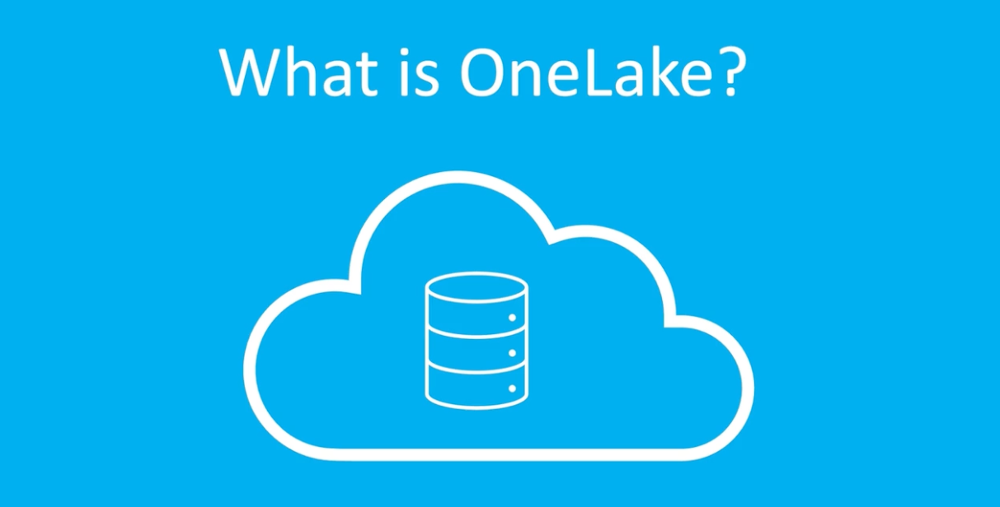

OneLake is the **logical data lake provided by Microsoft Fabric**, designed to serve as a **single, unified location for all organizational analytical data**.

It simplifies data storage and management by centralizing data across different teams, workloads, and services within the Fabric ecosystem.

An easy way to remember it is to think of **OneLake as the equivalent of OneDrive for data** - a single place where all data files are stored and shared across the organization.

---

<!-- ## Key Features of OneLake -->
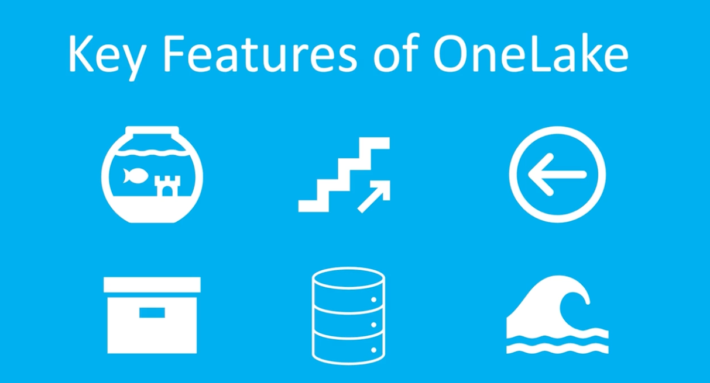

### 1. Single Data Lake for the Organization
OneLake acts as the **central data lake** for the entire organization, allowing all data workloads to store and access data from a single location.

### 2. Automatic Provisioning
Every **Microsoft Fabric tenant automatically includes OneLake**.  
This means there is **no additional infrastructure to configure or manage**, simplifying setup and administration.

### 3. Governance and Collaboration
OneLake includes **built-in governance capabilities** that help organizations manage data access and security.  
It also supports **distributed ownership**, enabling multiple teams to collaborate while maintaining proper control over their data.

### 4. Workspace-Based Organization
Data access and ownership can be managed through **workspaces**, allowing different departments or teams to control their own data while still operating within the same centralized lake.

### 5. Unified Data Storage
All Fabric data items - such as **Lakehouses, Data Warehouses, and other analytics workloads** - store their data automatically in OneLake using the **Delta Parquet format**, which supports efficient storage and analytics.

### 6. Built on Azure Data Lake
OneLake is built on top of **Azure Data Lake Storage**, allowing it to support **any file type or data structure** while remaining compatible with the broader Azure ecosystem.

---

## Workspace
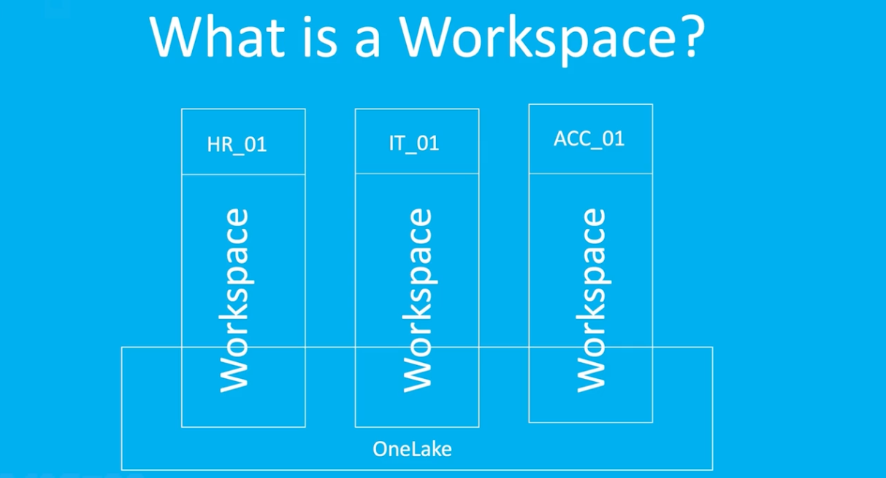

In Microsoft Fabric, a **workspace** is a container used to **create, organize, and manage data and analytics resources while enabling collaboration between users and teams**.

Workspaces sit on top of **OneLake**, Microsoft Fabric’s unified data lake, and allow organizations to divide their data and analytics environment into **separate, independent areas**. This helps teams work on their own projects while still sharing the same underlying data platform.

---

<!-- ## Key Features of Workspaces -->
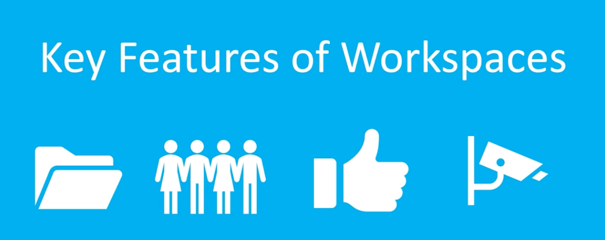

### 1. Organization
Workspaces help organize **data, projects, and analytics assets**, making it easier for teams to manage their work and collaborate on different tasks within the same environment.

### 2. Roles and Permissions
Workspaces support different **user roles**, each with specific permissions and capabilities:

- **Admin** – Full control over the workspace, including managing users and settings  
- **Member** – Can create, edit, and manage content within the workspace  
- **Contributor** – Can create and modify content but with limited management capabilities  
- **Viewer** – Can view content but cannot modify it  

### 3. Capabilities
Depending on their assigned role, users can perform different tasks such as:

- Creating and managing **data pipelines**
- Working with **notebooks**
- Running **Spark jobs**
- Building **data models and reports**
- Managing other analytics assets

### 4. Security
Each workspace can be **secured independently**, ensuring that data and projects are accessible **only to authorized users within that workspace**. This helps organizations maintain proper access control and data protection.

---

## Create Workspace

Press "New Workspace" button:
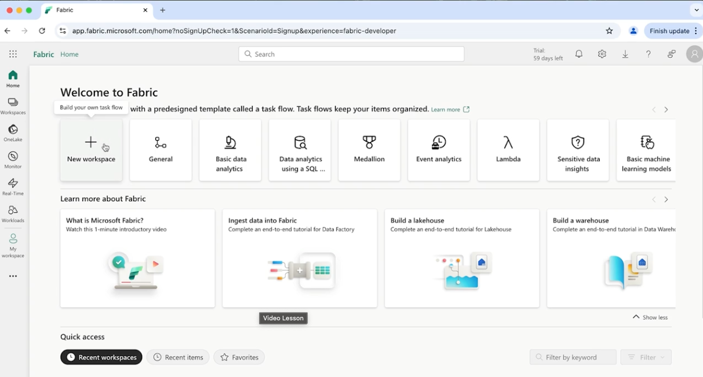
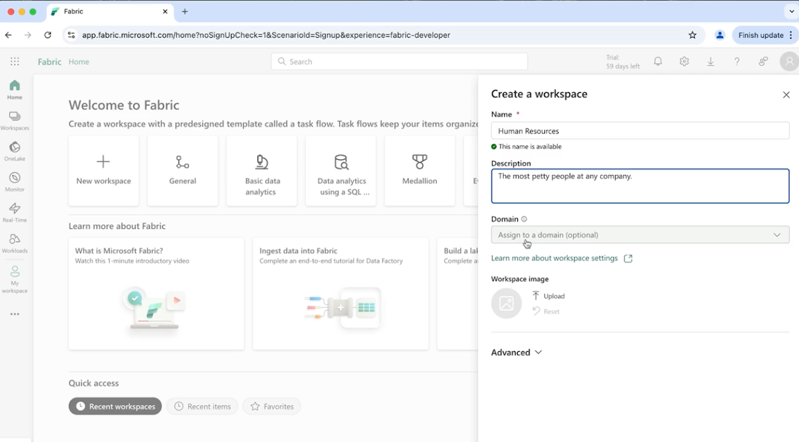
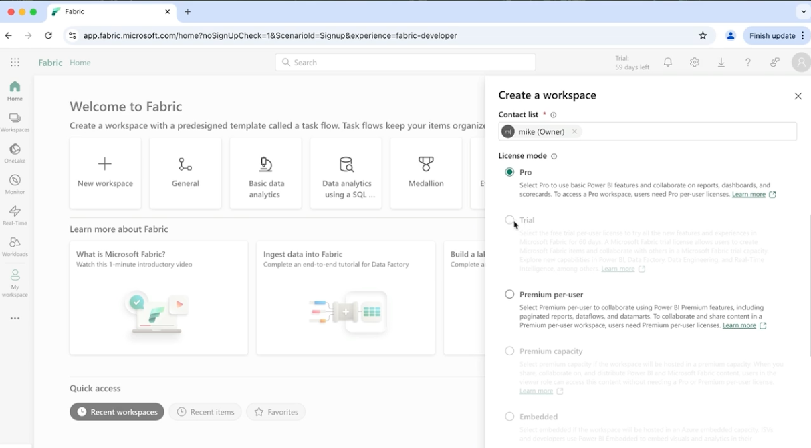
Press "Apply"

Navigate to "New item"
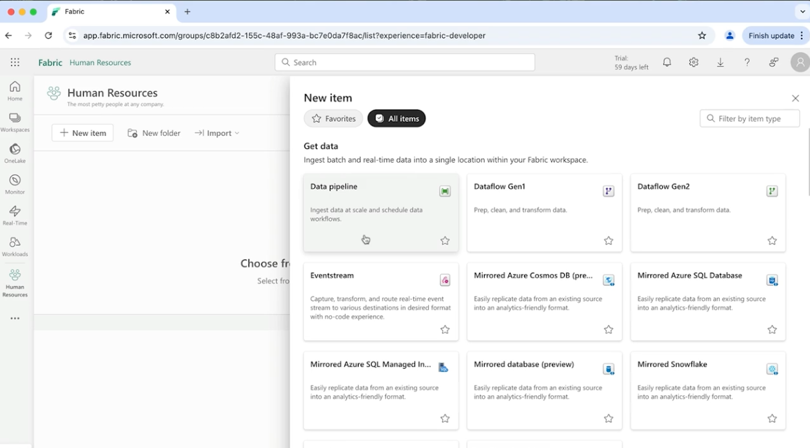
Create a Notebook
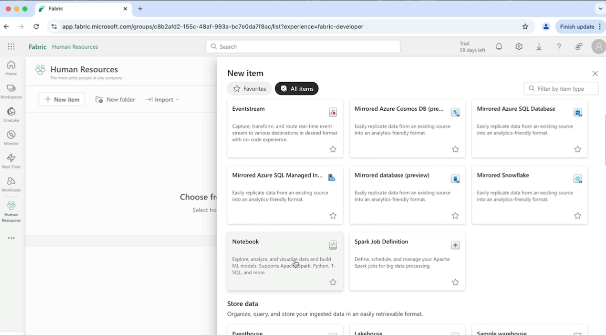
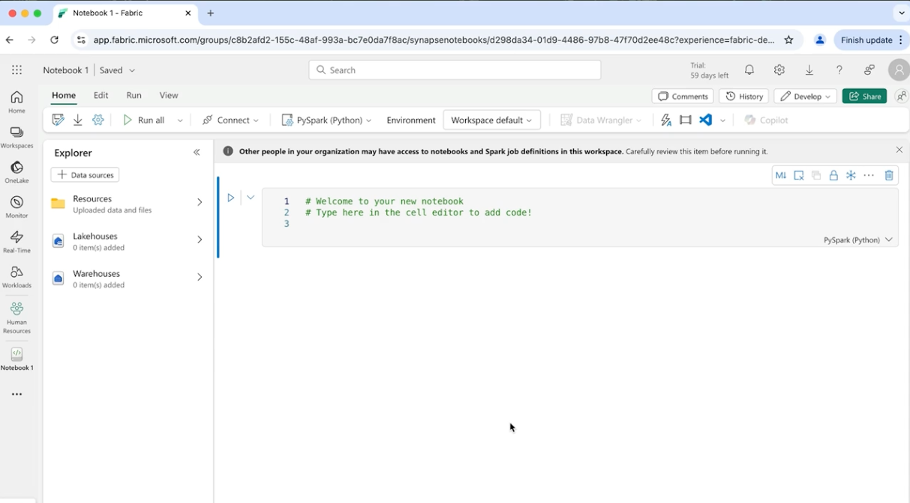

---

## Adding Folders to a Workspace

A **folder** is an **easy way to manage all your objects into your workspace**.

Press the button "New folder"
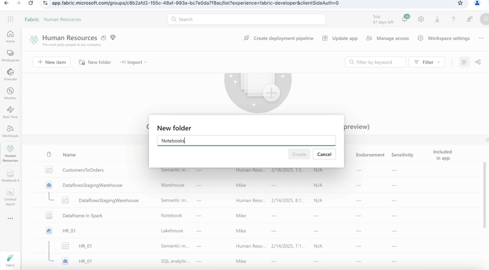

---

## Lakehouse

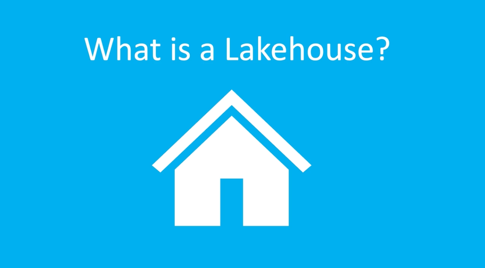

A **Lakehouse** is a modern data architecture that combines the best features of **data lakes** and **data warehouses** into a single platform.

It allows organizations to store large volumes of raw data while also enabling **high-performance analytics and reporting** on that same data.

An easy way to remember it:  
A **Lakehouse = Data Lake + Data Warehouse**

---

<!-- ## Key Features of a Lakehouse -->
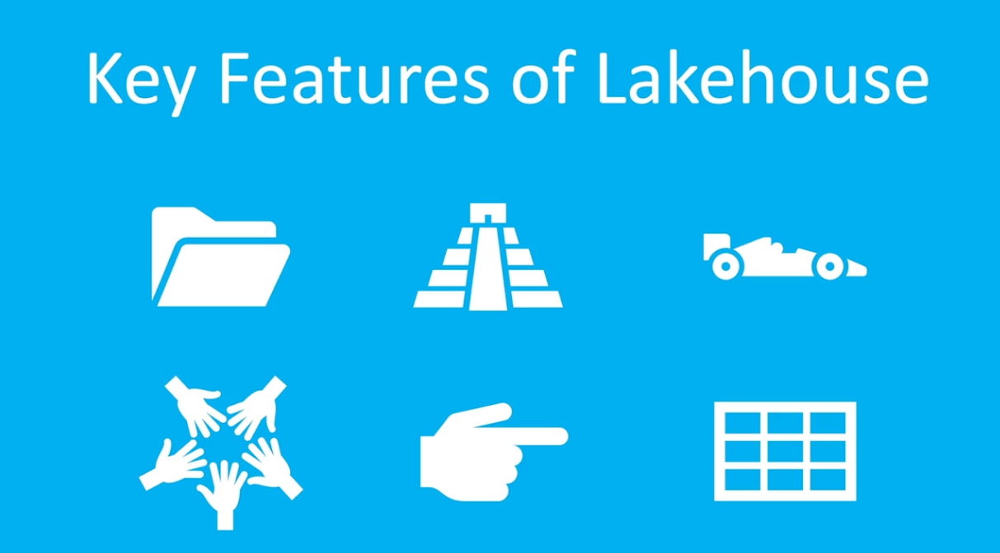

### 1. Unified Storage
A Lakehouse stores both **structured and unstructured data** in a single storage location, eliminating the need for separate storage systems.

### 2. Scalability
Like a **data lake**, a Lakehouse can handle **large volumes of data**, making it suitable for big data workloads.

### 3. High Performance
Like a **data warehouse**, it provides **high performance for analytics and reporting**, enabling faster data queries and insights.

### 4. Data Lake Integrations
Lakehouses in Microsoft Fabric use the **Delta format**, which introduces **ACID transactions** and improved reliability for big data workloads.

### 5. SQL Analytical Endpoints
Microsoft Fabric automatically generates **SQL Analytical Endpoints**, allowing users to query Lakehouse data directly using **SQL tools and queries**.

### 6. Automatic Table Discovery
The system automatically **discovers and registers tables**, simplifying data management and making datasets easier to access and use.

---

## Lakehouse Demo

You can press "Build a lakehouse"
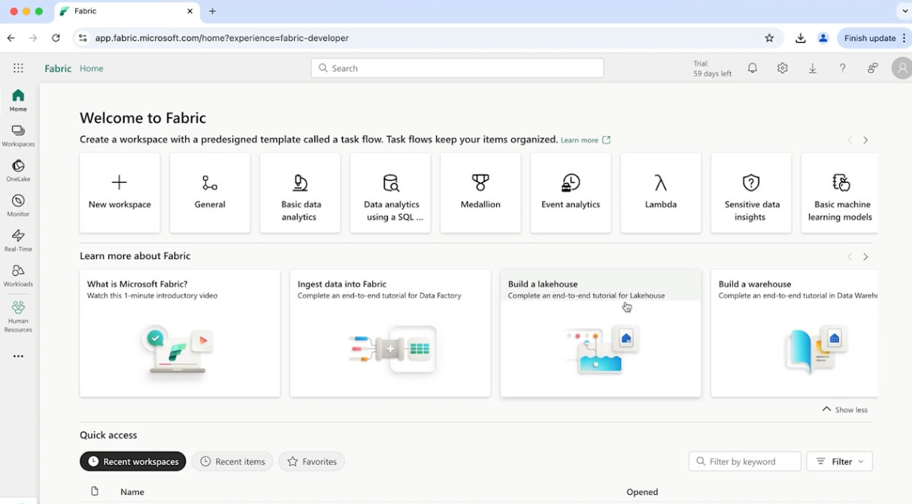

Another method:
Go to "Human Resources Workspace" and click on "New Item", navigate down to "Store data" and click on "Lakehouse"
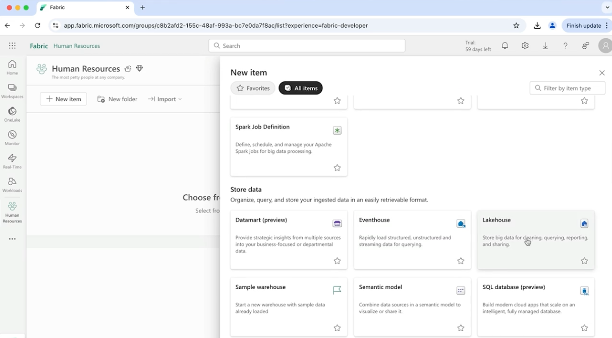

Give the Lakehouse a name and press "Create"
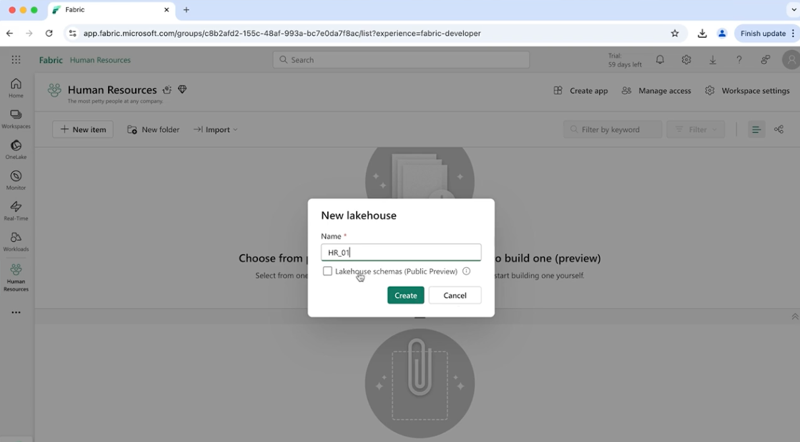

Inside the Lakehouse we have "Tables" and "Files" that we can import
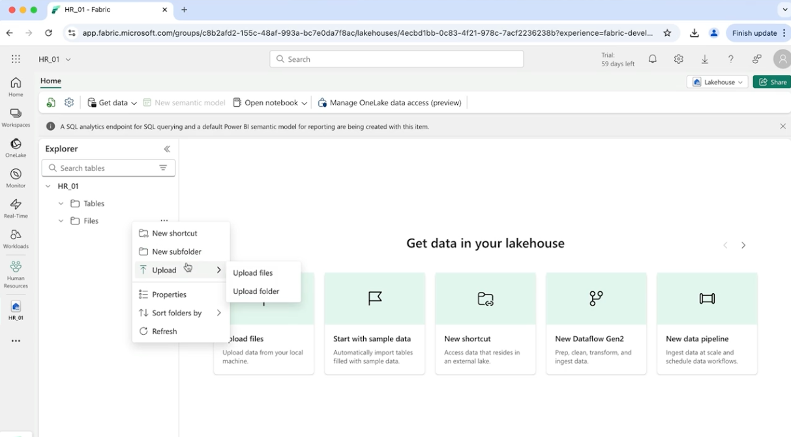

Let's create e subfolder and gave it the name "Training Datasets".
In the subfolder "Training Datasets" go and import some data "titanic.csv"
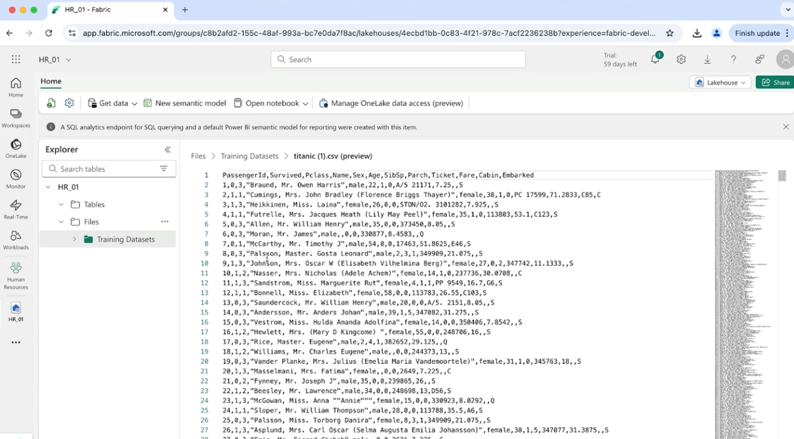

From this csv let's make a table
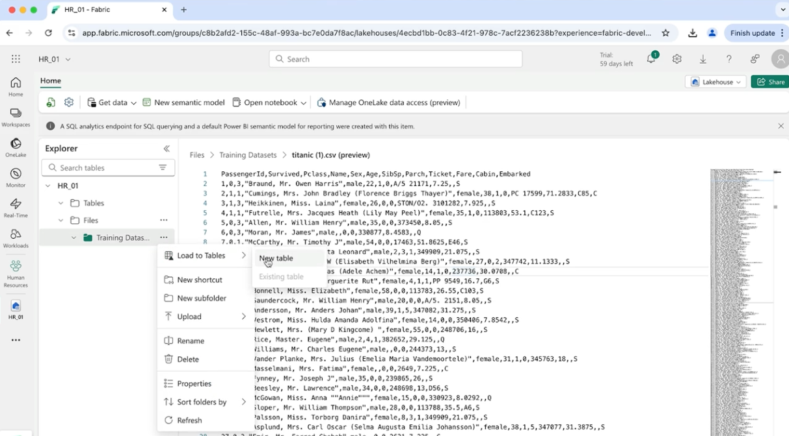
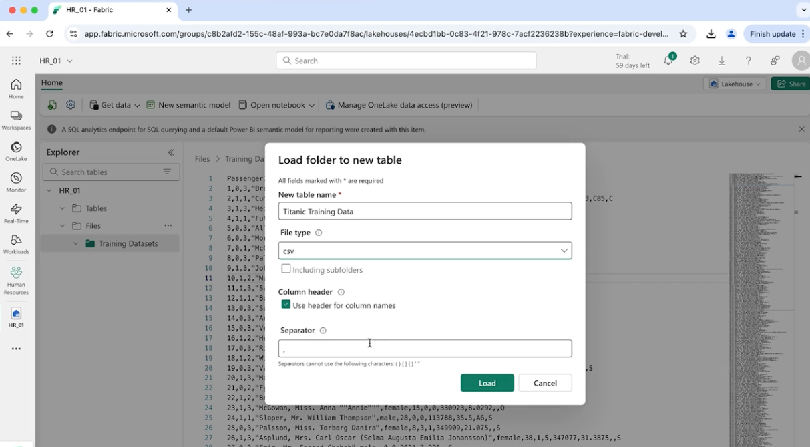
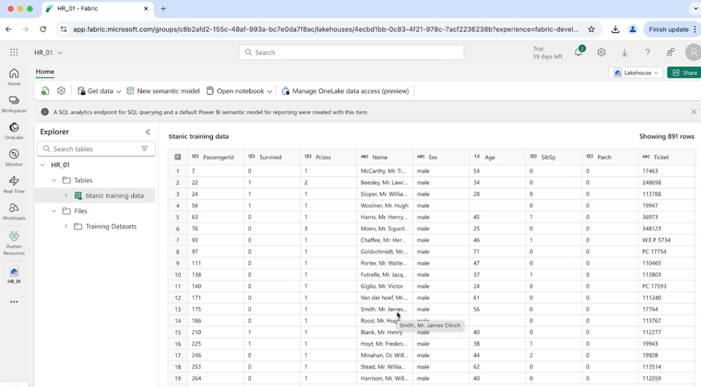

---
