# OneLake Overview

## OneLake

OneLake is the **logical data lake provided by Microsoft Fabric**, designed to serve as a **single, unified location for all organizational analytical data**.

It simplifies data storage and management by centralizing data across different teams, workloads, and services within the Fabric ecosystem.

An easy way to remember it is to think of **OneLake as the equivalent of OneDrive for data** - a single place where all data files are stored and shared across the organization.

---

<!-- ## Key Features of OneLake -->

### 1. Single Data Lake for the Organization
OneLake acts as the **central data lake** for the entire organization, allowing all data workloads to store and access data from a single location.

### 2. Automatic Provisioning
Every **Microsoft Fabric tenant automatically includes OneLake**.  
This means there is **no additional infrastructure to configure or manage**, simplifying setup and administration.

### 3. Governance and Collaboration
OneLake includes **built-in governance capabilities** that help organizations manage data access and security.  
It also supports **distributed ownership**, enabling multiple teams to collaborate while maintaining proper control over their data.

### 4. Workspace-Based Organization
Data access and ownership can be managed through **workspaces**, allowing different departments or teams to control their own data while still operating within the same centralized lake.

### 5. Unified Data Storage
All Fabric data items - such as **Lakehouses, Data Warehouses, and other analytics workloads** - store their data automatically in OneLake using the **Delta Parquet format**, which supports efficient storage and analytics.

### 6. Built on Azure Data Lake
OneLake is built on top of **Azure Data Lake Storage**, allowing it to support **any file type or data structure** while remaining compatible with the broader Azure ecosystem.

---

## Workspace

In Microsoft Fabric, a **workspace** is a container used to **create, organize, and manage data and analytics resources while enabling collaboration between users and teams**.

Workspaces sit on top of **OneLake**, Microsoft Fabric’s unified data lake, and allow organizations to divide their data and analytics environment into **separate, independent areas**. This helps teams work on their own projects while still sharing the same underlying data platform.

---

<!-- ## Key Features of Workspaces -->

### 1. Organization
Workspaces help organize **data, projects, and analytics assets**, making it easier for teams to manage their work and collaborate on different tasks within the same environment.

### 2. Roles and Permissions
Workspaces support different **user roles**, each with specific permissions and capabilities:

- **Admin** – Full control over the workspace, including managing users and settings  
- **Member** – Can create, edit, and manage content within the workspace  
- **Contributor** – Can create and modify content but with limited management capabilities  
- **Viewer** – Can view content but cannot modify it  

### 3. Capabilities
Depending on their assigned role, users can perform different tasks such as:

- Creating and managing **data pipelines**
- Working with **notebooks**
- Running **Spark jobs**
- Building **data models and reports**
- Managing other analytics assets

### 4. Security
Each workspace can be **secured independently**, ensuring that data and projects are accessible **only to authorized users within that workspace**. This helps organizations maintain proper access control and data protection.

---

## Create Workspace

Press "New Workspace" button:

Press "Apply"

Navigate to "New item"

Create a Notebook

---

## Adding Folders to a Workspace

A **folder** is an **easy way to manage all your objects into your workspace**.

Press the button "New folder"

---

## Lakehouse

A **Lakehouse** is a modern data architecture that combines the best features of **data lakes** and **data warehouses** into a single platform.

It allows organizations to store large volumes of raw data while also enabling **high-performance analytics and reporting** on that same data.

An easy way to remember it:  
A **Lakehouse = Data Lake + Data Warehouse**

---

<!-- ## Key Features of a Lakehouse -->

### 1. Unified Storage
A Lakehouse stores both **structured and unstructured data** in a single storage location, eliminating the need for separate storage systems.

### 2. Scalability
Like a **data lake**, a Lakehouse can handle **large volumes of data**, making it suitable for big data workloads.

### 3. High Performance
Like a **data warehouse**, it provides **high performance for analytics and reporting**, enabling faster data queries and insights.

### 4. Data Lake Integrations
Lakehouses in Microsoft Fabric use the **Delta format**, which introduces **ACID transactions** and improved reliability for big data workloads.

### 5. SQL Analytical Endpoints
Microsoft Fabric automatically generates **SQL Analytical Endpoints**, allowing users to query Lakehouse data directly using **SQL tools and queries**.

### 6. Automatic Table Discovery
The system automatically **discovers and registers tables**, simplifying data management and making datasets easier to access and use.

---

## Lakehouse Demo

You can press "Build a lakehouse"

Another method:
Go to "Human Resources Workspace" and click on "New Item", navigate down to "Store data" and click on "Lakehouse"

Give the Lakehouse a name and press "Create"

Inside the Lakehouse we have "Tables" and "Files" that we can import

Let's create e subfolder and gave it the name "Training Datasets".
In the subfolder "Training Datasets" go and import some data "titanic.csv"

From this csv let's make a table

---

## Load OData Dataflow Gen2

Let's go to Lakehouse "HR_01" and let's use a tool "New Dataflow Gen2" do load more data. 
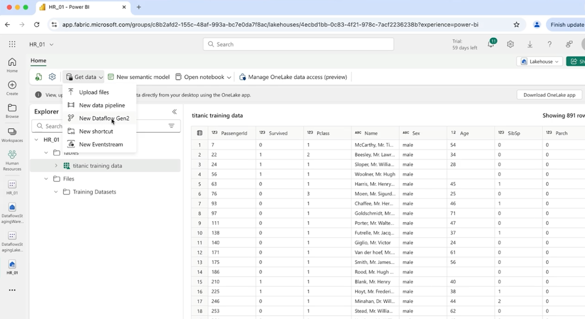

Press on the "New Dataflow Gen2" we will create a new data pipeline.
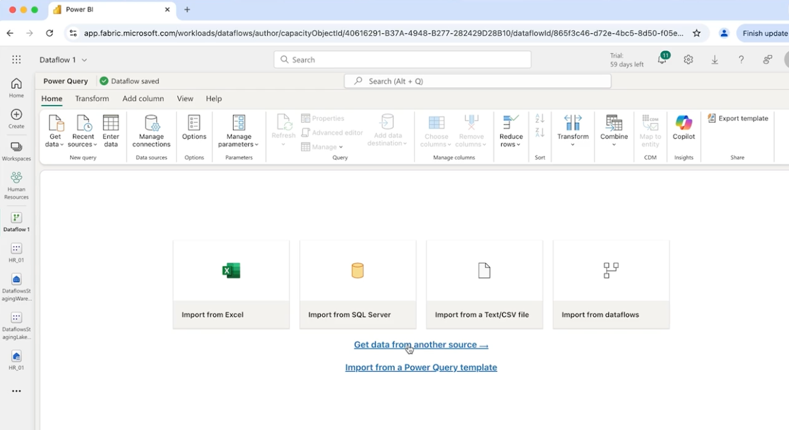

We are going to use **OData**, which is **Open Data Protocol** and it is a queryable web API.
Press "Get data from another data source" and search for "OData" and select it and put in the URL the following link http://services.odata.org/V4/Northwind/Northwind.svc and hit "Next".
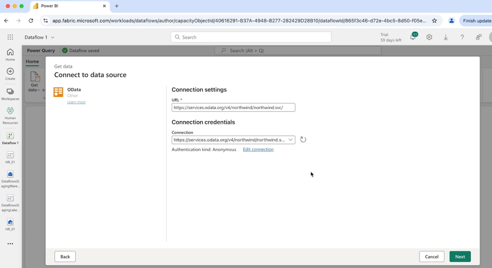

It is going to give as a list of tables to choose from from that source to import into our Lake.
Choose "Categories", "Customers" and "Employees" and hit "Create".
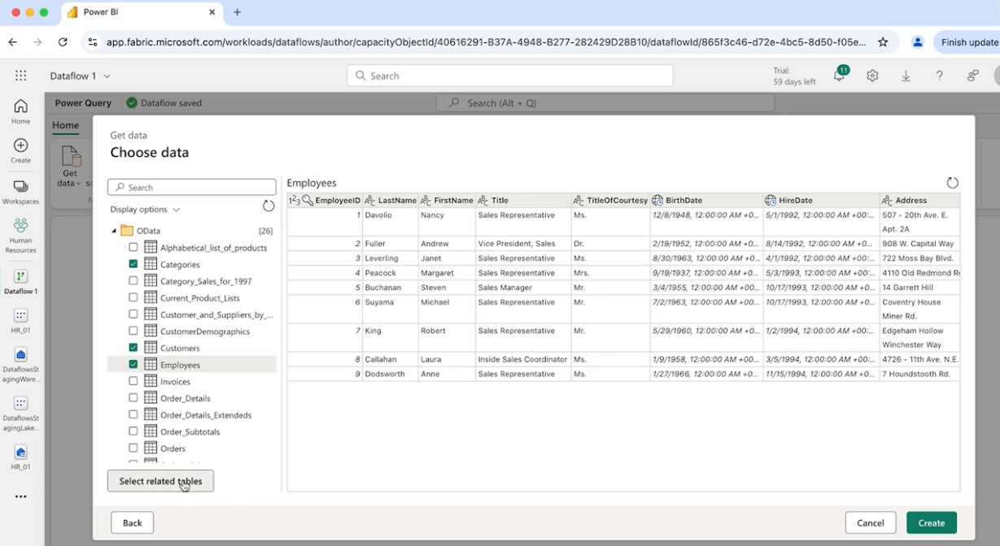

The data will open it Power Query and take a look at the data before you save it. After you check the data hit "Publish Now".
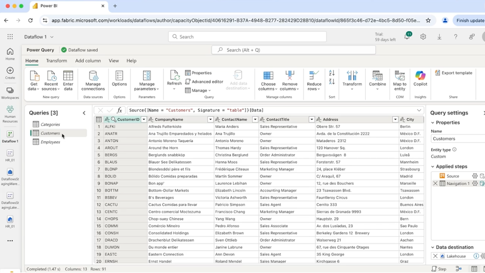

This operation will push that data to our Lake and we can see our Data flow 1 is in progress.
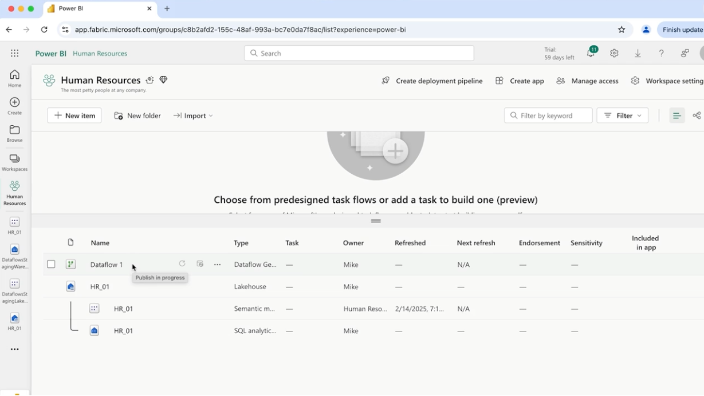

The data should be in the Tables or the Lake.

---

## Delta Tables

<!-- ### What is Delta Format? -->
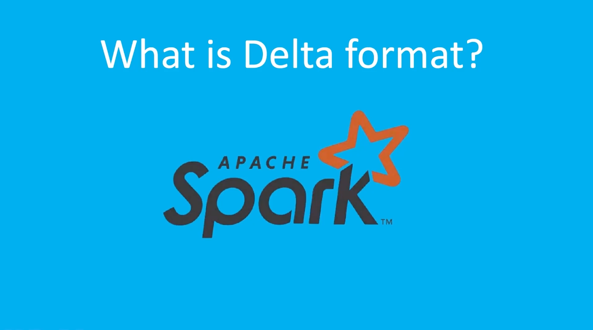

The **Delta format** in OneLake refers to **Delta Lake**, an **open-source storage format** that brings **ACID transactions** and reliability to **Apache Spark and big data workloads**.

In OneLake, **Delta tables organize file-based data into rows and columns**, making it accessible to multiple compute engines such as **notebooks, Kusto, Lakehouses, and Warehouses**. This structure enables efficient data processing, analytics, and querying across the Microsoft Fabric ecosystem.

If you're not familiar with **ACID properties**, it's important to understand them because they guarantee **reliable and consistent data operations**.

---

<!-- ## Key Features of Delta Format -->
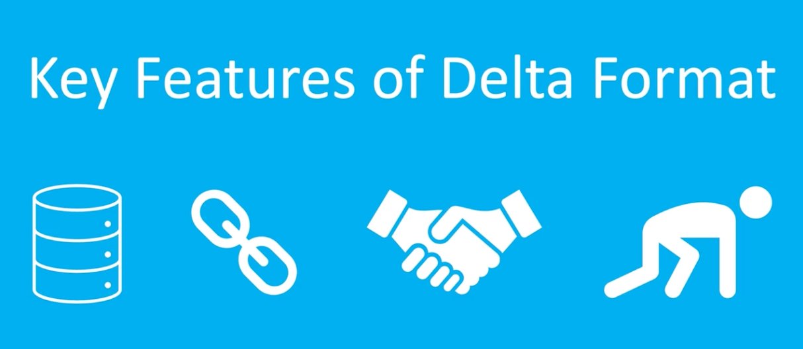

### 1. Data Versioning
Delta tables are stored as **Parquet files**, which are **immutable**.  
This means existing files are never modified. Instead, each write operation creates **new Parquet files**, representing changes and allowing the system to maintain **multiple versions of the data**.

### 2. Transaction Log Files
Delta tables use **JSON-based transaction log files** to track all changes made to the table. These logs record the **order and metadata of Parquet files** associated with the table, ensuring consistency and enabling time travel and version tracking.

### 3. Compatibility
Delta tables can be accessed using multiple languages and query engines, including:

- **DAX (Data Analysis Expressions)**
- **MDX (Multidimensional Expressions)**
- **T-SQL**
- **Spark SQL**
- **Python**

This flexibility allows different tools and services within Microsoft Fabric to work with the same data.

### 4. Optimization
Delta tables can be optimized for **Direct Lake semantic models**, improving **query performance and reliability**. Optimization techniques such as file compaction and indexing help ensure efficient data access for analytics and reporting.

---

## OneLake File Explorer

OneLake explorer work just like OneDrive and it works only on Windows.

---

## Parquet File Defined

### What is a Parquet File?

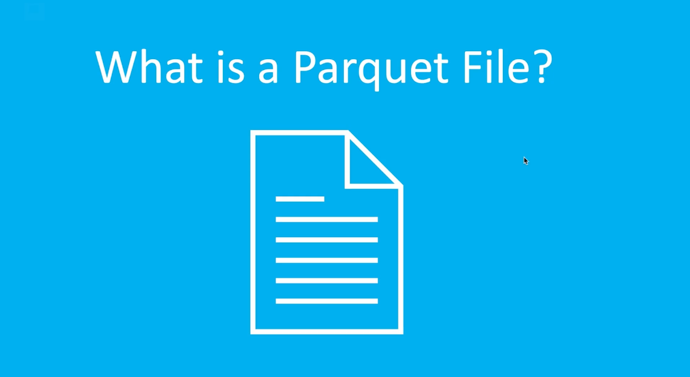

A **Parquet file** is a **columnar storage file format** designed for **efficient data processing and analytics**, especially in **big data environments**.

Instead of storing data row by row like traditional databases, Parquet stores data **column by column**, which allows analytics engines to read only the data they need. This significantly improves **query performance and storage efficiency** for large datasets.

Parquet is widely used in modern data platforms such as **Apache Spark, Hadoop ecosystems, and cloud data platforms including Microsoft Fabric**.

---

## Key Features of Parquet Files

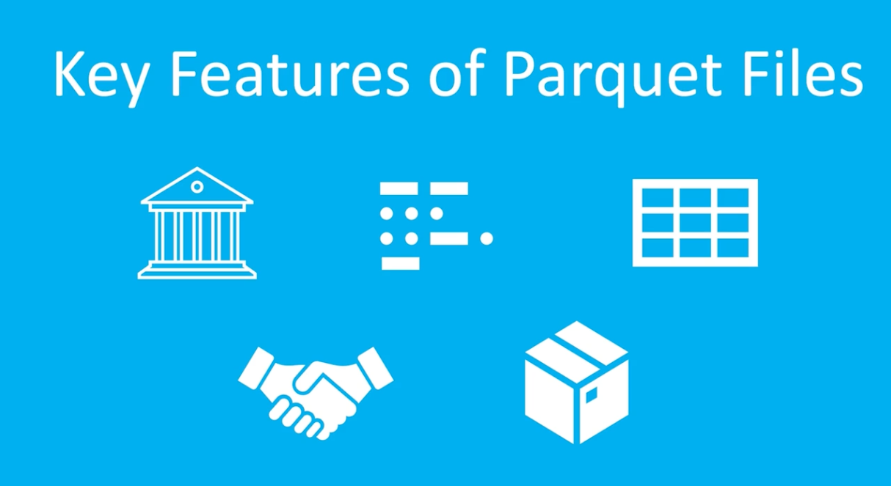

### 1. Columnar Storage
Data is stored **by column rather than by row**.  
This allows analytics systems to read only the required columns during queries, improving **query performance and efficiency**, especially for **read-heavy workloads** common in data warehouses and analytics.

### 2. Efficient Compression
Since **similar data types are stored together in columns**, Parquet can apply **highly efficient compression techniques**.  
This reduces storage requirements and lowers infrastructure costs.

### 3. Schema Evolution
Parquet files support **schema evolution**, meaning the data structure can change over time.  
For example, **new columns can be added without rewriting the entire dataset**, which is useful for evolving data pipelines.

### 4. Compatibility
Parquet is supported by many **data processing frameworks and analytics systems**, including:

- **Apache Spark**
- **Hadoop**
- **Modern cloud data platforms**
- **Various analytics engines**

This makes it a **versatile format for many data workloads**.

### 5. Metadata Storage
Parquet files store **metadata about the schema and structure of the data** within the file itself.  
This allows systems to understand the dataset **without reading the entire file**, enabling faster query planning and execution.

Because of these advantages, **columnar storage formats like Parquet are widely used in modern data warehouses**, including platforms such as **Snowflake, BigQuery, and Microsoft Fabric**.

---

<!-- ## What is a Shortcut? -->
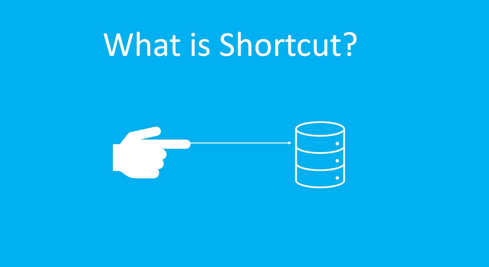

In Microsoft Fabric, a **Shortcut** is an object in **OneLake** that points to an existing storage location, either **internal or external**. It works similarly to a **symbolic link**, allowing users to reference data **without copying or moving it** into another location.

Shortcuts enable organizations to access data from multiple storage systems while keeping the data in its original location, simplifying data integration and reducing duplication.

---

<!-- ## Key Features of Shortcuts -->
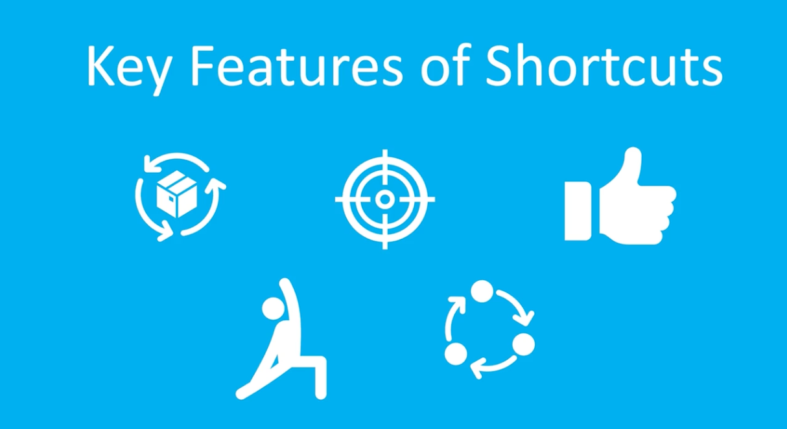

### 1. Unified Data Access
Shortcuts help **unify data across different domains, clouds, and storage accounts** by creating a **virtual data lake** that allows users to access distributed data through OneLake.

### 2. Target Path and Shortcut Path
A shortcut consists of two main locations:

- **Target Path** – The original storage location where the data actually resides  
- **Shortcut Path** – The location in **OneLake** where the shortcut appears  

This allows users to interact with the data **as if it were stored directly in OneLake**.

### 3. Easy Access Through OneLake
Shortcuts appear as **folders within OneLake**, making them accessible to any **Fabric workload or service** that has permission to access OneLake.

### 4. Flexibility
Shortcuts can connect to multiple storage systems, including:

- **Azure Data Lake Storage**
- **Amazon S3**
- **Dataverse**
- **Google Cloud Platform (GCP)**

This flexibility allows organizations to **integrate data from multiple cloud environments**.

### 5. Metadata Synchronization
When shortcuts are created to supported data lake sources, **OneLake automatically synchronizes metadata**.  
This allows the system to recognize the underlying data **as structured tables**, making it easier to query and analyze.

---

## Shortcut Demo

Create another workspace named "Accounting".
We are going to create a shortcut in "Accounting" to point into the workspace "Human Resources".
Let's go to "Accounting", click on our Lakehouse "ACCT_01". 
Click on "Get data" -> "New Shortcut".
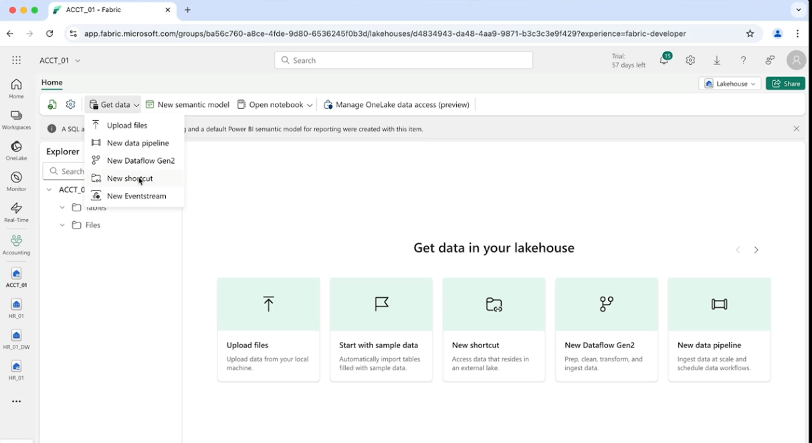

A pop-up will appeare, choose "Microsoft OneLake".
We want to navigate to "HR_01" because that's where we want to create a shortcut to "ACCT_01".
Choose "HR_01" and click Next.
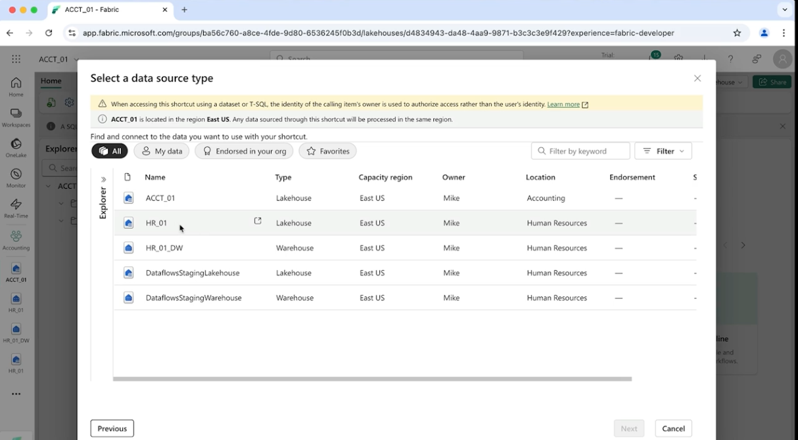

From the Tables select "Categories" and "Customers" and click Next
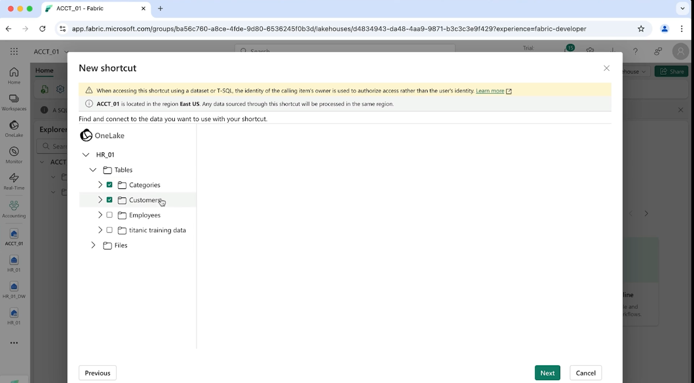

Review the folders and tables and click Create.
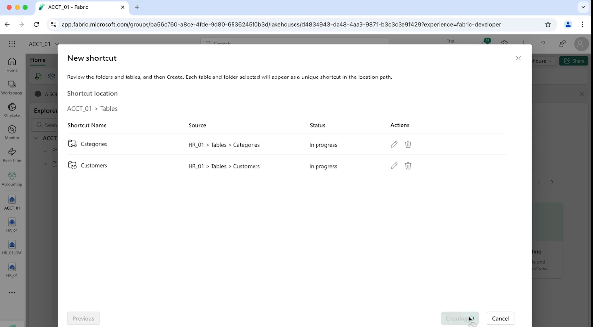

Now in the "ACCT_01" we have a shortcut that points to the physical tables from the "HR_01".
It helps us eliminating duplicated data.
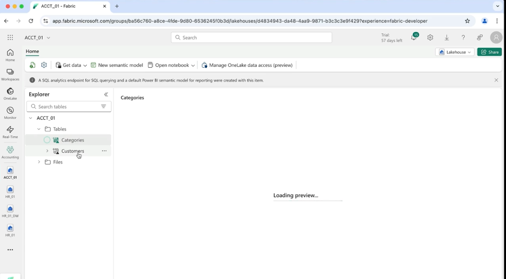

---

## SQL Endpoint Demo

In Microsoft Fabric, a **SQL Endpoint** refers to the **SQL Analytics Endpoint**.  
This endpoint provides a **SQL-based interface** that allows users to **query Delta tables stored in a Lakehouse** using standard SQL tools and queries.

---

## Accessing a SQL Analytics Endpoint

Let’s walk through a simple example.

### 1. Open the Workspace

Navigate to the **Human Resources** workspace.
"
---

### 2. Open the Lakehouse

Inside the Lakehouse **HR_01**, you will see two related items automatically created:

- **HR_01 – Semantic Model**
- **HR_01 – SQL Analytics Endpoint**

Click on **HR_01 (SQL Analytics Endpoint)** to open the SQL interface where you can **begin querying your data using SQL**.

---

### 3. SQL Endpoint in a Warehouse

Within the **HR_01 Warehouse**, you will see:

- **HR_01 – Semantic Model**

To access the SQL endpoint for the warehouse:

1. Open the **HR_01 Warehouse**
2. Navigate to **Settings**
3. Locate the **SQL Connection String**

This connection string represents the **SQL endpoint used to connect to the warehouse**.

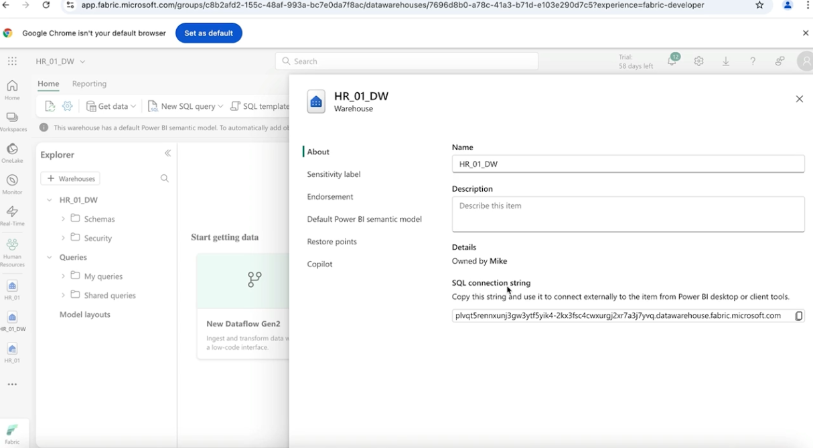

---

## Purpose of SQL Endpoints

SQL endpoints allow external tools and users to **connect to Microsoft Fabric data items** such as:

- **Lakehouses**
- **Warehouses**

Using the endpoint, users can query data through **T-SQL, BI tools, or other SQL-compatible applications**.

---

## Create DW for Visual Query

We go to "Accounting" workspace, click on "New Item", navigate down to "Sample Warehouse" and click on it and give the warehouse the name "ACCTG_DW01" and click "Create".

This will create:
- Creating warehouse
- Craeting tables
- Copying data
- Wrapping up

---

## Visual Query Editor Demo

The data was loaded. On the button "New SQL query" click on "New visual query". We created this "Visual query 2", now drag and drop the column "Date" into the visual query and then the column "Weather".

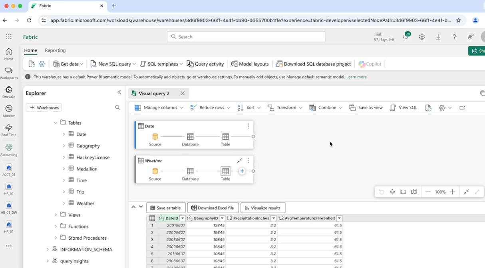

Now we got this visual interface for crafting our queryes. This is a tool for peoples that aren't strong on SQL. This Visual Query is the domain of the Data Analyst.

---

## Managing Access in Microsoft Fabric

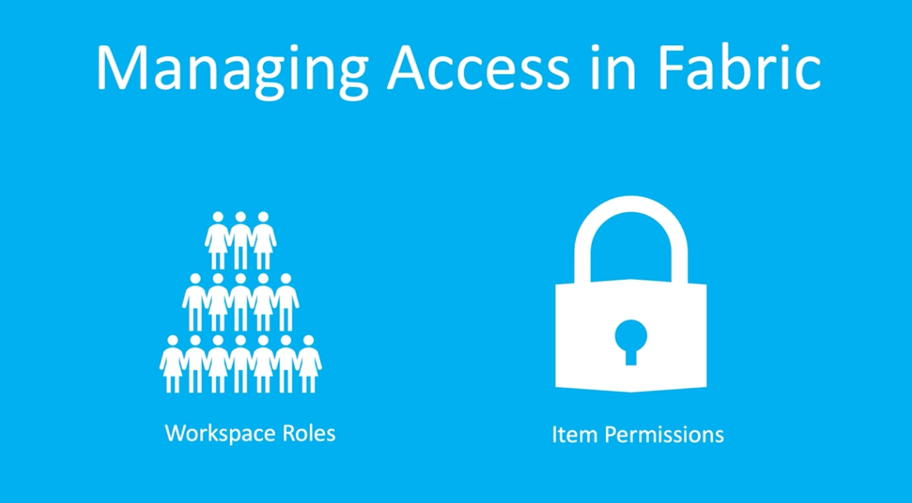

Managing access in **Microsoft Fabric** involves a combination of **Workspace Roles** and **Item Permissions**.  
Workspace roles control access at the **workspace level**, while item permissions allow **more granular control over specific assets** within the workspace.

---

## Workspace Roles

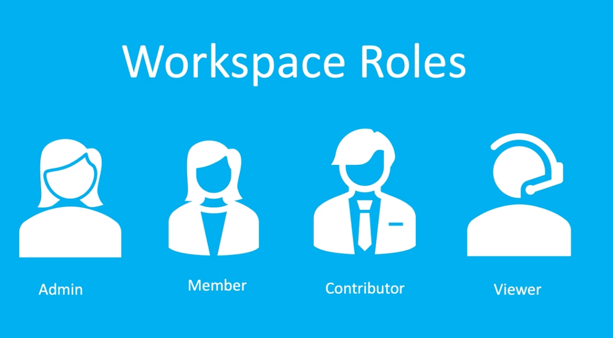

Workspace roles define the **level of access users have across the entire workspace**. There are four main roles:

### 1. Admin
- Full administrative control over the workspace  
- Can manage workspace settings and permissions  
- Has full access to all data and items within the workspace

### 2. Member
- Can **view, modify, and share** all content in the workspace  
- Can create and manage workspace items

### 3. Contributor
- Can **view and modify** content within the workspace  
- Cannot manage workspace settings or user permissions

### 4. Viewer
- Can **view content only**  
- Cannot modify or create items in the workspace

---

## Item Permissions

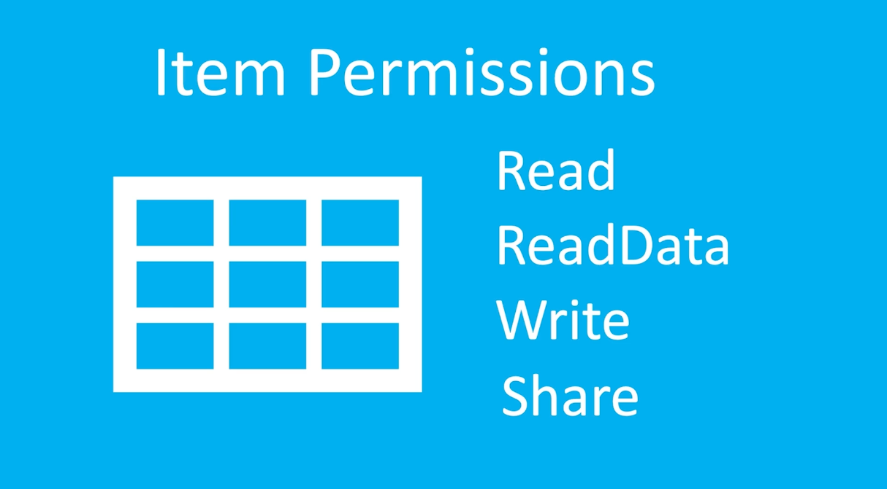

Item permissions control **access to specific items within a workspace**, such as **Lakehouses, Warehouses, reports, or datasets**.  
These permissions provide **more granular control** than workspace roles.

There are four main item permissions:

### 1. Read
Allows users to **view item metadata and reports**.

### 2. ReadData
Allows users to **read and query data** from the item.

### 3. Write
Allows users to **modify or update the item**.

### 4. Share
Allows users to **share the item with others and manage its permissions**.

--- 

## Create Group and Assign Permissions

Let's create a Role.
We are in the workspace "ACCT_01".
Click on the "Categories" and them on the "Manage OneLake data access (preview)"
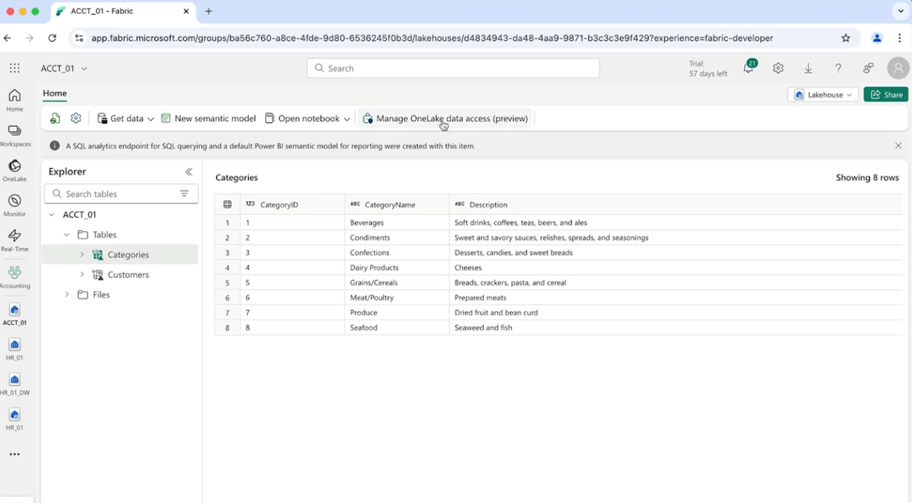

We've got the "Default Viewer". We will create a new role, click on the button "New Role", add a Role name "EmployeesHR", select the bullet point "Selected Folders". select "\Tables Folder", we see that we can't select the table "Categories" because we can't create Roles on the Shortcuts.

Got to Home, select the "Human Resources" workspace and select the lakehouse "HR_01".

Click on the "Categories" and them on the "Manage OneLake data access (preview)"
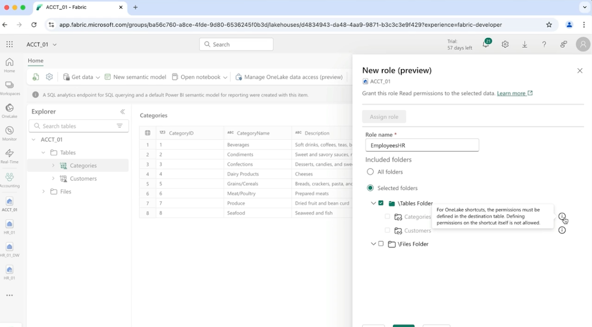

We've got the "Default Viewer". We will create a new role, click on the button "New Role", add a Role name "EmployeesHR", select the bullet point "Selected Folders". select "\Tables Folder", now we can select "Categories" and click Save.
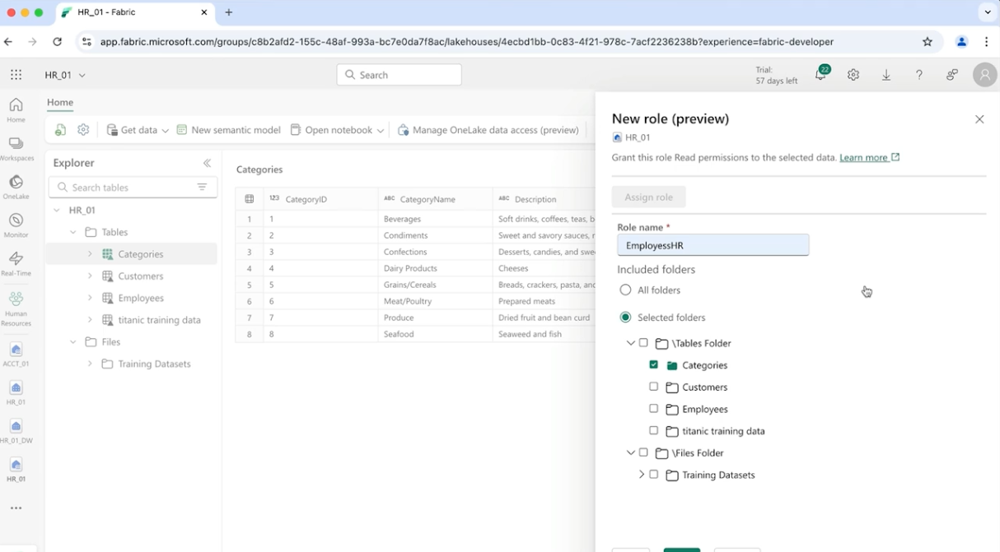

Go on the "Manage OneLake data access (preview)", click on the 3 dot points of the Role "EmployeesHR" and select "Assign" and assign it to somebody and select the permissions that you want to gave to that person.
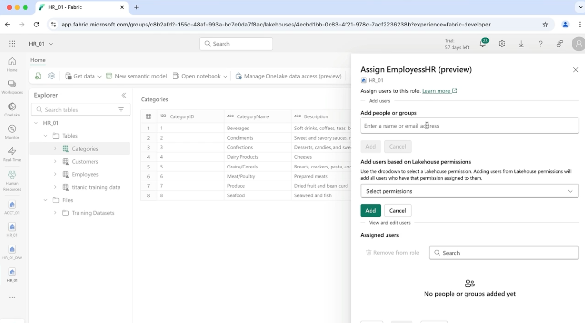