## Load OData Northwinds Data Pipeline

We will go to the workspace "Human Resources" on the Lakehouse "HR_01" and inside we are going to press the button Get data --> New Dataflow Gen2, you will be redicrected to Power Query, select "Get data from another source" and search for "OData" and click on it. On the URL paste the following link: https://services.odata.org/Northwind/Northwind.svc/ and hit Next. From the list of the tables we are going to select everithing (Click on the first box, hold shift and click on the last box) and hit Create button. Now we are waiting for the Dataflow to import all the tables.

---

<!-- ## Defining a Semantic Model -->
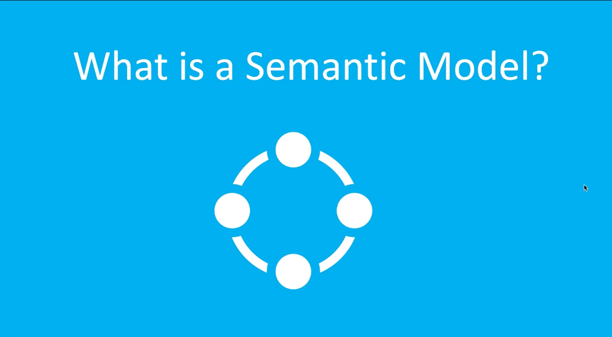

A **semantic model** defines the **logical structure of data used for analysis and reporting**.  
It describes how **tables relate to each other**, along with the **metrics, hierarchies, and calculations** used to analyze the data.

In simple terms, a semantic model defines the **relationships between tables** and provides a **business-friendly layer on top of raw data**, making it easier for analysts and reporting tools to work with the data.

---

<!-- ## Features of Semantic Models -->
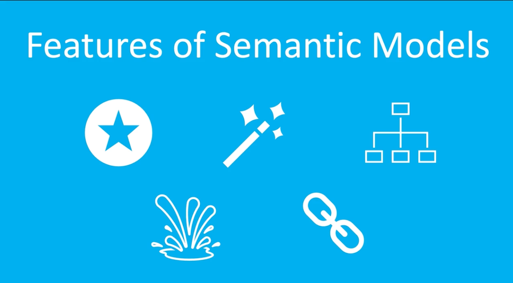

### 1. Star Schema
Semantic models are commonly structured using a **star schema**.  
In this model:

- **Fact tables** store measurable events (such as sales or transactions)
- **Dimension tables** provide descriptive attributes used for filtering and analysis (such as date, product, or customer)

This structure is widely used in **data warehouse architectures** because it simplifies analytical queries.

### 2. Automatic Creation
In Microsoft Fabric, **semantic models can be automatically generated** from data sources such as Lakehouses or Warehouses.  
Users can then select which **tables, relationships, and measures** should be included in the model.

### 3. Integration with Power BI
Semantic models integrate **seamlessly with Power BI**, enabling users to create **visualizations, dashboards, and reports** directly from the model.

### 4. Direct Lake Mode
Semantic models can be created using **Direct Lake mode**, which allows Power BI to query data **directly from the Lakehouse** without importing or duplicating the data.  
This enables **faster performance and support for very large datasets**.

### 5. Security
Semantic models support **data security features**, including:

- **Row-Level Security (RLS)** – Restricts access to specific rows of data  
- **Object-Level Security (OLS)** – Restricts access to specific tables or columns  

These features help ensure **data isolation and secure access for different users and workloads**.

---

## Create a Report Based on Semantic Model 

Let's go to the workspace "Human Resources" here is our Semantic model "CustomersToOrders" that we created, click on the elipses and click on the "Create report".

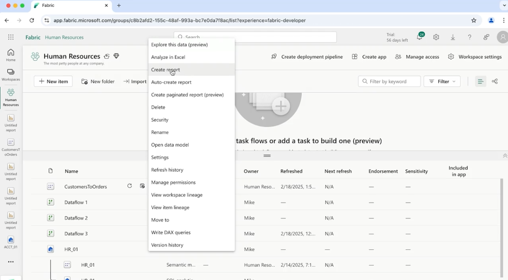

Power BI reporting will open in the Fabric web interface.
Here drag and drop on the report "CompanyName" from the Customers Table, from the Order table drag and drop the "OrderID", "ShipAddress", "ShipCity" columns.

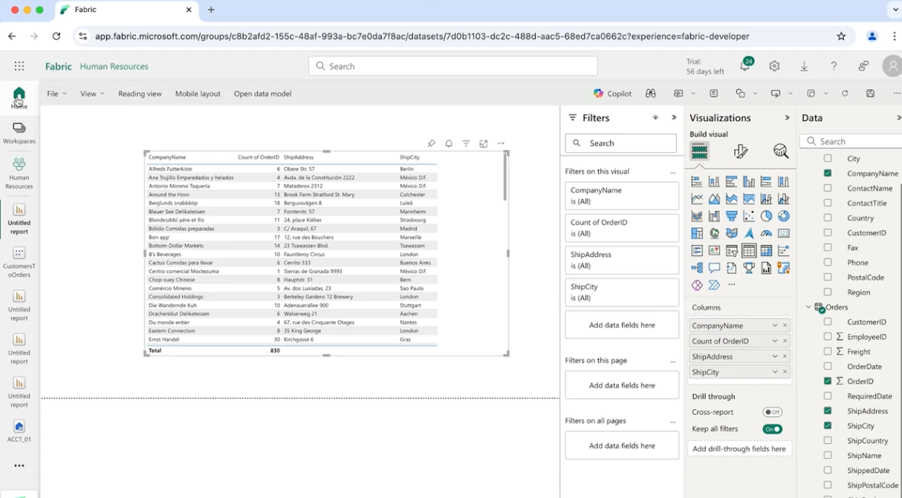

---

## Fixing Mistake in a Model

The direction you drag the key from creates the relationship.

The relationship needs to be One Customer to Many Orders. After you delete the old relationship, drag the CustomerID from the Customers table to the CustomerID from the Orders table.

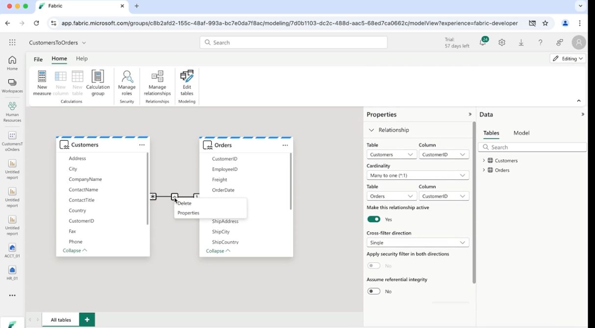
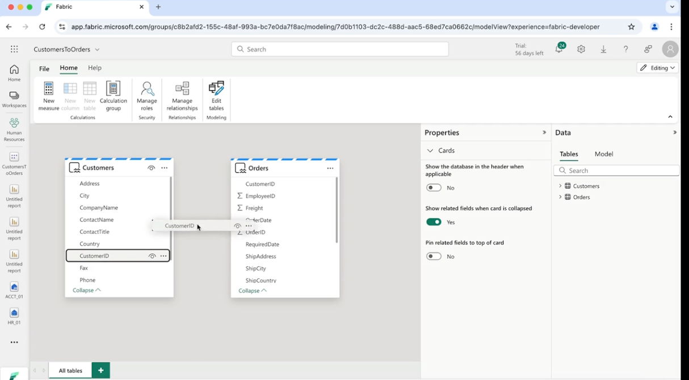
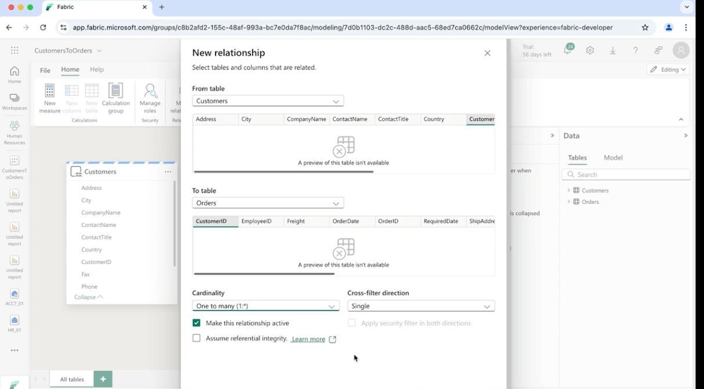
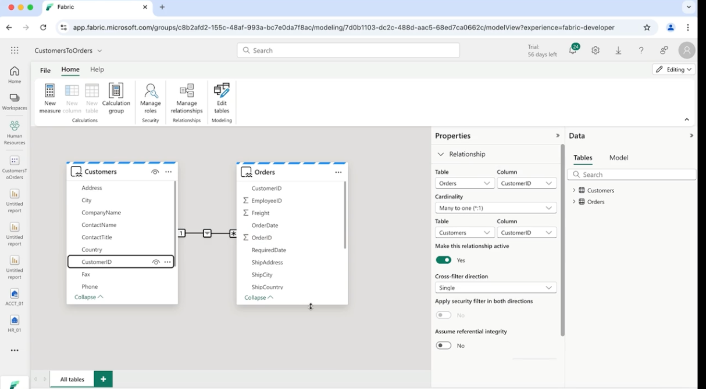

---

## Connect Semantic Model to PowerBI Desktop

In the Desktop version of the Power BI click on the button "OneLake data hub" this will open a pop-up to validate your account with email and password. From there you have access to everything and you choose your models from the pop-up.

---

### Auto Generate Reports

From the workspaces choose "Human Resources", on the semantic model "CustomersToOrders" click on the 3 dots and click on the "Open the data model".

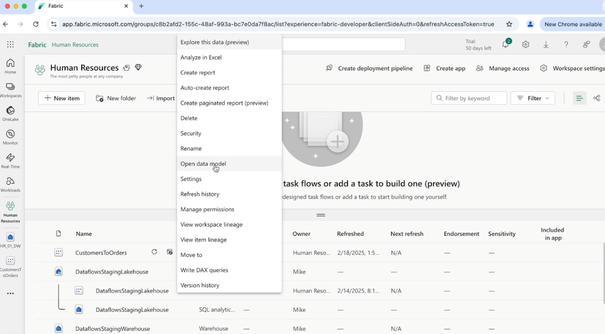

Add a 3rd model the semantic model, a one to many relationship between Customers and Invoices

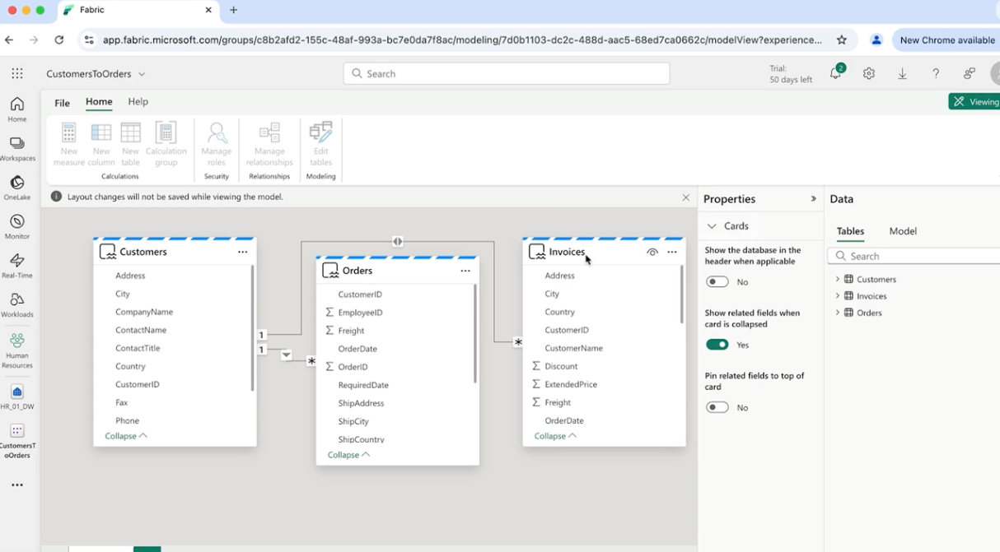

Now we are going to autogenerate a report or lots of reports base on this semantic model.
Go back to home, workspace "Human Resources", click on the 3 dots from the SM "CustomersToOrders" and click on the button "Auto-create reports". It will auto generate or give you idea for reports base on your data.

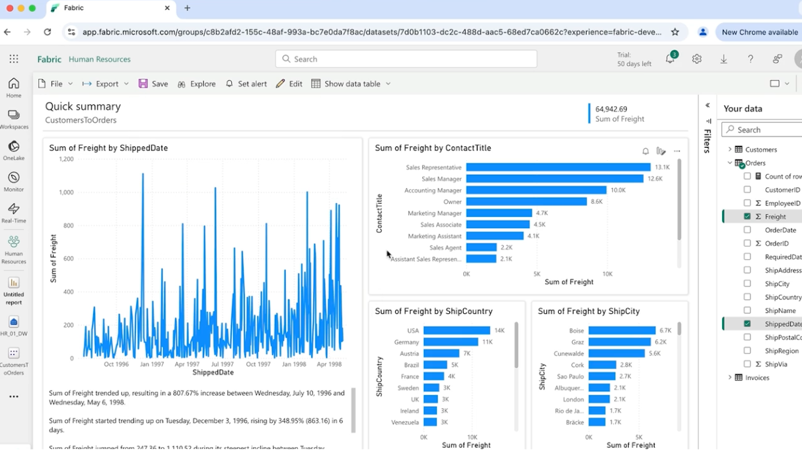

---

## Defining an App in Microsoft Fabric

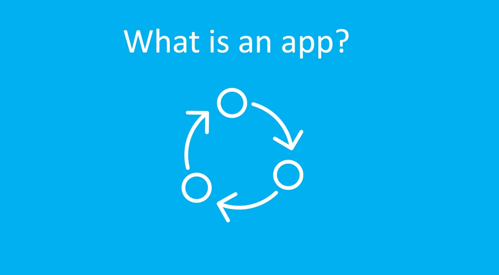

An **App in Microsoft Fabric** is a **packaged collection of content** that can include **dashboards, reports, semantic models, and other analytics resources**. These items are bundled together and **published for users to access in a structured and organized way**.

Apps make it easier to **distribute curated analytics content** across an organization while maintaining control over how the content is accessed and updated.

---

## Features of Apps in Microsoft Fabric

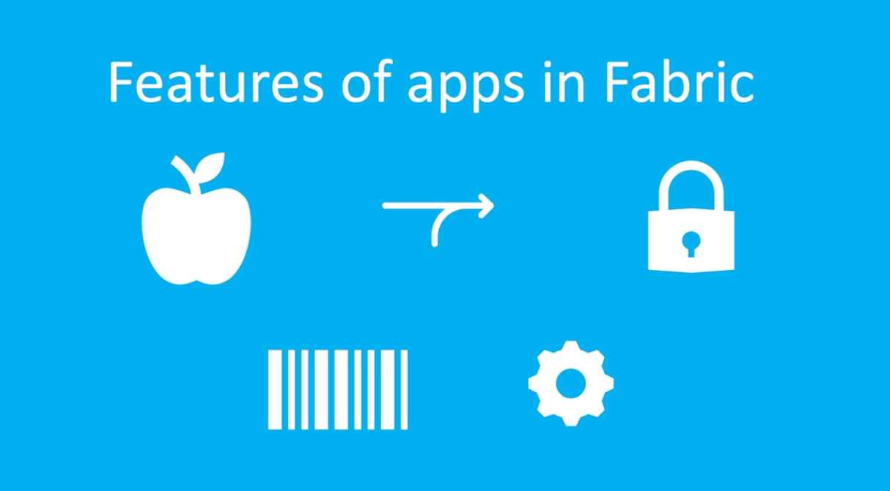

### 1. Purpose
Apps are designed to **organize and share analytics content in a structured and user-friendly way**.  
They can be built to support **specific business roles, departments, or business scenarios**, making it easier for users to access relevant insights.

### 2. Distribution
Apps can be **distributed to users across the organization**, allowing them to easily find and access the reports, dashboards, and data they need without navigating the workspace directly.

### 3. Access Control
Apps have their own **permission settings**, enabling administrators to control **who can view and interact with the app content**.

### 4. Customization
The **layout, navigation, and presentation** of an app can be customized to improve the user experience and make the analytics content easier to explore.

### 5. Update Mechanism
When the underlying content of an app is updated, **users automatically see the latest version** once the app is republished.  
This ensures that everyone always has access to **the most current data and reports**.

---

## Create app in Fabric

In the workspace "Human Resources", fint the report "FreighDetail" and click on it.
Now let's turn this auto generated report into an app.
Let's go home, click on the workspace "Human Resources", click on the button of the pace "Create app".

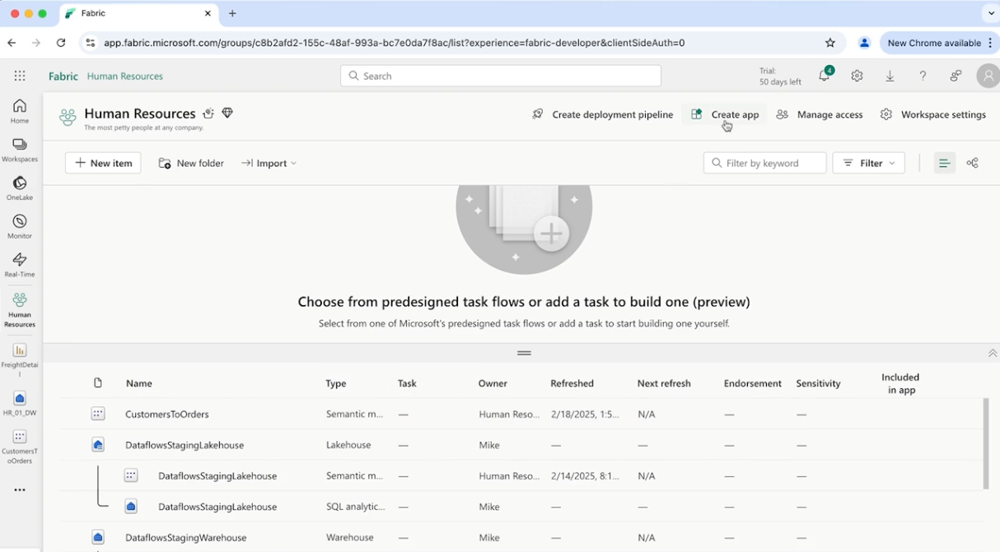

Name the app and add a short description and click create.

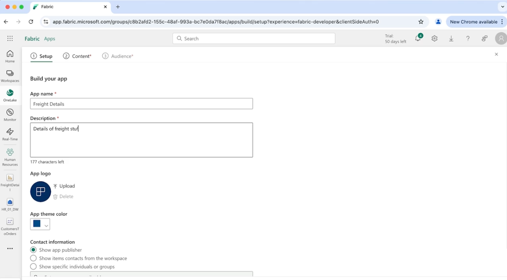

Click on the button "Add content" and the only content that we can add is "FreightDetail", then click on Audience, add the Entire organization, and git Publish and you will get a link to see the app online.

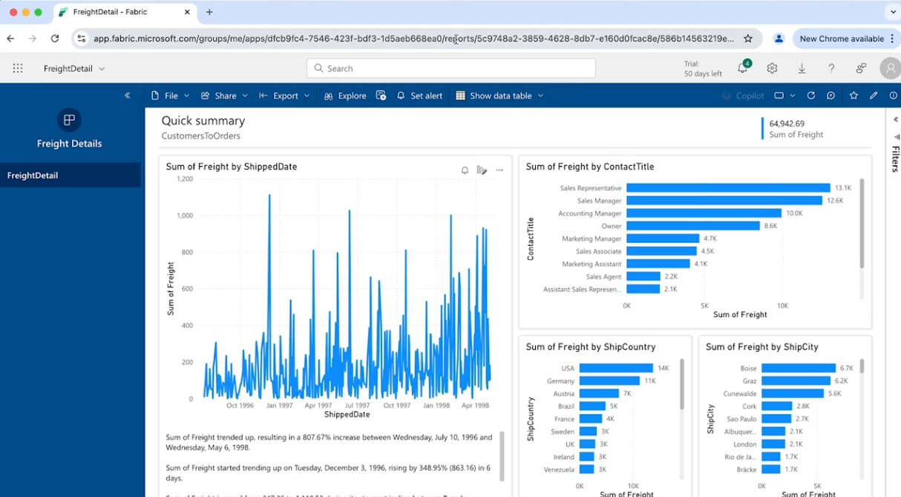

---

## Update app with Change in Report

We will change the report in the Power BI, click Save, go to workspace "Human Resources" and hit the button "Update app", review the name of the app, details and git Update. This will update the app.