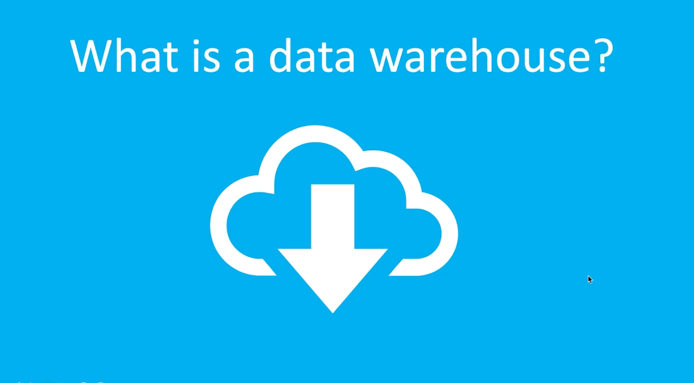
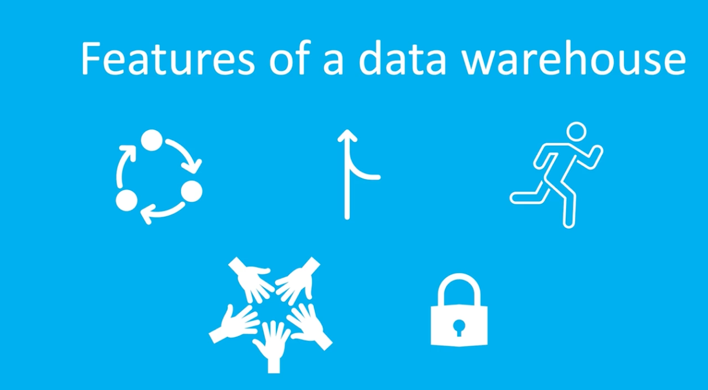
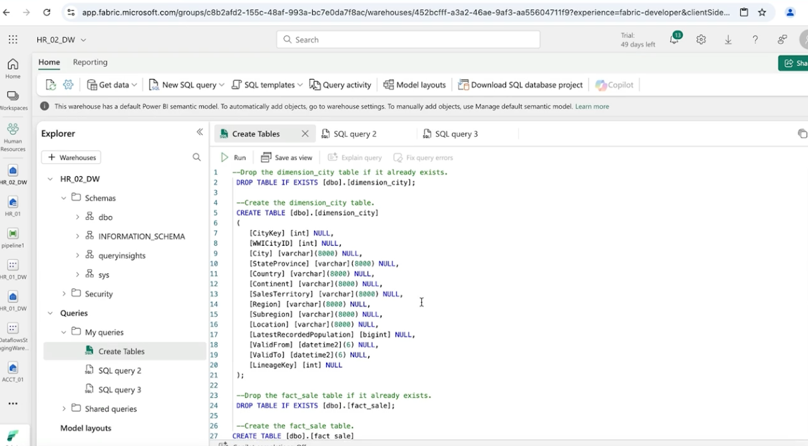
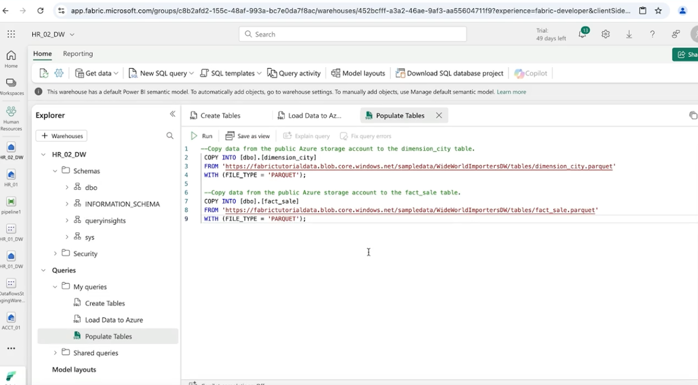
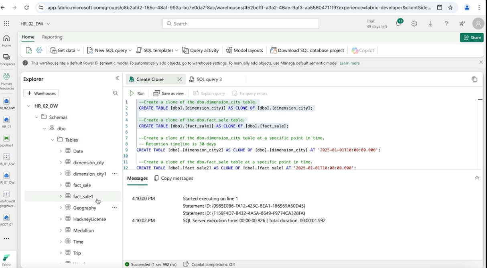
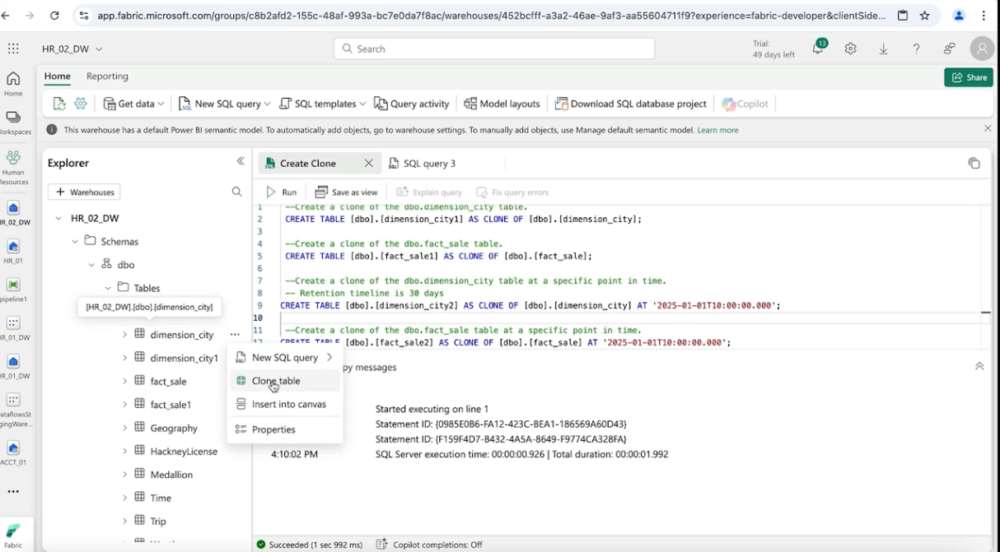
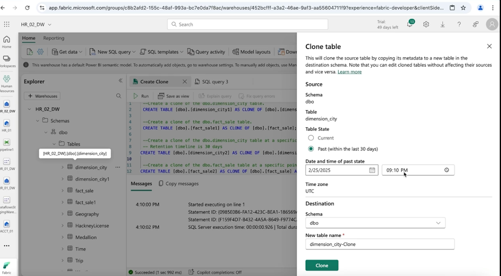
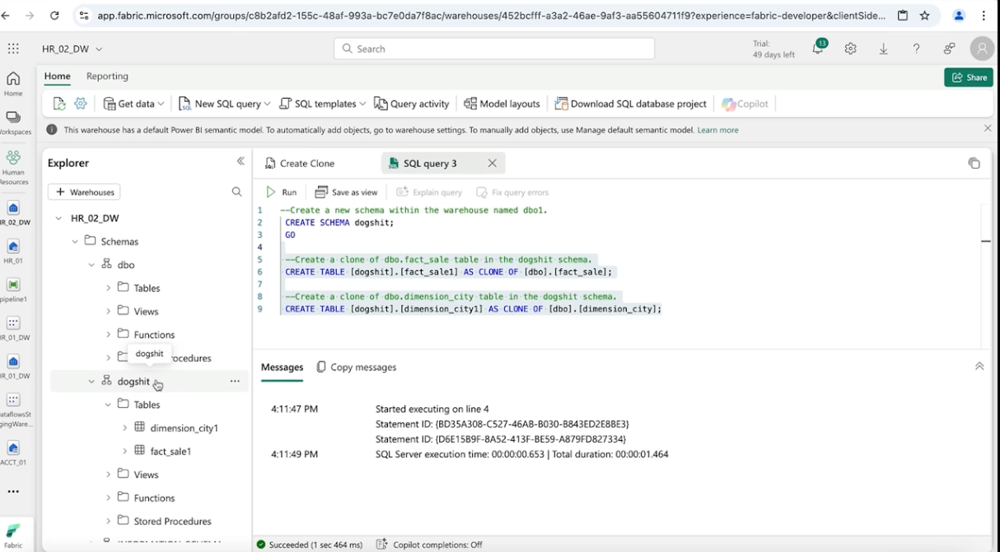
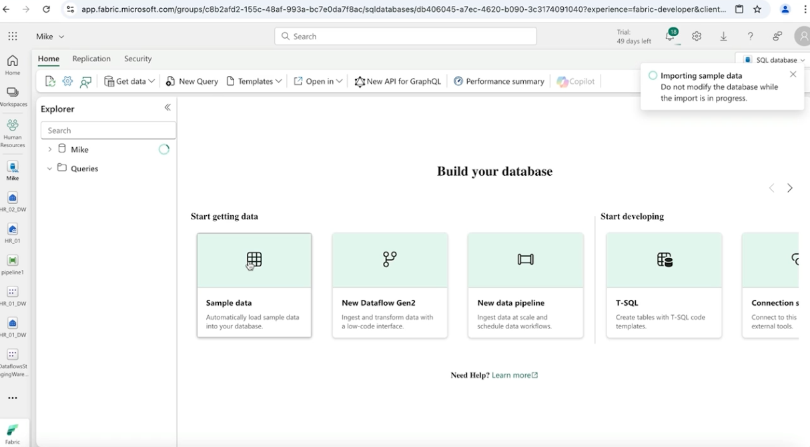
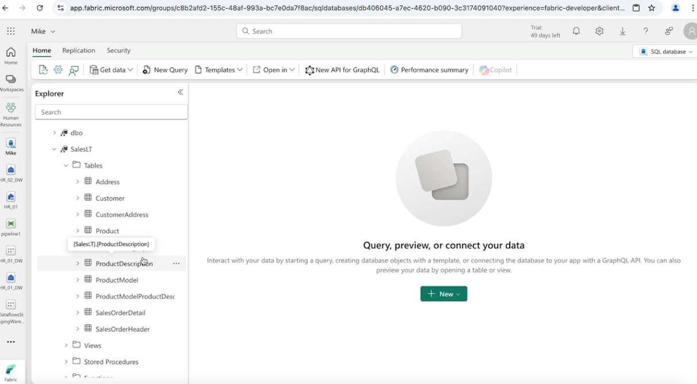

## Data Warehouse Defined



A **Data Warehouse in Microsoft Fabric** is a **centralized repository designed to store and manage large volumes of structured data** for **analytical processing and reporting**.

Data warehouses are optimized for **business intelligence, analytics, and decision-making**, enabling organizations to analyze historical and current data efficiently.

---

<!-- ## Features of a Data Warehouse -->


### 1. Centralized Data Storage
Data warehouses consolidate **structured data from multiple sources**, allowing organizations to perform **comprehensive analysis and reporting** from a single, reliable data source.

### 2. Scalability
Microsoft Fabric data warehouses are designed to **handle large-scale data storage and processing**.  
They can scale efficiently as **data volumes and analytical workloads grow**.

### 3. High Performance
Data warehouses are optimized for **high-performance queries and analytical workloads**, enabling users to generate **fast insights from large datasets**.

### 4. Integration
Fabric Data Warehouses integrate seamlessly with other **Microsoft Fabric services**, including:

- **Data Factory / Data Pipelines**
- **Power BI**
- **OneLake**

This creates a **unified data ecosystem** for analytics and reporting.

### 5. Security
Data warehouses in Microsoft Fabric provide **robust security features**, including:

- **Access control and role-based permissions**
- **Data encryption**
- **Compliance with industry standards**

These features help ensure that **sensitive data remains protected while still accessible for authorized analytics workloads**.;

---

## Create Data Warehouse

Let's go ahead and create a Data Warehouse. We have one in each workspace already but they where created automatically when we created the workspace, we will created other ones.

In the workspace "Human Resources" click the button "New Item" and in the search move down to "Store data" and search for "Simple warehouse", call the warehouse "HR_02_DW" and create it.

---

## Create and Populate Tables

Let's go ahead and do 3 tasks:
- create a tables
- load some data into our azure storage account
- then load that data into our new tables

### 1. Create Tables

```SQL
-Drop the dimension_city table if it already exists.
 DROP TABLE IF EXISTS [dbo].[dimension_city];

 --Create the dimension_city table.
 CREATE TABLE [dbo].[dimension_city]
 (
    [CityKey] [int] NULL,
    [WWICityID] [int] NULL,
    [City] [varchar](8000) NULL,
    [StateProvince] [varchar](8000) NULL,
    [Country] [varchar](8000) NULL,
    [Continent] [varchar](8000) NULL,
    [SalesTerritory] [varchar](8000) NULL,
    [Region] [varchar](8000) NULL,
    [Subregion] [varchar](8000) NULL,
    [Location] [varchar](8000) NULL,
    [LatestRecordedPopulation] [bigint] NULL,
    [ValidFrom] [datetime2](6) NULL,
    [ValidTo] [datetime2](6) NULL,
    [LineageKey] [int] NULL
 );

 --Drop the fact_sale table if it already exists.
 DROP TABLE IF EXISTS [dbo].[fact_sale];

 --Create the fact_sale table.
CREATE TABLE [dbo].[fact_sale]
(
   [SaleKey] [bigint] NULL,
   [CityKey] [int] NULL,
   [CustomerKey] [int] NULL,
   [BillToCustomerKey] [int] NULL,
   [StockItemKey] [int] NULL,
   [InvoiceDateKey] [datetime2](6) NULL,
   [DeliveryDateKey] [datetime2](6) NULL,
   [SalespersonKey] [int] NULL,
   [WWIInvoiceID] [int] NULL,
   [Description] [varchar](8000) NULL,
   [Package] [varchar](8000) NULL,
   [Quantity] [int] NULL,
   [UnitPrice] [decimal](18, 2) NULL,
   [TaxRate] [decimal](18, 3) NULL,
   [TotalExcludingTax] [decimal](29, 2) NULL,
   [TaxAmount] [decimal](38, 6) NULL,
   [Profit] [decimal](18, 2) NULL,
   [TotalIncludingTax] [decimal](38, 6) NULL,
   [TotalDryItems] [int] NULL,
   [TotalChillerItems] [int] NULL,
   [LineageKey] [int] NULL,
   [Month] [int] NULL,
   [Year] [int] NULL,
   [Quarter] [int] NULL
);
```

### 1. Load to our our azure storage account


### 1. Load to tables


---

## Clone Tables

Let's use the clone feature to clone some tables.

- Create Clone

```SQL
 --Create a clone of the dbo.dimension_city table.
 CREATE TABLE [dbo].[dimension_city1] AS CLONE OF [dbo].[dimension_city];

 --Create a clone of the dbo.fact_sale table.
 CREATE TABLE [dbo].[fact_sale1] AS CLONE OF [dbo].[fact_sale];

 --Create a clone of the dbo.dimension_city table at a specific point in time.   
 -- Retention timeline is 30 days
CREATE TABLE [dbo].[dimension_city2] AS CLONE OF [dbo].[dimension_city] AT '2025-01-01T10:00:00.000';

 --Create a clone of the dbo.fact_sale table at a specific point in time.
CREATE TABLE [dbo].[fact_sale2] AS CLONE OF [dbo].[fact_sale] AT '2025-01-01T10:00:00.000';
```

We can also clone table by hand



- Create Schemas and put tables inside that schema


---

## Create SQL Database and Populate

Let's create a database.
Go into the workspace "Human Resources" click on the "New item" and search for "SQL database (preview)" and name the database "Mike".

Let's click on the "Sample data" to import some sameple data.



We can see in the workspace "Human Resources" that there is a "SQL database" named "Mike".

---

## Copy Command

Let's go ahead and copy some data with the COPY INTO command.

```SQL
CREATE TABLE [dbo].[bing_covid-19_data]
(
    [id] [int] NULL,
    [updated] [date] NULL,
    [confirmed] [int] NULL,
    [confirmed_change] [int] NULL,
    [deaths] [int] NULL,
    [deaths_change] [int] NULL,
    [recovered] [int] NULL,
    [recovered_change] [int] NULL,
    [latitude] [float] NULL,
    [longitude] [float] NULL,
    [iso2] [varchar](8000) NULL,
    [iso3] [varchar](8000) NULL,
    [country_region] [varchar](8000) NULL,
    [admin_region_1] [varchar](8000) NULL,
    [iso_subdivision] [varchar](8000) NULL,
    [admin_region_2] [varchar](8000) NULL,
    [load_time] [datetime2](6) NULL
);

COPY INTO [dbo].[bing_covid-19_data]
FROM 'https://pandemicdatalake.blob.core.windows.net/public/curated/covid-19/bing_covid-19_data/latest/bing_covid-19_data.parquet'
WITH (
    FILE_TYPE = 'PARQUET'
);

Select top 100 * from [dbo].[bing_covid-19_data];

DELETE FROM [dbo].[bing_covid-19_data];

COPY INTO [dbo].[bing_covid-19_data]
FROM 'https://pandemicdatalake.blob.core.windows.net/public/curated/covid-19/bing_covid-19_data/latest/bing_covid-19_data.csv'
WITH (
    FILE_TYPE = 'CSV', 
    FIRSTROW = 2
);

SELECT COUNT(*) FROM [dbo].[bing_covid-19_data];
```

---

## CTAS -> CREATE TABLE AS SELECT

This is another more advance way to bring the data it.

```SQL
CREATE TABLE [dbo].[bing_covid-19_data_2023]
AS
SELECT * 
FROM [dbo].[bing_covid-19_data] 
WHERE DATEPART(YEAR,[updated]) = '2023';

select * from [dbo].[bing_covid-19_data_2023]

CREATE TABLE [dbo].[infections_by_month_2022]
AS
SELECT [country_region], DATEPART(MONTH,[updated]) AS [month], SUM(CAST(confirmed as bigint)) [confirmed_sum]
FROM OPENROWSET(BULK 'https://pandemicdatalake.blob.core.windows.net/public/curated/covid-19/bing_covid-19_data/latest/bing_covid-19_data.parquet') AS data
WHERE DATEPART(YEAR,[updated]) = '2022'
GROUP BY [country_region],DATEPART(MONTH,[updated]);

SELECT * FROM [dbo].[infections_by_month_2022]
WHERE [country_region] = 'United States'
ORDER BY [confirmed_sum] DESC;
```

---

## Monitor and Kill Long Running Sessions

If a session is taking to much and it is making another session not load in time we need to fix this.

```SQL
--  find all sessions that are currently executing.
SELECT * 
FROM sys.dm_exec_sessions;

--  the relationship between the active session in a specific connection.
SELECT connections.connection_id,
 connections.connect_time,
 sessions.session_id, sessions.login_name, sessions.login_time, sessions.status
FROM sys.dm_exec_connections AS connections
INNER JOIN sys.dm_exec_sessions AS sessions
ON connections.session_id=sessions.session_id;

-- long running queries 
SELECT request_id, session_id, start_time, total_elapsed_time
FROM sys.dm_exec_requests
WHERE status = 'running'
ORDER BY total_elapsed_time DESC;

-- terminate session 
KILL 140
```