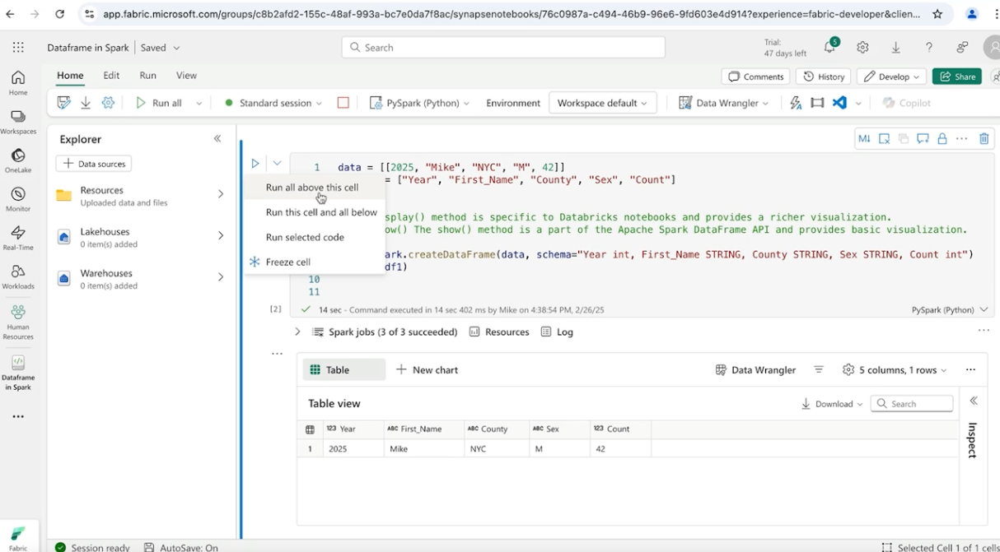
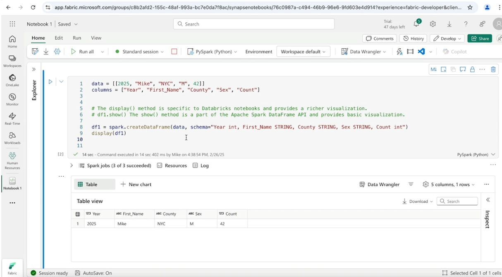
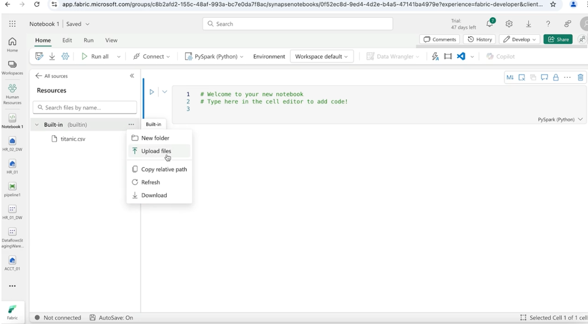
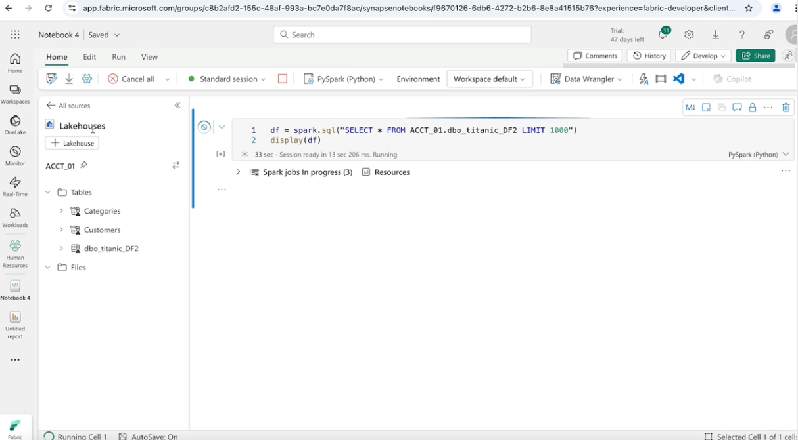
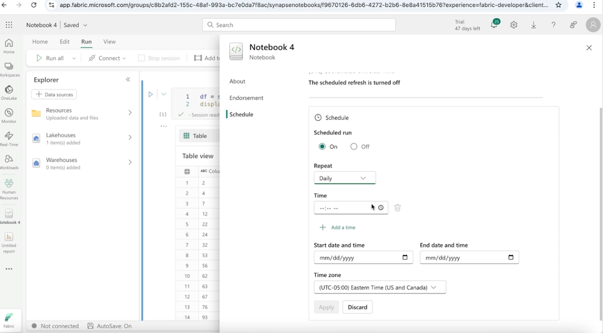
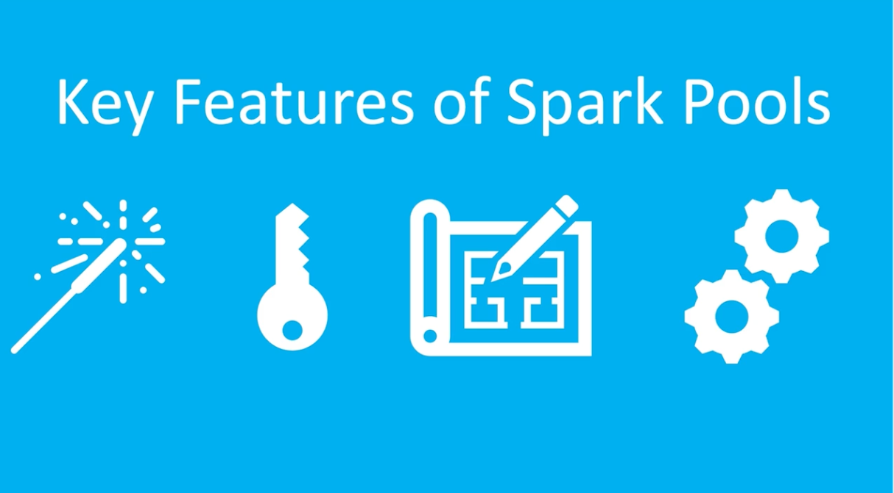
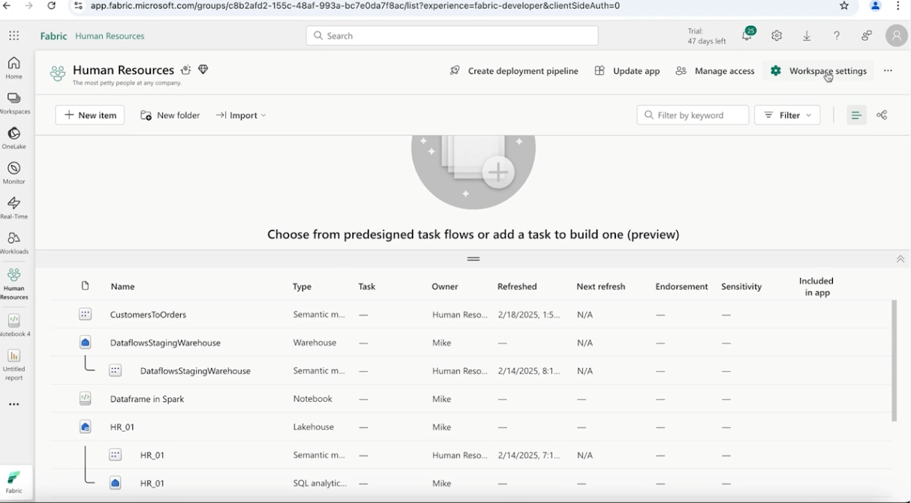
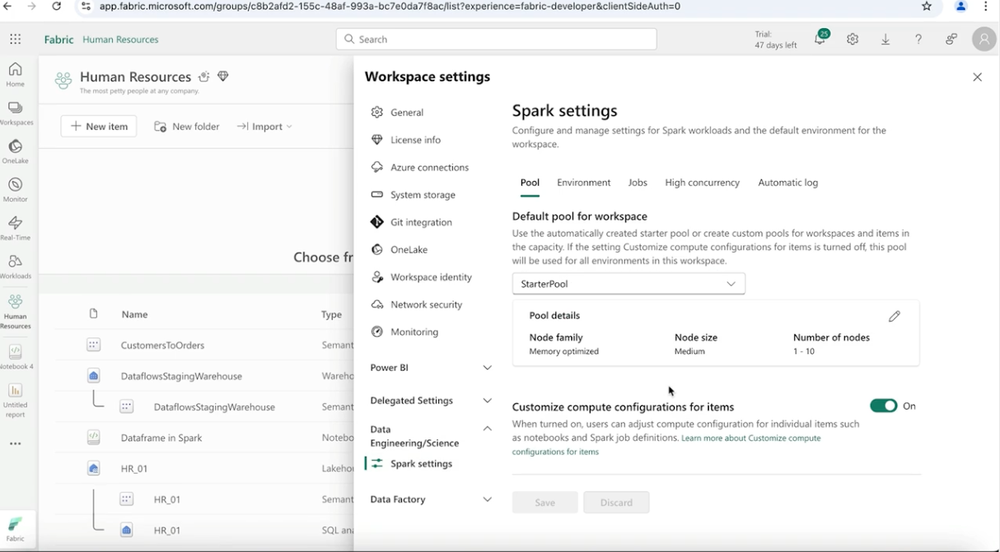

## Apache Spark Defined


**Apache Spark** is an **open-source unified analytics engine** designed for **large-scale data processing**.  
It provides a **distributed, in-memory computing framework** that allows organizations to process massive datasets efficiently.

Spark supports a wide range of workloads, including:

- **Batch data processing**
- **Interactive queries**
- **Real-time analytics**
- **Machine learning**

Modern data platforms and warehouses—such as **BigQuery, Snowflake, and Microsoft Fabric**—use **massively parallel computing** concepts similar to those used by Spark to process large datasets efficiently.

---

## Features of Apache Spark


### 1. Speed
Spark performs computations **in memory**, which significantly improves processing speed compared to traditional **disk-based frameworks** like earlier Hadoop MapReduce systems.

### 2. Ease of Use
Spark provides **simple and flexible APIs** in multiple programming languages, including:

- **Java**
- **Scala**
- **Python**
- **R**

This makes it accessible to a wide range of developers and data engineers.

### 3. Versatility
Spark supports multiple types of **data processing workloads within a single framework**, including:

- **ETL (Extract, Transform, Load)**
- **Streaming analytics**
- **Machine learning**
- **Graph processing**

This versatility allows organizations to build **end-to-end data processing pipelines** using one unified platform.

### 4. Scalability
Spark can **scale from a single server to thousands of distributed machines**, making it suitable for both **small-scale processing and large enterprise-level data workloads**.

### 5. Integration
Spark integrates seamlessly with many **data sources and storage systems**, including:

- **Hadoop**
- **Apache HBase**
- **Apache Cassandra**
- **AWS S3**
- **Cloud data lakes and warehouses**

This flexibility allows Spark to operate within **many different data architectures and cloud environments**.

---

## Notebook Basics



---

## Create Dataframe in Spark

To create a notebook we go to the workspace, in our case "Human Resources", click on the "New item" and select the "Notebook" from the secton "Analyze and train data", gave a name to the notebook and run the following code:

```python
data = [[2025, "Mike", "NYC", "M", 42]]
columns = ["Year", "First_Name", "County", "Sex", "Count"]


# The display() method is specific to Databricks notebooks and provides a richer visualization.
# df1.show() The show() method is a part of the Apache Spark DataFrame API and provides basic visualization.

df1 = spark.createDataFrame(data, schema="Year int, First_Name STRING, County STRING, Sex STRING, Count int")
display(df1)
```


---

## Create Dataframe in Scala

```scala
val data = Seq((2025, "Mike", "Albany", "M", 42))
val columns = Seq("Year", "First_Name", "County", "Sex", "Count")


// The display() method is specific to Databricks notebooks and provides a richer visualization.
// df1.show() The show() method is a part of the Apache Spark DataFrame API and provides basic visualization
val df1 = data.toDF(columns: _*)
display(df1)
```

---

## Automatically Import Data Into Notebook



We can drag and drop the csv from the file list to the notebook and it will automatically create a cell code to import that data in the notebook

---

## Automatically Import Data from Lakehouse

We go tho workspace "Human Resources", press "New item" search for the section "Analyze and train data", and open a "Notebook", click on the "Lakehouse" and click on Add, select the bullet point option "Existing Lakehouse without Schema" and select the Lakehouse "ACCT_01" and the tables will be imported.

We can drag and drop the tables or the schema into the notebook and it will create a cell that imports the schema or the table.



---

## No Auto Upload in the Data Warehouse

We can not drag and drop the tables or schemas from the Data Warehouse into the Notebook.
We will get the following warning in the notebook when we have open a Data Warehouse "This data source is not fully supported under the current global language".

---

## Schedule Notebook Run

Under the Run section in the notebook click "Schedule" and we can add the details of the scheduled notebook.


---

## Spark Pools


In Microsoft Fabric, **Spark Pools** are managed sets of **Apache Spark compute resources** used to run data processing and analytics workloads.

As a **Data Engineer**, managing compute resources is an important responsibility. Spark Pools allow you to create environments where **Spark jobs can run efficiently**, with resources optimized for different workloads.

These pools provide **dedicated clusters or compute nodes** that can be configured to meet specific performance and scalability requirements within the Fabric platform.

---

## Key Features of Spark Pools



### 1. Spark-Based Compute
Spark Pools are used to manage **Apache Spark compute resources**.  
Users can configure settings such as:

- Number of compute nodes  
- Memory allocation  
- Processing capacity  

These configurations allow data engineers to optimize Spark jobs for their specific data processing tasks.

### 2. Default Startup Pool
Microsoft Fabric provides a **preconfigured startup Spark pool** that allows users to begin running Spark workloads immediately without manually configuring clusters.

This pool is useful for **exploration, experimentation, and quick development tasks**.

### 3. Custom Spark Pools
Users can create **custom Spark pools** with specific configurations tailored to their workload requirements.  
This allows organizations to optimize resources for **different types of data processing jobs**.

### 4. Capacity Management
Spark Pools help administrators **manage and allocate compute capacity across workspaces**.  
This ensures **efficient resource utilization, workload balancing, and cost control** across the Fabric environment.

---

## Configure Spark Settings

Go to the workspace "Human Resources" and we have a button named "Workspace settings", click on it.


We have a lot of settings but the one that we are looking for is Data Engineering/Science -> Spark settings


We can play with a lot of settings.