## Defining Real-Time Analytics

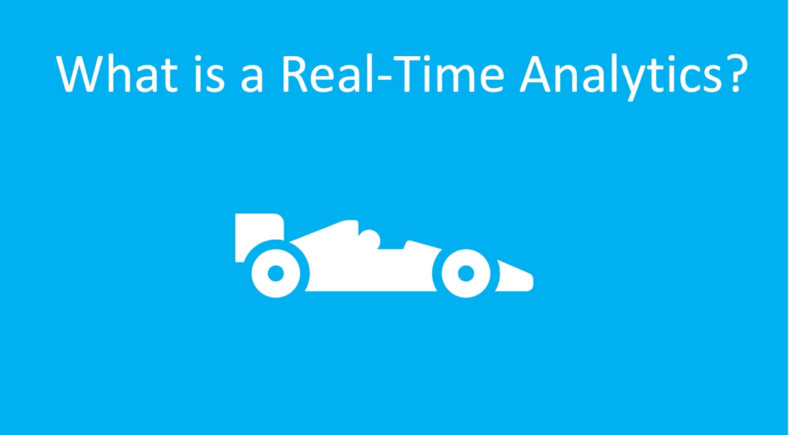

Real-Time Analytics (RTA) in **Microsoft Fabric** focuses on analyzing **data in motion**—data that is continuously generated and processed as events occur.

It enables organizations to **ingest, process, analyze, and visualize streaming data** in near real time. This supports **event-driven scenarios**, where insights can be generated immediately from sources such as **IoT devices, application logs, telemetry, and streaming systems**.

Real-Time Analytics allows businesses to monitor live systems, detect anomalies, and respond quickly to changing conditions.

---

## Key Points of Real-Time Analytics in Fabric

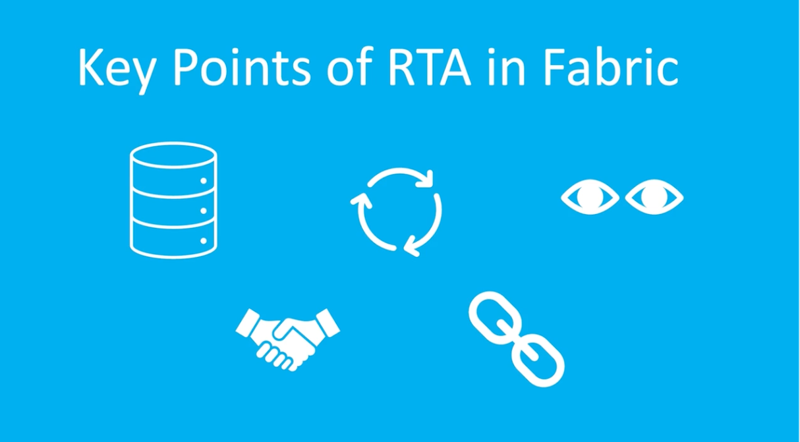

### 1. Data Ingestion
Real-Time Analytics can ingest streaming data from various sources, including:

- **IoT devices**
- **Application and system logs**
- **Event streams**
- **Semi-structured data sources**

This enables continuous data flow into the analytics platform.

### 2. Transformation and Storage
The platform processes, transforms, and stores streaming data efficiently, preparing it for **real-time querying, analysis, and long-term storage**.

### 3. Visualization
Real-Time Analytics enables **immediate visual insights** through dashboards and reports.  
This allows teams to monitor systems and make **data-driven decisions quickly**.

### 4. Real-Time Actions
The system supports **event-driven triggers and automated responses** based on incoming data streams.  
This enables real-time alerts, automation, and operational responses to important events.

### 5. Integration
Real-Time Analytics integrates seamlessly with other **Microsoft Fabric services**, ensuring that streaming data remains **secure, governed, and accessible across the organization** while maintaining proper access controls.

---

## Real-Time Fabric Architecture and Components

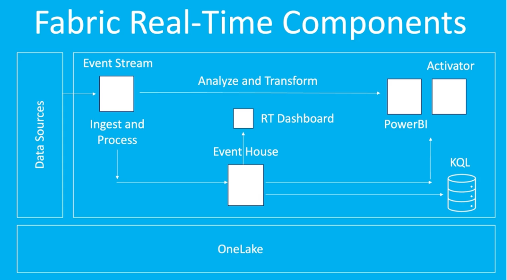

The **Real-Time Analytics architecture in Microsoft Fabric** enables organizations to ingest, process, analyze, and act on **streaming data in real time**.  
This architecture typically involves three main layers:

1. **Real-Time Hub**
2. **Data Sources and Processing Components**
3. **OneLake**

---

## 1. Real-Time Hub

The **Real-Time Hub** in Microsoft Fabric acts as a **centralized platform for managing and discovering streaming data across the organization**.  

It allows users to:
- Discover available event streams
- Connect to streaming data sources
- Monitor real-time data pipelines

This hub simplifies how teams work with **real-time event data** in Fabric.

---

## 2. Data Sources and Processing Components

Streaming data flows through several components that ingest, process, analyze, and trigger actions based on events.

### Event Stream
**Event Streams** provide a **real-time data ingestion and routing experience** in Microsoft Fabric.  
They allow users to:

- Ingest real-time events
- Transform streaming data
- Route events to different destinations

This can be done **without writing code**, making it easier to build streaming pipelines.

---

### Data Ingestion and Processing
Streaming data can be ingested from multiple sources, including:

- **Azure Event Hubs**
- **Azure IoT Hub**
- **Databases using Change Data Capture (CDC)**
- **Application logs and telemetry systems**

These connectors bring streaming data into Fabric for processing.

---

### Eventhouse
An **Eventhouse** is a specialized workspace in Fabric designed to **analyze and manage large volumes of event-based data in real time**.

It enables fast querying and analysis of streaming data and integrates with other services such as **Power BI and Activator** to generate insights and trigger actions.

---

### KQL Database
A **KQL Database** is a specialized database in Microsoft Fabric designed to **store and query large volumes of event-based data**.

It uses **Kusto Query Language (KQL)**, a powerful query language designed for:

- High-speed analytics
- Complex queries
- Aggregations
- Data transformations

KQL databases are optimized for **log analytics and real-time event processing**.

---

### Power BI
**Power BI** can connect to real-time data streams to create **interactive reports and dashboards**, allowing users to visualize and analyze streaming data.

---

### Activator
**Activator** is a **no-code automation tool** that allows users to define rules and conditions based on streaming data.

When specific **events or patterns occur**, Activator can automatically trigger actions such as:

- Sending alerts
- Starting workflows
- Triggering notifications

---

### Real-Time Dashboards
**Real-Time Dashboards** provide live visualizations of streaming data, allowing organizations to monitor systems and events as they happen.

---

## 3. OneLake

**OneLake** acts as the **centralized storage layer** for Microsoft Fabric.  
It stores data generated or processed by the real-time analytics components, ensuring that event data can also be used for **historical analysis, reporting, and machine learning workloads**.

---

## Create an EventHouse

Go to the workspace "Human Resources", click on "New item" and search for the "Eventhouse" and gave it a name "LogHouseData". When we do this it is qoing to create a KQL Database behinde the scenes.

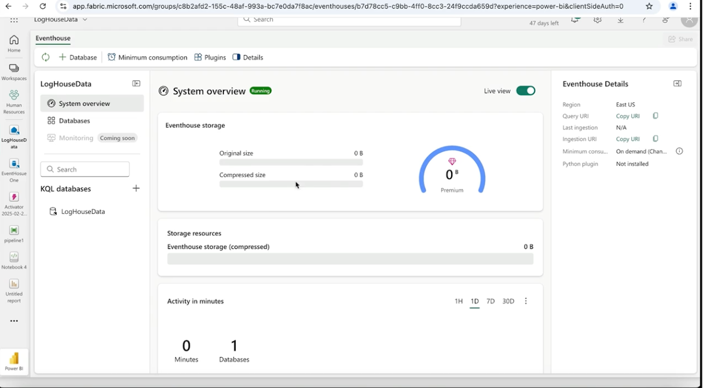

Click on Databases and we can see the information of our KQL daqtabases.
We don't have any data so let's import some data.
Click on the elipses (3 dots) -> "Get data" -> Sample -> Log analytics

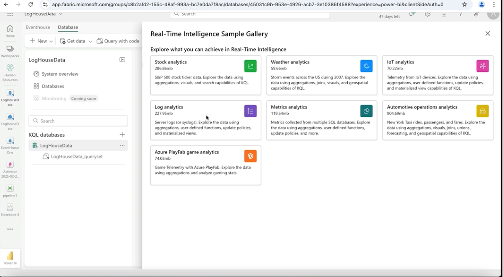
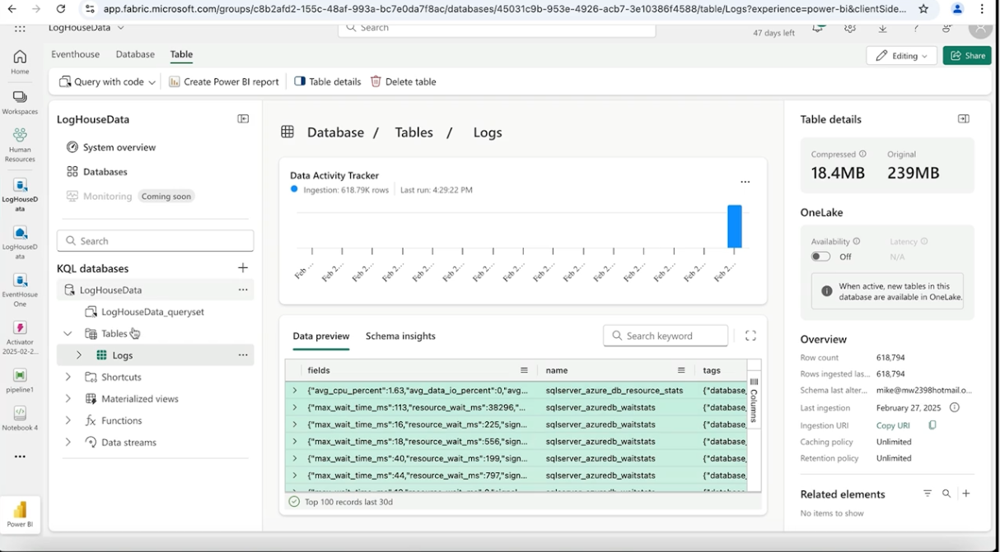

Let's query our data using KQL, click on the "LogHouseData_queryset".

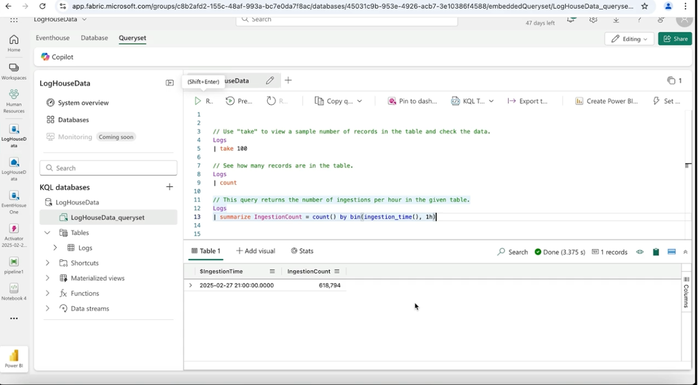

---

## KQL Practice with Weather Data

Create a new database named "Weather_queryset" and use the default setting and test the following querys
```SQL
// How many rows are in this dataset. 
Weather
| count

Weather
| take 5

Weather
| take 5
| project State, EventType, DamageProperty

Weather
| distinct EventType

Weather
| where State == 'TEXAS' and EventType == 'Flood'
| sort by DamageProperty
| project StartTime, EndTime, State, EventType, DamageProperty

Weather
| where State == 'TEXAS' and EventType == 'Flood'
| project StartTime, EndTime, State, EventType, DamageProperty

Weather
| where StartTime between (datetime(2007-08-01 00:00:00) .. datetime(2007-08-30 23:59:59))
| project State, EventType, StartTime, EndTime
| sort by StartTime asc 

Weather
| where State == 'TEXAS' and EventType == 'Flood'
| top 5 by DamageProperty
| project StartTime, EndTime, State, EventType, DamageProperty

Weather
| where State == 'TEXAS' and EventType == 'Flood'
| top 5 by DamageProperty desc
| project StartTime, EndTime, Duration = EndTime - StartTime, DamageProperty

// Creating a calcuated column from two other columns. 
Weather
| where State == 'TEXAS' and EventType == 'Flood'
| top 5 by DamageProperty desc
| extend Duration = EndTime - StartTime
```

---

## KQL Answers Explained

Explained the rest of the querys

```SQL
// How many rows are in this dataset. 
Weather
| count

// Return the top five rows. 
Weather
| take 5

// The project means... give me the list of columns after the project word. 
Weather
| take 5
| project State, EventType, DamageProperty

// Give me the EventType with no dupes. 
Weather
| distinct EventType


// Return state of Teaxas and EventType clomun named flood. 
Weather
| where State == 'TEXAS' and EventType == 'Flood'
| sort by DamageProperty
| project StartTime, EndTime, State, EventType, DamageProperty


// Nothing new
Weather
| where State == 'TEXAS' and EventType == 'Flood'
| project StartTime, EndTime, State, EventType, DamageProperty

// Notice syntax for datetime 
Weather
| where StartTime between (datetime(2007-08-01 00:00:00) .. datetime(2007-08-30 23:59:59))
| project State, EventType, StartTime, EndTime
| sort by StartTime asc 

// Nothing new here. 
Weather
| where State == 'TEXAS' and EventType == 'Flood'
| top 5 by DamageProperty
| project StartTime, EndTime, State, EventType, DamageProperty


// Creating a calcuated column. 
Weather
| where State == 'TEXAS' and EventType == 'Flood'
| top 5 by DamageProperty desc
| project StartTime, EndTime, Duration = EndTime - StartTime, DamageProperty

// Creating a calcuated column from two other columns. 
Weather
| where State == 'TEXAS' and EventType == 'Flood'
| top 5 by DamageProperty desc
| extend Duration = EndTime - StartTime
```

---

## Create and Populate EventStream


Go to the workspace "Human Resources", click on "New item" and search for the "Eventstream" and gave it a name "TheBikeStream".

Let's add a source, click on "Sample data".
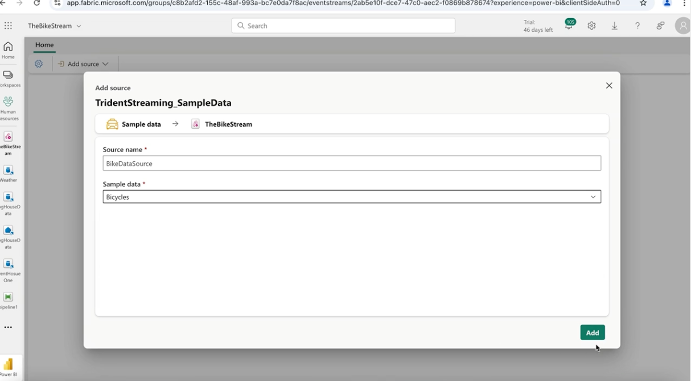

Enter the source name "BikeDataSource" and choose the sample "Bykes"


This is the stream pipeline
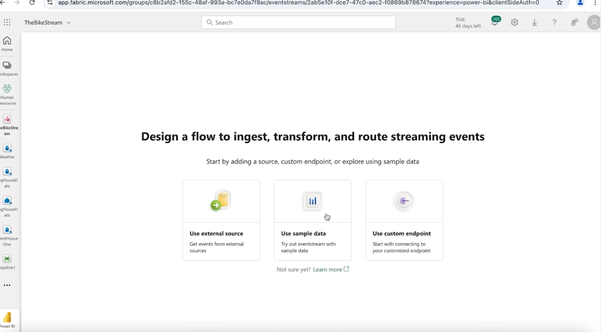

Let's configure the destination. By clicking on the last task drop down we configure it to the Lakehouse
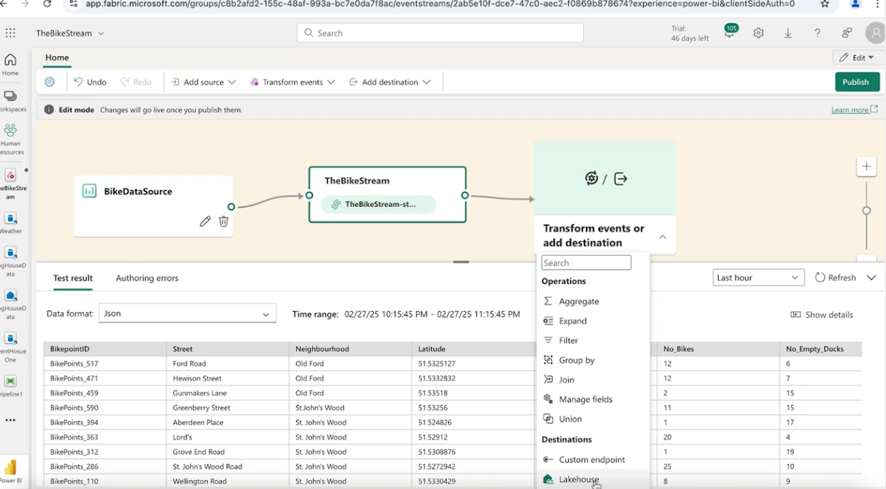

Configure the settings and save them.
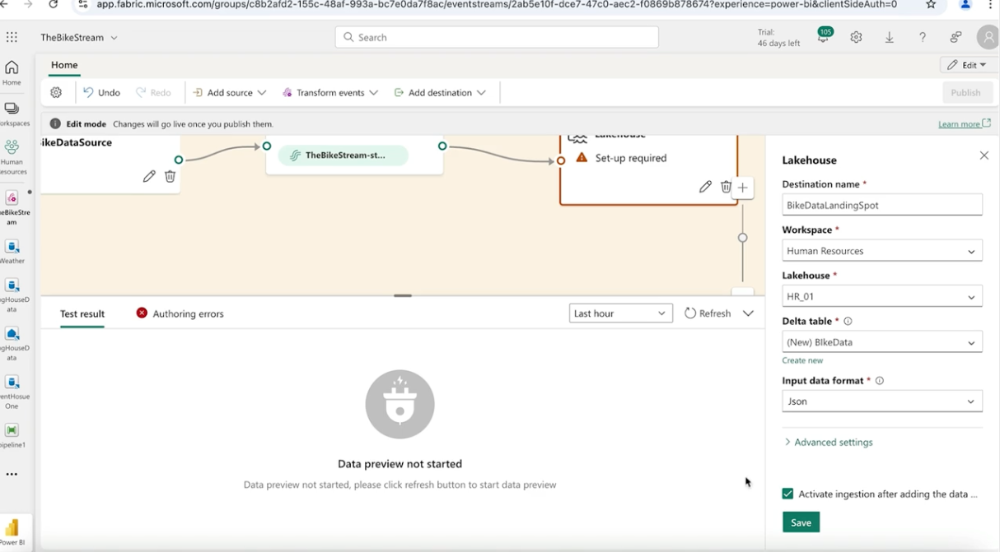

Hit Publish the pipeline so that we can make it work.

---

## Troble Shooting EventStrem Issues

If we close the pipeline for a day and reopen it we will see some errors.
We are going to analyse those error and solve them.

The data is not loading because we are on a free account the the people that are paying have priority.

---

## Add Transformer to EventStream

On the pipeline click the button "Transform event" -> "Manage fields"
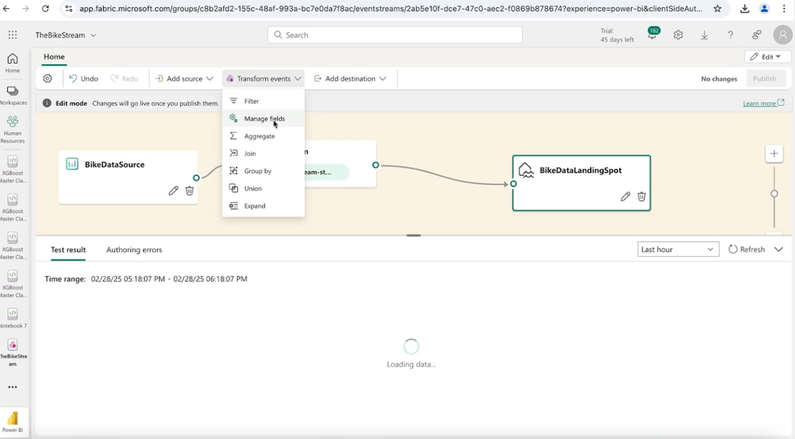

A task was added to the pipeline.
We will put that task between TheBikeStream and the destination.
The test will be a System timestamp.
