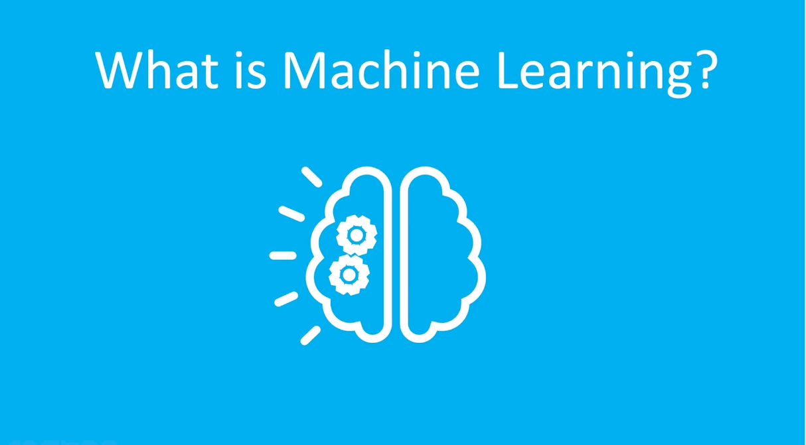
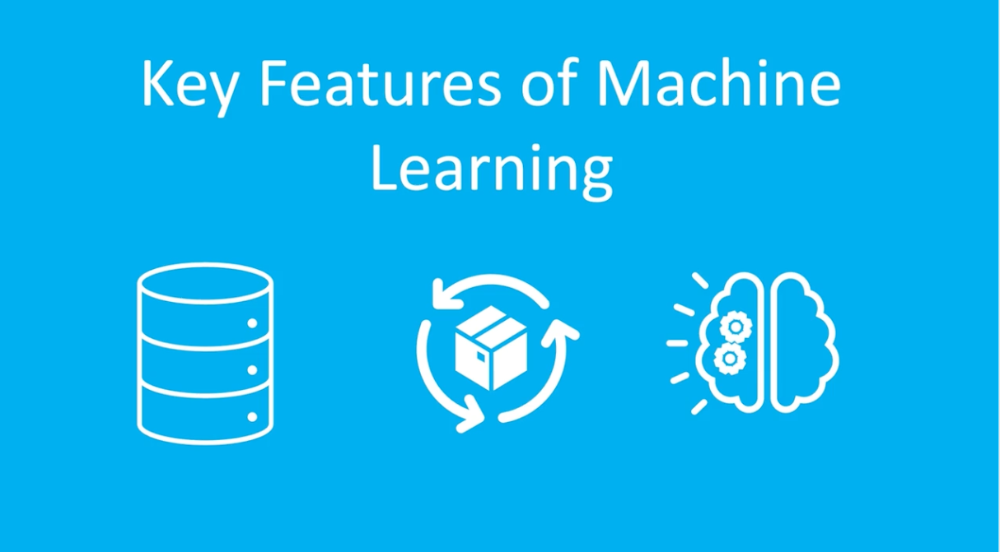

## Machine Learning Defined

**Machine Learning (ML)** is a **subset of Artificial Intelligence (AI)** that focuses on enabling computers to **learn from data and improve their performance over time without being explicitly programmed**.

Instead of relying on predefined rules, machine learning models use **algorithms trained on data** to identify patterns, make predictions, and support decision-making processes.

Machine learning is widely used in areas such as **predictive analytics, recommendation systems, fraud detection, and anomaly detection**.

---

## Key Features of Machine Learning

### 1. Data-Driven
Machine learning models rely heavily on **large amounts of data** to learn patterns and relationships.  
The quality and quantity of data directly impact the **accuracy and reliability of predictions**.

### 2. Modeling
A **machine learning model** is created by applying algorithms to **training data**.  
During training, the model learns patterns and relationships within the data, which it can then use to **make predictions or classifications on new data**.

### 3. Learning Methods
There are several machine learning approaches. One of the most common is **Supervised Learning**, where the model learns from **labeled datasets** that contain both input data and the correct output.

Other common approaches include:

- **Unsupervised Learning** – Identifying patterns in unlabeled data  
- **Reinforcement Learning** – Learning through interaction with an environment and feedback

---

## Modeling the Titanic with XGBoost in Fabric

We have imported a notebook into fabric workspace and worked with it.

---

## Automating Data Cleansing in Fabric

Data Rangler - this is another term for data cleansing.