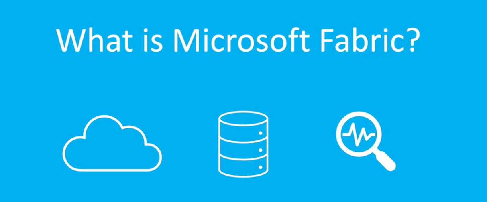
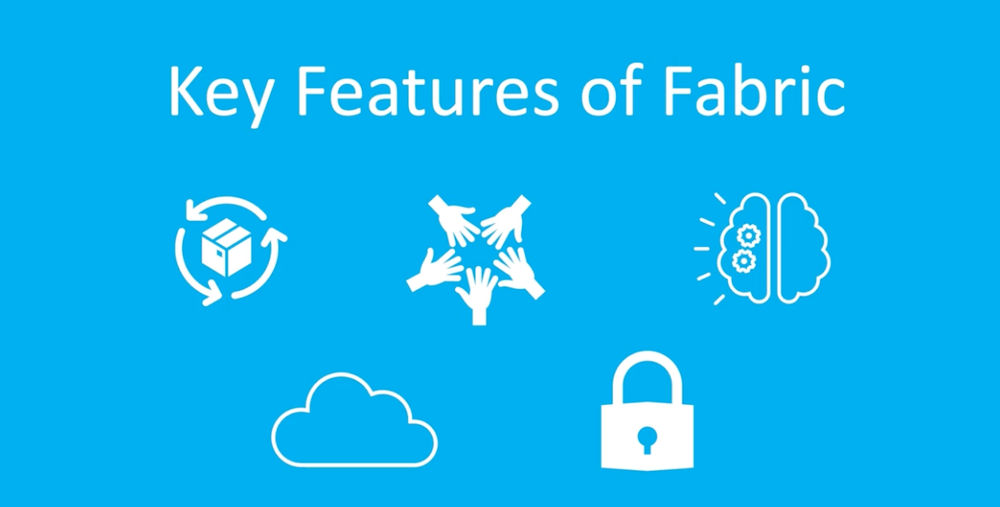

# Microsoft Fabric Overview

<!-- ## What is Microsoft Fabric? -->

Microsoft Fabric is a **unified cloud-based data platform** designed to simplify data management and analytics within an organization. It is a **data-centric platform** that brings together all the components needed to ingest, store, process, analyze, and visualize data in a single environment.

Fabric integrates multiple services from the Microsoft ecosystem, including Azure technologies, to provide a **seamless end-to-end data experience**.

---

<!-- ## Key Features of Microsoft Fabric -->

Microsoft Fabric provides several capabilities that simplify modern data workflows:

### 1. End-to-End Data Services
Fabric supports the complete data lifecycle, including:

- Data ingestion  
- Data storage  
- Data processing and analysis  
- Data visualization  

This allows teams to work with data from **source to insights** within a single platform.

### 2. Unified Data Experience
Fabric combines several data workloads under one architecture, including:

- Data Ingestion  
- Data Engineering  
- Data Warehousing  
- Data Science  
- Real-Time Analytics  
- Applied Observability  
- Business Intelligence  

This unified approach reduces the need for multiple separate tools.

### 3. AI-Powered Capabilities
Microsoft Fabric includes **built-in AI and machine learning capabilities** that help:

- Automate repetitive tasks  
- Generate insights from data  
- Improve analytics workflows  

### 4. Integration with Microsoft Cloud
Fabric is fully compatible with **Microsoft Azure and other Microsoft cloud services**, enabling easy integration with existing enterprise systems.

### 5. Reduced Complexity
Fabric simplifies data architecture by providing:

- A single optimized environment  
- Built-in security  
- Governance and compliance tools  
- Integrated data services 

---

Tutorial: [Start a Microsoft Fabric Trial without using a work email address](https://www.youtube.com/watch?v=RHV7jZqc_tE)

