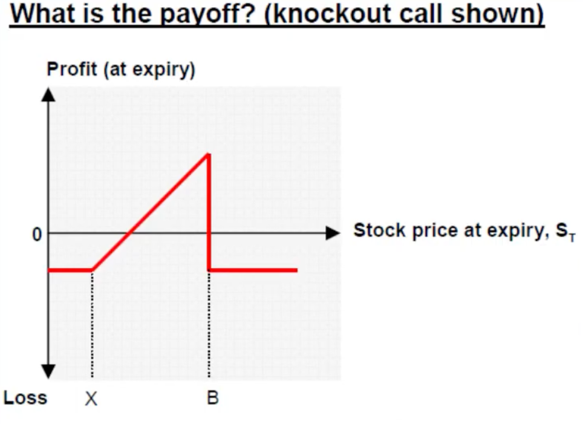

## OBS1. Financial Derivative
**Financial Derivative** &rarr; is a type of financial contract whose **value** is based on (or “**derived from**”) **the value of another asset**, called the *underlying asset*.

### 🔑 Simple idea
Instead of having value on its own, a derivative’s price depends on something else—like:
- stocks
- bonds
- commodities (oil, gold, wheat)
- currencies
- interest rates

### 📊 Common types of derivatives
1. **Futures contracts** &rarr; Agreements to buy or sell an asset at a fixed price on a future date.
2. **Options** &rarr; Give the holder the right (but not obligation) to buy or sell an asset at a set price before a certain date.
3. **Forwards** &rarr; Similar to futures, but customized private agreements between two parties.
4. **Swaps** &rarr; Contracts where two parties exchange financial flows (e.g., swapping fixed interest payments for variable ones).

---

## V1. Python Multithreading in 3 Minutes
**Multithreading** &rarr; running multiple threads within the same program so different tasks can make progress “at the same time.”

**Thread** &rarr; a lightweight unit of execution inside a process.

### ✅ Basic example
Python provides the built-in `threading` module.
```python
import threading
import time

def task(name):
    for i in range(3):
        print(f"{name} is running")
        time.sleep(1)

# Create threads
t1 = threading.Thread(target=task, args=("Thread-1",))
t2 = threading.Thread(target=task, args=("Thread-2",))

# Start threads
t1.start()
t2.start()

# Wait for both to finish
t1.join()
t2.join()

print("Done")
```
Both threads run concurrently.

### ⚠️ Important: The GIL
Python (specifically standard CPython) has something called the Global Interpreter Lock (GIL).

What it means
- Only one thread can execute Python bytecode at a time.
So:
- Multithreading is great for I/O-bound tasks
- Multithreading is not ideal for CPU-heavy tasks

### Good use cases for multithreading
✅ Downloading files
✅ Web scraping
✅ API requests
✅ Chat servers
✅ GUI applications
Example:
- While one thread waits for the internet, another can continue working.

### Bad use cases
❌ Heavy math calculations
❌ Video rendering
❌ Machine learning training
For CPU-heavy work, use:
- multiprocessing
- async programming
- native extensions

### Multithreading vs Multiprocessing
| Feature             | Multithreading | Multiprocessing |
| ------------------- | -------------- | --------------- |
| Memory              | Shared         | Separate        |
| Speed for CPU tasks | Limited by GIL | Better          |
| Communication       | Easy           | Harder          |
| Best for            | I/O tasks      | CPU tasks       |

---

## V2. Arithmetic Brownian Motion in Python

**Arithmetic Brownian Motion (ABM)** &rarr; a mathematical model used to describe **how a quantity changes randomly over time**

It is widely used in:
- finance
- physics
- economics
- stochastic processes

In finance, it can model things like stock prices or interest rates, though a related model called *Geometric Brownian Motion is more common for stocks*.

### 📌 The formula
The standard ABM equation is:
$dX_{t} = \mu dt + \sigma W_{t}$

Where:
$dX_{t}$ = value at time t
$\mu$ = drift (average rate of change)
$\sigma$ = volatility (randomness strength)
$W_{t}$ = standard Brownian motion
$dW_{t}$ = random shock

### 🧠 Intuition
ABM says:
```
Future value = current value + predictable trend + random noise
```
So the process has:
1. a **deterministic part ($\mu dt$)**
2. a **random part ($\sigma dW_{t}$)**

### 📈 Expanded form
The solution can be written as:
$X_{t} = X_{0} + \mu t + \sigma W_{t}$

Meaning:
- start at $X_{0}$
- add steady growth $\mu t$ 
- add randomness $\sigma W_{t}$

### 🎲 Key properties
#### Mean
**Mean** &rarr; Average value grows linearly over time

$E[X_{t}] = X_{0} + \mu t$

#### Variance
**Variance** &rarr; Uncertainty increases over time

$Var(X_{t}) = \sigma^{2}t$

### 📊 What the paths look like
ABM paths:
- wiggle randomly
- can move up or down
- are continuous
- may become negative (⚠️ MOST IMPORTANT)

### ⚠️ Limitation in finance
**ABM allows negative prices, which is unrealistic for stocks**

That’s why stock prices are usually modeled with:
- **Geometric Brownian Motion (GBM)** instead of ABM.
GBM keeps prices positive.

### 🔄 ABM vs GBM
| Feature              | ABM           | GBM            |
| -------------------- | ------------- | -------------- |
| Random movement      | Additive      | Multiplicative |
| Can become negative? | Yes           | No             |
| Formula style        | Linear        | Exponential    |
| Typical finance use  | Rates/spreads | Stock prices   |

GBM equation:
$dS_{t} = \mu S_{t}dt + \sigma S_{t}W_{t}$

### 🌍 Real-world uses
ABM is often used for:
- interest rate approximations
- short-term spread movements
- physical diffusion models
- random walk simulations

### 🎯 Simple example
Suppose:
- starting value = 100
- drift = 2 per year
- volatility = 5
Then the process tends to increase by about 2 units yearly, but with random fluctuations of strength 5
Possible path:
```
100 → 104 → 98 → 107 → 103 → ...
```

---

## V3. Monte Carlo Simulations in Pytnon

**Monte Carlo Simulation** &rarr; a **computational method that uses random sampling to estimate solutions to problems that may be difficult or impossible to solve exactly**

It is widely used in:
- finance
- physics
- engineering
- machine learning
- risk analysis
- statistics.

### 🧠 Core idea
Instead of solving a problem analytically, you:
1. generate many random outcomes
2. simulate the process repeatedly
3. average the results
The law of large numbers makes the estimate converge toward the true answer

### 🎲 Simple intuition
Suppose you want to estimate the probability of rolling a 6.
You could:
- roll a die thousands of times,
- count how often 6 appears,
- estimate:

$$P(6) \approx \frac{nr of 6s}{total rolls}$$

### 📌 General structure
Monte Carlo methods usually follow:
1. Define a probabilistic model
2. Generate random samples
3. Compute outcomes
4. Aggregate statistics

### 📈 Example: Estimating π
Imagine a square with a circle inside it.
Randomly throw points into the square.
The fraction landing inside the circle approximates:
$$\frac{\pi}{4}$$

So:

$$\pi\approx 4\times\frac{\text{points inside circle}}{\text{total points}}$$

### 💰 Monte Carlo in finance
Very common for pricing derivatives and risk modeling.

Example:
- simulate thousands of possible future stock price paths
- compute option payoff for each path
- average discounted payoff

Used for:
- option pricing
- portfolio risk
- Value at Risk (VaR)
- stress testing

Stock paths are often modeled using:

$$dS_{t} = \mu S_{t}dt + \sigma S_{t}dW_{t}$$

which is **Geometric Brownian Motion**

### 🐍 Simple Python example
Estimate π:
```python
import random

inside = 0
total = 100000

for _ in range(total):
    x = random.random()
    y = random.random()

    if x*x + y*y <= 1:
        inside += 1

pi_estimate = 4 * inside / total

print(pi_estimate)
```
More samples → better estimate

### ⚡ Advantages
✅ Works for very complex problems
✅ Easy to implement
✅ Scales to high dimensions
✅ Flexible

⚠️ Disadvantages
❌ Can be computationally expensive
❌ Convergence may be slow
❌ Results contain statistical error

Error decreases roughly like:
$$Error \approx \frac{1}{\sqrt{N}}$$
where N is numer of simulation.

So improving accuracy by 10× requires about 100× more simulations.

### 🌍 Common applications
Finance
- option pricing
- risk analysis

Physics
- particle simulations
- thermodynamics

AI / ML
- probabilistic inference
- reinforcement learning

Engineering
- reliability analysis
- uncertainty quantification

### 🎯 Intuition in one sentence
Monte Carlo methods solve hard problems by using randomness and averaging many simulated outcomes.

---

## V4. Monte Carlo Pricing Financial Derivatives in Python
**Monte Carlo pricing** &rarr; a method for **valuing financial derivatives by simulating many possible future paths of the underlying asset and averaging the resulting payoffs**

It is especially useful when:
- the derivative is complex
- no closed-form formula exists
- or multiple risk factors are involved



### 🧠 Core idea
Instead of solving the price mathematically, we:
1. simulate many possible future market scenarios
2. compute the derivative payoff in each scenario
3. average the payoffs
4. discount back to today

### 📈 Example intuition
Suppose you want to price a call option on a stock.
At maturity T, the payoff is:

$max(S_{T} - K, 0)$
where:
- $S_{T}$ = stock price at maturity
- $K$ = strike price

Monte Carlo simulates many possible values of $S_{T}$.

Example simulated outcomes:
| Simulated (S_T) | Option payoff |
| --------------- | ------------- |
| 120             | 20            |
| 95              | 0             |
| 140             | 40            |
| 105             | 5             |

Average payoff:

$$\frac{20 + 0 + 40 + 5}{4} = 16.25$$

Then discount to present value.

### 📌 Pricing formula
Monte Carlo derivative pricing is based on the risk-neutral expectation:

$V_{0}=e^{-rT}E[Payoff]$
Where:
- $V_{0}$ = derivative price today
- r = risk-free rate
- T = maturity
- expectation is estimated via simulation

### 📊 Simulating stock prices
Typically we model stock prices using **Geometric Brownian Motion**:

$dS_{t} = rS_{t}dt + \sigma S_{t}dW_{t}$

Discret simulation form:

$S_{t+\Delta t} = S_{t}exp((r-\frac{1}{2}\sigma^{2})\Delta t + \sigma\sqrt{\Delta t}Z)$

Where:
- $Z \sim N(0,1)$ (standard normal random variable)

### 🐍 Simple Python example
European call option pricing
```python
import numpy as np

# Parameters
S0 = 100      # initial stock price
K = 100       # strike price
r = 0.05      # risk-free rate
sigma = 0.2   # volatility
T = 1         # time to maturity
N = 100000    # simulations

# Simulate terminal prices
Z = np.random.randn(N)

ST = S0 * np.exp(
    (r - 0.5 * sigma**2) * T
    + sigma * np.sqrt(T) * Z
)

# Option payoff
payoffs = np.maximum(ST - K, 0)

# Monte Carlo price
price = np.exp(-r * T) * np.mean(payoffs)

print(price)
```

### ✅ Advantages
Monte Carlo is excellent for:

#### Complex derivatives
- Asian options
- Basket options
- Path-dependent products

#### High-dimensional problems
- Many underlying assets

#### Flexible modeling
Can incorporate:
- stochastic volatility
- jumps
- correlations
- interest rate models

### ⚠️ Disadvantages
#### Slow convergence
Error decreases as:

$Error \approx \frac{1}{\sqrt{N}}$

Doubling accuracy requires ~4× simulations.

#### Computationally expensive
Especially for:
- long maturities
- many assets
- nested simulations

### 🛠 Variance reduction techniques
Used to improve efficiency:
- antithetic variates
- control variates
- importance sampling
- quasi-Monte Carlo

### 🌍 Common derivative applications
Monte Carlo is widely used for pricing:
- exotic options
- mortgage-backed securities
- credit derivatives
- real options
- counterparty risk (CVA)

### 🔄 Monte Carlo vs Black–Scholes
| Method        | Best for                   |
| ------------- | -------------------------- |
| Black–Scholes | Simple European options    |
| Monte Carlo   | Complex/exotic derivatives |

**Black–Scholes** &rarr; gives an exact formula for some products.
**Monte Carlo** &rarr; approximates by simulation.

### 🎯 Intuition in one sentence
Monte Carlo pricing estimates a derivative’s value by averaging payoffs across thousands or millions of simulated future market paths.

## V5. Volatility Trading 101 with Python