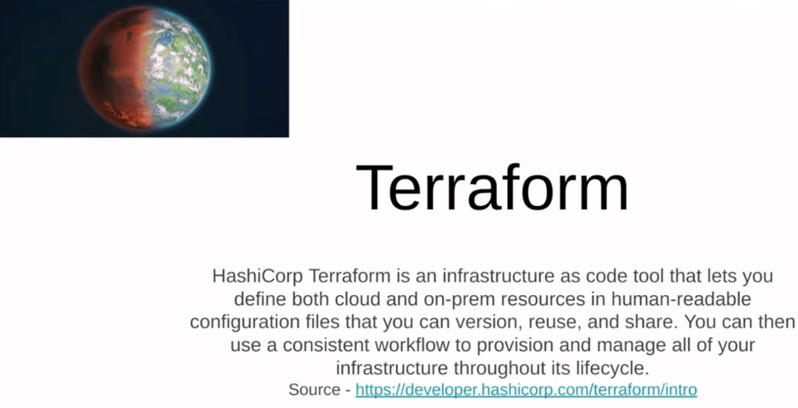
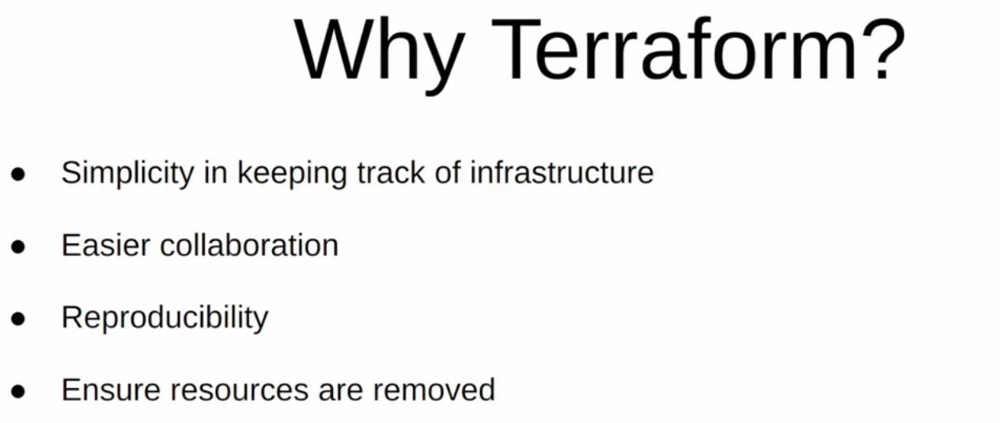
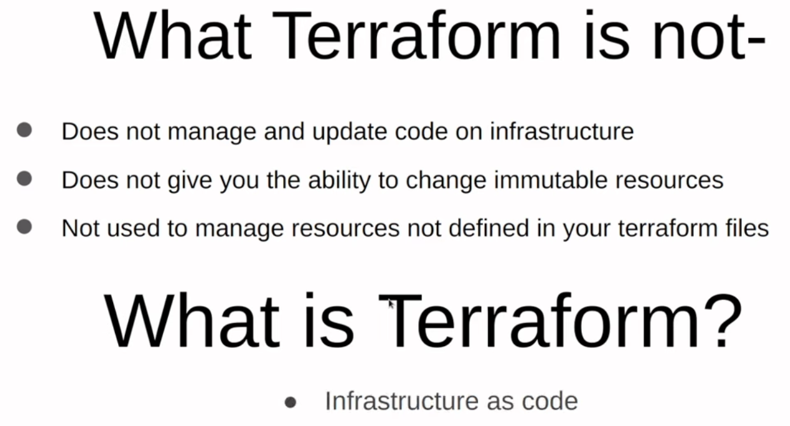
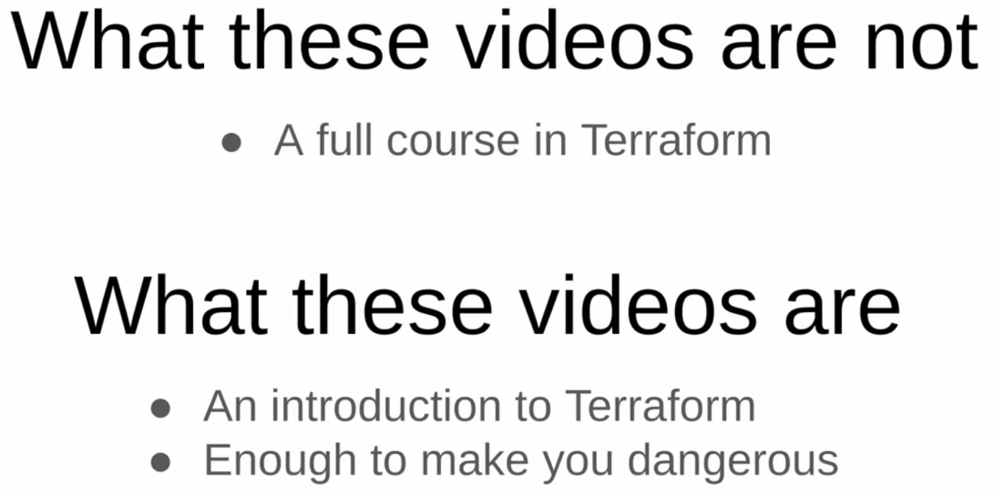
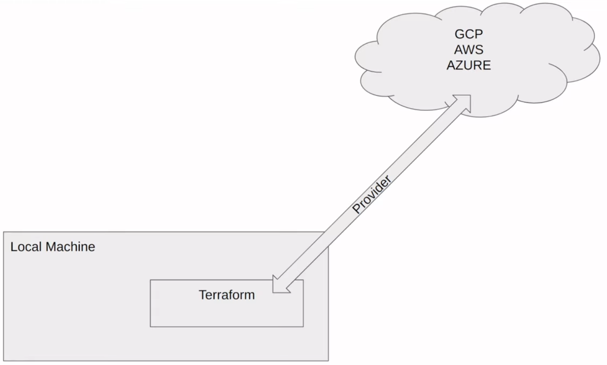
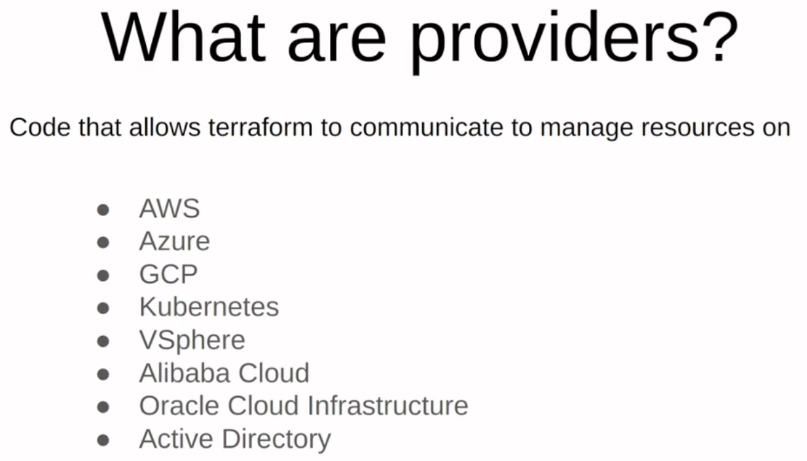

## Local Setup for Terraform and GCP

### Pre-Requisites
1. Terraform client installation: https://www.terraform.io/downloads
2. Cloud Provider account: https://console.cloud.google.com/ 

### Terraform Concepts
[Terraform Overview](1_terraform_overview.md)

### GCP setup

1. [Setup for First-time](2_gcp_overview.md#initial-setup)
    * [Only for Windows](windows.md) - Steps 4 & 5
2. [IAM / Access specific to this course](2_gcp_overview.md#setup-for-access)

### Terraform Workshop for GCP Infra
Your setup is ready!
Now head to the [terraform](terraform) directory, and perform the execution steps to create your infrastructure.

---

# DE Zoomcamp 1.3.1 - Terraform Primer








---

## Terraform Overview

[Video](https://www.youtube.com/watch?v=18jIzE41fJ4&list=PL3MmuxUbc_hJed7dXYoJw8DoCuVHhGEQb&index=2)

### Concepts

#### Introduction

1. What is [Terraform](https://www.terraform.io)?
   * open-source tool by [HashiCorp](https://www.hashicorp.com), used for provisioning infrastructure resources
   * supports DevOps best practices for change management
   * Managing configuration files in source control to maintain an ideal provisioning state 
     for testing and production environments
2. What is IaC?
   * Infrastructure-as-Code
   * build, change, and manage your infrastructure in a safe, consistent, and repeatable way 
     by defining resource configurations that you can version, reuse, and share.
3. Some advantages
   * Infrastructure lifecycle management
   * Version control commits
   * Very useful for stack-based deployments, and with cloud providers such as AWS, GCP, Azure, K8S…
   * State-based approach to track resource changes throughout deployments


#### Files

* `main.tf`
* `variables.tf`
* Optional: `resources.tf`, `output.tf`
* `.tfstate`

#### Declarations
* `terraform`: configure basic Terraform settings to provision your infrastructure
   * `required_version`: minimum Terraform version to apply to your configuration
   * `backend`: stores Terraform's "state" snapshots, to map real-world resources to your configuration.
      * `local`: stores state file locally as `terraform.tfstate`
   * `required_providers`: specifies the providers required by the current module
* `provider`:
   * adds a set of resource types and/or data sources that Terraform can manage
   * The Terraform Registry is the main directory of publicly available providers from most major infrastructure platforms.
* `resource`
  * blocks to define components of your infrastructure
  * Project modules/resources: google_storage_bucket, google_bigquery_dataset, google_bigquery_table
* `variable` & `locals`
  * runtime arguments and constants


#### Execution steps
1. `terraform init`: 
    * Initializes & configures the backend, installs plugins/providers, & checks out an existing configuration from a version control 
2. `terraform plan`:
    * Matches/previews local changes against a remote state, and proposes an Execution Plan.
3. `terraform apply`: 
    * Asks for approval to the proposed plan, and applies changes to cloud
4. `terraform destroy`
    * Removes your stack from the Cloud


### Terraform Workshop to create GCP Infra
Continue [here](./terraform): `week_1_basics_n_setup/1_terraform_gcp/terraform`


### References
https://learn.hashicorp.com/collections/terraform/gcp-get-started

---

## GCP Overview

[Video](https://www.youtube.com/watch?v=18jIzE41fJ4&list=PL3MmuxUbc_hJed7dXYoJw8DoCuVHhGEQb&index=2)


### Project infrastructure modules in GCP:
* Google Cloud Storage (GCS): Data Lake
* BigQuery: Data Warehouse

(Concepts explained in Week 2 - Data Ingestion)

### Initial Setup

For this course, we'll use a free version (upto EUR 300 credits). 

1. Create an account with your Google email ID 
2. Setup your first [project](https://console.cloud.google.com/) if you haven't already
    * eg. "DTC DE Course", and note down the "Project ID" (we'll use this later when deploying infra with TF)
3. Setup [service account & authentication](https://cloud.google.com/docs/authentication/getting-started) for this project
    * Grant `Viewer` role to begin with.
    * Download service-account-keys (.json) for auth.
4. Download [SDK](https://cloud.google.com/sdk/docs/quickstart) for local setup
5. Set environment variable to point to your downloaded GCP keys:
   ```shell
   export GOOGLE_APPLICATION_CREDENTIALS="<path/to/your/service-account-authkeys>.json"
   
   # Refresh token/session, and verify authentication
   gcloud auth application-default login
   ```
   
### Setup for Access
 
1. [IAM Roles](https://cloud.google.com/storage/docs/access-control/iam-roles) for Service account:
   * Go to the *IAM* section of *IAM & Admin* https://console.cloud.google.com/iam-admin/iam
   * Click the *Edit principal* icon for your service account.
   * Add these roles in addition to *Viewer* : **Storage Admin** + **Storage Object Admin** + **BigQuery Admin**
   
2. Enable these APIs for your project:
   * https://console.cloud.google.com/apis/library/iam.googleapis.com
   * https://console.cloud.google.com/apis/library/iamcredentials.googleapis.com
   
3. Please ensure `GOOGLE_APPLICATION_CREDENTIALS` env-var is set.
   ```shell
   export GOOGLE_APPLICATION_CREDENTIALS="<path/to/your/service-account-authkeys>.json"
   ```
 
### Terraform Workshop to create GCP Infra
Continue [here](./terraform): `week_1_basics_n_setup/1_terraform_gcp/terraform`

---

## GCP and Terraform on Windows

You don't need these instructions if you use WSL. It's only for "plain Windows" 

### Google Cloud SDK

* For this tutorial, you'll need a Linux-like environment, e.g. [GitBash](https://gitforwindows.org/), [MinGW](https://www.mingw-w64.org/) or [cygwin](https://www.cygwin.com/)
  * Power Shell should also work, but will require adjustments 
* Download SDK in zip: https://dl.google.com/dl/cloudsdk/channels/rapid/google-cloud-sdk.zip
  * source: https://cloud.google.com/sdk/docs/downloads-interactive
* Unzip it and run the `install.sh` script

When installing it, you might see something like that:

```
The installer is unable to automatically update your system PATH. Please add
  C:\tools\google-cloud-sdk\bin
```

* To fix that, adjust your `.bashrc` to include this in `PATH` ([instructions](https://unix.stackexchange.com/questions/26047/how-to-correctly-add-a-path-to-path))
* You can also do it system-wide ([instructions](https://gist.github.com/nex3/c395b2f8fd4b02068be37c961301caa7))

Now we need to point it to correct Python installation. Assuming you use [Anaconda](https://www.anaconda.com/products/individual):

```bash
export CLOUDSDK_PYTHON=~/Anaconda3/python
```

Now let's check that it works:

```bash
$ gcloud version
Google Cloud SDK 367.0.0
bq 2.0.72
core 2021.12.10
gsutil 5.5
```

### Google Cloud SDK Authentication 

* Now create a service account and generate keys like shown in the videos
* Download the key and put it to some location, e.g. `.gc/ny-rides.json`
* Set `GOOGLE_APPLICATION_CREDENTIALS` to point to the file

```bash
export GOOGLE_APPLICATION_CREDENTIALS=~/.gc/ny-rides.json
```

Now authenticate: 

```bash
gcloud auth activate-service-account --key-file $GOOGLE_APPLICATION_CREDENTIALS
```

Alternatively, you can authenticate using OAuth like shown in the video

```bash
gcloud auth application-default login
```

If you get a message like `quota exceeded`

> WARNING:
> Cannot find a quota project to add to ADC. You might receive a "quota exceeded" or "API not enabled" error. 
> Run `$ gcloud auth application-default set-quota-project` to add a quota project.

Then run this:

```bash
PROJECT_NAME="ny-rides-alexey"
gcloud auth application-default set-quota-project ${PROJECT_NAME}
```


### Terraform 

* [Download Terraform](https://www.terraform.io/downloads)
* Put it to a folder in [PATH](https://gist.github.com/nex3/c395b2f8fd4b02068be37c961301caa7)
* Go to the location with Terraform files and initialize it

```bash
terraform init
```

Optionally you can configure your terraform files (`variables.tf`) to include your project id:

```bash
variable "project" {
  description = "Your GCP Project ID"
  default = "ny-rides-alexey"
  type = string
}
```

* Now [follow the instructions](1_terraform_overview.md#execution-steps)
  * Run `terraform plan`
  * Next, run `terraform apply`

If you get an error like that:

> Error: googleapi: Error 403: terraform@ny-rides-alexey.iam.gserviceaccount.com does not have
> storage.buckets.create access to the Google Cloud project., forbidden


Then you need to give your service account all the permissions. Make sure you follow the instructions in the videos 

* You can also use [this file](https://docs.google.com/document/d/e/2PACX-1vSZapy7gIj0TP-EFzub2OpAlAkuifGEVJ4XpkA1RvxZ45NjiQi29b6OhLuetdXXHWAn2lbbKxnbzMdd/pub), but it doesn't list all the required permissions

---

### Concepts
* [Terraform_overview](../1_terraform_overview.md)
* If you were able to generate a service account keyfile due to organizational policies, refer to the instructions [below](#fallback)

### Execution

```shell
# Refresh service-account's auth-token for this session
gcloud auth application-default login

# Initialize state file (.tfstate)
terraform init

# Check changes to new infra plan
terraform plan -var="project=<your-gcp-project-id>"
```

```shell
# Create new infra
terraform apply -var="project=<your-gcp-project-id>"
```

```shell
# Delete infra after your work, to avoid costs on any running services
terraform destroy
```

### Warning
Remember to use a [proper gitignore](https://github.com/github/gitignore/blob/main/Terraform.gitignore) file before publishing your code on GitHub

### Fallback
1. Link gcloud cli with gcp
```bash
gcloud auth login
```
2. Generate ADC by confirming your identity
```bash
gcloud auth application-default login
```

3. Give yourself the token creator role on the pertinent service account
```bash
gcloud iam service-accounts add-iam-policy-binding \
    <SERVICE_ACCOUNT_EMAIL> \
    --member="user:YOUR_EMAIL@gmail.com" \
    --role="roles/iam.serviceAccountTokenCreator"
```
4. Add the sections below the first block to your main terraform configuration
   ```terraform
    # Connect to gcp using ADC (identity verification)
    provider "google" {
      project = var.project
      region  = var.region
      zone    = var.zone
    }

    # add these data blocks 
    
    # This data source gets a temporary token for the service account
    data "google_service_account_access_token" "default" {
      provider               = google
      target_service_account = "<SERVICE_ACCOUNT_EMAIL>"
      scopes                 = ["https://www.googleapis.com/auth/cloud-platform"]
      lifetime               = "3600s"
    }
    
    # This second provider block uses that temporary token and does the real work
    provider "google" {
      alias        = "impersonated"
      access_token = data.google_service_account_access_token.default.access_token
      project      = var.project
      region       = var.region
      zone         = var.zone
    }
   ```

3. Now, you can follow the instructions [above](#execution)

