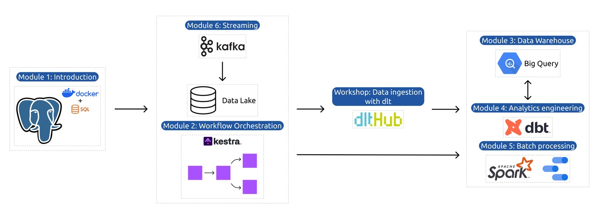

# 📚 Data Engineering Zoomcamp

A collection of notes, code examples, assignments, and projects from the **Data Engineering Zoomcamp** course.

It covers the full data engineering lifecycle, including:
- Data ingestion and orchestration  
- Data warehousing and analytics engineering  
- Batch and streaming data processing  
- Cloud infrastructure and scalability  
- End-to-end data pipelines and projects

This repo is my personal workspace for learning, experimenting, and building production-ready data platforms. 🚀