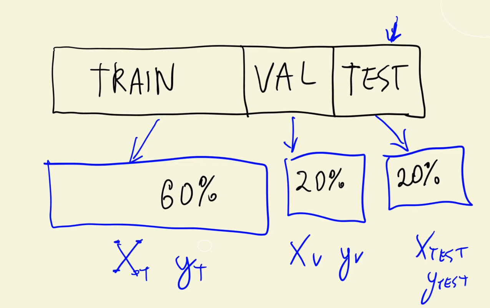
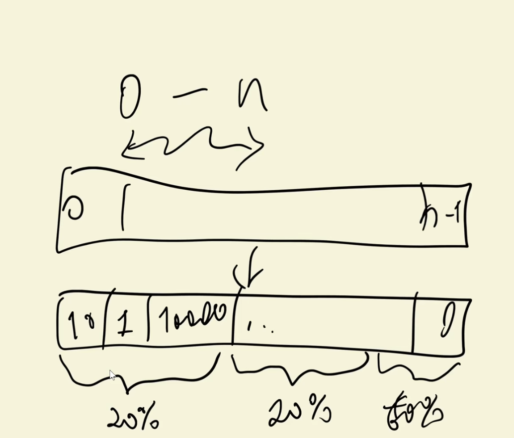

# ML Zoomcamp 2.1 - Car Price Prediction Project

## 📝 Problem Description
- Goal: Build a model to help users of online classified websites set the best price for selling their cars.  
- Input: Car features (make, model, engine type, fuel type, etc.).  
- Output: Predict the **price (MSRP: Manufacturer Suggested Retail Price)** of the car.  


## 📊 Dataset Information
- Source: **Kaggle** (car prices dataset).  
- Features: Manufacturer, model, engine, fuel type, and more.  
- Target variable: **MSRP (price of the car)**.  
- Format: CSV file.  


## 🚀 Project Plan
### Step 1: Data Exploration
- Load dataset.  
- Perform Exploratory Data Analysis (EDA).  

### Step 2: Baseline Model
- Train a **Linear Regression** model on the dataset.  

### Step 3: Model Implementation
- Manually implement linear regression.  
- Understand inner workings of the algorithm.  

### Step 4: Model Evaluation
- Use **RMSE (Root Mean Squared Error)** to measure performance.  

### Step 5: Feature Engineering
- Create new features to improve predictive power.  

### Step 6: Regularization
- Address **numerical stability issues**.  
- Apply **regularization techniques** to improve robustness.  

### Step 7: Final Model
- Refine the pipeline with improvements.  


## 💻 Code Repository
- GitHub repo: **mlbookcamp-code**  
- Chapter: **02-car-price**  
- Contents:
  - Jupyter Notebook with all session code.  
  - CSV dataset file for training.  

---

# ML Zoomcamp 2.2 - Data Preparation
## 🎬 Introduction
- Focus: **Prepare dataset** for the car price prediction project.  
- Data source: GitHub repo → `mlbookcamp-code / chapter-02-car-price`.  
- Files:
  - **CSV dataset** (car price data).  
  - **Jupyter Notebook** (with session code).  


## 📥 Step 1: Download the Dataset
- Options:  
  - Use `wget` to download from GitHub.  
  - Or download manually via browser (Save As).  
- Save the dataset locally for further processing.  


## 📂 Step 2: Load the Dataset
- Use **pandas `read_csv()`** to load the dataset.  
- Inspect with `.head()` to see first 5 rows.  
- Data contains car features (make, model, year, engine type, transmission, etc.) and **target variable: MSRP (Manufacturer Suggested Retail Price)**.  


## 🧹 Step 3: Clean Column Names
- Issues:
  - Inconsistent capitalization.  
  - Spaces vs. underscores.  
- Solution:
  - Convert all column names to **lowercase**.  
  - Replace spaces with **underscores**.  
- Done via pandas `df.columns.str.lower().str.replace(" ", "_")`.  


## 🧽 Step 4: Normalize String Values
- Problem: Some categorical values inconsistent (UPPERCASE vs. lowercase).  
- Approach:
  - Identify **string columns** using `df.dtypes`.  
  - Select columns of type **object**.  
  - Convert them all to lowercase and replace spaces with underscores.  


## ✅ Result After Cleaning
- Dataset is now:  
  - Uniform column names.  
  - Consistent categorical values.  
- Easier to work with in future steps (e.g., feature engineering, modeling).  

---

# ML Zoomcamp 2.3 - Exploratory Data Analysis

## 🎬 Introduction
- Goal: Perform **Exploratory Data Analysis (EDA)** on the car price dataset.  
- Objective: Understand the data, inspect columns, and explore the distribution of prices.  
- Dataset contains both **categorical (strings)** and **numerical** variables.

## 🔍 Step 1: Explore Columns
- Loop through all columns to inspect:
  - Column names
  - Example values
  - Number of unique values using:
    - `.unique()` → view unique entries  
    - `.nunique()` → count unique entries  
- Examples:
  - `make`: 48 unique manufacturers (e.g., BMW, Audi, Mercedes-Benz)  
  - `model`: many unique car models  
  - `year`: 28 different years  
  - `engine_fuel_type`: 10 types  
  - `engine_hp`, `engine_cylinders`, `transmission_type`, `driven_wheels` → numerical/technical features  
  - `highway_mpg`, `city_mpg`, `popularity` → performance & social metrics  
  - `msrp` → **target variable (price)**  

## 📈 Step 2: Visualize Price Distribution
- Libraries used:  
  - `matplotlib` (low-level plotting)  
  - `seaborn` (high-level visualization on top of matplotlib)  
- Visualization: **Histogram of MSRP (car prices)**  
  - Shows a **long tail distribution**:
    - Most cars are inexpensive  
    - A few cars are extremely expensive (1M–2M USD range)  

## 🧠 Concept: Long Tail Distribution
- Most values concentrated in a small range (cheap cars).  
- Few extremely high values (luxury cars).  
- Common in **price data** — many affordable products, few premium ones.  
- Problem: Long tails can **confuse ML models**.

## 🔢 Step 3: Apply Logarithmic Transformation
- Goal: Reduce the effect of extreme outliers.  
- Method:
  - Apply **logarithm to price** → compresses large values.  
  - Use `numpy.log1p()` (log(1 + x)) to avoid issues with 0 values.  
- Result:
  - Distribution becomes **more normal (bell-shaped)**.  
  - Easier for models to learn patterns and make predictions.

## 🩺 Step 4: Check for Missing Values
- Use `df.isnull().sum()` to count missing entries per column.  
- Found missing data in:
  - `fuel_type`, `market_category`, `engine_hp`, `engine_cylinders`, etc.  
- Observation: Must handle missing values before training (e.g., imputation or removal).

---

# ML Zoomcamp 2.4 - Setting Up The Validation Framework

## 🎯 Goal
- Prepare a **validation framework** for the car price prediction model.  
- Split the dataset into three parts:
  1. **Training set (60%)**
  2. **Validation set (20%)**
  3. **Test set (20%)**
- Purpose:
  - Train model on training data.
  - Evaluate performance on validation data.
  - Use test data **only at the end** to confirm final model performance.




## 🧩 Step 1: Split Dataset (Train/Validation/Test)
- Dataset size: ~12,000 records.  
- Computed sizes:
  - Validation ≈ 2,400 records (20%)  
  - Test ≈ 2,400 records (20%)  
  - Train = `n - n_val - n_test` ≈ 7,200 records (60%)  
- Used rounding and integer conversion for clean splits.

## 🪄 Step 2: Extract Subsets
- Used **`iloc`** with ranges to slice DataFrames:
  - `df.iloc[:n_val]` → Validation  
  - `df.iloc[n_val : n_val+n_test]` → Test  
  - `df.iloc[n_val+n_test :]` → Train  
- Ensured total rows matched dataset size.

## 🔀 Step 3: Shuffle the Data
- Problem: Data might be **ordered** (e.g., grouped by manufacturer).  
- Solution:
  - Generated shuffled indices using:
    ```python
    import numpy as np
    import random
    np.random.seed(2)
    idx = np.arange(len(df))
    random.shuffle(idx)
    ```
  - Used these shuffled indices to extract random subsets for train/validation/test.  
- Ensured **reproducibility** with fixed random seed.

## 🧱 Step 4: Reset Indexes
- After splitting, reset indices for clarity:
  ```python
  df_train = df_train.reset_index(drop=True)
  df_val = df_val.reset_index(drop=True)
  df_test = df_test.reset_index(drop=True)
  ```
- Dropped old indices to clean up dataframes.

## 🎯 Step 5: Prepare Target Variables (y)
- Applied logarithmic transformation to target (`msrp`):
  ```python
  y_train = np.log1p(df_train.msrp.values)
  y_val = np.log1p(df_val.msrp.values)
  y_test = np.log1p(df_test.msrp.values)
  ```

## 🧹 Step 6: Remove Target from DataFrames
- Removed msrp column from all datasets:
  ```python
  del df_train['msrp']
  del df_val['msrp']
  del df_test['msrp']
    ```
- Reason: Prevent data leakage (using target as a feature).
- Common source of error — model could "cheat" by learning from target column.

---

# ML Zoomcamp 2.5 - Linear Regression

## 🎯 What is Linear Regression
- **Linear Regression** is a fundamental model used for **regression problems**, where the goal is to predict **numerical values** (e.g., price).  
- It contrasts with **classification** (predicting categories) and **ranking** (ordering items).  
- In this lesson, the target variable `y` represents the **car price (MSRP)**, and the model `g` learns to approximate it using input features `x`.  

## 🧩 Simplified Form
- Focused on **one observation (one car)** instead of the entire dataset.  
- Each observation (car) is represented as a **feature vector** containing characteristics such as:  
  - Engine horsepower  
  - City miles per gallon (MPG)  
  - Popularity  
- The goal: create a function `g(x)` that uses these features to predict a price close to the actual value.  

## 🚗 Example on Training Data
- Used the **training dataset** (not validation or test) for model development.  
- Example car: Rolls-Royce Phantom Drophead Coupe (2015).  
- Selected three features:
  1. Engine horsepower = 453  
  2. City MPG = 11  
  3. Popularity = 86  
- These values form the feature vector used by the model to predict the price.  

## 🧮 Model Implementation Concept
- The **linear regression equation** combines all features linearly with their weights:  
  - Starts with a **bias term (intercept)** representing the base prediction without any features.  
  - Each feature is multiplied by a **weight (coefficient)** that determines its influence on the final prediction.  
- In general form:
  - Prediction = Bias + (Weight₁ × Feature₁) + (Weight₂ × Feature₂) + ... + (Weightₙ × Featureₙ)

## 📊 Interpretation of Weights
- **Bias term (w₀):** Base predicted value when no feature information is available.  
- **Feature weights (w₁, w₂, w₃, ...):**  
  - Indicate how much the price changes when the feature increases by one unit.  
  - Example interpretations:  
    - Higher **engine horsepower** → higher price.  
    - Higher **city MPG** → typically indicates more efficient or higher-end vehicles.  
    - Higher **popularity** → slightly increases price but with a smaller effect.  

## 🔢 Logarithmic and Exponential Transformations
- Since the model was trained on **log-transformed prices**, the predicted output is also in logarithmic form.  
- To obtain the actual dollar price:
  - Apply the **exponential function** to reverse the logarithm.  
- The transformation ensures the model handles large price ranges more effectively.

---

# 2.6 