# ML Zoomcamp 2.1 - Car Price Prediction Project

## 📝 Problem Description
- Goal: Build a model to help users of online classified websites set the best price for selling their cars.  
- Input: Car features (make, model, engine type, fuel type, etc.).  
- Output: Predict the **price (MSRP: Manufacturer Suggested Retail Price)** of the car.  


## 📊 Dataset Information
- Source: **Kaggle** (car prices dataset).  
- Features: Manufacturer, model, engine, fuel type, and more.  
- Target variable: **MSRP (price of the car)**.  
- Format: CSV file.  


## 🚀 Project Plan
### Step 1: Data Exploration
- Load dataset.  
- Perform Exploratory Data Analysis (EDA).  

### Step 2: Baseline Model
- Train a **Linear Regression** model on the dataset.  

### Step 3: Model Implementation
- Manually implement linear regression.  
- Understand inner workings of the algorithm.  

### Step 4: Model Evaluation
- Use **RMSE (Root Mean Squared Error)** to measure performance.  

### Step 5: Feature Engineering
- Create new features to improve predictive power.  

### Step 6: Regularization
- Address **numerical stability issues**.  
- Apply **regularization techniques** to improve robustness.  

### Step 7: Final Model
- Refine the pipeline with improvements.  


## 💻 Code Repository
- GitHub repo: **mlbookcamp-code**  
- Chapter: **02-car-price**  
- Contents:
  - Jupyter Notebook with all session code.  
  - CSV dataset file for training.  

---

# ML Zoomcamp 2.2 - Data Preparation
## 🎬 Introduction
- Focus: **Prepare dataset** for the car price prediction project.  
- Data source: GitHub repo → `mlbookcamp-code / chapter-02-car-price`.  
- Files:
  - **CSV dataset** (car price data).  
  - **Jupyter Notebook** (with session code).  


## 📥 Step 1: Download the Dataset
- Options:  
  - Use `wget` to download from GitHub.  
  - Or download manually via browser (Save As).  
- Save the dataset locally for further processing.  


## 📂 Step 2: Load the Dataset
- Use **pandas `read_csv()`** to load the dataset.  
- Inspect with `.head()` to see first 5 rows.  
- Data contains car features (make, model, year, engine type, transmission, etc.) and **target variable: MSRP (Manufacturer Suggested Retail Price)**.  


## 🧹 Step 3: Clean Column Names
- Issues:
  - Inconsistent capitalization.  
  - Spaces vs. underscores.  
- Solution:
  - Convert all column names to **lowercase**.  
  - Replace spaces with **underscores**.  
- Done via pandas `df.columns.str.lower().str.replace(" ", "_")`.  


## 🧽 Step 4: Normalize String Values
- Problem: Some categorical values inconsistent (UPPERCASE vs. lowercase).  
- Approach:
  - Identify **string columns** using `df.dtypes`.  
  - Select columns of type **object**.  
  - Convert them all to lowercase and replace spaces with underscores.  


## ✅ Result After Cleaning
- Dataset is now:  
  - Uniform column names.  
  - Consistent categorical values.  
- Easier to work with in future steps (e.g., feature engineering, modeling).  

---

# ML Zoomcamp 2.3 - Exploratory Data Analysis

## 🎬 Introduction
- Goal: Perform **Exploratory Data Analysis (EDA)** on the car price dataset.  
- Objective: Understand the data, inspect columns, and explore the distribution of prices.  
- Dataset contains both **categorical (strings)** and **numerical** variables.

## 🔍 Step 1: Explore Columns
- Loop through all columns to inspect:
  - Column names
  - Example values
  - Number of unique values using:
    - `.unique()` → view unique entries  
    - `.nunique()` → count unique entries  
- Examples:
  - `make`: 48 unique manufacturers (e.g., BMW, Audi, Mercedes-Benz)  
  - `model`: many unique car models  
  - `year`: 28 different years  
  - `engine_fuel_type`: 10 types  
  - `engine_hp`, `engine_cylinders`, `transmission_type`, `driven_wheels` → numerical/technical features  
  - `highway_mpg`, `city_mpg`, `popularity` → performance & social metrics  
  - `msrp` → **target variable (price)**  

## 📈 Step 2: Visualize Price Distribution
- Libraries used:  
  - `matplotlib` (low-level plotting)  
  - `seaborn` (high-level visualization on top of matplotlib)  
- Visualization: **Histogram of MSRP (car prices)**  
  - Shows a **long tail distribution**:
    - Most cars are inexpensive  
    - A few cars are extremely expensive (1M–2M USD range)  

## 🧠 Concept: Long Tail Distribution
- Most values concentrated in a small range (cheap cars).  
- Few extremely high values (luxury cars).  
- Common in **price data** — many affordable products, few premium ones.  
- Problem: Long tails can **confuse ML models**.

## 🔢 Step 3: Apply Logarithmic Transformation
- Goal: Reduce the effect of extreme outliers.  
- Method:
  - Apply **logarithm to price** → compresses large values.  
  - Use `numpy.log1p()` (log(1 + x)) to avoid issues with 0 values.  
- Result:
  - Distribution becomes **more normal (bell-shaped)**.  
  - Easier for models to learn patterns and make predictions.

## 🩺 Step 4: Check for Missing Values
- Use `df.isnull().sum()` to count missing entries per column.  
- Found missing data in:
  - `fuel_type`, `market_category`, `engine_hp`, `engine_cylinders`, etc.  
- Observation: Must handle missing values before training (e.g., imputation or removal).

---

# ML Zoomcamp 2.4 - Setting Up The Validation Framework

## 🎯 Goal
- Prepare a **validation framework** for the car price prediction model.  
- Split the dataset into three parts:
  1. **Training set (60%)**
  2. **Validation set (20%)**
  3. **Test set (20%)**
- Purpose:
  - Train model on training data.
  - Evaluate performance on validation data.
  - Use test data **only at the end** to confirm final model performance.


## 🧩 Step 1: Split Dataset (Train/Validation/Test)
- Dataset size: ~12,000 records.  
- Computed sizes:
  - Validation ≈ 2,400 records (20%)  
  - Test ≈ 2,400 records (20%)  
  - Train = `n - n_val - n_test` ≈ 7,200 records (60%)  
- Used rounding and integer conversion for clean splits.

## 🪄 Step 2: Extract Subsets
- Used **`iloc`** with ranges to slice DataFrames:
  - `df.iloc[:n_val]` → Validation  
  - `df.iloc[n_val : n_val+n_test]` → Test  
  - `df.iloc[n_val+n_test :]` → Train  
- Ensured total rows matched dataset size.

## 🔀 Step 3: Shuffle the Data
- Problem: Data might be **ordered** (e.g., grouped by manufacturer).  
- Solution:
  - Generated shuffled indices using:
    ```python
    import numpy as np
    import random
    np.random.seed(2)
    idx = np.arange(len(df))
    random.shuffle(idx)
    ```
  - Used these shuffled indices to extract random subsets for train/validation/test.  
- Ensured **reproducibility** with fixed random seed.

## 🧱 Step 4: Reset Indexes
- After splitting, reset indices for clarity:
  ```python
  df_train = df_train.reset_index(drop=True)
  df_val = df_val.reset_index(drop=True)
  df_test = df_test.reset_index(drop=True)
  ```
- Dropped old indices to clean up dataframes.

## 🎯 Step 5: Prepare Target Variables (y)
- Applied logarithmic transformation to target (`msrp`):
  ```python
  y_train = np.log1p(df_train.msrp.values)
  y_val = np.log1p(df_val.msrp.values)
  y_test = np.log1p(df_test.msrp.values)
  ```

## 🧹 Step 6: Remove Target from DataFrames
- Removed msrp column from all datasets:
  ```python
  del df_train['msrp']
  del df_val['msrp']
  del df_test['msrp']
    ```
- Reason: Prevent data leakage (using target as a feature).
- Common source of error — model could "cheat" by learning from target column.

---

# ML Zoomcamp 2.5 - Linear Regression

## 🎯 What is Linear Regression
- **Linear Regression** is a fundamental model used for **regression problems**, where the goal is to predict **numerical values** (e.g., price).  
- It contrasts with **classification** (predicting categories) and **ranking** (ordering items).  
- In this lesson, the target variable `y` represents the **car price (MSRP)**, and the model `g` learns to approximate it using input features `x`.  

## 🧩 Simplified Form
- Focused on **one observation (one car)** instead of the entire dataset.  
- Each observation (car) is represented as a **feature vector** containing characteristics such as:  
  - Engine horsepower  
  - City miles per gallon (MPG)  
  - Popularity  
- The goal: create a function `g(x)` that uses these features to predict a price close to the actual value.  
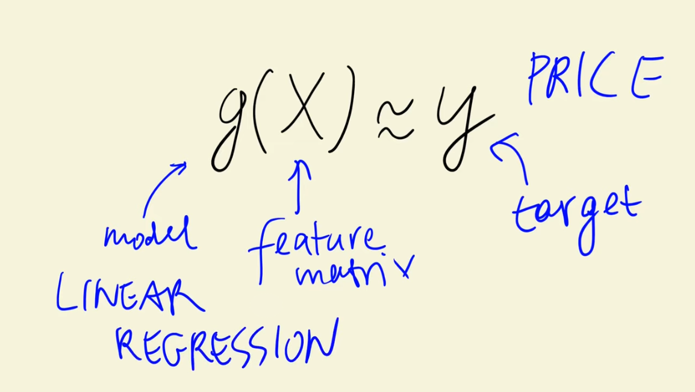
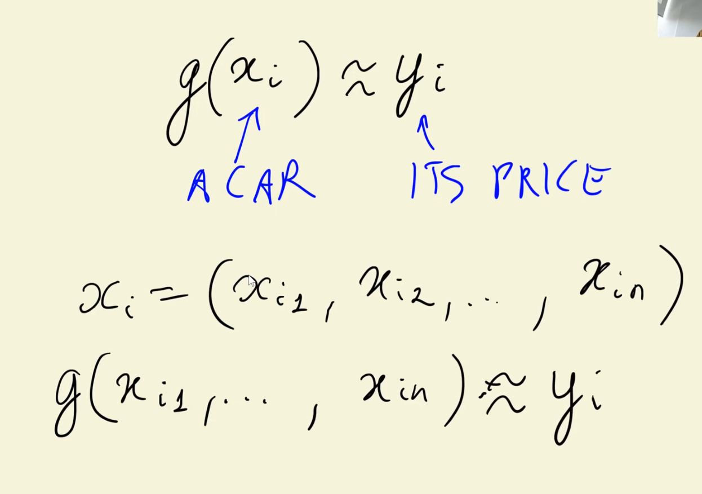

## 🚗 Example on Training Data
- Used the **training dataset** (not validation or test) for model development.  
- Example car: Rolls-Royce Phantom Drophead Coupe (2015).  
- Selected three features:
  1. Engine horsepower = 453  
  2. City MPG = 11  
  3. Popularity = 86  
- These values form the feature vector used by the model to predict the price. 
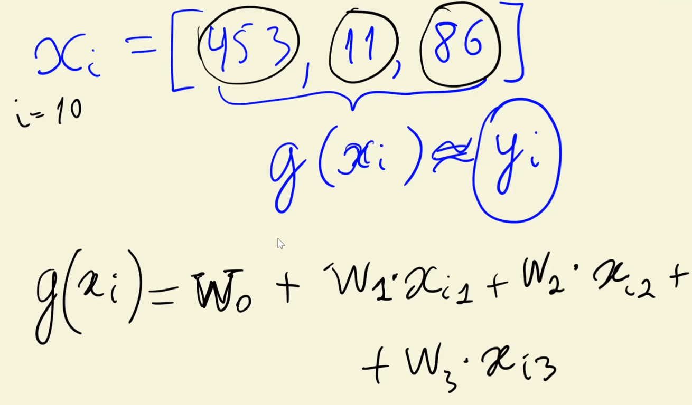

## 🧮 Model Implementation Concept
- The **linear regression equation** combines all features linearly with their weights:  
  - Starts with a **bias term (intercept)** representing the base prediction without any features.  
  - Each feature is multiplied by a **weight (coefficient)** that determines its influence on the final prediction.  
- In general form:
  - Prediction = Bias + (Weight₁ × Feature₁) + (Weight₂ × Feature₂) + ... + (Weightₙ × Featureₙ)
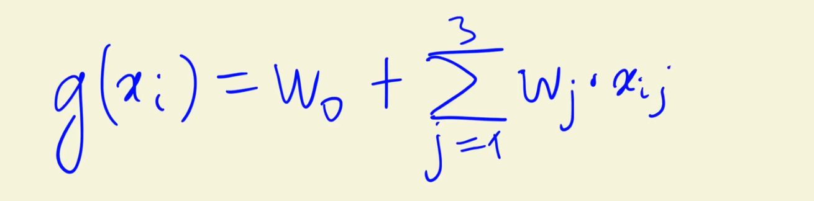

## 📊 Interpretation of Weights
- **Bias term (w₀):** Base predicted value when no feature information is available.  
- **Feature weights (w₁, w₂, w₃, ...):**  
  - Indicate how much the price changes when the feature increases by one unit.  
  - Example interpretations:  
    - Higher **engine horsepower** → higher price.  
    - Higher **city MPG** → typically indicates more efficient or higher-end vehicles.  
    - Higher **popularity** → slightly increases price but with a smaller effect.  

## 🔢 Logarithmic and Exponential Transformations
- Since the model was trained on **log-transformed prices**, the predicted output is also in logarithmic form.  
- To obtain the actual dollar price:
  - Apply the **exponential function** to reverse the logarithm.  
- The transformation ensures the model handles large price ranges more effectively.
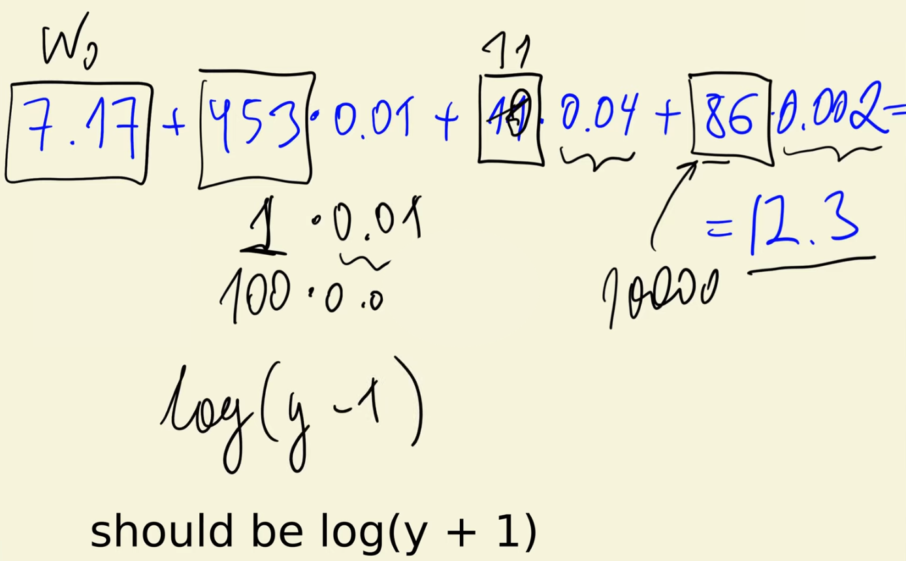

---

# ML Zoomcamp 2.6 - Linear Regression: Vector Form

##2 🔹 Linear Regression (Single Vector)
- The prediction for a single observation includes:
  - A **bias term** (intercept).
  - A **sum of products** between each feature and its corresponding weight.  
- This sum can be expressed as a **dot product** between:
  - The feature vector (`xᵢ`).
  - The weight vector (`w`).  
- In compact form: **Prediction = xᵢ · w + bias**.  

## 🧮 Vector Form and Dot Product
- The dot product simplifies computation:
  - It represents the sum of all feature-weight multiplications.  
- Using vector notation:
  - The bias term can be included by **adding a constant feature = 1** to every input vector.  
  - This allows a single **dot product** to handle both the bias and the features simultaneously.  
- After this transformation:
  - The weight vector `w` has **n + 1 elements** (bias + n features).  
  - The feature vector `x` also has **n + 1 elements**, with the first always being 1.

## 🔢 All Examples in Matrix Form
- When generalizing to **multiple examples (rows)**:
  - Each row represents one car (one feature vector).  
  - The entire dataset becomes a **feature matrix X**:
    - Each row → one observation (car).  
    - Each column → one feature (including the bias).  
  - The weights remain in a **single vector w**.  
- The result of multiplying the matrix X by vector w gives a **vector of predictions** for all examples:
  - `y_pred = X · w`

## 💡 Interpretation
- Each prediction is obtained as the **dot product** of one row (car features) with the weight vector.  
- Matrix-vector multiplication allows computing **all predictions at once**, improving efficiency.  
- This operation forms the core of **linear regression mathematics**.

---

# ML Zoomcamp 2.7 - Training Linear Regression: Normal Equation

## 🎯 Problem Description
- The model predicts values as:  
  **ŷ = X · w**  
- The goal is to find weights `w` such that predictions **ŷ** are as close as possible to actual values **y**.  
- Ideally, `X · w = y`, but this equation rarely has an exact solution.  
- Instead, we aim to find an **approximate solution** — the weights that minimize the difference between predictions and actual values.

## 🧩 Linear Regression Equation and Its Solution
- If the matrix `X` were **square and invertible**, we could solve directly:  
  **w = X⁻¹ · y**  
- However, in most real-world cases, `X` is **rectangular** (more rows than columns), so its inverse **does not exist**.  
- To address this, we modify the equation using the **Normal Equation** approach.  

## 📐 The Normal Equation
- Multiply both sides by the transpose of `X` to form a **Gram matrix**:  
  **Xᵀ · X · w = Xᵀ · y**  
- This new matrix (`Xᵀ · X`) is **square** and usually invertible.  
- Solving for `w` gives the **Normal Equation**:  
  **w = (Xᵀ · X)⁻¹ · Xᵀ · y**  
- This equation provides the **best possible approximation** for `w` in the least squares sense.  

## 📚 Mathematical Insight
- The Normal Equation comes from minimizing the **mean squared error** between predicted and true values.  
- Detailed proofs can be found in the book *“Elements of Statistical Learning”*, which covers the mathematical foundation behind this derivation.  
- The version shown here is an **intuitive, geometric explanation** of how the model fits data.  

## ⚙️ Implementation Concept
- To apply the Normal Equation in practice:
  1. Compute the **Gram matrix** `Xᵀ · X`.  
  2. Invert it (if possible).  
  3. Multiply by `Xᵀ · y` to obtain weights `w`.  
- The **first value** in `w` corresponds to the **bias (intercept)**.  
- Remaining values represent the **coefficients** for each feature.  

## 🧱 Adding the Bias Term
- A **bias term (1)** must be added as the **first column** of `X`.  
- It ensures that the model can learn a **baseline prediction**, representing the average outcome when all features are zero.  
- Without this term, the model might produce incorrect or poorly centered predictions.  

## 📊 Interpreting Coefficients
- Positive coefficients → feature increases the predicted value.  
- Negative coefficients → feature decreases the predicted value.  
- Example: In car price prediction,
  - More horsepower → higher price (positive weight).  
  - Older year → lower price (negative weight).  

## 🧠 Training Function Overview
- A general function for training a linear regression model:
  - Automatically adds the bias column to the dataset.  
  - Computes weights using the **Normal Equation**.  
  - Returns both **bias** and **feature coefficients**.  
- Once trained, the model can be used to **predict new car prices** or any other continuous target variable.  

---

# ML Zoomcamp 2.8 - Baseline Model for Car Price Prediction Project

## 🎯 Objective
- The goal of this lesson is to **build a baseline linear regression model** to predict car prices.  
- It reuses the linear regression code from the previous lesson to create the first working model.  
- The baseline model will only use **numerical features** from the dataset to keep it simple.  

## 🧱 Selecting Features
- From the training dataset, only **numeric columns** are selected for the first model:  
  - `engine_hp` (horsepower)  
  - `engine_cylinders`  
  - `highway_mpg`  
  - `city_mpg`  
  - `popularity`  
- These five features represent key numerical aspects of each car.  
- The selected subset of columns becomes the **feature matrix (X_train)**, while `y_train` contains the target prices.  

## ⚠️ Handling Missing Values
- Some of the selected features contain **missing values (NaN)** — particularly in `engine_hp` and `engine_cylinders`.  
- To train the model, missing values must be replaced.  
- The simplest approach: **fill missing values with 0**.  
- This effectively tells the model to **ignore those features** when data is missing.  

### 💡 Discussion:
- Setting missing values to 0 doesn’t always make physical sense (e.g., a car cannot have 0 horsepower).  
- However, for a baseline model, it simplifies preprocessing and still allows model training.  
- In later lessons, more refined strategies (like filling with mean or median) can be used.  

## ⚙️ Model Training
- The linear regression model is trained using:  
  - `X_train` (numeric feature matrix)  
  - `y_train` (log-transformed car prices)  
- The training produces:  
  - **Bias term (intercept)** → baseline price when all features are 0.  
  - **Weights (coefficients)** → impact of each feature on price.  
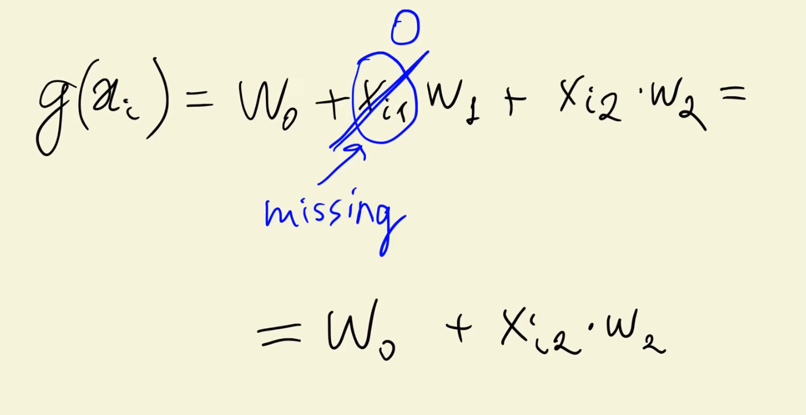

## 📊 Making Predictions
- Predictions are made on the **training data** using matrix multiplication (`X_train · w + bias`).  
- The predicted values (`y_pred`) are compared to the true prices (`y_train`).  

## 🧩 Visualization and Comparison
- Predictions and target values are plotted together as histograms:  
  - **Red bars**: model predictions.  
  - **Blue bars**: actual target prices.  
- Observations:  
  - The predicted distribution has a similar shape but is **shifted toward smaller values**.  
  - The model tends to **underestimate car prices**.  
  - Peaks of the prediction and actual distributions do not align perfectly.  

## 📉 Model Evaluation Insights
- The baseline model demonstrates that:
  - Linear regression works, but the model isn’t yet accurate.  
  - Predictions systematically deviate from true prices.  
- Visual inspection suggests the model needs refinement, but **visual comparison is subjective**.  
- To evaluate performance objectively, a numerical metric is needed.  

---

# ML Zoomcamp 2.9 - Root Mean Squared Error

## 🧠 Recap of the Previous Lesson
- Previously, a **baseline linear regression model** was trained using only numerical features.  
- The model’s predictions were compared visually to actual car prices, revealing noticeable differences.  
- However, **visual comparison is subjective**, so we now need a **quantitative metric** to evaluate how good (or bad) our model is.  

## 🎯 Objective
- Introduce **Root Mean Squared Error (RMSE)** — a standard metric for measuring model performance in regression tasks.  
- RMSE provides a **numerical way to measure prediction accuracy**, showing how far predictions are from true values on average.  

## 📐 RMSE Formula Overview
\[
RMSE = \sqrt{\frac{1}{m} \sum_{i=1}^{m} (y_i - \hat{y_i})^2}
\]
Where:  
- \( y_i \) = actual target value  
- \( \hat{y_i} \) = predicted value  
- \( m \) = number of observations  

Steps:
1. Compute the **difference** between each prediction and actual value.  
2. **Square** these differences (to remove negative signs and penalize large errors).  
3. **Average** all squared errors (Mean Squared Error).  
4. Take the **square root** of that average — resulting in RMSE.  

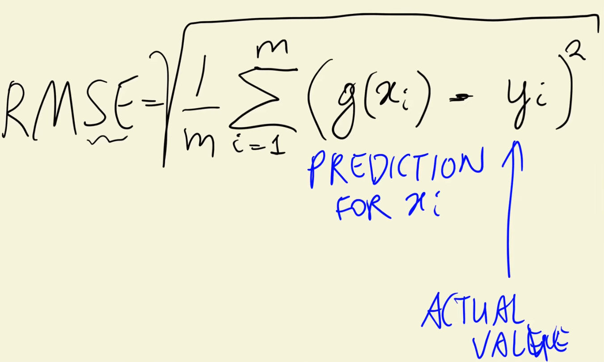
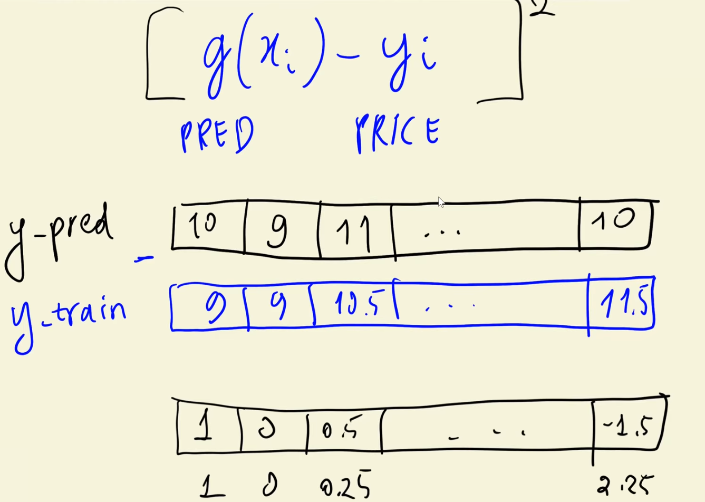
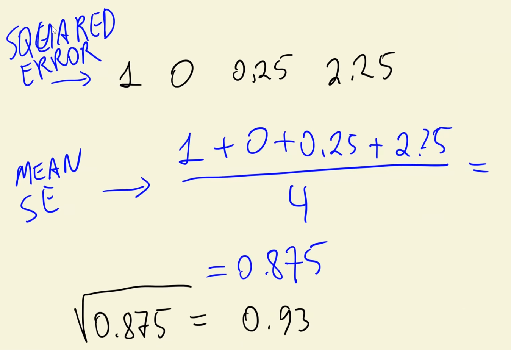

## 🧩 Intuitive Explanation
- The squared error represents how far off each prediction is from reality.  
- Taking the mean gives a single measure of average squared deviation.  
- Taking the square root returns the error to the **original scale** of the target variable (e.g., car prices).  
- The lower the RMSE, the better the model’s predictions.  

## 🧮 Example Calculation (Conceptually)
Suppose:  
- Predictions = [10, 9, 11, 8.5]  
- Actual Prices = [9, 9, 10.5, 11]  

Steps:
1. Differences = [1, 0, 0.5, -2.5]  
2. Squared Errors = [1, 0, 0.25, 6.25]  
3. Mean of Squares = (1 + 0 + 0.25 + 6.25) / 4 = 1.875  
4. RMSE = √1.875 ≈ 1.37  

Interpretation:  
➡️ On average, the model’s predictions differ from actual prices by **about 1.37 units** (in log-price scale).  

## ⚙️ Implementation Logic
To compute RMSE:
1. Take the difference between predicted and actual values.  
2. Square the differences.  
3. Compute their mean.  
4. Take the square root of that mean.  

This function can then be reused to evaluate any regression model’s performance.  

---

# ML Zoomcamp 2.10 - Computing RMSE on Validation Data

## 🎯 Objective
- Learn how to **properly validate** a machine learning model.  
- Use **validation data** instead of training data to measure model performance and detect overfitting.  

## 🧩 Dataset Splitting Reminder
- The dataset should always be divided into three parts:
  1. **Training set** – used to train the model.  
  2. **Validation set** – used to tune and evaluate the model.  
  3. **Test set** – used for final evaluation after model selection.  

## 🧱 Problem in Previous Approach
- Previously, the model was **trained and evaluated** on the same dataset.  
- This led to **optimistic RMSE results**, since the model “saw” that data before.  
- Correct validation requires evaluating on **unseen validation data**.  

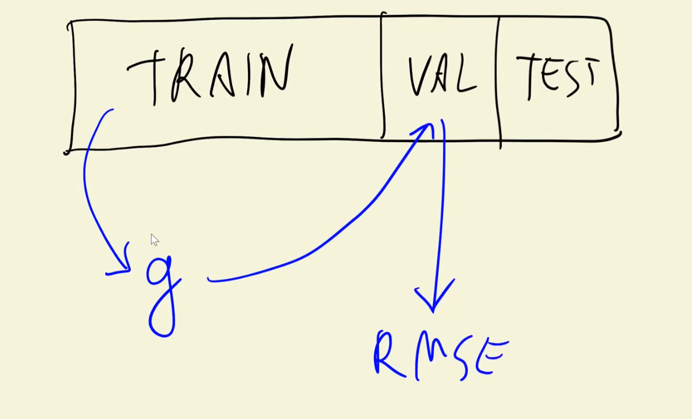

## 🛠️ Step 1: Create a Reusable `prepare_x` Function
- A function was introduced to prepare data consistently for **training**, **validation**, or **testing**.  
- This function performs:
  1. Selection of **numerical columns**.  
  2. Filling of **missing values**.  
  3. Conversion of the resulting DataFrame into a **NumPy array** for modeling.  
- Ensures identical preprocessing across datasets — avoiding data inconsistencies.  

## ⚙️ Step 2: Train and Validate the Model
1. Prepare the **training feature matrix** using `prepare_x(train_df)`.  
2. Train the linear regression model on training data.  
3. Prepare the **validation feature matrix** using the same function.  
4. Apply the trained model (weights) to predict on validation data.  
5. Compute **RMSE** using validation predictions versus actual values.  

## 📊 Result
- The new RMSE value, computed on **validation data**, provides a realistic measure of model generalization.  
- The workflow is now divided into two clear sections:
  - **Training phase** – fit the model using training data.  
  - **Validation phase** – evaluate performance using unseen validation data.  

---

# ML Zoomcamp 2.11 - Feature Engineering

## 🧠 Motivation
- In previous lessons, the baseline model used only **five numerical features**.  
- One key variable in the dataset, **`year`**, was not yet used.  
- Since a car’s **age** strongly influences its price (older cars are cheaper, newer ones more expensive), this lesson introduces **car age** as a new feature.

## 🧩 Concept: Deriving Car Age
- The dataset was collected in **2017**, meaning:
  - A car from 2017 has an age of 0.
  - A car from 2008 has an age of 9.
- A new feature, **`age = 2017 - year`**, is computed to represent how old the car is.
- This derived feature provides a clearer relationship to price than raw manufacturing year.

## 🛠️ Updating the Data Preparation Function
- The previous `prepare_x` function (used to process training, validation, and test data) is **modified**:
  1. A **new column** `age` is added, computed from the `year` column.
  2. A new **feature list** is created, including all baseline numerical columns plus `age`.  
  3. To avoid unwanted side effects, the function now works on a **copy** of the DataFrame — ensuring the original dataset remains unchanged.

## ⚙️ Implementation Details
- The function no longer modifies input data directly.
- The prepared feature matrix (`x_train`) now contains **six columns** — the original five numerical features plus the new `age` feature.
- After retraining, the model uses the same validation procedure as before.

## 📈 Results and Improvements
- The updated model achieved a **significant RMSE improvement**:
  - RMSE dropped from **0.76 → 0.51**.
- The histogram comparison between **predicted vs actual prices** shows:
  - Better alignment of distributions.
  - Improved shape matching for most price ranges.
  - Some mismatches still remain at the extremes, indicating room for improvement.

---

# ML Zoomcamp 2.12 - Categorical Variables

## What Are Categorical Variables?
- Variables that represent **categories** (usually strings), not magnitudes.  
- In the car dataset, examples include: **make, model, engine_fuel_type, transmission_type, driven_wheels, market_category, vehicle_size, vehicle_style**.
- ⚠️ **“Number of doors”** looks numeric but is **categorical** (distinct types: 2, 3, 4 doors) — treat it as categories, not a continuous number.

## Why They Matter
- Categories often carry strong signals (e.g., **make** can drive price differences).
- Using them properly can **boost model performance** over numeric-only baselines.

## How to Encode (One-Hot / Dummy Encoding)
- Replace a single categorical column with **multiple binary columns**, one per category value.  
  - Example for “number_of_doors”: create **doors_2**, **doors_3**, **doors_4**; set exactly one to 1 per row.  
- Practical notes:
  - Build binaries by checking equality to each category value, then convert booleans to 0/1.
  - Create columns via **looping over the allowed values** to avoid repetitive code.
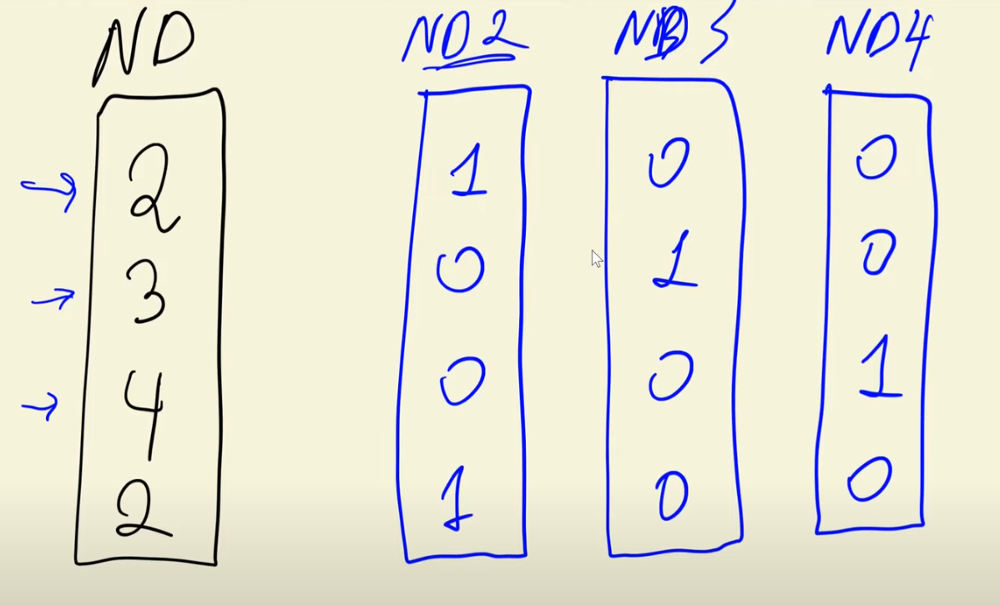

## Safer Data Prep
- **Do not mutate** original DataFrames inside helpers:
  - In `prepare_x`, **work on a copy** to avoid side effects.  
- Maintain a **features list** that includes:
  1. Baseline numeric features  
  2. Previously engineered **age** feature  
  3. Newly created one-hot features  
- When extending the features list, **copy, then append** (don’t mutate shared lists).

## First Addition: “Number of Doors”
- Added one-hot columns for doors (2, 3, 4).  
- **Result:** Only a **small improvement** in validation performance (almost negligible).

## Next Addition: Top Car Makes
- Selected the **top 5 most frequent makes** (via value counts) and one-hot encoded them.  
- **Result:** **Modest improvement** (about 1% better RMSE vs. previous step).  
- Takeaway: Popular categories can help, but gains may be incremental.

## Scaling Up: Multiple Categorical Fields
- Identified categorical columns: **make, engine_fuel_type, transmission_type, driven_wheels, market_category, vehicle_size, vehicle_style** (excluded **model** due to too many unique values).
- Built a **dictionary** mapping each categorical field → **its top 5 most common values**.
- For each field and each selected value, created a corresponding **binary feature**.
- **Issue observed:** After adding many categorical dummies, RMSE **exploded** (e.g., from ~0.5 to ~41) and learned **weights became huge** (numerical instability).

## What Went Wrong (Preview)
- Adding many correlated/rare dummy variables can cause:
  - **Multicollinearity** and near-singular matrices in the normal equation.  
  - **Numerical instability** → huge or nonsensical coefficients and poor RMSE.
- This sets up the need for **regularization/other fixes**, discussed in the next lesson.

---

# 2.13 

### 🔁 Recap
- In the previous lesson, we added **categorical variables** to the model using `prepare_x`.  
- The model’s **Root Mean Squared Error (RMSE)** became extremely high, and the **weights exploded** to large values.  
- In this lesson, we explore **why this happens** and how to fix it using **regularization**.

## ⚠️ The Problem: Non-Invertible Matrices
- The normal equation for linear regression is:

  \[
  w = (X^T X)^{-1} X^T y
  \]

- Sometimes, the **Gram matrix** \( X^T X \) cannot be inverted — it is **singular**.  
- This happens when:
  - Some features are **duplicates** or **linear combinations** of others.  
  - There’s **multicollinearity** (high correlation between columns).

- Example:
  - Columns 2 and 3 in a matrix contain identical values → the matrix is **non-invertible**.  
  - Linear algebraically: one column can be **expressed as a combination** of others.

## 🔍 Numerical Illustration
- Even small floating-point variations (e.g., 5 → 5.0001) can make the matrix **numerically invertible**,  
  but the inverse produces **very large, unstable values**.  
- This leads to:
  - Extremely large coefficients  
  - Poor generalization  
  - High RMSE

## 🧩 The Solution: Regularization
- To stabilize the matrix, we **add a small value (α or λ)** to the **diagonal** of the Gram matrix:

  \[
  (X^T X + \alpha I)^{-1} X^T y
  \]

- This process is called **regularization** (or **Ridge Regression** in linear regression).

### Intuition:
- Adding α ensures \( X^T X + \alpha I \) is **invertible**.
- It **reduces variance** by shrinking large coefficients.
- It **controls weight magnitude**, preventing overfitting.

## ⚙️ Practical Implementation
- Modify the training function to include a **regularization parameter (r)**:
  - Default value: 0.01  
  - Larger `r` → more regularization → smaller weights, higher bias  
  - Smaller `r` → less regularization → risk of instability
- The process:
  1. Compute \( X^T X \)
  2. Add \( r \times I \) to the diagonal
  3. Invert the resulting matrix safely
  4. Compute the new weight vector \( w \)

## 📈 Results
- After adding regularization:
  - RMSE **improved by ~0.5** compared to the unregularized model.  
  - Weights became **stable and well-behaved**.  
- Demonstrated clear **performance and stability gains**.

## ⚖️ Choosing the Regularization Strength
- The parameter `r` controls the trade-off:
  - **Too high** → underfitting (model can’t learn enough)
  - **Too low (or 0)** → overfitting and unstable weights
- ✅ The next lesson focuses on **finding the optimal value for `r`**.

---

# ML Zoomcamp 2.14 - Tuning the Model

## 🔁 Recap
- In the previous lesson, we introduced **regularization** to stabilize the linear regression model and prevent large, unstable weights.  
- Regularization parameter **r (or λ)** controls how strongly we penalize large coefficients.  
- Now, the goal is to find the **optimal value** of `r` that yields the best performance.

## 🎯 Objective
- Identify the **best regularization strength** using the **validation dataset**.
- Approach:
  1. Define a **range of values** for `r` (e.g., 0, 0.0001, 0.001, 0.01, 0.1, 1, 10).  
  2. For each `r`, train a regularized linear regression model.  
  3. Measure performance (using **Root Mean Squared Error**, RMSE) on the **validation set**.  
  4. Compare results and pick the best-performing value.

## 📊 Observations
- **r = 0 (no regularization)**  
  - Very large weights (bias term is huge).  
  - RMSE is also very high.  
- **Small regularization (e.g., r = 0.001 or 0.01)**  
  - RMSE **decreases significantly**.  
  - Model becomes more stable.  
- **Higher regularization (e.g., r = 1 or 10)**  
  - Performance **starts degrading**.  
  - The model becomes too constrained and loses flexibility.

## ✅ Optimal Choice
- The best-performing regularization value is around **r = 0.01**.  
  - It offers a **good trade-off** between bias and variance.  
  - Model remains accurate without overfitting.  
- Minor changes around this value (e.g., 0.001 vs. 0.01) don’t drastically affect performance.

## ⚙️ Final Steps
- Train the model again using the **best regularization parameter** (r = 0.01).  
- Confirm improved performance on the **validation set**.  
- The next step: **test** the model’s performance on the **test dataset** to evaluate generalization.

## 🧠 Key Takeaways
- Regularization parameter `r` directly influences model complexity and stability.  
- Small `r` values prevent overfitting while keeping good accuracy.  
- Large `r` values can lead to underfitting.  
- Always use **validation data** (not training data) to tune hyperparameters like `r`.  
- Next lesson: **Evaluate final model performance on the test set.**

---

# ML Zoomcamp 2.15 - Using The Model

## 🔁 Recap
- In the previous lesson, we determined the **best regularization parameter (r = 0.01)** for our linear regression model.  
- Now, the goal is to **train the final model** using **all available data** (training + validation) and evaluate it on the **test set**.

## 🧩 Dataset Preparation
- Originally, the dataset was divided into:
  - **Training set**
  - **Validation set**
  - **Test set**
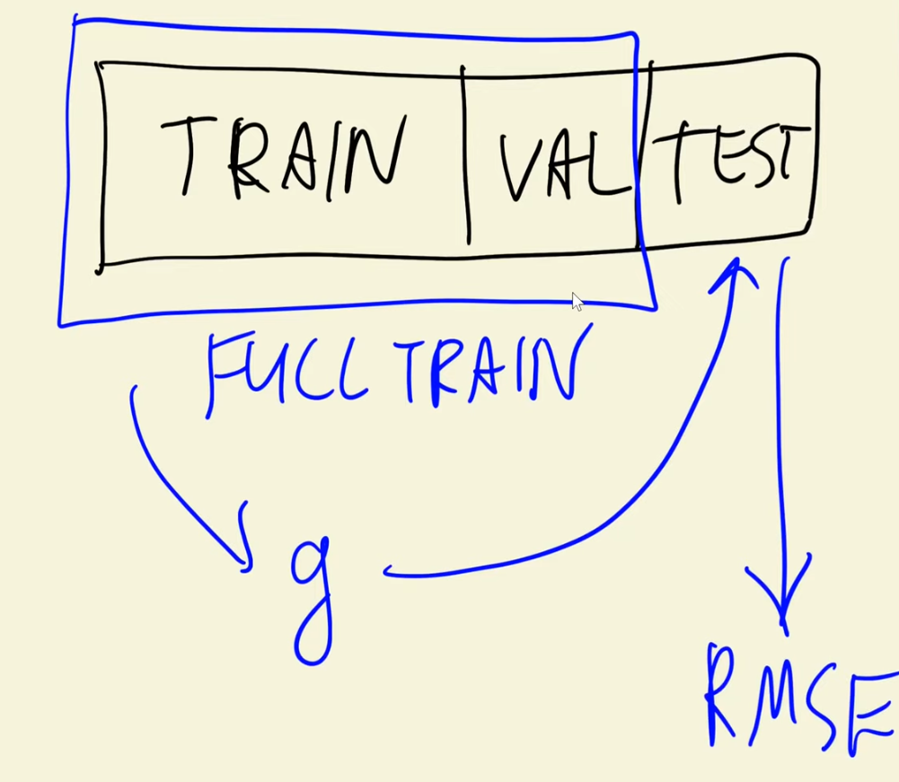

- For the final model:
  - The **training and validation sets** are **merged** into a single dataset (`full_train`).
  - This is done using **pandas `concat()`**, which stacks both datasets vertically.
  - The **index is reset** to ensure clean and sequential indexing.

- The corresponding **target vectors** (`y_train` and `y_val`) are also **concatenated** using NumPy’s `concatenate()`.

## ⚙️ Final Model Training
- A new feature matrix `X_full_train` and target vector `y_full_train` are created.  
- The model is trained with the **regularized linear regression** function using `r = 0.01`.  
- The resulting weights (`w`) and bias (`b`) represent the **final trained model**.
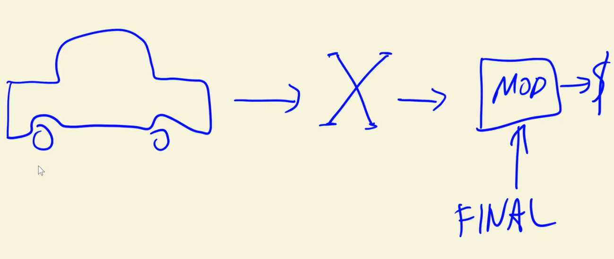
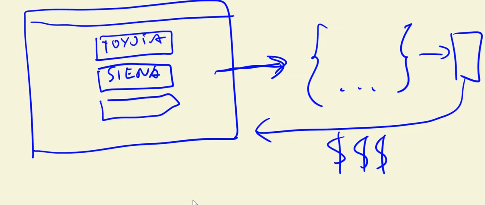

## 🧠 Model Evaluation
- The model is evaluated on the **test dataset**, which the model has never seen before.  
- The **Root Mean Squared Error (RMSE)** on the test set is **almost identical** to that on the validation set.  
- ✅ This consistency indicates that the model **generalizes well** and is **not overfitting**.

## 🔮 Using the Model for Prediction
- The model can now be used to **predict car prices** for new inputs.
- In a real-world scenario:
  - A user enters car information (e.g., make, model, year, fuel type, engine specs) into an app or website.
  - The system sends this information as a **JSON/dictionary** to the model.
  - The model processes it using the `prepare_x()` function, which:
    - Converts the data into a single-row **DataFrame**.
    - Produces the correct **feature matrix** expected by the model.
  - The model outputs a **predicted price** in logarithmic form.
  - Applying the **exponential function** reverses the log transformation to give the actual predicted price.

## 📈 Example Outcome
- For a test example (Toyota Sienna):
  - The predicted price was **slightly off by about \$5,000**, but still reasonably accurate.
  - This shows the model’s ability to make **realistic and consistent price estimations**.

---

# ML Zoomcamp 2.16 - Car Price Prediction Project Summary

## 🎯 Project Overview
In this session, we completed a **machine learning regression project** aimed at **predicting car prices** based on multiple features.  
The dataset contained variables such as:
- **Make, Model, Engine, Fuel Type, Transmission, Driven Wheels**, etc.  
- Target variable: **MSRP (Manufacturer’s Suggested Retail Price)**.

## 🧹 Data Preparation
1. **Data Cleaning**
   - Standardized text formatting (case sensitivity, spacing, naming consistency).
   - Ensured uniformity across columns for easier processing.

2. **Exploratory Data Analysis (EDA)**
   - Identified a **long-tail distribution** in price.
   - Applied a **logarithmic transformation** to normalize prices.
   - Handled **missing values**, since models cannot train effectively with NaNs.

3. **Validation Framework**
   - Split dataset into **Train**, **Validation**, and **Test** sets.
   - Established a reusable structure for preparing feature matrices using the `prepare_x()` function.

## 📈 Building and Understanding Linear Regression
1. Implemented **linear regression manually** using:
   - The **dot product** representation for prediction.
   - The **normal equation** to compute weights analytically.
2. Observed that the **baseline model** (5 numerical features) performed poorly.
3. Introduced **RMSE (Root Mean Squared Error)** as an objective metric to measure model performance.

## 🧩 Feature Engineering
1. Created a new feature: **Car Age (2017 - Year)**.
   - Significantly improved model accuracy.
2. Discussed **Feature Engineering** as the process of creating meaningful new variables from existing data.

## 🔤 Handling Categorical Variables
1. Converted categorical features (e.g., **number of doors**, **make**, **fuel type**) into numerical form using **one-hot encoding**.  
2. Observed that after adding many categorical variables, the model performance **degraded** sharply due to **numerical instability**.

## ⚙️ Regularization and Model Stability
1. Introduced **Regularization** to solve instability caused by multicollinearity.
   - Added a small number (`r`) to the diagonal of the **Gram matrix (XᵀX)** to stabilize matrix inversion.
2. Tuned the **regularization parameter (r)** to control model complexity.
3. Found that **r = 0.001–0.01** provided the best performance balance.

## 🏁 Final Model Training
1. Combined **training** and **validation** data into a **full training dataset**.  
2. Retrained the model using the **optimal regularization value**.  
3. Evaluated performance on the **test dataset**:
   - RMSE on test data ≈ RMSE on validation data → **good generalization**.
4. Demonstrated how to:
   - Take new car input (as a JSON/dictionary).
   - Convert it to a DataFrame.
   - Generate a **price prediction**.
   - Reverse the logarithmic transformation to get the **final car price**.

## 💡 Key Learnings
- Understood the **end-to-end workflow** of a regression ML project:
  1. Data cleaning and exploration.
  2. Splitting and validation.
  3. Model training and evaluation.
  4. Feature engineering.
  5. Regularization and model tuning.
  6. Final evaluation and prediction.
- Learned to implement ML fundamentals **from scratch** using **NumPy**.
- Prepared for using **Scikit-Learn** in future lessons for faster and more scalable modeling.
