# ML Zoomcamp 3.1 - Churn Prediction Project

## 🧠 Introduction
This week’s project focuses on **customer churn prediction** — a classic **binary classification** problem in machine learning.  
We’ll predict which telecom customers are likely to **leave (churn)** based on their account and usage data.

## 📱 Business Context
- Imagine working for a **telecom company** providing services like phone, internet, and TV.  
- Some customers are satisfied, but others consider switching to a competitor (e.g., “Telco 2”).  
- **Goal:** identify which customers are likely to churn (leave) soon.

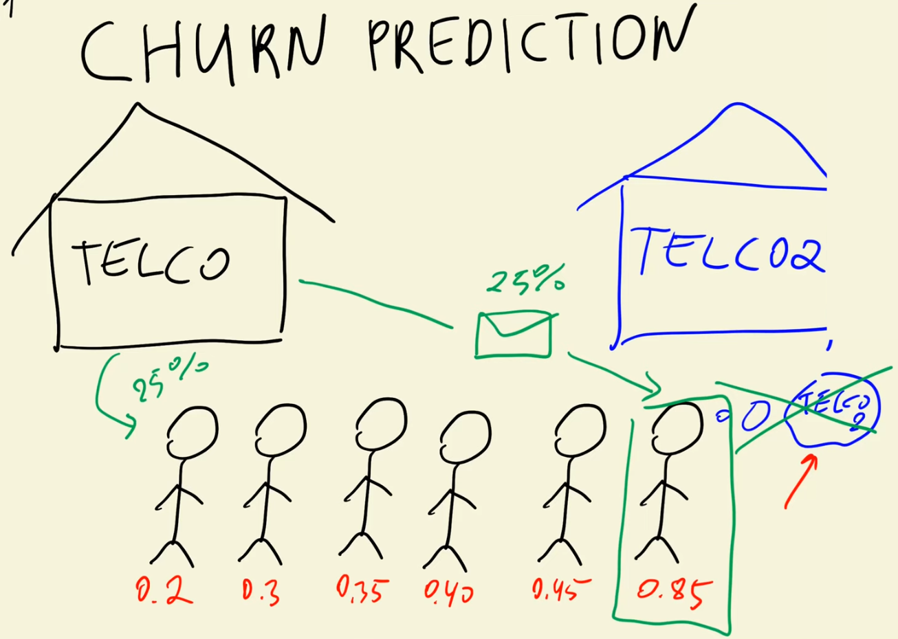

## 🎯 Objective
We want to:
1. Predict **how likely** each customer is to leave — outputting a **score between 0 and 1**.
2. Use this score to **prevent churn** by offering discounts or promotions.
3. Balance two risks:
   - ❌ Giving discounts to loyal customers (losing revenue).
   - ⚠️ Missing customers who are about to leave (losing them entirely).

This makes the model’s **accuracy and precision** crucial for effective decision-making.

## 🧩 Machine Learning Framing
- This is a **supervised learning** problem.
- Specifically: **binary classification**, where the target variable `y` has two possible values:
  - `1` → Customer **did churn**
  - `0` → Customer **did not churn**
- The model outputs a **probability (0–1)** representing how likely a customer is to churn.

## 📊 Dataset Overview
We will use the **Telco Customer Churn dataset** from **Kaggle**.  
It includes:
- `customerID`, `gender`, `tenure`, `contract type`, `internet service`, `payment method`, etc.
- The target column: **`Churn`** — indicating whether the customer left (`Yes`) or stayed (`No`).

## 🧱 Project Workflow
The week’s project follows a similar structure to the regression project, but adapted for classification.

### 1. **Data Loading & Preparation**
- Download the Telco dataset.
- Clean and preprocess categorical and numerical features.
- Set up a **validation framework** to evaluate model performance.
- This time, we’ll rely on **scikit-learn (sklearn)** instead of manual NumPy/Pandas implementation.

### 2. **Exploratory Data Analysis (EDA)**
- Examine the distribution of the **target variable (Churn)**.
- Investigate **feature relationships**:
  - Which features increase the likelihood of churn?
  - Calculate **churn rate** and **risk ratios** for categorical attributes.
- Explore **feature importance metrics**:
  - **Mutual Information**
  - **Correlation**

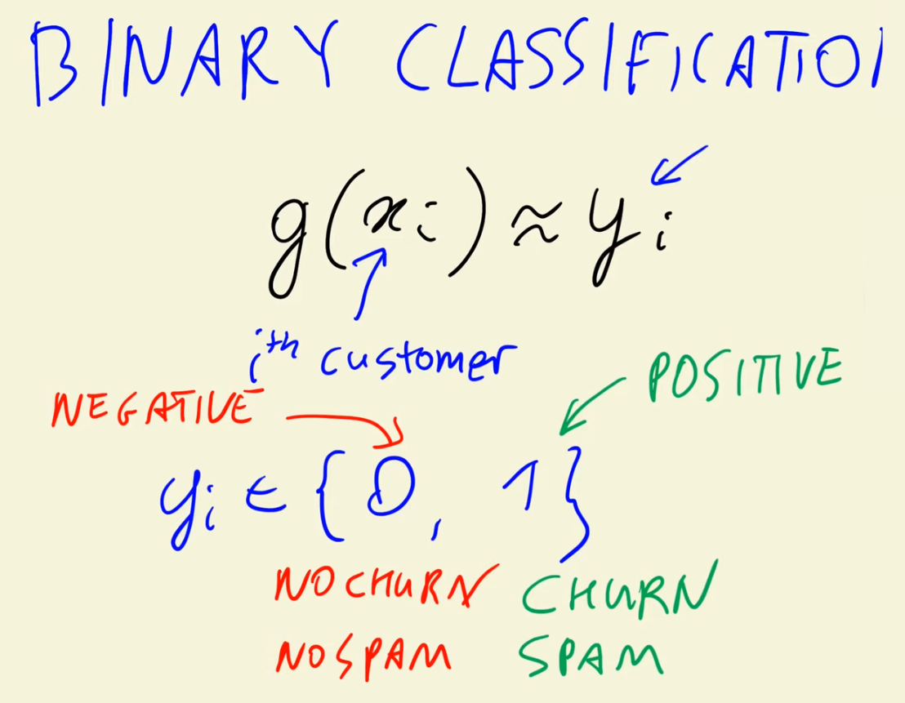
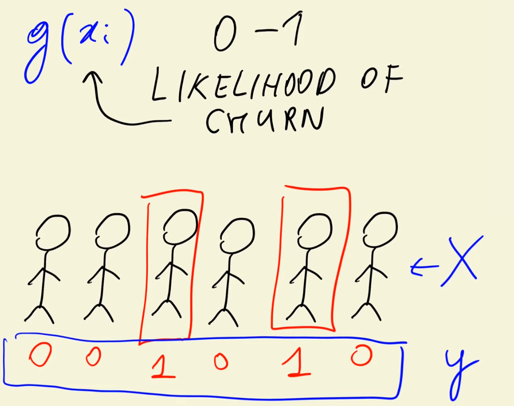


### 3. **Feature Encoding**
- Convert categorical variables using **one-hot encoding** or similar sklearn utilities.
- Learn how to handle different data types properly for classification models.

### 4. **Modeling**
- Introduce **Logistic Regression**, a fundamental model for binary classification.
- Compare it to **Linear Regression** conceptually:
  - Linear regression predicts continuous values.
  - Logistic regression predicts **probabilities** and class labels (0/1).
- Use **scikit-learn** to train and evaluate the model efficiently.

### 5. **Interpretation**
- Examine the **model coefficients** to understand how features influence churn.
- Learn how to interpret the relationship between input variables and churn likelihood.

## 📅 Learning Plan Summary
| Step | Topic | Description |
|------|--------|-------------|
| 1️⃣ | Data Download & Cleaning | Load and prepare Telco churn dataset |
| 2️⃣ | Validation Framework | Use sklearn to split and validate |
| 3️⃣ | EDA | Explore churn rates, correlations, and risk ratios |
| 4️⃣ | Feature Encoding | Use sklearn tools for categorical features |
| 5️⃣ | Modeling | Train Logistic Regression model |
| 6️⃣ | Interpretation | Understand model coefficients and predictions |

## 🧭 Outcome
By the end of this week, you’ll be able to:
- Frame a **business problem** as a **classification task**.  
- Build and evaluate a **logistic regression model** for churn prediction.  
- Interpret model outputs to **make data-driven retention strategies**.  
- Use **scikit-learn** for the full ML workflow — from preprocessing to evaluation.

---

# ML Zoomcamp 3.2 - Data Preparation

## 🧠 Overview
In this lesson, we downloaded, inspected, and preprocessed the **Telco Customer Churn dataset** using **Pandas**.  
The goal was to clean and prepare the data for machine learning by ensuring proper formatting, fixing data types, and creating a binary target variable (`churn`).

## 📥 Step 1: Downloading the Dataset
- The dataset was retrieved using the Linux utility **`wget`** (via `!wget` in Jupyter).  
- Alternatively, it can be downloaded manually from the browser and saved locally.
- After downloading, it was stored in the **`week_3`** directory.

## 📂 Step 2: Loading Data with Pandas
- The data was loaded using **`pandas.read_csv()`** into a DataFrame.
- The dataset contains **21 columns**, including:
  - `customerID`, `gender`, `SeniorCitizen`, `Partner`, `Dependents`, `tenure`, `TotalCharges`, and `Churn`.
- Since not all columns are visible in the default display, the DataFrame was **transposed** (`.T`) to view all columns and inspect data structure more clearly.

## 🧹 Step 3: Data Cleaning and Normalization
1. **Standardizing Column Names**
   - Converted all column names to **lowercase**.
   - Replaced spaces with **underscores** for consistency.
   - Example: `Total Charges` → `total_charges`.

2. **Inspecting Data Types**
   - Used `df.dtypes` to examine column types.
   - Found that:
     - `SeniorCitizen` was numeric (`0` or `1`), not categorical.
     - `TotalCharges` was incorrectly stored as an **object (string)** instead of a numeric column.

## ⚠️ Step 4: Handling Incorrect Data Types
- The `total_charges` column appeared numeric but contained **non-numeric values** (spaces used for missing data).  
- When attempting to convert to numeric, Pandas raised parsing errors.
- Solution:
  - Used **`pd.to_numeric(..., errors='coerce')`** to replace invalid entries with `NaN`.
  - Identified **11 missing values** after conversion.

## 🔧 Step 5: Handling Missing Values
- Missing `total_charges` entries were replaced with **0** using `.fillna(0)`.  
- Although zero is not ideal semantically (it may represent missing billing data), it works for practical ML preprocessing.

## 🧮 Step 6: Encoding the Target Variable (`Churn`)
- The original `Churn` column contained **"Yes"** or **"No"** strings.  
- For ML models, it was converted into **binary values**:
  - `Yes` → `1` (customer churned)
  - `No` → `0` (customer stayed)
- This transformation converts categorical labels into numeric format suitable for classification tasks.

---

# ML Zoomcamp 3.3 - Setting Up The Validation Framework

### 🎯 Goal
In this lesson, we learned how to **split the dataset** into three parts — **train**, **validation**, and **test** — using **Scikit-learn’s `train_test_split`** utility instead of manual NumPy/Pandas logic used in previous projects.

## ⚙️ Step 1: The Validation Framework
- The entire dataset is divided into:
  - **60%** → Training set  
  - **20%** → Validation set  
  - **20%** → Test set  
- This allows:
  - **Training** → fitting the model  
  - **Validation** → tuning hyperparameters  
  - **Testing** → evaluating final model performance  

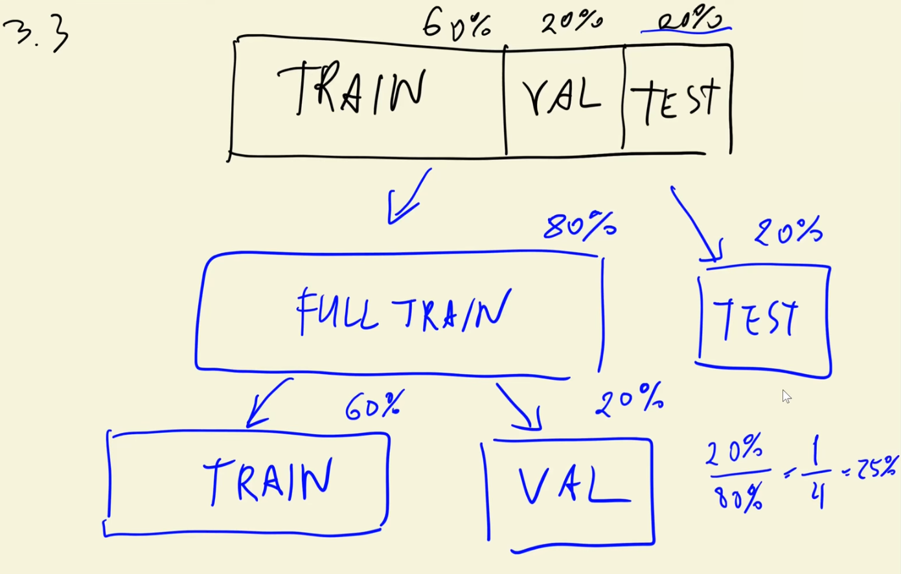

## 🧩 Step 2: Using `train_test_split`
- The **`train_test_split`** function from `sklearn.model_selection` helps partition datasets efficiently.
- Parameters used:
  - `test_size=0.2` → assigns 20% of the data to the test set.
  - `random_state=1` → ensures **reproducible splits** across different runs.

🧠 **Note:**  
The function only splits into **two sets** (train & test).  
To get **three sets**, we must split the **training portion again**.

## 🔁 Step 3: Two-Step Splitting Process
1. **First split:**
   - Split full dataset into:
     - `df_full_train` → 80%
     - `df_test` → 20%
   - Now we have the test data isolated.

2. **Second split:**
   - Split `df_full_train` again to create:
     - `df_train` → 60% (of original dataset)
     - `df_val` → 20% (of original dataset)
   - To achieve this, we use `test_size=0.25` when splitting `df_full_train`
     (because 25% of 80% = 20% of total data).

✅ Resulting sizes:
- `train` → 4,200 rows  
- `validation` → 1,400 rows  
- `test` → 1,400 rows  

## 🧹 Step 4: Resetting Indices
- After splitting, indices become shuffled and non-sequential.  
- Used `.reset_index(drop=True)` for all three datasets to maintain clean, continuous indexing.  
- This doesn’t affect model performance but improves data readability.

## 🎯 Step 5: Preparing Target Variable (`y`)
- Extracted the **target column (`churn`)** from each subset:
  - `y_train`, `y_val`, `y_test`
- Stored them as **NumPy arrays** for later use in model training and evaluation.

## 🚫 Step 6: Preventing Data Leakage
- After extracting the `churn` variable, it was **removed from each dataset** (`df_train`, `df_val`, `df_test`).
- This prevents accidental model “cheating” by using the target variable during training.

## 📊 Step 7: Keeping Full Train for EDA
- Did **not** remove `churn` from `df_full_train`, because it will be useful in **exploratory data analysis (EDA)** in the next lesson.
- The full training data will help analyze patterns, class balance, and correlations. 

---

# ML Zoomcamp 3.4 - EDA

## 🎯 Objective
In this lesson, we performed **Exploratory Data Analysis (EDA)** on the **full training dataset** to better understand:
- The target variable (`churn`)
- The structure of the dataset  
- The distinction between **numerical** and **categorical** variables  

## 🧹 Step 1: Data Preparation
- Used the **full training dataset (`df_full_train`)** created earlier.  
- **Reset the indices** for a cleaner and more consistent DataFrame view.  
- Verified there were **no missing values**:
  - All missing entries previously found in `total_charges` were fixed during data preprocessing.  
  - No additional data cleaning was necessary.

## 🎯 Step 2: Target Variable (`churn`)
- The target column `churn` indicates whether a customer left the telecom company:
  - `1` → Customer churned  
  - `0` → Customer stayed  

### 🔍 Distribution Analysis
- Used `value_counts()` to count churned vs. non-churned customers.
- Observation:
  - Roughly **3 times more non-churned customers** than churned ones.
  - About **26–27%** of customers churned.
- This **churn rate** (fraction of customers leaving) is an important baseline metric for modeling.

### 💡 Why Mean = Churn Rate
- Since `churn` is binary (`0` or `1`),  
  the **mean** equals the **fraction of 1s** (i.e., the churn rate).  
  - Formula:  
    \[
    \text{mean} = \frac{\text{number of 1s}}{\text{total samples}} = \text{churn rate}
    \]
- Therefore, `df_full_train.churn.mean()` gives the same value as the normalized count — approximately **0.27** (27%).

## 🧮 Step 3: Analyzing Variable Types
To better structure the data, we categorized features into **numerical** and **categorical** types.

### **Numerical Variables**
Identified as continuous or numeric features:
- `tenure` — months the customer has been with the company  
- `monthlycharges` — monthly payment amount  
- `totalcharges` — total amount billed  

### **Categorical Variables**
- All other columns except `customerid`, `churn`, and the numerical ones.  
- Examples:
  - `gender`, `partner`, `dependents`, `phoneservice`, `internetservice`, `contract`, `paymentmethod`, etc.  
- `seniorcitizen` is stored as an integer (`0` or `1`) but is **categorical** in meaning (yes/no).  

## 📈 Step 4: Categorical Variable Exploration
- Counted the **number of unique values** for each categorical feature using `.nunique()`.
- Observations:
  - Most categorical variables are **binary** (two unique values).  
  - Some variables have **three** categories (e.g., `internetservice`, `contract`).  
  - `paymentmethod` has **four** unique values — the most among all features.

## 🧭 Insights
- The dataset is **balanced enough** for modeling but still shows a **moderate churn imbalance (27%)**.  
- Most variables are **categorical**, which will require **encoding** before model training.  
- Some features like `seniorcitizen` should be treated as categorical despite being numeric.  

---

# ML Zoomcamp 3.5 - Feature Importance: Churn Rate And Risk Ratio

## 🎯 Objective
In this lesson, we explored **feature importance** by analyzing how the **churn rate** varies across different groups of customers.  
We also introduced the **risk ratio** as a way to measure how strongly a variable influences customer churn.

## 🧩 Step 1: From Global to Group Churn
- Previously, we computed the **global churn rate** (~27%).  
- Now, we calculated **churn rates within groups** — for example:
  - By **gender** (`Male`, `Female`)
  - By **partner status** (`Yes`, `No`)
- This helps identify which customer groups are **more or less likely** to leave the company.

## 👩‍💼 Example 1: Churn by Gender
- **Female customers:** churn rate ≈ global average (~27%)  
- **Male customers:** churn rate ≈ global average (~27%)  
🟢 **Conclusion:** Gender has *minimal effect* on churn.  

## ❤️ Example 2: Churn by Partner Status
- **With Partner:** churn rate ≈ 20% (lower than global)  
- **Without Partner:** churn rate ≈ 33% (higher than global)  
🟠 **Insight:** Partner status *strongly affects churn likelihood*.  

- Customers **without a partner** are significantly **more likely** to churn.  
- Customers **with a partner** are **less likely** to churn.

## 🧮 Step 2: Measuring Feature Importance via Differences
We compared **group churn** with **global churn**:
- **Difference = Group Churn – Global Churn**

Interpretation:
- If **difference > 0** → group churns *more* than average → **higher churn risk**  
- If **difference < 0** → group churns *less* than average → **lower churn risk**  

🔹 Example:
- Partner = “No” → difference ≈ +6% → high churn group  
- Partner = “Yes” → difference ≈ –7% → low churn group  

Larger differences indicate **more predictive variables**.

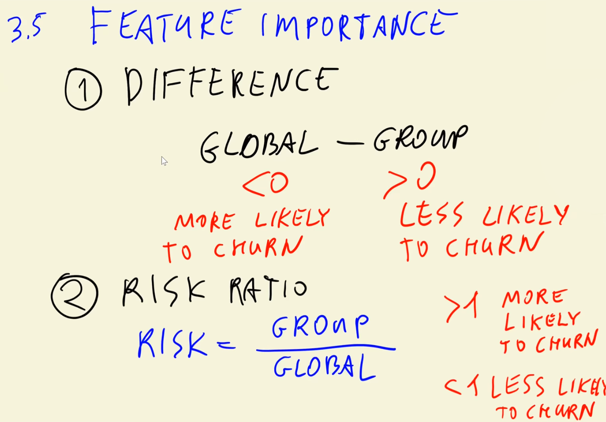
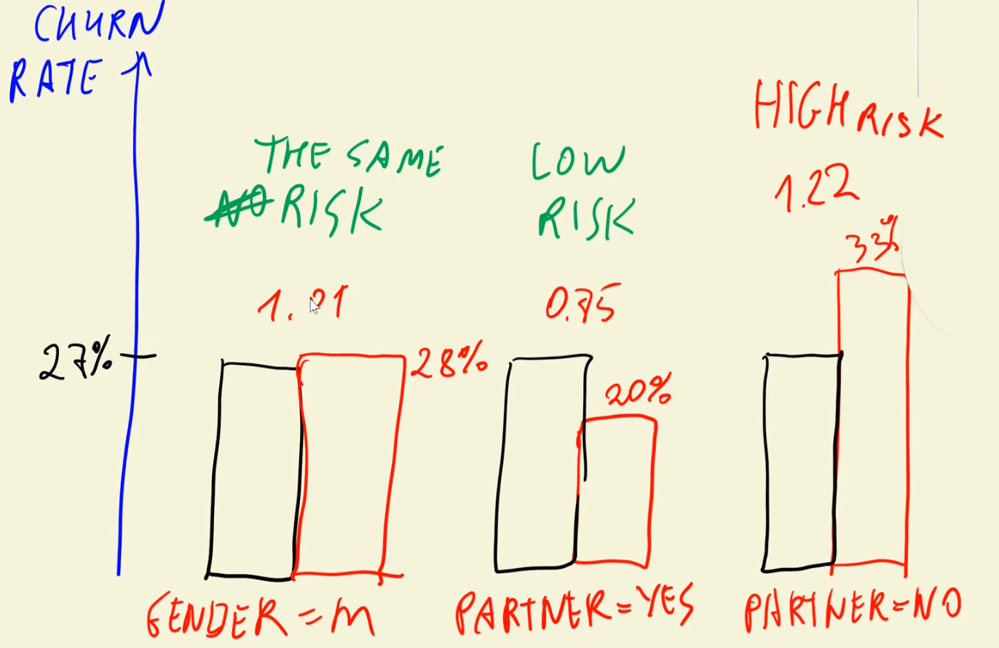

## ⚖️ Step 3: Introducing the Risk Ratio
Instead of just differences, we can use a **relative metric** — the **risk ratio**.

\[
\text{Risk Ratio} = \frac{\text{Group Churn Rate}}{\text{Global Churn Rate}}
\]

- **Risk Ratio > 1** → group more likely to churn  
- **Risk Ratio < 1** → group less likely to churn  
- **Risk Ratio ≈ 1** → same risk as average customer  

Example:  
- Partner = “No” → 33% / 27% ≈ **1.22** → 22% higher risk  
- Partner = “Yes” → 20% / 27% ≈ **0.75** → 25% lower risk  

This provides a clear, **relative measure of churn risk**.

---

# ML Zoomcamp 3.6 - Feature Importance: Mutual Information

## 🎯 Objective
In this lesson, we learned how to measure the **importance of categorical variables** using **Mutual Information (MI)** — a concept from **information theory** that quantifies how much knowing one variable tells us about another.

Previously, we used **risk ratios** to assess the relationship between churn and categorical variables (e.g., contract type).  
However, risk ratios work **within a single feature’s categories** — they don’t let us **compare the overall importance between features** (e.g., “Is `contract` more important than `gender`?”).  
Mutual Information fills that gap.

## 📚 Step 1: What is Mutual Information?
Mutual Information (MI) measures the **mutual dependence** between two random variables.  
It quantifies **how much information we gain** about one variable by observing the other.

Mathematically:
> The higher the mutual information between two variables,  
> the more one variable tells us about the other.

In our case:
- Variable 1: **Target** (`churn`)
- Variable 2: **Feature** (e.g., `contract`, `gender`, `partner`)

So MI answers:
> “How much do we learn about churn when we know the value of this feature?”

## 🧩 Step 2: Intuitive Example
- **Contract Type**:
  - If a customer has a **month-to-month** contract, we can infer a **high likelihood of churn**.  
  - If they have a **two-year** contract, the churn probability is **very low**.
  - ➜ MI is **high** — contract type gives strong information about churn.

- **Gender**:
  - Whether the customer is male or female barely changes the churn rate.
  - ➜ MI is **near zero** — gender gives **no useful signal**.

Thus, the **higher the MI value**, the **more predictive** the feature is.

## ⚙️ Step 3: Using Scikit-learn to Compute MI
Scikit-learn provides a built-in method:
- `mutual_info_score()` from `sklearn.metrics`

Inputs:
- `labels_true` → target variable (`churn`)  
- `labels_pred` → categorical feature (e.g., `contract`, `gender`, `partner`)  

The function measures **how much knowing the feature helps predict churn**.  
It’s **symmetric** — the order of inputs doesn’t matter.

## 📈 Step 4: Comparing Variable Importance
After computing MI for multiple features:
- **Contract** has **high MI** → very informative about churn.  
- **Partner** has **moderate MI** → some predictive power.  
- **Gender** has **near-zero MI** → not informative at all.

Even though MI values themselves (like 0.009 bits) are hard to interpret directly,  
we can compare them **relatively** to see which features matter most.

## 🧮 Step 5: Applying MI to All Categorical Variables
To evaluate all categorical columns:
1. Define a helper function that applies `mutual_info_score()` to each feature.  
2. Apply it across all **categorical columns** in the dataset.  
3. Store results in a series or table (`mi`).  
4. Sort results by importance (descending order).  

This produces a **ranked list** of features by predictive power.

## 🧭 Step 6: Example of Sorted Importance
From the MI ranking:
| Feature | Mutual Information | Interpretation |
|----------|--------------------|----------------|
| `contract` | High | Strong predictor of churn |
| `internetservice` | High | Important — internet type affects churn |
| `techsupport` | Moderate | Helpful but not dominant |
| `partner` | Moderate | Some predictive power |
| `gender` | Very low | Not predictive |

🟢 **Insight:**  
Features like **contract type**, **tech support**, and **online security** provide meaningful signals for churn prediction.  
In contrast, **gender**, **multiple lines**, or **phone service** add little value.

## 🤖 Step 7: Why Mutual Information Matters
Mutual Information helps:
- Identify which features are **worth encoding and using** in the model.  
- Filter out **irrelevant variables** that don’t improve prediction.  
- Explain **why ML models can generalize** — they learn from high-MI signals.

For example:
- Customers with **month-to-month contracts** and **no tech support** show **high churn probability**.
- These insights help models (and humans) focus on **meaningful predictors**.

---

# ML Zoomcamp 3.7 - Feature Importance: Correlation

## 🎯 Objective
In this lesson, we learned how to measure the **importance of numerical variables** using **Pearson’s correlation coefficient** — a statistical measure of how strongly two variables are linearly related.

Previously, we used **Mutual Information** for **categorical variables**.  
Now, we use **correlation** to understand relationships between **numerical features** and **churn**.

## 📚 Step 1: What Is Pearson’s Correlation?
- **Pearson’s correlation coefficient (r)** measures the **degree of dependency** between two variables.  
- It ranges between **-1** and **1**:
  - **r = 1** → perfect positive correlation  
  - **r = -1** → perfect negative correlation  
  - **r = 0** → no linear relationship  

### Interpretation:
| Correlation Range | Strength | Meaning |
|-------------------|-----------|----------|
| 0 to ±0.1 | Very weak | Almost no relationship |
| ±0.1 to ±0.5 | Moderate | Partial relationship |
| ±0.5 to ±1.0 | Strong | Strong dependency |

## 🔢 Step 2: Correlation in the Context of Churn
- In our dataset:
  - **Y (Target):** `churn` → binary (0 = stays, 1 = leaves)  
  - **X (Feature):** numerical variables such as:
    - `tenure`
    - `monthlycharges`
    - `totalcharges`

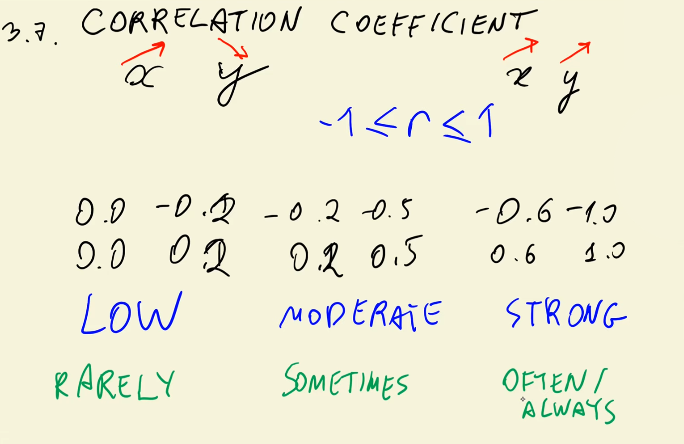
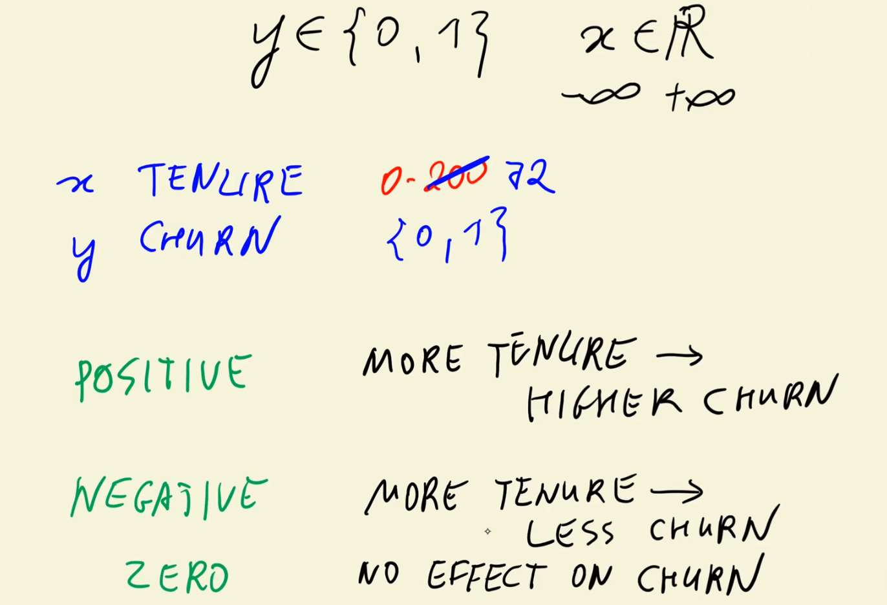
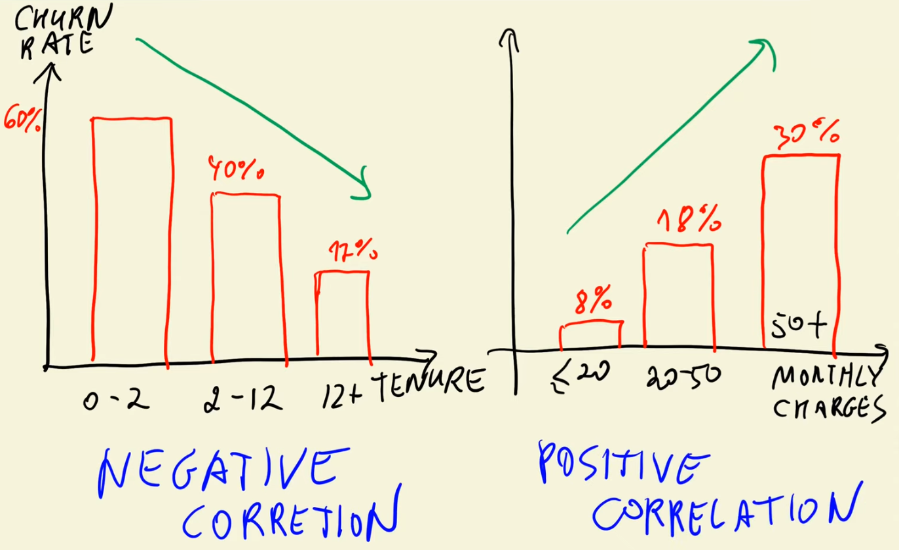

Thus, correlation tells us **how numerical features relate to churn**.

### Sign of Correlation:
- **Positive correlation:**  
  When X increases → Y (churn) tends to increase.  
  → Example: Higher monthly charges → more likely to churn.

- **Negative correlation:**  
  When X increases → Y (churn) tends to decrease.  
  → Example: Longer tenure → less likely to churn.

## 📈 Step 3: Example – Correlation by Feature

### 🕒 Tenure
- Represents how long a customer has stayed (0–72 months).  
- **Correlation with churn:** Negative.  
  - Longer tenure → lower churn rate.  
  - New customers are far more likely to leave.

| Tenure Range | Churn Rate |
|---------------|-------------|
| 0–2 months | ~59% |
| 2–12 months | ~40% |
| >12 months | ~17% |

➡️ **Interpretation:** The longer customers stay, the less likely they are to churn.  
**Strong negative correlation** between `tenure` and `churn`.

### 💰 Monthly Charges
- Represents how much a customer pays per month.  
- **Correlation with churn:** Positive.  
  - Higher monthly charges → higher churn rate.

| Monthly Charges | Churn Rate |
|------------------|-------------|
| < \$20 | ~9% |
| \$20–\$50 | ~18% |
| > \$50 | ~32% |

➡️ **Interpretation:** Expensive plans lead to a higher probability of churn.  
**Moderate positive correlation** between `monthlycharges` and `churn`.

### 💵 Total Charges
- Represents the total amount a customer has paid.  
- **Correlation with churn:** Negative (weaker).  
  - Higher total charges → lower churn.  
  - Correlated with tenure (longer stay → more total payments).

➡️ **Interpretation:** Customers who paid more over time tend to stay longer.

## 📊 Step 4: Summary of Correlation Results

| Feature | Correlation with Churn | Direction | Interpretation |
|----------|------------------------|------------|----------------|
| `tenure` | Negative | Strong | Long-term customers rarely churn |
| `monthlycharges` | Positive | Moderate | Higher bills increase churn |
| `totalcharges` | Negative | Weak | Longer relationships → less churn |

## 🧠 Step 5: Understanding Correlation Strength
- The **absolute value** of correlation indicates **importance**:
  - Larger magnitude → stronger relationship.  
  - Direction (positive/negative) indicates the type of relationship, not its strength.

➡️ In our case:  
`tenure` > `monthlycharges` > `totalcharges`  
in terms of predictive importance for churn.

---

# ML Zoomcamp 3.8 - One-Hot Encoding

## 🎯 Objective
In this lesson, we learned how to transform **categorical variables** into a format that can be used by machine learning algorithms using **One-Hot Encoding (OHE)**.  
We focused on automating this process using **Scikit-learn’s `DictVectorizer`**.

## 📚 Step 1: Recap — Why Encode Categorical Variables?
Machine learning models work with **numerical data**, not text.  
Categorical variables such as `"gender"` or `"contract"` must be converted into numbers.

In the **regression module**, we implemented this manually.  
Now, we’ll use **Scikit-learn** to handle encoding efficiently.

## 🔢 Step 2: What Is One-Hot Encoding?
**One-hot encoding** converts each category into a separate binary column (0 or 1).  
Each row “activates” one column corresponding to its category.

### Example

| gender | contract     | → | female | male | month-to-month | one-year | two-year |
|--------|--------------|---|--------|------|----------------|-----------|----------|
| female | two-year     | → | 1 | 0 | 0 | 0 | 1 |
| female | one-year     | → | 1 | 0 | 0 | 1 | 0 |
| male   | month-to-month | → | 0 | 1 | 1 | 0 | 0 |

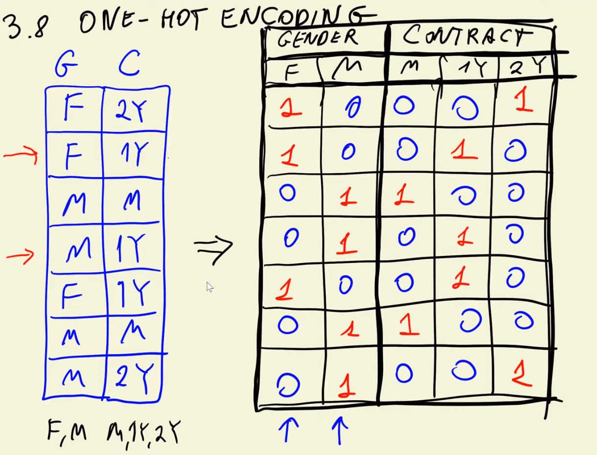

✅ Each categorical feature becomes multiple binary features.  
This is why it’s called **“one-hot”** — one value is “hot” (1), others are “cold” (0).

## ⚙️ Step 3: Implementing One-Hot Encoding with Scikit-learn
Instead of manually creating these columns, we use:
- `DictVectorizer` from `sklearn.feature_extraction`.

This transformer:
1. Takes dictionaries (rows as key-value pairs).  
2. Learns all possible categorical values (`fit`).  
3. Converts them into binary vectors (`transform`).  

## 🧱 Step 4: Workflow Overview

### 1️⃣ Convert DataFrame Rows into Dictionaries  
Each row (record) is converted into a dictionary like:  
`{'gender': 'female', 'contract': 'two_year'}`

### 2️⃣ Initialize and Fit the `DictVectorizer`  
The vectorizer learns all possible categories for each variable.

### 3️⃣ Transform Data into Feature Matrix  
- Produces a **sparse matrix** (optimized for many zeros).  
- Can be converted to a **NumPy array** (`sparse=False`) for readability.  
- Automatically creates one binary column per unique category.  

## 🧩 Step 5: Sparse Matrix Representation
- One-hot encoding results in many zeros (inactive categories).  
- A **sparse matrix** efficiently stores only non-zero values to save memory.  
- Example: SciPy’s **Compressed Sparse Row (CSR)** format.

However, for simplicity in this lesson, we used dense arrays (`sparse=False`).

## 🧠 Step 6: How `DictVectorizer` Handles Mixed Data
If numerical columns (e.g., `tenure`, `monthlycharges`) are included:
- `DictVectorizer` automatically **keeps them as-is** (no encoding).  
- Only categorical columns are one-hot encoded.  

So the final dataset combines:
- Binary columns for categorical features.  
- Original numerical columns.

## 🧮 Step 7: Applying to Training and Validation Sets
1. **Training Phase**
   - Convert training data (`df_train`) into dictionaries.
   - `fit` the `DictVectorizer` on this data.
   - `transform` to create the training feature matrix (`X_train`).

2. **Validation Phase**
   - Convert validation data (`df_val`) into dictionaries.
   - Only use `transform` (not `fit`) — to avoid data leakage.
   - Create validation feature matrix (`X_val`).

The resulting matrices (`X_train`, `X_val`) are now ready for model training.

## 🧾 Step 8: Summary of Steps
| Step | Action | Description |
|------|---------|-------------|
| 1 | Identify categorical variables | e.g., `gender`, `contract` |
| 2 | Convert rows to dictionaries | Each row = dict of feature names and values |
| 3 | Fit `DictVectorizer` | Learns all category names |
| 4 | Transform data | Converts to binary matrix (one-hot encoded) |
| 5 | Use dense/sparse output | Depending on memory and use case |
| 6 | Repeat for validation data | Only transform, never refit |

---

# ML Zoomcamp 3.9 - Logistic Regression

## 🎯 Overview
This lesson introduces the **transition from regression to classification models** in machine learning — focusing on how to handle problems where the output variable is **categorical** rather than numerical.

Regression models (like linear regression) predict **continuous values**, but many real-world problems require predicting **categories or classes** (e.g., churn: yes/no, sentiment: positive/negative).

## ⚖️ Regression vs. Classification
- **Regression:**  
  Output is a **number** (e.g., predicting car prices, house values).  
  The model produces continuous values like `17.2`, `105.8`, etc.

- **Classification:**  
  Output is a **label or class** (e.g., `positive` / `negative`, `yes` / `no`).  
  The model predicts the **probability** of belonging to a certain class.

Example:
- Regression → predicts any value between `−∞` and `+∞`.  
- Classification → constrains output between **0 and 1**, representing probabilities.

## 📈 Logistic (Sigmoid) Function
To convert raw model outputs into probabilities, we use the **logistic function (sigmoid)**:

- It “squashes” any input value into the range **(0, 1)**.
- Formula maps low values near `−∞` to **0** and high values near `+∞` to **1**.
- Values near **0.5** represent uncertainty — the model is unsure.

This curve defines the core behavior of **logistic regression**.

## 🔢 Understanding Probabilities
- If the model predicts a value **> 0.5**, classify as **positive (1)**.  
- If **< 0.5**, classify as **negative (0)**.  
- 0.5 acts as the **decision boundary** separating classes.

Example:
| Input Value | Sigmoid Output | Classification |
|--------------|----------------|----------------|
| −2.0 | 0.12 | Negative |
| 0.0 | 0.50 | Neutral Boundary |
| +2.0 | 0.88 | Positive |

## 🧩 Model Interpretation
- The **logistic regression model** learns a **line (decision boundary)** that separates the classes.
- In higher dimensions, this becomes a **plane (or hyperplane)**.
- The goal is to **minimize classification error** by adjusting weights, similar to regression but optimized for classification tasks.

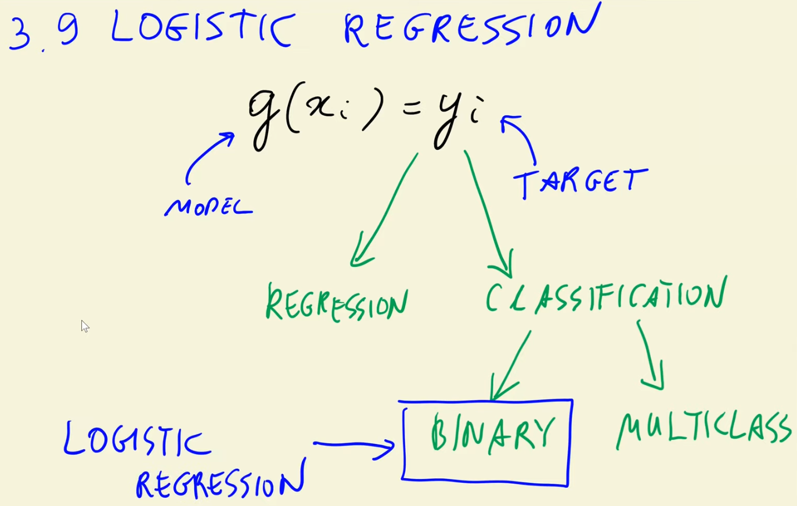
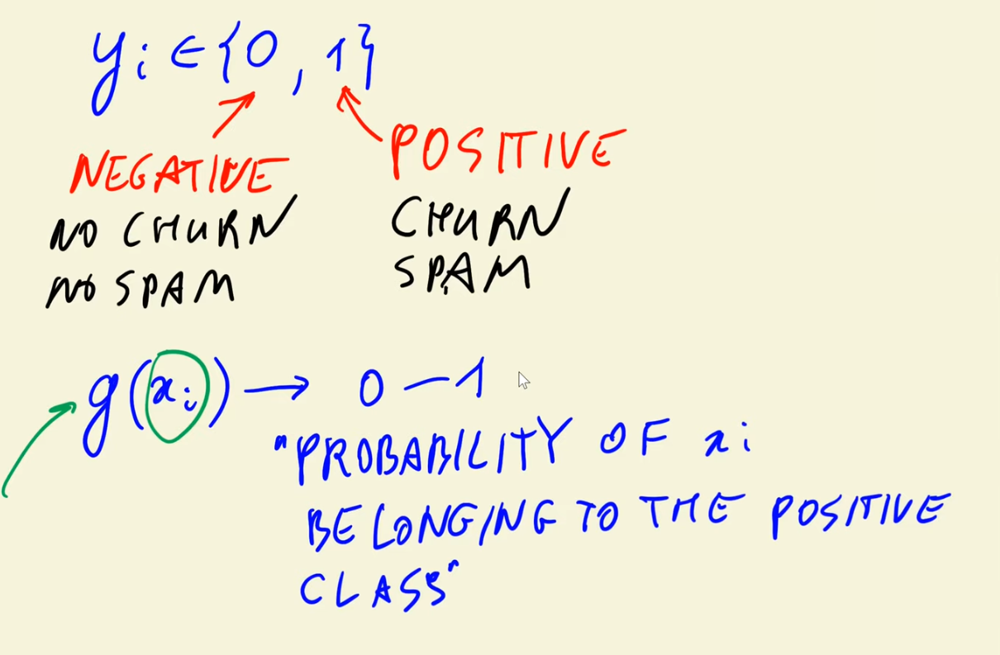
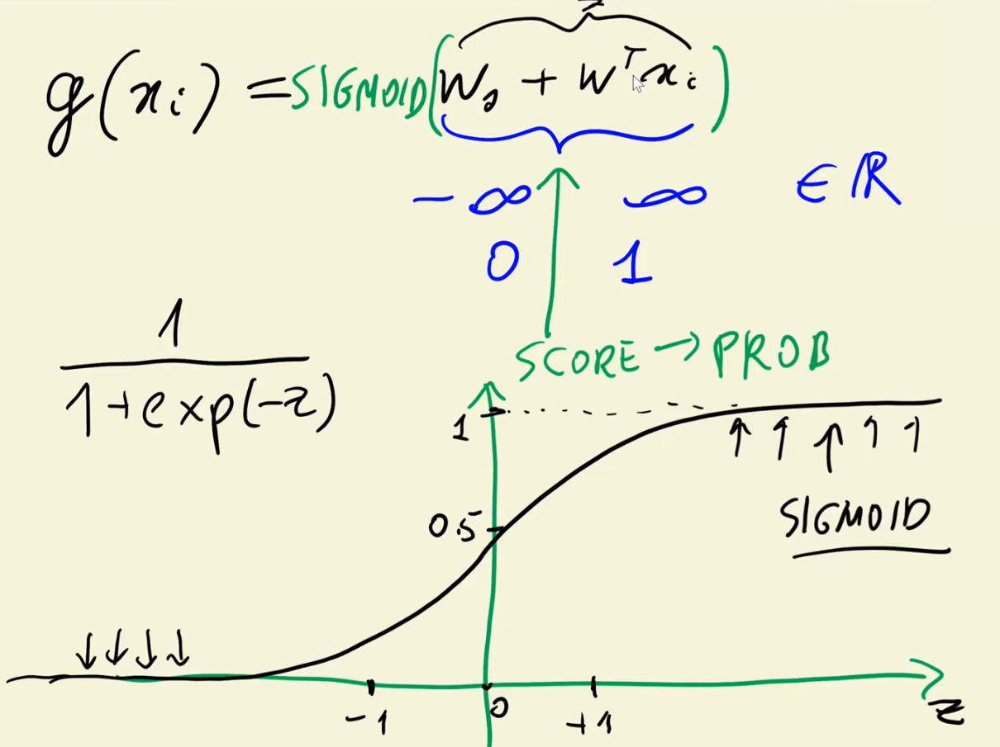


## 📊 Practical Meaning
- **Positive Output:** The model predicts a strong chance of belonging to the positive class.  
- **Negative Output:** The model predicts a strong chance of belonging to the negative class.  
- **Values near zero:** Uncertain predictions — close to the decision boundary.

---

# ML Zoomcamp 3.10 - Training Logistic Regression with Scikit-Learn

## 🎯 Objective
In this lesson, we learned how to **train, interpret, and evaluate** a logistic regression model using **Scikit-learn**.  
The goal was to predict customer churn using the **training and validation datasets** prepared earlier.

## ⚙️ Step 1: Model Setup
- **Scikit-learn module:** `sklearn.linear_model.LogisticRegression`
- Logistic regression is considered a **linear model**, similar to linear regression, but its **output** is converted to a **probability (0–1)** using the logistic function.
- The model includes:
  - **Weights (w):** represent feature importance.
  - **Bias/Intercept (b):** adjusts the decision boundary.

## 🧠 Step 2: Training the Model
1. Initialize the model using `LogisticRegression()`.  
2. Train (fit) it using:
   - **X_train:** feature matrix (encoded categorical + numerical variables).  
   - **y_train:** churn labels (0 = not churned, 1 = churned).  
3. After fitting, we can inspect:
   - `coef_` → model weights (feature coefficients).  
   - `intercept_` → bias term.

## 🔍 Step 3: Predictions
Scikit-learn provides two key methods:

### **1. `predict()` → Hard Predictions**
- Returns **0 or 1** directly.  
- These are “**hard predictions**” — the final classification result.  
  Example:  
  - 0 → Not churned  
  - 1 → Churned  

### **2. `predict_proba()` → Soft Predictions**
- Returns **probabilities** instead of discrete labels.  
- Each prediction gives two values:
  - Column 1 → Probability of class 0 (no churn)  
  - Column 2 → Probability of class 1 (churn)  
- These are called “**soft predictions**” because they represent uncertainty.

🧩 Example:
| Customer | P(No Churn) | P(Churn) | Predicted Class |
|-----------|-------------|-----------|----------------|
| 1 | 0.54 | 0.46 | 0 |
| 2 | 0.32 | 0.68 | 1 |
| 3 | 0.50 | 0.50 | 1 (threshold 0.5) |

By default, the **threshold = 0.5**.  
If `P(Churn) > 0.5`, the model predicts **churn**.

## 📨 Step 4: Using Predictions in Business
Once probabilities are available:
- We can **select customers** with high churn probability (e.g., >0.5).  
- These customers could receive **promotional emails or discounts** to prevent churn.  
- Example:
  ```text
  “Select all customer IDs where predicted churn probability > 0.5”

## 📈 Step 5: Evaluating Model Performance
In regression, we used **RMSE (Root Mean Square Error)**.  
For classification, we use **Accuracy**:

\[
\text{Accuracy} = \frac{\text{Number of correct predictions}}{\text{Total predictions}}
\]

- The model achieved roughly **80% accuracy** — meaning it correctly predicts churn or no churn in 8 out of 10 cases.
- 20% of predictions are incorrect (false positives or false negatives).

🧩 Example (simplified):

| Customer | Actual | Predicted | Correct? |
|-----------|---------|-----------|-----------|
| 1 | 1 | 1 | ✅ |
| 2 | 0 | 0 | ✅ |
| 3 | 1 | 0 | ❌ |
| 4 | 0 | 1 | ❌ |

Correct predictions → 80% of total.

## 🧮 Step 6: Boolean Logic Behind Accuracy
- The comparison `prediction == actual` returns a Boolean array (`True`/`False`).  
- Taking the **mean** of this array converts it to a ratio (fraction of correct predictions).  
- Example:
  - `[True, True, False, True] → [1, 1, 0, 1] → mean = 0.75`

Thus, **accuracy = 0.80** means 80% of predictions match actual outcomes.

## 🧩 Step 7: Understanding Model Parameters
- `coef_`: shows how each feature influences the **log-odds of churn**.
- `intercept_`: adjusts the **global decision threshold**.
- Interpreting these parameters helps identify which factors increase or decrease churn probability.

## ✅ Key Takeaways
1. **Logistic Regression** is used for **classification** problems.  
2. **Accuracy** is the primary performance metric for binary classification.  
3. **Hard predictions** → final decisions (0 or 1).  
4. **Soft predictions** → probabilities (measure of confidence).  
5. Model accuracy ≈ **80%**, meaning it performs reasonably well on unseen data.  
6. Next step: **interpreting model coefficients** to understand feature impact on churn prediction.

---

# ML Zoomcamp 3.11 - Model Interpretation

This video was about the interpretation of coefficients, and training a model with fewer features.

In the formula of the logistic regression model, only one of the one-hot encoded categories is multiplied by 1, and the other by 0. In this way, we only consider the appropriate category for each categorical feature.

Classes, functions, and methods:

- zip(x,y) - returns a new list with elements from x joined with their corresponding elements on y

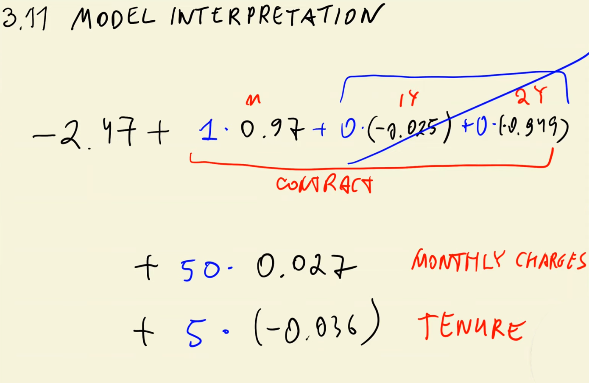

---

# ML Zoomcamp 3.12 - Using the Model

## 🎯 Objective
This final lesson of Session 3 demonstrates how to:
- Train the **final logistic regression model** using **all available features** (categorical + numerical).  
- Evaluate its accuracy on the **test dataset**.  
- Use the model for **real-life churn prediction** and decision-making (e.g., sending promotional emails).

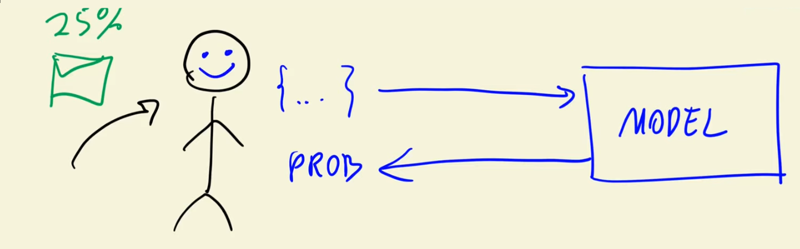

## ⚙️ Step 1: Preparing Data for the Final Model
- Combine **categorical** and **numerical** variables from the full training dataset.  
- Convert the data into dictionaries using the `to_dict(orient='records')` method.  
- Use **DictVectorizer** to transform these dictionaries into a numerical feature matrix.  
- Train the **logistic regression model** on the entire training dataset (`X_full_train`, `y_full_train`).

This ensures the model learns from **all available data**, not just the validation subset.

## 🧠 Step 2: Evaluating on Test Data
- Apply the same **DictVectorizer** to transform the **test dataset**.  
- Use the model’s `predict_proba()` function to compute **probabilities of churn**.  
- Convert probabilities greater than **0.5** into **churn predictions (1 = churn, 0 = stay)**.  
- Compare predictions with the actual test labels (`y_test`) to measure **accuracy**.

🧩 **Result:**  
The model achieved approximately **81% accuracy**, slightly higher than validation accuracy (80%).  
This small improvement is normal due to training on more data.

## ⚖️ Step 3: Interpreting Accuracy Results
- A small difference between validation and test accuracy (≈1%) indicates a **well-generalized model**.  
- If test accuracy had dropped significantly, that would indicate **overfitting**.  
- In this case, the model performs **consistently** and can be used for deployment.

## 💡 Step 4: Using the Model in Practice
The trained model can now be used to make predictions for **individual customers**.

### Example:
A customer’s profile (as a dictionary):
- Male, senior citizen, has partner and dependents  
- Uses streaming and TV services  
- Has a **monthly contract**  
- Tenure = 32 months, **Total charges** relatively high  

The model computes:
- **Churn probability:** 0.40 (40%)  
→ Prediction: **Not likely to churn**, no email sent.

Another customer:
- Female, not senior, lives with partner  
- Has a **monthly contract**, tenure = 17 months  
- Model computes **churn probability = 0.60 (60%)**  
→ Prediction: **Likely to churn**, send promotional email or discount offer.

## 📨 Step 5: Model Usage Scenario
- Imagine this model deployed as a **web service (API)**:
  1. A client sends customer data as JSON/dictionary.  
  2. The API transforms it using **DictVectorizer**.  
  3. The logistic regression model returns **churn probability**.  
  4. Based on the probability:
     - If `> 0.5` → Send retention email or discount.  
     - If `< 0.5` → No action needed.

This demonstrates how machine learning integrates into **business workflows** like customer retention.

## ✅ Key Takeaways
1. **Final Model:** Trained on the full dataset using all features.  
2. **Accuracy:** Achieved ~81%, consistent with validation results.  
3. **Deployment:** Can predict churn probabilities for any new customer.  
4. **Practical Use:** Enables targeted marketing — send offers only to high-risk customers.  
5. **Conclusion:** The model is robust, interpretable, and ready for production use.
