## ML Zoomcamp 4.2 - Accuracy and Dummy Model

**Accurcy** measures the fraction of correct predictions. Specifically, it is the number of correct predictions divided by the total number of predictions. 

We can change the **decision threshold**, it should not be always 0.5. But, in this particular problem, the best decision cutoff, associated with the hightest accuracy (80%), was indeed 0.5. 

Note that if we build a **dummy model** in which the decision cutoff is 1, so the algorithm predicts that no clients will churn, the accuracy would be 73%. Thus, we can see that the improvement of the original model with respect to the dummy model is not as high as we would expect. 

Therefore, in this problem accuracy can not tell us how good is the model because the dataset is **unbalanced**, which means that there are more instances from one category than the other. This is also known as **class imbalance**. 

**Classes and methods:** 

* `np.linspace(x,y,z)` - returns a numpy array starting at x until y with a z step 
* `Counter(x)` - collection class that counts the number of instances that satisfy the x condition
* `accuracy_score(x, y)` - sklearn.metrics class for calculating the accuracy of a model, given a predicted x dataset and a target y dataset. 

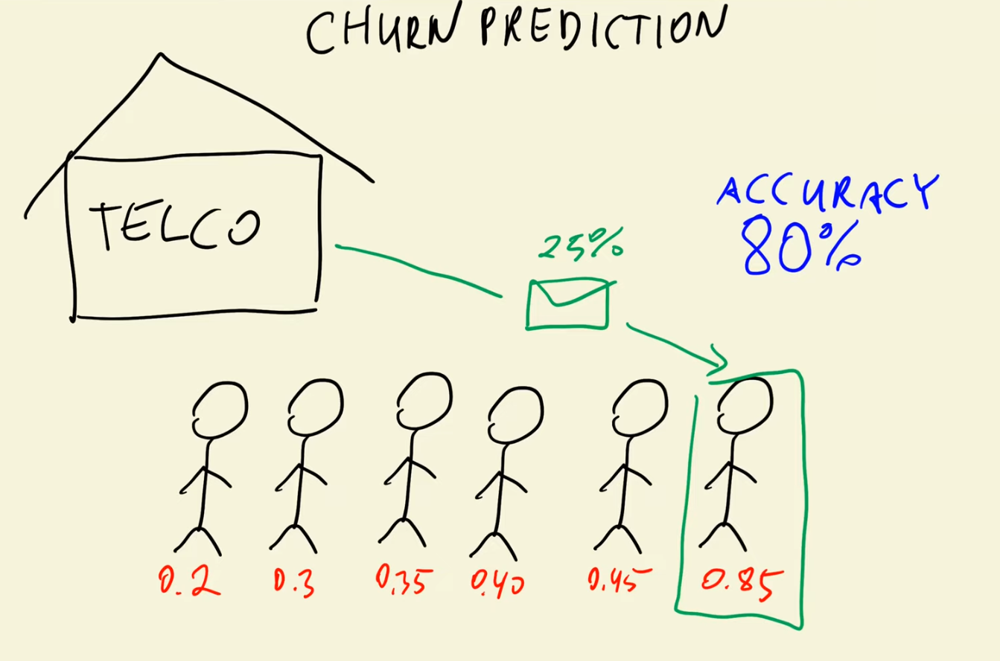
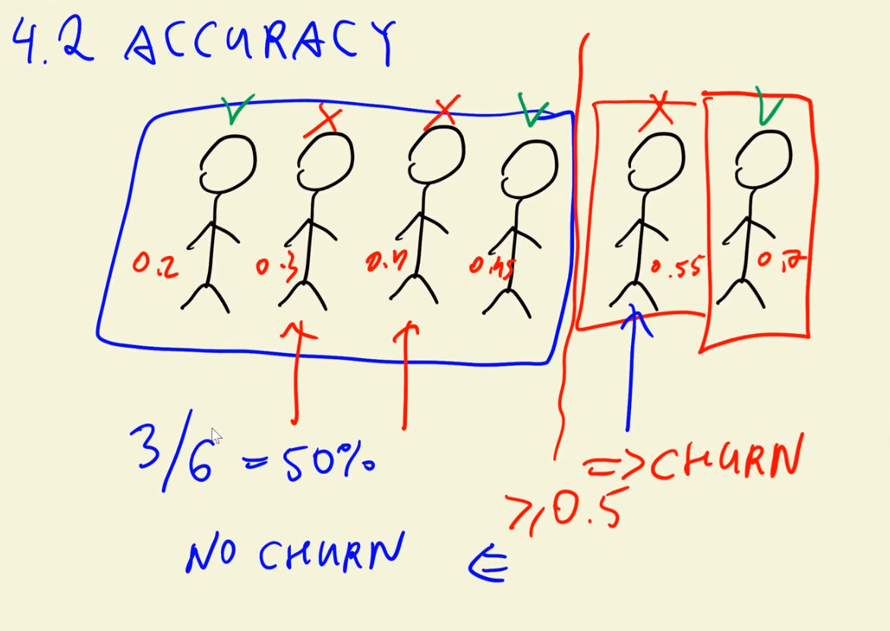
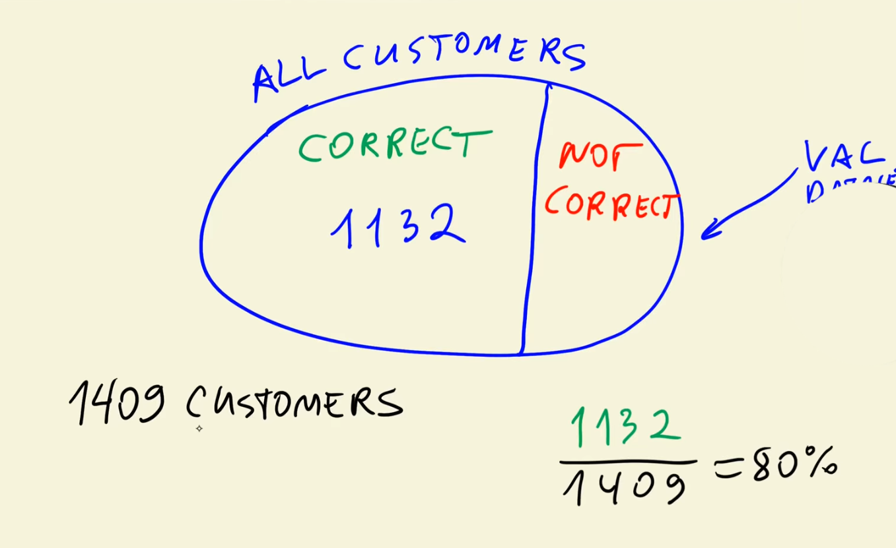
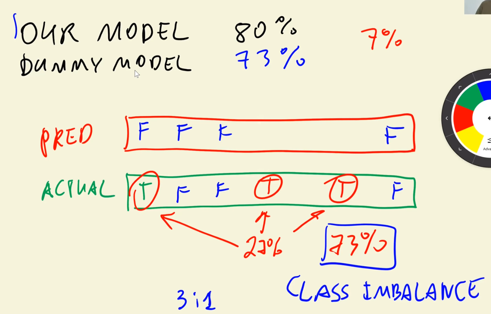

# ML Zoomcamp 4.3 - Confusion Table

## 🎯 Objective
This lesson introduces the **confusion table (confusion matrix)** — a detailed way of analyzing model performance in binary classification problems.  
It helps identify **correct** and **incorrect predictions**, especially when **class imbalance** makes accuracy alone misleading.

## ⚙️ Background
- In the previous lesson, we used **accuracy** to evaluate the model.  
- However, accuracy can be **misleading** if the dataset is **imbalanced** (e.g., far more non-churning customers than churning ones).  
- A model predicting “no churn” for everyone could still reach high accuracy without being useful.  
- The **confusion table** provides a clearer breakdown of performance.

## 🧩 The Four Possible Outcomes
For each customer, the model predicts **Churn** or **No Churn** based on a threshold (e.g., 0.5).  
There are **four possible results**:

| Actual / Predicted | **Churn (1)** | **No Churn (0)** |
|--------------------|----------------|------------------|
| **Churn (1)** | ✅ **True Positive (TP)** – Predicted churn correctly | ❌ **False Negative (FN)** – Missed a churn |
| **No Churn (0)** | ❌ **False Positive (FP)** – Predicted churn incorrectly | ✅ **True Negative (TN)** – Correctly predicted no churn |

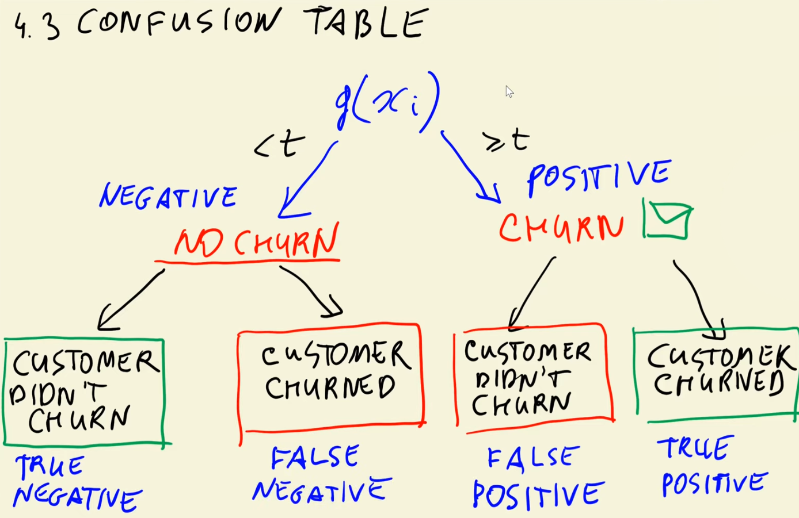

**Definitions:**
- **True Positive (TP):** Customer churned, and model predicted churn.  
- **True Negative (TN):** Customer stayed, and model predicted no churn.  
- **False Positive (FP):** Customer stayed, but model predicted churn (unnecessary promotion).  
- **False Negative (FN):** Customer churned, but model predicted they would stay (lost opportunity).

## 🧮 Step-by-Step Understanding
1. **Split all customers** into actual churners (Y=1) and non-churners (Y=0).  
2. **Split predictions** into predicted churn and predicted non-churn (based on threshold).  
3. **Combine the two splits** to classify each case as TP, TN, FP, or FN.  
4. **Count** the number of cases in each category.

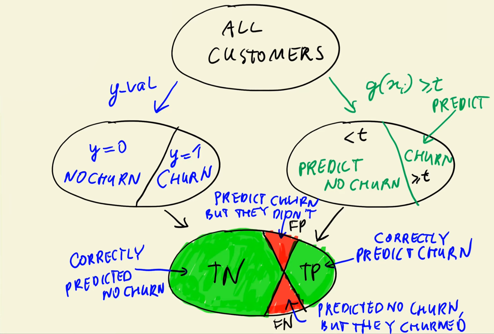
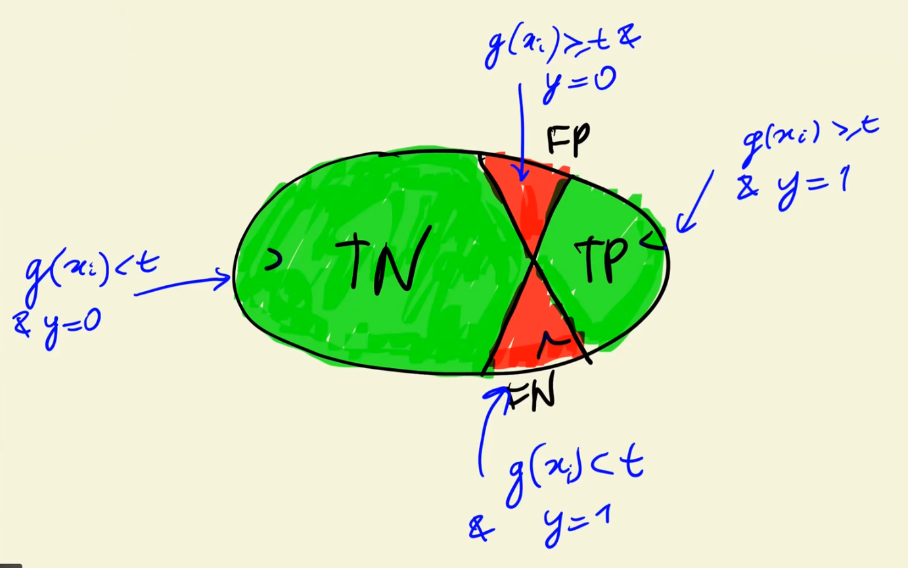

Example (based on the dataset):
- True Positives (TP): 210  
- True Negatives (TN): 922  
- False Positives (FP): 101  
- False Negatives (FN): 176  

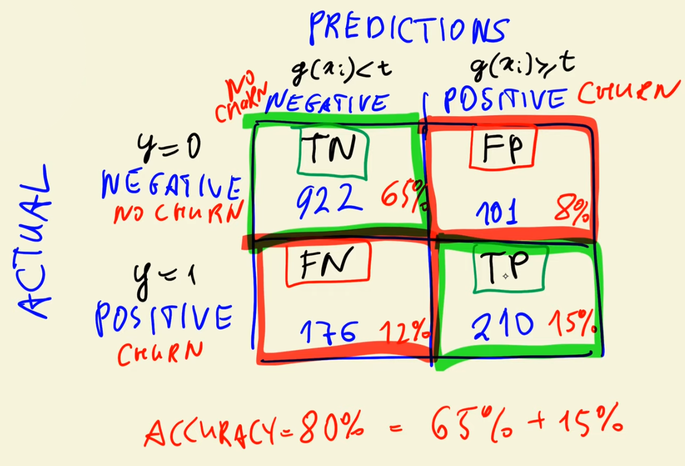

## 📊 The Confusion Matrix Structure
|                      | **Actual Churn (1)** | **Actual No Churn (0)** |
|----------------------|----------------------|--------------------------|
| **Predicted Churn (1)** | TP = 210 | FP = 101 |
| **Predicted No Churn (0)** | FN = 176 | TN = 922 |

- **Correct Predictions:** TP + TN = 210 + 922 = 1,132  
- **Incorrect Predictions:** FP + FN = 101 + 176 = 277  

✅ Correct predictions ≈ **80% accuracy**  
❌ Incorrect predictions ≈ **20% errors**

## 📉 Business Impact of Errors
- **False Positives (FP):**  
  - The company sends a promotional email to customers who weren’t planning to churn.  
  - Result: **Unnecessary discounts → profit loss.**

- **False Negatives (FN):**  
  - The company fails to identify actual churners.  
  - Result: **Lost customers → lost revenue.**

In this dataset, **false negatives are more frequent**, meaning the model misses more actual churners — a more costly type of mistake.

## 📈 Normalized (Percentage) Confusion Matrix
By converting counts to percentages:
- **True Negatives:** ~65%  
- **True Positives:** ~15%  
- **False Negatives:** ~12%  
- **False Positives:** ~8%  

✅ **Correct Predictions (TP + TN):** 80%  
❌ **Incorrect Predictions (FP + FN):** 20%

## 💡 Why the Confusion Table Matters
- Accuracy gives **one number**, but the confusion table shows **how the model succeeds and fails**.  
- It distinguishes between **types of errors**, which helps improve model decisions.  
- From this table, we can calculate **advanced metrics**:
  - **Precision**
  - **Recall**
  - **F1-score**
  - **ROC and AUC scores**

## ✅ Key Takeaways
1. The **confusion table** offers a deeper view into model performance.  
2. It identifies **which types of mistakes** (FP vs FN) are more common.  
3. **False negatives** are often more dangerous in churn prediction (missed customers).  
4. **Accuracy = (TP + TN) / Total**, but it’s not enough on its own.  
5. Upcoming lessons will explore **Precision** and **Recall**, two metrics derived directly from this table.

---

# ML Zoomcamp 4.4 - Precision and Recall

## 🧭 Review of the Previous Lesson
In the last lesson, we discussed the **Confusion Matrix**, which categorizes model predictions into:
- **True Positives (TP)**  
- **True Negatives (TN)**  
- **False Positives (FP)**  
- **False Negatives (FN)**  

These components are the foundation for other **evaluation metrics**, such as **accuracy**, **precision**, and **recall**.

## ⚙️ Accuracy Recap
Accuracy measures how often the model is correct:
\[
\text{Accuracy} = \frac{TP + TN}{TP + TN + FP + FN}
\]
However, **accuracy can be misleading** in imbalanced datasets (e.g., churn prediction), since a model can appear accurate even if it fails to detect the minority class.

## 🎯 Precision — “How Many of Our Positive Predictions Are Correct?”
**Definition:**  
Precision measures the **fraction of predicted positives that are actually correct**.

\[
\text{Precision} = \frac{TP}{TP + FP}
\]

**Example:**  
- The model predicts that 4 customers will churn.  
- 3 of them actually churn (TP), and 1 does not (FP).  
- Precision = 3 / 4 = **75%**

This means that 75% of the promotional emails sent to predicted churners were correct — the rest (25%) were unnecessary offers sent to non-churners.

**Interpretation:**
- **High precision:** Few false positives → fewer wasted promotions.  
- **Low precision:** Many false positives → wasted resources on non-churning customers.

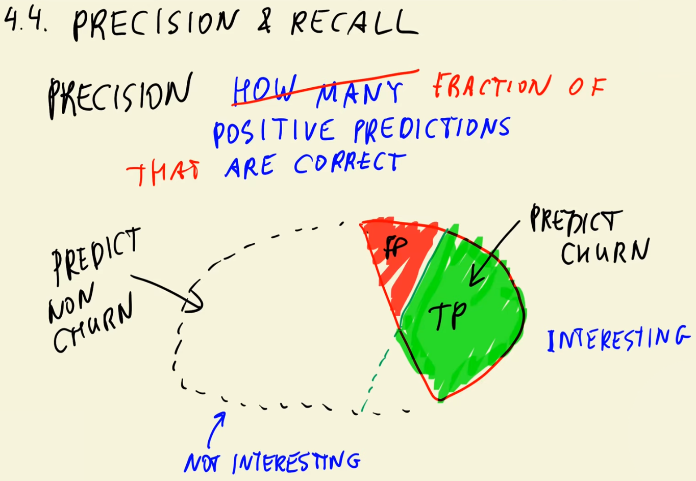
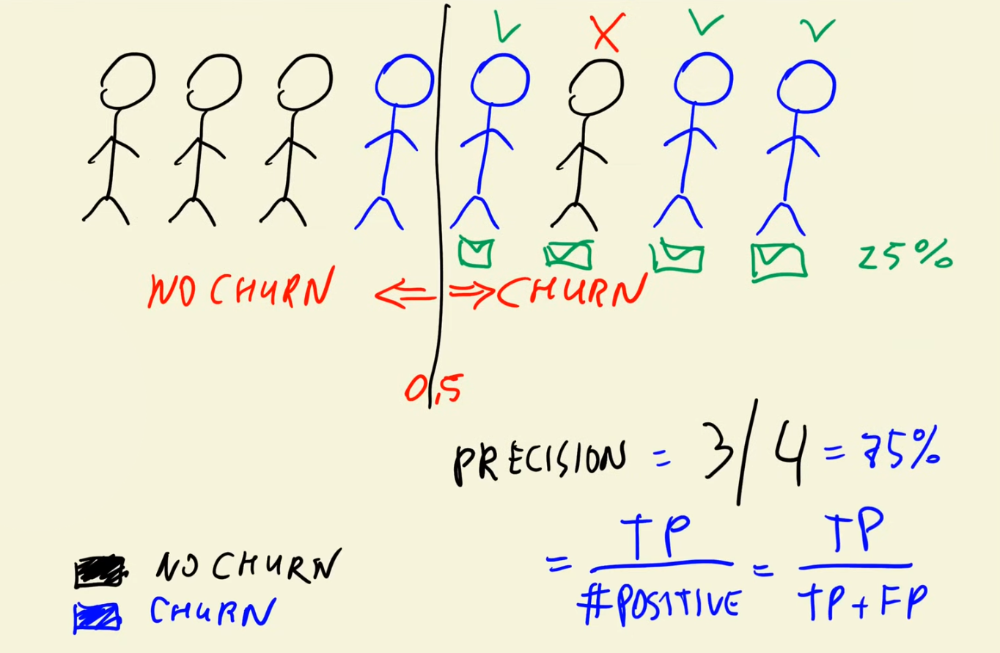
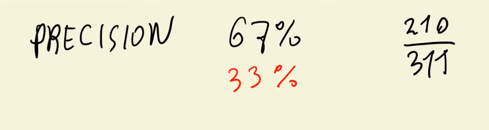

## 🔍 Recall — “How Many Actual Positives Did We Find?”
**Definition:**  
Recall measures the **fraction of actual positives that the model successfully identified**.

\[
\text{Recall} = \frac{TP}{TP + FN}
\]

**Example:**  
- 4 customers actually churned.  
- The model correctly identified 3 (TP) but missed 1 (FN).  
- Recall = 3 / 4 = **75%**

This means the model captured 75% of all actual churners but missed 25%.

**Interpretation:**
- **High recall:** Few false negatives → most churners identified.  
- **Low recall:** Many false negatives → many churners missed.

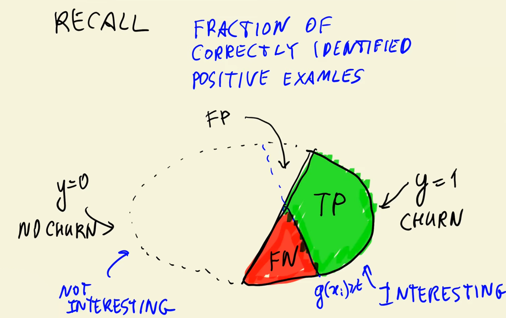
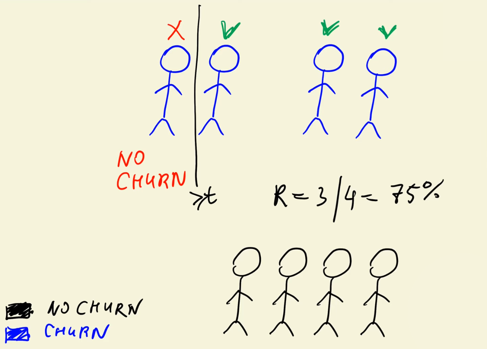
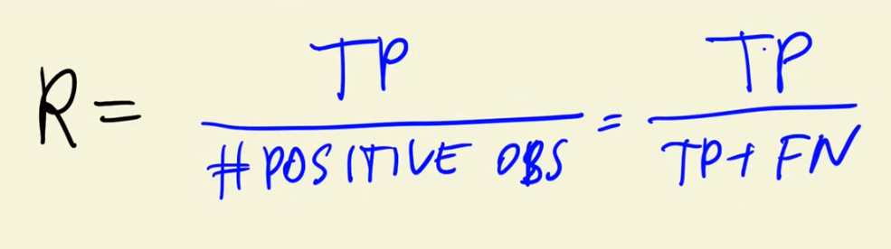
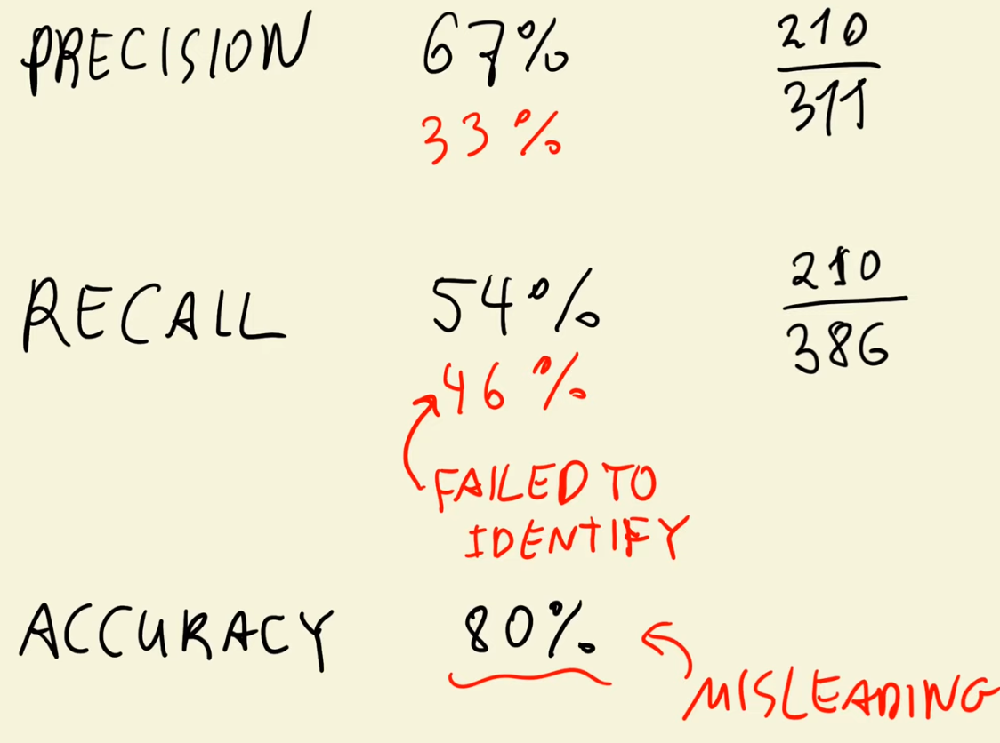

## ⚖️ Precision vs Recall
| Metric | Focus | Formula | Common Problem When Low |
|---------|--------|----------|--------------------------|
| **Precision** | How many predicted churners were correct | TP / (TP + FP) | Too many non-churners get emails |
| **Recall** | How many actual churners were detected | TP / (TP + FN) | Too many churners go undetected |

Both metrics trade off:
- Increasing recall often lowers precision (catching more churners but also more false alarms).  
- Increasing precision can lower recall (fewer false alarms but missing real churners).

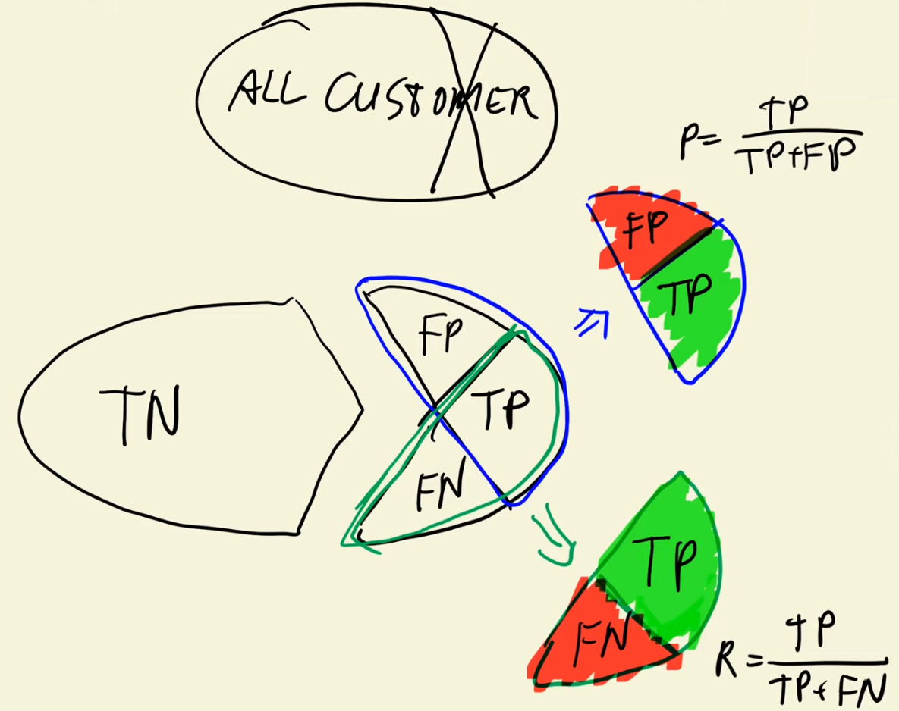
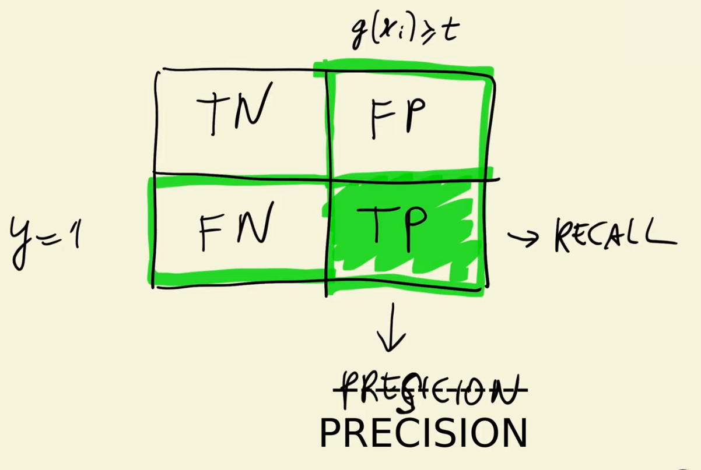

## 📉 Example from the Lesson
Model results:
- **Precision:** 64% → 36% of promotional emails are wasted on non-churners.  
- **Recall:** 54% → 46% of real churners are missed.  
- **Accuracy:** 80% → misleadingly high due to class imbalance.

Thus, even with high accuracy, the model performs poorly for the business goal of retaining customers.

## 🧠 Recap Visualization
From the **confusion matrix**:

|                | **Actual Positive (Churn)** | **Actual Negative (No Churn)** |
|----------------|-----------------------------|--------------------------------|
| **Predicted Positive (Churn)** | TP | FP |
| **Predicted Negative (No Churn)** | FN | TN |

- **Precision:** looks at the **Predicted Positive** row → TP / (TP + FP).  
- **Recall:** looks at the **Actual Positive** column → TP / (TP + FN).  

## ✅ Key Takeaways
1. **Accuracy alone is not enough**, especially for imbalanced datasets.  
2. **Precision** measures the correctness of positive predictions.  
3. **Recall** measures how well the model finds all positive cases.  
4. **Precision-Recall trade-off** depends on business goals (e.g., minimizing lost customers vs wasted promotions).  
5. These metrics are derived directly from the **confusion matrix**.

---

# ML Zoomcamp 4.5 - ROC Curves

## 📘 Introduction
In this lesson, we learn about **ROC curves** — a way to visualize the performance of binary classification models.

- **ROC** stands for **Receiver Operating Characteristic**.  
- Originally used during WWII to evaluate **radar detection accuracy** (detecting planes vs. false signals).  
- In machine learning, it helps assess how well a model distinguishes between **positive (1)** and **negative (0)** classes (e.g., churn vs. non-churn).

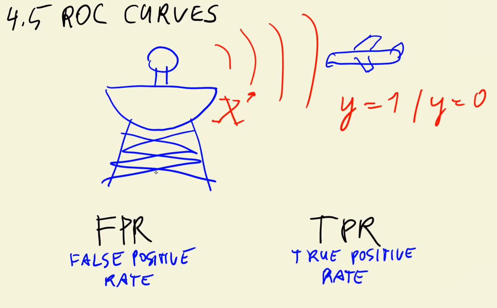

## 🧩 The Confusion Matrix Recap
| **Actual / Predicted** | **Positive (Churn)** | **Negative (No Churn)** |
|-------------------------|----------------------|--------------------------|
| **Positive (Churn)** | ✅ True Positive (TP) | ❌ False Negative (FN) |
| **Negative (No Churn)** | ❌ False Positive (FP) | ✅ True Negative (TN) |

All key metrics for ROC curves are derived from these four values.

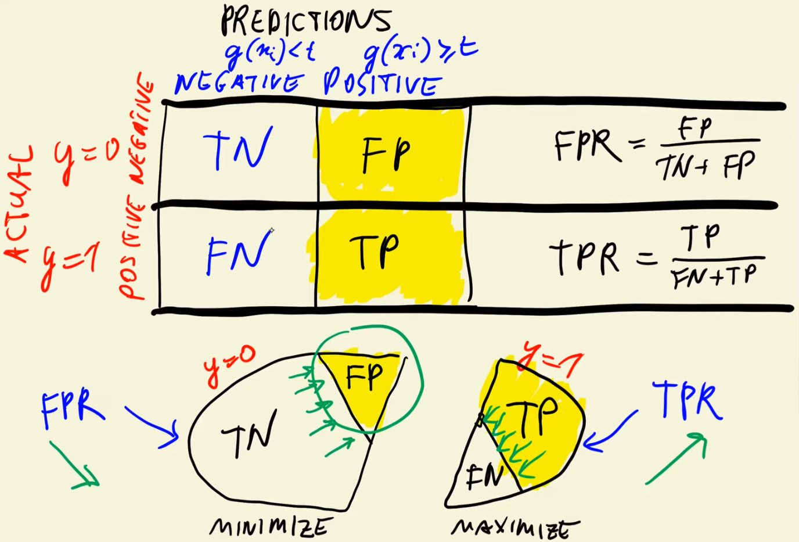

## 📊 The Two Core Metrics

### 1. **True Positive Rate (TPR)**  
Also called **Recall** or **Sensitivity**.

\[
\text{TPR} = \frac{TP}{TP + FN}
\]

→ The fraction of **actual positives** (churners) that the model correctly identifies.

### 2. **False Positive Rate (FPR)**  
\[
\text{FPR} = \frac{FP}{FP + TN}
\]

→ The fraction of **actual negatives** (non-churners) that are **incorrectly predicted** as positives.

**Goal:**
- Maximize **TPR** (catch more churners).  
- Minimize **FPR** (avoid false alarms).

## 📈 Interpreting TPR and FPR
- **TPR (Recall):** Measures the ability to detect positive cases.  
- **FPR:** Measures how often the model raises a false alarm.  
- Good models have **high TPR** and **low FPR**.  
- Bad models have **low TPR** or **high FPR**.

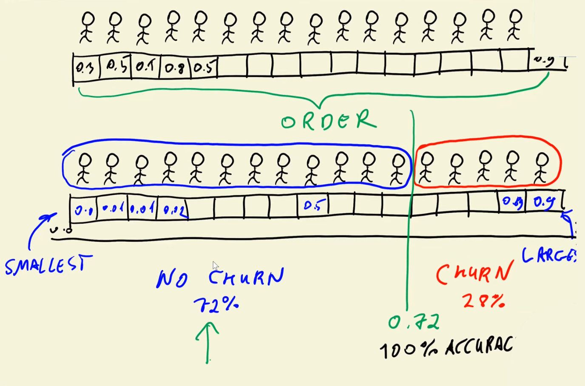

## ⚙️ Evaluating Across Thresholds
ROC curves are built by **evaluating the model at multiple thresholds**:
- Instead of using just 0.5 (the default cutoff), test all thresholds between 0 and 1.  
- For each threshold:
  - Compute the confusion matrix.
  - Calculate **TPR** and **FPR**.
- Plot **TPR vs. FPR** for each threshold to form the ROC curve.

## 🪙 Three Benchmark Models

### 1. **Random Model**
- Predicts churn randomly (like flipping a coin).  
- Both TPR and FPR increase together → a **diagonal line** from (0,0) to (1,1).  
- Accuracy ≈ 50%.  
- Represents the **baseline** of random guessing.

### 2. **Ideal Model**
- Perfectly separates positives and negatives.  
- All non-churners have low scores; all churners have high scores.  
- The ROC curve **jumps to (0,1)** — meaning **FPR = 0, TPR = 1** (no mistakes).  
- This is the “north star” benchmark for any model.

### 3. **Actual Model**
- Lies **between the random and ideal curves**.  
- The closer it is to the top-left corner (0,1), the better the model.

## 📉 Plot Interpretation

| **Region** | **Meaning** |
|-------------|-------------|
| **(0,0)** | No positive predictions (threshold = 1). |
| **(1,1)** | All predicted positive (threshold = 0). |
| **Ideal Corner (0,1)** | Perfect model — 100% TPR, 0% FPR. |
| **Diagonal (Random)** | Random guessing — no predictive power. |

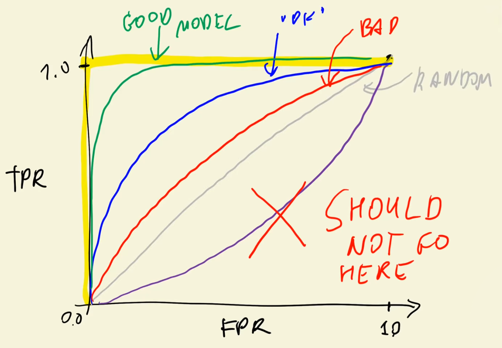

- The **curve** shows how TPR and FPR change as we lower the threshold.  
- As the threshold decreases:
  - **TPR increases** (we catch more positives),
  - but **FPR also increases** (we make more false alarms).

**Good models** rise steeply toward (0,1).  
**Weak models** stay near the diagonal.

## 🧠 Key Insights
- **ROC Curve = TPR (y-axis) vs. FPR (x-axis)**  
- Each point on the curve corresponds to a specific **decision threshold**.  
- The **closer the curve is to the top-left**, the better.  
- Models below the diagonal perform worse than random — their predictions should be inverted.

## 🔺 Comparing Models
You can plot multiple models on one ROC chart:
- Model A closer to top-left → **better performance**.  
- Model B closer to diagonal → **worse performance**.

ROC curves are especially helpful for **imbalanced datasets**, where accuracy is misleading.

## 🟩 AUC – Area Under the Curve
- **AUC (Area Under ROC Curve)** quantifies overall model quality.  
- Higher AUC = better model.  
- **AUC = 1.0** → Perfect classifier.  
- **AUC = 0.5** → Random guessing.  
- This metric will be discussed in the **next lesson**.

## ✅ Summary
| **Metric** | **Formula** | **Goal** |
|-------------|-------------|----------|
| **TPR (Recall)** | TP / (TP + FN) | Maximize |
| **FPR** | FP / (FP + TN) | Minimize |
| **ROC Curve** | Plot of TPR vs. FPR | Evaluate model at all thresholds |
| **AUC** | Area under ROC curve | Quantify performance |

---

# ML Zoomcamp 4.6 - ROC AUC

## 🧭 Introduction
In this lesson, we explore **AUC – Area Under the ROC Curve**, a powerful metric used to evaluate **binary classification models**.

Previously, we learned about **ROC curves**, which show how a model performs across thresholds (0 → 1) by plotting:
- **True Positive Rate (TPR)** vs **False Positive Rate (FPR)**

Now, AUC gives us a **single number** summarizing how close the ROC curve is to the **ideal classifier**.

## 🎯 The Ideal Point
- The **ideal point** on the ROC chart is where:
  - **TPR = 1 (100%)**
  - **FPR = 0 (0%)**

A perfect model would be located exactly at this top-left corner.  
AUC measures **how close our ROC curve** is to that ideal.

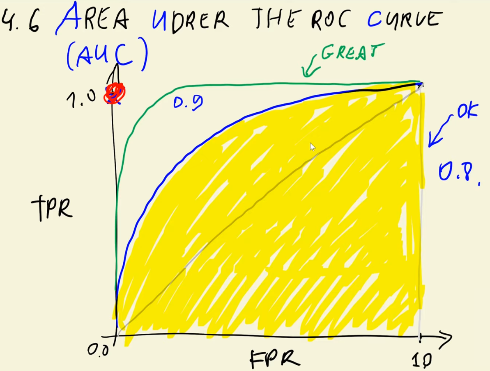
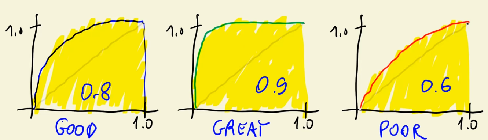

## 📈 Understanding the AUC Value
The **AUC value** represents the **area under the ROC curve**:
- **AUC = 1.0** → Perfect classifier (ideal performance)
- **AUC = 0.5** → Random guessing (no predictive power)
- **AUC < 0.5** → Worse than random (predictions should be inverted)

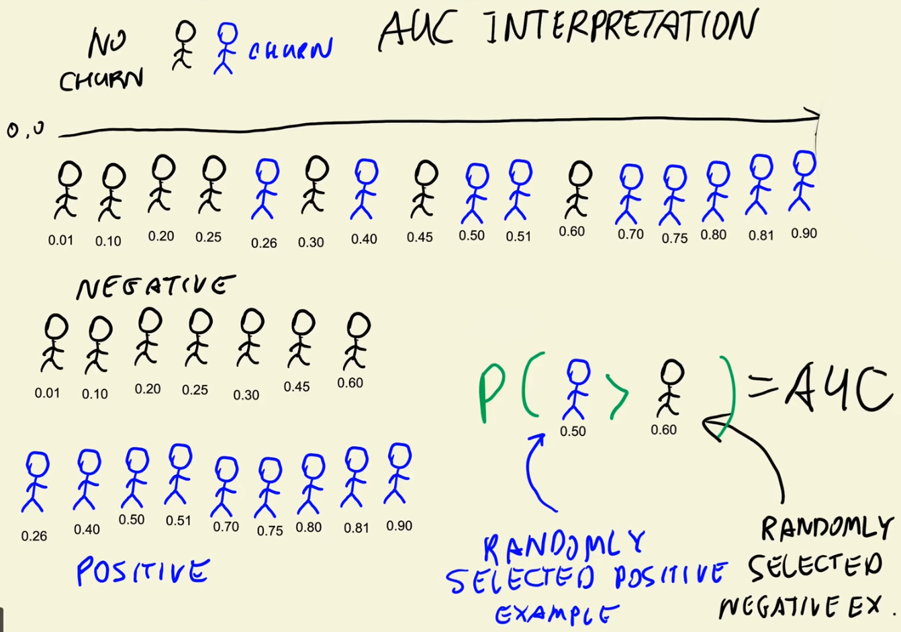
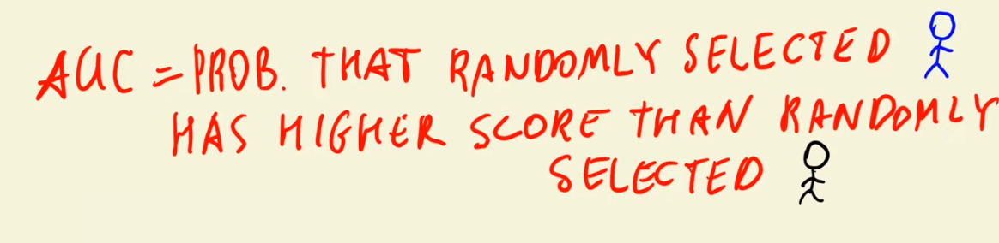

## 🧩 Comparing Model Performances
| Model Type | ROC Curve Shape | Typical AUC | Interpretation |
|-------------|----------------|--------------|----------------|
| **Random Model** | Diagonal line | 0.5 | Predicts randomly |
| **Poor Model** | Slightly above diagonal | 0.6 – 0.65 | Weak performance |
| **Okay Model** | Moderately curved upward | 0.75 – 0.8 | Decent, usable model |
| **Good Model** | Close to ideal point | 0.85 – 0.9 | Strong classifier |
| **Perfect Model** | Reaches (0,1) corner | 1.0 | Ideal performance |

The **larger the area**, the **better the model** at distinguishing between classes.

## ⚙️ How AUC Is Computed
AUC is computed using the **TPR** and **FPR** values obtained at various thresholds.  
In practice, libraries like **scikit-learn** provide built-in functions:
- `roc_curve()` → computes FPR and TPR values for all thresholds  
- `auc()` or `roc_auc_score()` → computes the final AUC value

These methods integrate the curve to calculate the area precisely.

## 🧠 Intuitive Interpretation
AUC can also be understood **probabilistically**:

> **AUC = Probability that a randomly chosen positive example has a higher predicted score than a randomly chosen negative example.**

For example:
- Take one **churning customer (positive)** and one **non-churning customer (negative)**.
- Compare their model scores.
- If the positive one has a higher score, count it as a success.
- Repeat this many times — the **fraction of successes** ≈ **AUC**.

Thus:
- **AUC = 0.84** means that in **84% of random comparisons**,  
  the model correctly ranks the positive example above the negative one.

## 💡 Why AUC Is Useful
- It is **threshold-independent**: measures model performance across all possible cutoffs.  
- It captures both **sensitivity (TPR)** and **specificity (1 − FPR)**.  
- It is robust even for **imbalanced datasets**.  
- It intuitively measures **ranking quality** — how well positives are ranked above negatives.

## 🧮 Conceptual Summary

| **Concept** | **Formula / Meaning** | **Goal** |
|--------------|-----------------------|-----------|
| **TPR (Recall)** | TP / (TP + FN) | Maximize |
| **FPR** | FP / (FP + TN) | Minimize |
| **AUC** | Area under ROC curve | Closer to 1 = better |
| **Interpretation** | Probability that positive > negative | Higher = better ranking |

## 🧭 Key Takeaways
- **AUC** summarizes the ROC curve into a single, interpretable number.  
- It tells how close a model is to the **ideal classifier** (perfect separation).  
- **AUC ≈ 1** → Excellent model.  
- **AUC ≈ 0.5** → Random model.  
- **AUC < 0.5** → Inverted or broken model.  
- It’s one of the **most reliable** metrics for comparing binary classifiers.

---

# ML Zoomcamp 4.7 - Cross-Validation

## 🧭 Introduction
This lesson introduces **cross-validation**, a powerful technique for evaluating model stability and optimizing hyperparameters.  
Previously, we used a single **validation set** and measured model quality with metrics like **AUC**.  
Now we’ll learn how to **use all data more efficiently** and assess how stable our model really is.

## ⚙️ Traditional Split vs Cross-Validation

### Standard Workflow
1. Split dataset into **train**, **validation**, and **test** sets.  
2. Use **validation** to tune parameters.  
3. Use **test** only once for final evaluation.

### Limitation
With a single validation split, model performance may vary depending on **how data was split**.

## 🔁 K-Fold Cross-Validation

**Idea:**  
Instead of using one validation split, divide the training data into **K folds** (subsets).  
Then:
1. Train the model on **K−1 folds**.  
2. Validate on the **remaining fold**.  
3. Repeat this **K times**, changing the validation fold each time.

Each iteration (fold) gives a performance score (e.g., **AUC**), producing:
- A set of results: `AUC₁, AUC₂, …, AUCₖ`
- Then compute:
  - **Mean AUC:** overall model performance  
  - **Standard deviation:** model stability across folds  

**Example (K=3):**
| Fold | Training Data | Validation Data | AUC |
|------|----------------|----------------|------|
| 1 | Parts 1–2 | 3 | 0.83 |
| 2 | Parts 1–3 | 2 | 0.84 |
| 3 | Parts 2–3 | 1 | 0.85 |

→ **Mean AUC ≈ 0.84**, **Std ≈ 0.01**

A small standard deviation means the model performs **consistently** across splits.

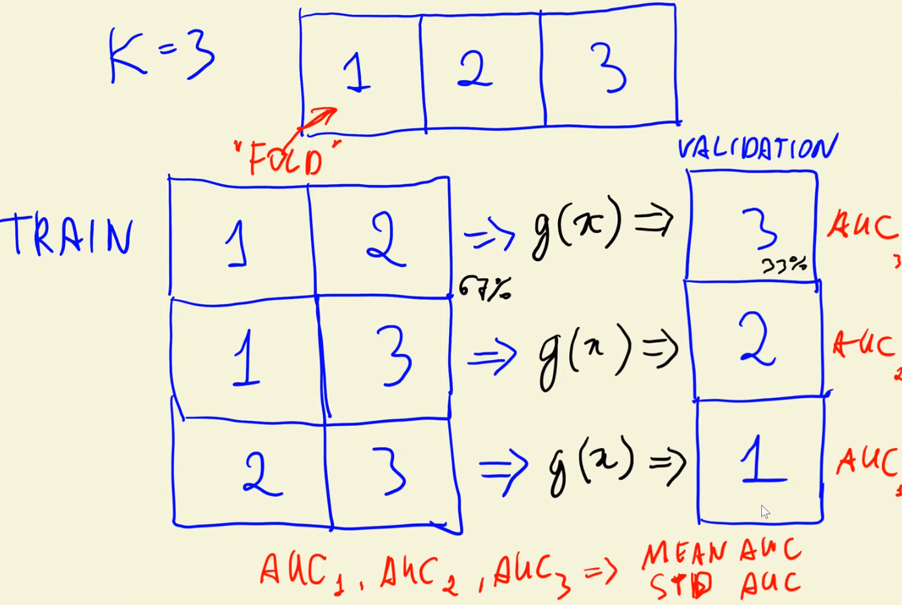
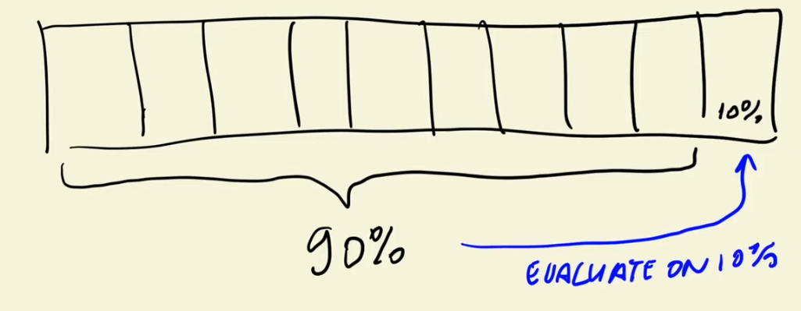

## 🧩 Practical Setup

- Cross-validation is implemented via **`KFold`** from `sklearn.model_selection`.
- Main parameters:
  - `n_splits`: number of folds (e.g., 5 or 10)
  - `shuffle=True`: to randomize data before splitting
  - `random_state`: ensures reproducibility

The dataset is divided into folds, and the model is **trained and validated repeatedly**.

## 📊 Why Use Cross-Validation?

| **Scenario** | **Recommended Approach** |
|---------------|---------------------------|
| Large dataset | Single hold-out validation is usually enough |
| Small dataset | Use cross-validation to make the most of limited data |
| Need for stability analysis | Cross-validation gives variance and consistency metrics |
| Parameter tuning | Cross-validation helps choose optimal hyperparameters |

## 🧮 Parameter Tuning

Cross-validation can be used to find the best **hyperparameter values** (e.g., regularization strength in Logistic Regression).

- Example: Logistic Regression’s **`C` parameter** controls regularization.  
  - Small `C` → Stronger regularization  
  - Large `C` → Weaker regularization

Typical tuning process:
1. Try multiple `C` values (e.g., `0.1`, `0.5`, `1`, `5`, `10`)
2. Perform cross-validation for each value.
3. Compare mean AUC across folds.
4. Choose the best performing `C`.

**Observation:**  
Performance differences between values are usually small — e.g., 0.83 vs. 0.84 — meaning either value may be acceptable.

## 🧠 Model Training Recap

After finding the optimal parameters:
1. **Train the final model** on the **entire training dataset** (not just one fold).  
2. **Evaluate on the test dataset** to estimate real-world performance.  
3. Expect minor differences (1–2%) between validation and test results — this is normal.

## 📈 Understanding Variability
- **Mean performance** → overall model accuracy or AUC.  
- **Standard deviation** → reliability of the model.  
- High variance means results depend heavily on data splits → model may be unstable.

## ⚖️ When to Use Each Approach

| **Dataset Size** | **Suggested Method** |
|------------------|----------------------|
| Large (tens of thousands of rows) | Simple train/validation/test split |
| Small or imbalanced | K-Fold cross-validation (e.g., K=5 or 10) |
| Need reproducibility | Shuffle data and fix random seed |
| Need stability insights | Use mean and standard deviation across folds |

## ✅ Key Takeaways
- **Cross-validation** provides a more robust estimate of model quality.  
- It reduces sensitivity to random train/validation splits.  
- **K-Fold CV** divides data into K parts, training K times.  
- **Mean score** → expected model performance.  
- **Standard deviation** → model stability.  
- Use CV especially for **smaller datasets** or **hyperparameter tuning**.