# ML Zoomcamp 6.1 - Credit Risk Scoring Project

## 🧭 Overview
In this new session, we begin exploring **Decision Trees** and **Ensemble Learning** techniques.  
The central project for this week is building a **Credit Risk Scoring Model** — a predictive system that helps banks decide whether to grant or reject loan applications.

## 🏦 Credit Risk Scoring: The Problem
Imagine a customer applying for a **loan** to buy a new **mobile phone**.  
They fill out an application form providing key details such as:
- Income level  
- Loan amount requested  
- Employment history and experience  
- Whether they own or rent a home  
- Existing debts and total savings  
- Age and marital status  

The **bank** then evaluates this application to decide:
- ✅ **Approve the loan**, or  
- ❌ **Reject the loan**  

This decision depends on the **risk** that the customer might not repay — a situation known as **default**.

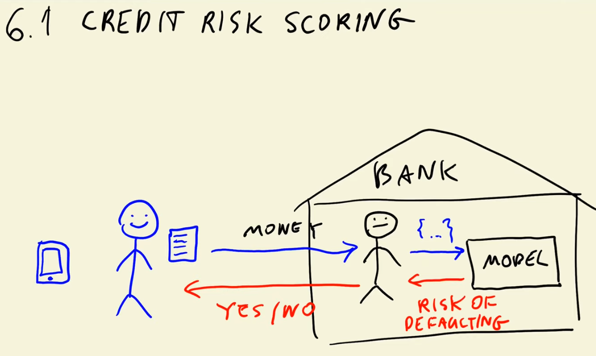
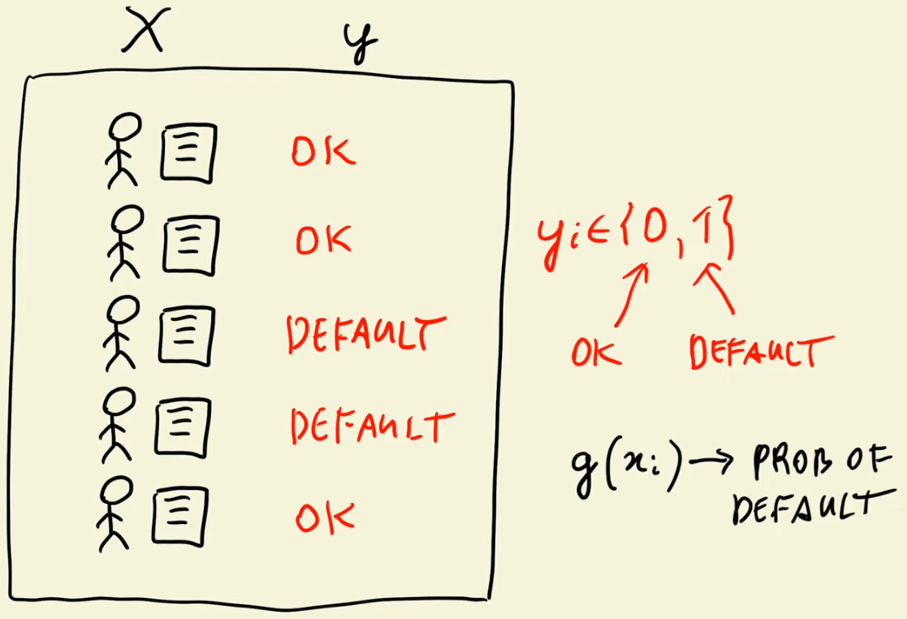

## 🎯 Project Goal
We aim to build a **machine learning model** that predicts the **probability of default** for new loan applicants.  
The model outputs a risk score that the bank can use to guide its lending decisions.

Formally:
- The target variable `y` is **binary**:
  - `0` → customer repaid the loan (no default)  
  - `1` → customer defaulted  
- The feature matrix `X` includes:
  - Financial information (income, savings, debt)
  - Personal details (age, marital status, job type)
  - Loan details (amount, duration, price of item)

This setup makes it a **binary classification problem**, where the goal is to estimate the **probability of default** for each new customer.

## 🧾 Dataset: Credit Scoring
We’ll use the **Credit Scoring Dataset** (`credit_scoring.csv`) for this project.

### Key Columns:
| Feature | Description |
|----------|--------------|
| `status` | Loan outcome – defaulted or not |
| `seniority` | Years of experience |
| `home` | Whether the applicant owns or rents a house |
| `time` | Duration of the loan (in months) |
| `age` | Age of the applicant |
| `marital` | Marital status |
| `records` | Prior credit history |
| `job` | Type of job held |
| `expenses` | Monthly expenses |
| `income` | Monthly income |
| `assets` | Total assets owned |
| `debt` | Current total debt |
| `amount` | Amount of credit requested |
| `price` | Price of the item being financed |

This dataset allows us to analyze customer profiles, identify risky patterns, and train models that predict default likelihood.

## 🌳 Topics Covered This Week

### **Lesson 2 – Data Preparation**
- Load and explore the dataset  
- Handle missing values and outliers  
- Prepare features and target variables  

### **Lesson 3 – Decision Trees**
- Understand **how decision trees work**
- Learn how they **split data into rules** (e.g., *if income < 2000 → higher risk*)  
- Use existing implementations and visualize decision paths  

### **Lesson 4 – Hyperparameter Tuning**
- Adjust tree depth, minimum samples, and splitting criteria  
- Prevent overfitting and improve generalization  

### **Lesson 5 – Random Forests**
- Combine multiple decision trees into a **forest**  
- Average their predictions to reduce variance  

### **Lesson 6 & 7 – Gradient Boosting**
- Introduce **boosted trees**, which learn sequentially to correct previous mistakes  
- Use the **XGBoost** library for powerful, efficient implementations  

### **Lesson 8 – Model Selection**
- Compare Decision Trees, Random Forests, and Gradient Boosting  
- Select the **best-performing model** for credit risk prediction  

## ✅ Summary
This session introduces the concept of **credit risk modeling** and sets the stage for applying **decision tree–based algorithms** to real financial data.  
You’ll learn to:
- Frame a binary classification problem (default vs. no default)  
- Prepare and analyze structured tabular data  
- Train, tune, and compare multiple tree-based ML models  

---

# ML Zoomcamp 6.2 - Data Cleaning and Preparation

## 🧭 Overview
In this lesson, we explore and clean the **Credit Risk Scoring Dataset** to prepare it for training **Decision Tree models** in the upcoming lessons.  
The main steps include:
- Downloading and inspecting the dataset  
- Handling categorical and numerical variables  
- Dealing with missing values  
- Splitting the dataset into training, validation, and test sets  

## 📂 Understanding the Dataset
The dataset contains financial and personal information about clients applying for loans.  
Some columns represent **categorical data encoded as numbers**, such as:
- `status` (loan outcome)
- `home` (housing situation)
- `marital` (marital status)
- `records` (credit history)
- `job` (occupation type)

Other columns contain **numerical values**, such as:
- `seniority`, `time`, `age`
- `expenses`, `income`, `assets`, `debt`
- `amount`, `price`

## 🧹 Step 1: Standardizing Column Names
The first step is to **convert all column names to lowercase** for consistency and ease of use.  
This helps maintain uniform naming throughout the project.

## 🔤 Step 2: Decoding Categorical Variables
In the original dataset, categorical variables are encoded as numbers (e.g., 1, 2, 3).  
To make the data readable and interpretable, each numeric code is **mapped back to its descriptive label** based on the dataset documentation.

Examples of decoded mappings:
- **Status**  
  - `1 → ok` (no default)  
  - `2 → default`  
  - `0 → unknown`  
- **Home**  
  - `1 → rent`  
  - `2 → owner`  
  - `3 → private`  
  - `4 → parents`  
  - `5 → other`  
- **Marital**  
  - `1 → single`  
  - `2 → married`  
  - `3 → widow`  
  - `4 → separated`  
  - `5 → divorced`  

The same process applies to the columns `records` and `job`.

This transformation converts numeric codes into meaningful text labels, improving clarity for analysis and visualization.

## 🔎 Step 3: Identifying Missing Values
The dataset uses **specific numeric placeholders** (e.g., `99999999` or `999999999`) to represent missing values in certain financial columns like:
- `income`
- `assets`
- `debt`

These extreme values are replaced with **NaN (Not a Number)** to indicate true missing data.

## 🔢 Step 4: Cleaning Missing and Irrelevant Records
The `status` column contains an `"unknown"` category, which is not useful for model training.  
All rows with `status = unknown` are removed, leaving only the relevant `"ok"` and `"default"` cases.

After removing these rows, the dataset’s index is **reset** to maintain sequential ordering and avoid confusion during debugging or visualization.

## 🧩 Step 5: Splitting the Data
The cleaned dataset is divided into three subsets:
- **Training set** – 60%  
- **Validation set** – 20%  
- **Test set** – 20%  

This ensures a robust workflow for model development and evaluation.

The splitting is done randomly but with a fixed `random_state` for reproducibility.

## 🔁 Step 6: Preparing Target Variable
The target variable `status` is converted into a binary numerical format for modeling:
- `default → 1`  
- `ok → 0`

After conversion:
- The `status` column is removed from the input features.  
- Separate target arrays (`y_train`, `y_val`, `y_test`) are created for model training and evaluation.

## ✅ Summary of Data Preparation Steps
| Step | Description |
|------|--------------|
| 1️⃣ | Convert column names to lowercase |
| 2️⃣ | Decode categorical variables into human-readable labels |
| 3️⃣ | Replace large numeric placeholders with NaN |
| 4️⃣ | Remove records with unknown loan status |
| 5️⃣ | Split data into train, validation, and test sets |
| 6️⃣ | Convert target variable (`status`) to binary (0 = ok, 1 = default) |

## 🧠 Outcome
After completing these steps, the dataset is:
- Cleaned  
- Consistent  
- Properly encoded  
- Split into manageable subsets  

This prepared data is now ready for **training a Decision Tree model**, which will be covered in the **next lesson**.

---

# ML Zoomcamp 6.3 - Decision Trees

## 🧭 Overview
In this lesson, we explore **Decision Trees** — one of the most fundamental models in machine learning.  
Using the **Credit Risk Scoring dataset** prepared earlier, we aim to predict whether a customer will **default** on a loan or **repay** it.  

The lesson covers:
- The concept of Decision Trees  
- How they represent decisions using conditions  
- How they can be trained on real data  
- The issue of **overfitting** and how to control it  

## 🌲 What is a Decision Tree?
A **Decision Tree** is a data structure that mimics human decision-making using a sequence of **if–then–else** rules. 

Each **node** in the tree represents a condition (for example, “Does the customer have prior credit records?”).  
- If the condition is **true**, the model follows one branch.  
- If **false**, it follows another.  
At the end of the path (the leaf node), the model makes a prediction such as **“default”** or **“ok”**.

### Example Concept:
- If a customer **has records** and their **job is part-time**, predict **default**.  
- If a customer **has records** but a **full-time job**, predict **ok**.  
- If a customer **has no records** but **assets > 6000**, predict **ok**, else **default**.  

Essentially, a decision tree can be expressed as a set of **logical rules** that categorize data based on feature thresholds.

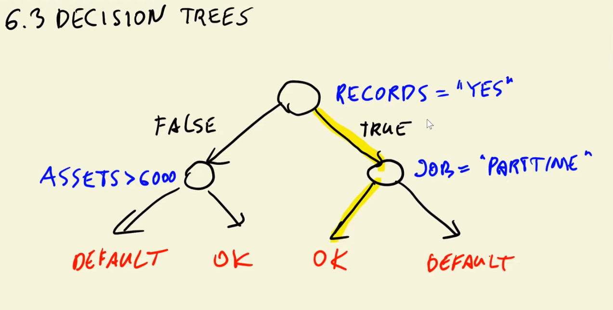
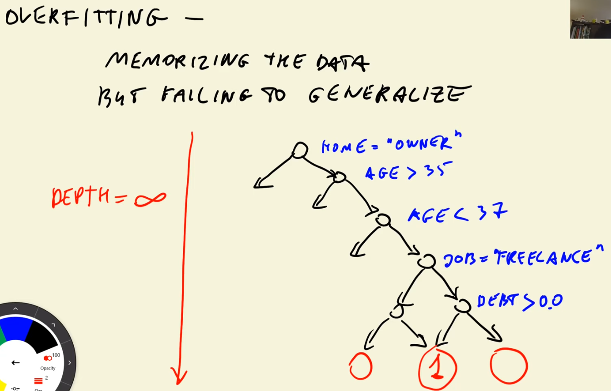

## 🧠 Learning Decision Rules Automatically
Instead of writing these rules manually, the **Decision Tree algorithm** learns them directly from data.  
The algorithm analyzes the dataset, splitting it based on conditions that **best separate the target classes** (default vs. no default).

The model uses **information gain** or **Gini impurity** to decide which conditions improve prediction accuracy at each split.

## ⚙️ Training and Evaluation
The tree is trained using:
- The **training dataset** (features and target variable)
- **Encoded categorical variables** transformed into numerical form
- **DecisionTreeClassifier** from scikit-learn

After training, the model’s predictions are evaluated using the **AUC (Area Under the ROC Curve)** metric:
- AUC close to **1.0** → excellent model  
- AUC near **0.5** → random guessing  

In this example:
- **Training AUC** = 1.0 (perfect accuracy)  
- **Validation AUC** = 0.65 (poor generalization)

This large gap reveals a major issue: **overfitting**.

## 🚨 Understanding Overfitting
**Overfitting** happens when the model memorizes patterns specific to the training data rather than learning general relationships.  

Example:
A tree that grows too deep might learn overly specific rules like:
> “If a 36-year-old freelancer with a house and zero debt applied for a loan — predict default.”

Such hyper-specific rules fit only one or two customers in the dataset and fail to generalize to new cases.

Overfitted trees:
- Have very deep structures (many levels)  
- Perform perfectly on training data  
- Perform poorly on unseen (validation) data  

## 🌿 Controlling Tree Depth
To prevent overfitting, we can limit how deep the tree grows using the parameter **max_depth**.

- A **deep tree** (unrestricted depth) memorizes data and overfits.  
- A **shallow tree** (e.g., `max_depth = 3`) generalizes better and avoids noise.

Results after limiting depth:
- **Training AUC:** slightly lower  
- **Validation AUC:** significantly higher (e.g., 0.73 instead of 0.65)

By restricting the tree’s complexity, we trade a bit of training accuracy for better **generalization performance**.

## 🌱 Decision Stump
When the tree depth is **1**, it has only one split — this is called a **Decision Stump**.  
It consists of a single rule such as:
> “If the customer has records → default; otherwise → ok.”

Although simple, such models can still capture meaningful patterns in data and are the building blocks for **ensemble methods** like boosting.

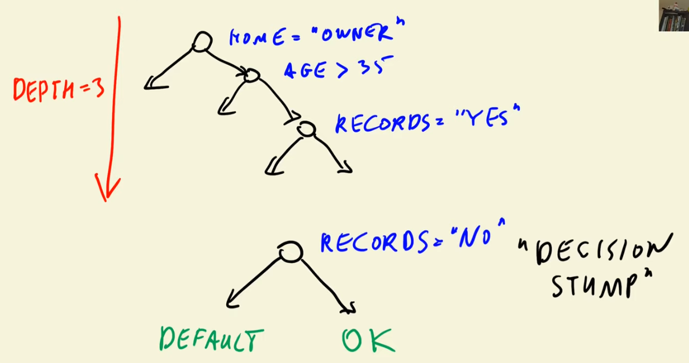

## 🔍 Interpreting Learned Rules
A trained decision tree can be **visualized** or printed as text to reveal its internal logic.  
For example, a two-level tree might learn:
- If `records = no` and `job = part-time` → default  
- If `records = no` and `job ≠ part-time` → ok  
- If `records = yes` and `seniority > 6.5 years` → ok  
- Otherwise → default  

These learned conditions show how decision trees automatically extract interpretable rules from data.

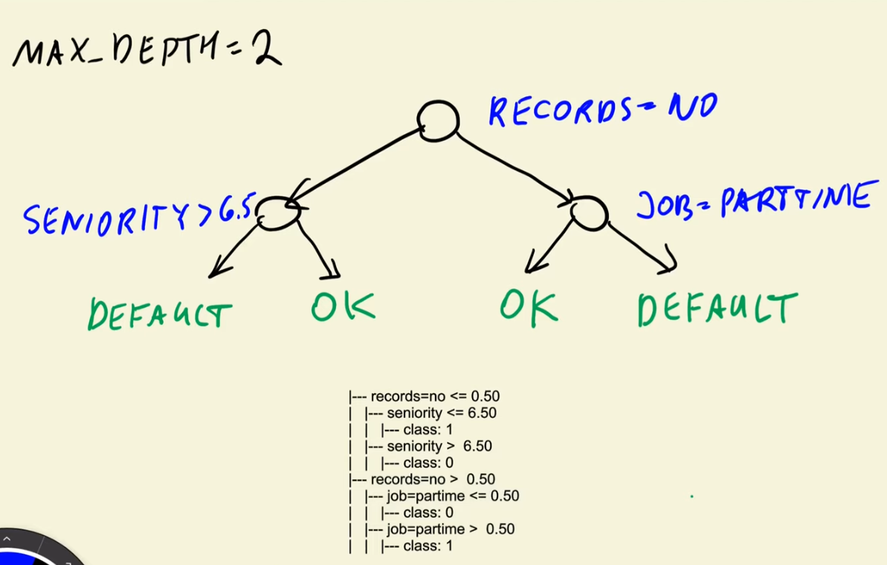

## 🧾 Key Takeaways
| Concept | Explanation |
|----------|--------------|
| **Decision Tree** | A sequence of if–then rules learned from data |
| **Overfitting** | The tree memorizes training data but performs poorly on new data |
| **max_depth** | Limits tree complexity and helps generalization |
| **Decision Stump** | A tree with only one split (very simple model) |
| **AUC Metric** | Measures model performance; higher is better |
| **Interpretability** | Decision trees are easy to explain and visualize |

---

# ML Zoomcamp 6.4 - Decision Tree Learning Algorithm

## 🧭 Overview
In this lesson, we explore **how decision trees learn rules from data**.  
Previously, we trained decision trees using scikit-learn and observed **overfitting** when tree depth was uncontrolled.  
Now, we dive deeper into the **learning algorithm** — how trees find the best splits, evaluate them, and decide when to stop growing.

## 🌲 Structure of a Decision Tree
- Each **node** represents a **condition** (e.g., `feature > threshold`).  
- Each **leaf node** (end of a branch) represents a **decision** (e.g., `default` or `ok`).  
- The **learning process** consists of finding the best **splits** that separate data into purer groups.

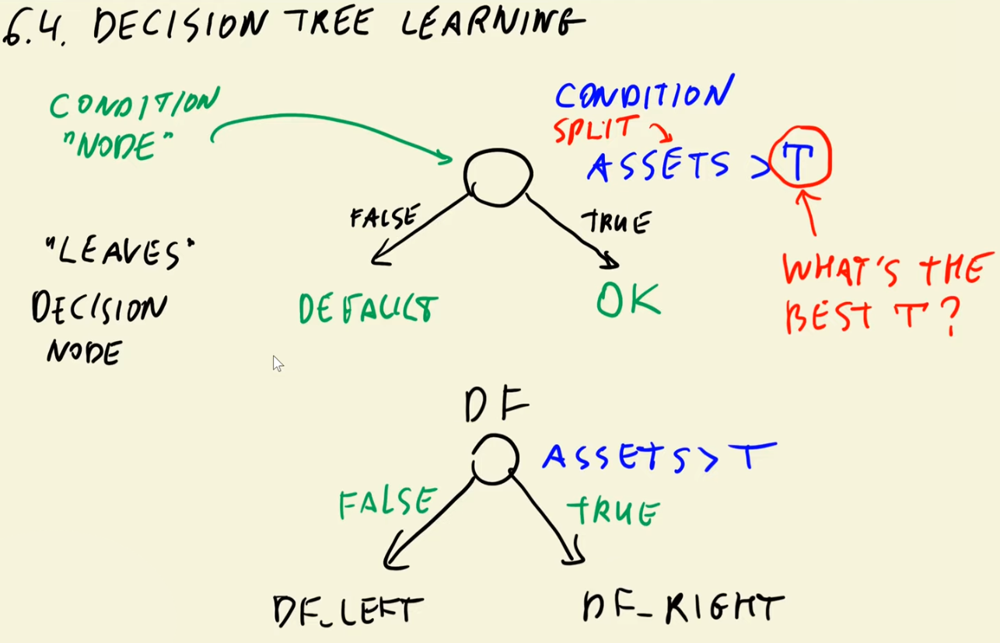

## ⚙️ Step 1: Splitting the Data
The tree divides the dataset into two groups based on a condition such as:  
> `assets > threshold (t)`

This process is called a **split**:
- **Left branch:** where condition is *false* (`assets ≤ t`)  
- **Right branch:** where condition is *true* (`assets > t`)  

The goal is to find the **best threshold** that separates classes as clearly as possible.

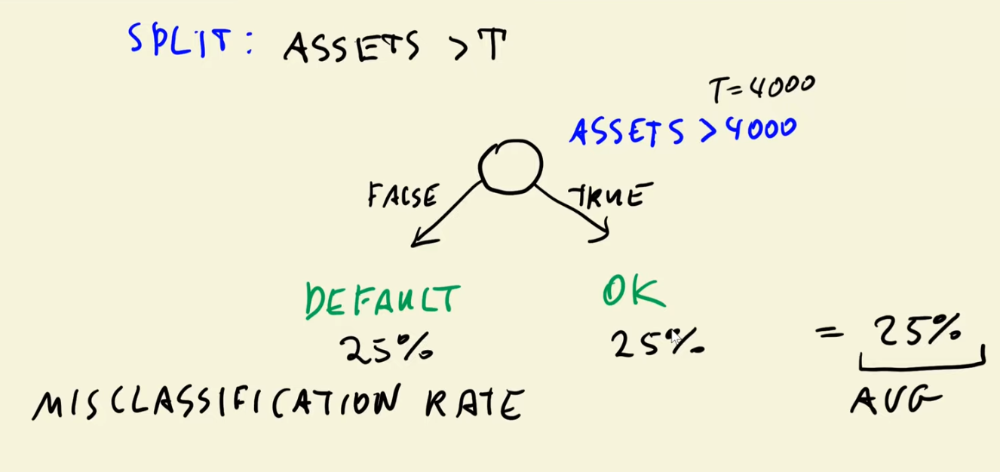

## 📊 Evaluating Potential Splits
The algorithm tests several threshold values (`t`) and measures how well each split separates the data.  
For each split:
- Records are divided into **left** and **right** subsets.
- Each subset predicts the **majority class** (`default` or `ok`).
- The **misclassification rate** is computed — how many predictions are wrong.

### Example:
If a group has 3 “default” and 1 “ok” case:
- Predicting “default” gives 1 error → **25% misclassification rate**.

The algorithm averages the error (or uses a weighted average) across both subsets to measure the **impurity** of the split.  
The **best split** is the one with the **lowest impurity**.

## 💡 Impurity Measures
Impurity quantifies how mixed the classes are within a subset.  
Common measures include:
- **Misclassification rate** – simple proportion of incorrect predictions.  
- **Gini impurity** – measures the probability of misclassifying a random sample.  
- **Entropy** – measures information disorder (used in information gain).  

In practice, **Gini** or **Entropy** are preferred; misclassification rate is used here for intuition.

## 🔍 Finding the Best Split (One Feature)
1. Sort the dataset by a numeric feature (e.g., `assets`).  
2. Identify all possible thresholds between unique values.  
3. For each threshold:
   - Split the dataset into left/right subsets.
   - Compute the impurity on both sides.
   - Calculate the average impurity.
4. Choose the threshold with the **lowest impurity**.

Example result:
- Best threshold: **assets > 3000**  
- Impurity: **10%** (lowest among all thresholds).  

This becomes the **first decision rule** of the tree.

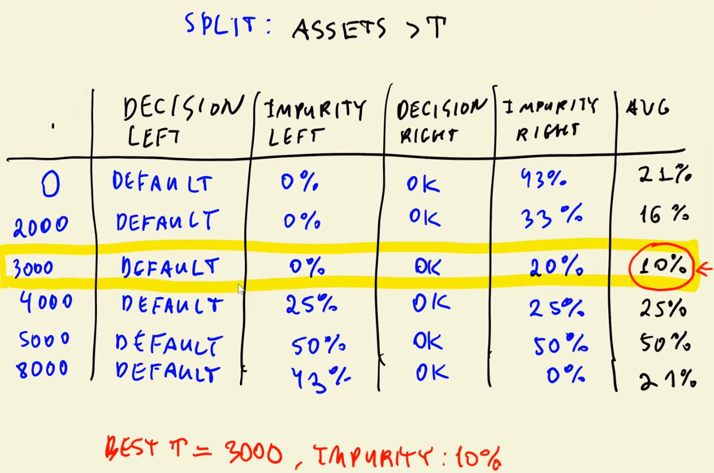

## 🔢 Multiple Features
When multiple features exist (e.g., `assets`, `debt`, `income`):
- The algorithm repeats the same process for **every feature**.  
- For each feature, all possible thresholds are tested.  
- The **best feature and threshold combination** (lowest impurity) becomes the **split criterion** at that node.

Example:
- `assets > 3000` yields lower impurity than `debt > 1000`.  
- The algorithm selects `assets > 3000` as the first split.

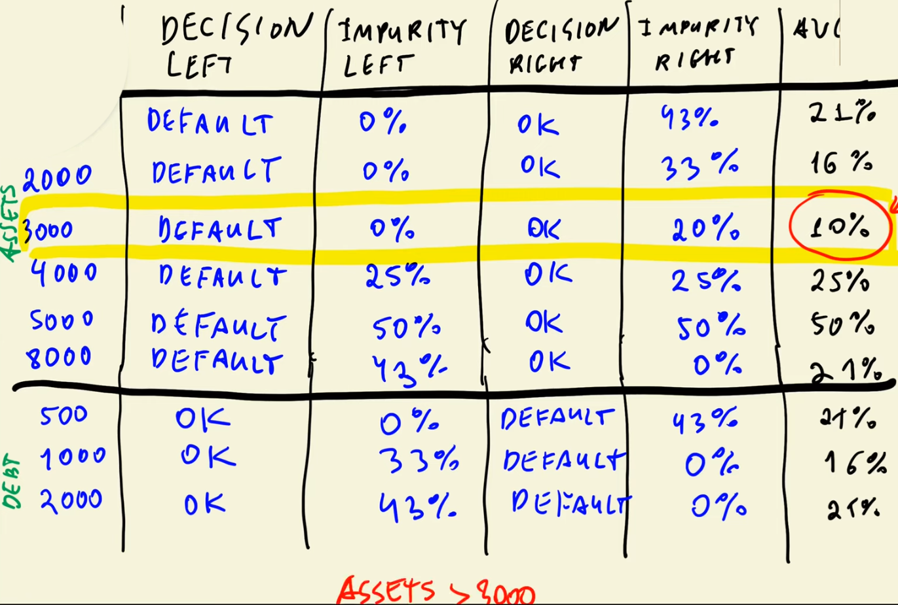

## 🔁 Recursive Splitting
After the best split is found:
1. The dataset is divided into two subsets (left/right).  
2. The same splitting process is applied **recursively** to each subset.  
3. The process continues until **stopping criteria** are met.  

This recursive approach builds the tree layer by layer.

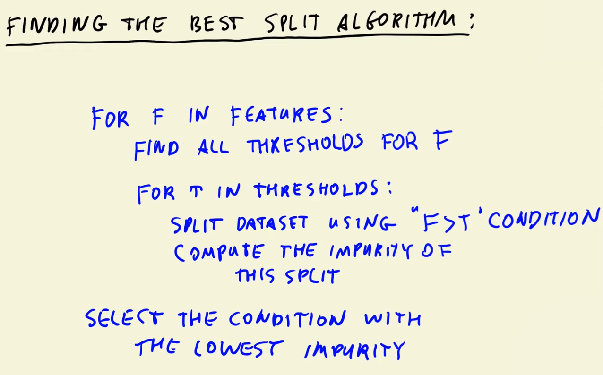

## ⛔ Stopping Criteria
To prevent infinite growth and overfitting, the algorithm stops splitting when:

1. **Group is pure** – all records belong to the same class.  
   (No need to split further.)
2. **Maximum depth reached** – predefined tree depth limit (`max_depth`).  
3. **Group too small** – subset size below a minimum threshold (`min_samples_split`).  

When any of these conditions are met, the algorithm creates a **leaf node** instead of continuing to split.

## 🧩 Full Decision Tree Learning Algorithm
1. **Find the best split:**
   - Iterate through all features.
   - For each feature, test all possible thresholds.
   - Select the split with the lowest impurity.
2. **Check stopping criteria:**
   - Stop if max depth reached, group is pure, or group is too small.
3. **Split the data:**
   - Divide dataset into left/right based on the chosen condition.
4. **Recursively repeat** for left and right subsets until stopping conditions are met.

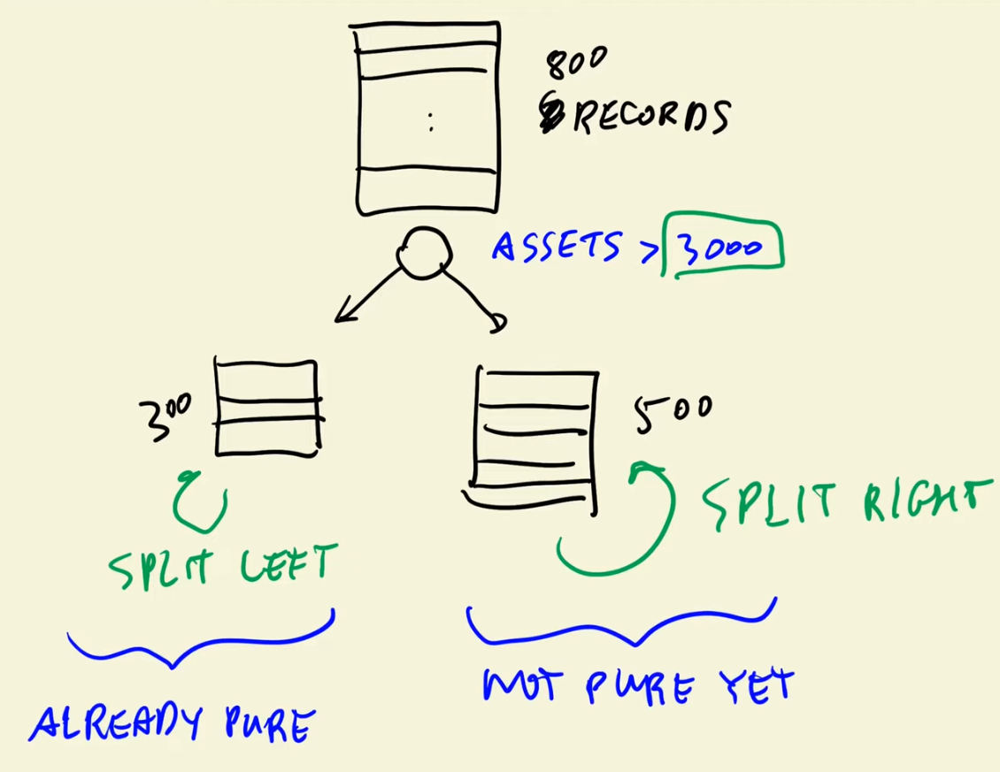
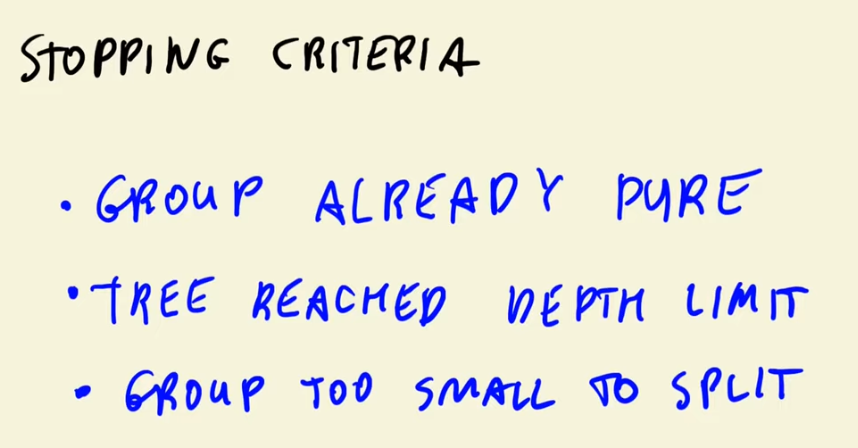
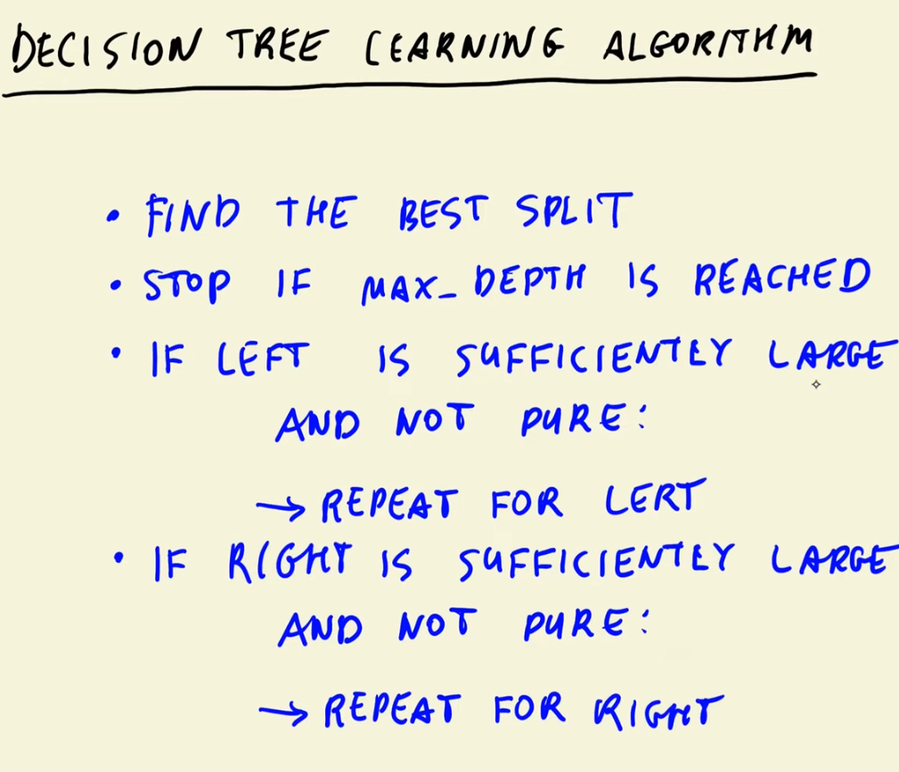

## 📘 Practical Notes
- Decision Trees can also handle **regression tasks**, using **Mean Squared Error (MSE)** as impurity.  
- Scikit-learn supports multiple impurity measures:  
  - `criterion="gini"`  
  - `criterion="entropy"`  
  - `criterion="log_loss"` (for probabilistic outputs)  

## ✅ Key Takeaways
| Concept | Description |
|----------|--------------|
| **Split** | Dividing data into subsets based on a feature threshold |
| **Impurity** | Measure of how mixed classes are (lower = better) |
| **Best Split** | The feature and threshold producing the lowest impurity |
| **Recursive Learning** | Repeatedly splitting subsets until stopping criteria are met |
| **Stopping Criteria** | Max depth, pure group, or minimum group size |
| **Overfitting Control** | Limiting tree depth and requiring larger group sizes prevents memorization |

---

# ML Zoomcamp 6.5 - Decision Trees Parameter Tuning

## 🧭 Overview
This lesson focuses on **tuning the parameters** of decision trees to improve model performance and control overfitting.  
Previously, we learned how trees are built and saw how unrestricted depth causes overfitting.  
Now, we aim to find optimal **hyperparameters** that maximize model performance — measured by **AUC** on the validation set.

## ⚙️ Key Parameters to Tune
Decision trees have many parameters, but two are the most important:

1. **`max_depth`**  
   - Controls how deep the tree can grow.  
   - Prevents overfitting by limiting the number of levels.  

2. **`min_samples_leaf`**  
   - Minimum number of samples required in a leaf (final node).  
   - Prevents creating overly specific rules from very few samples.  

These parameters balance **model complexity** and **generalization ability**.

## 🌲 Step 1: Understanding the Parameter Effects
- If **`max_depth`** is too large → tree memorizes data → overfits.  
- If too small → underfits → misses important patterns.  
- If **`min_samples_leaf`** is small → model may overfit on small subsets.  
- If large → tree stops splitting early → model simplifies excessively.  

The goal is to find a combination that maximizes validation performance (AUC).

## 🧠 Step 2: Tuning `max_depth`
The first step is to test multiple depth values such as:
> 1, 2, 3, 4, 5, 6, 10, 15, 20, None  

For each `max_depth` value:
1. Train a decision tree on the training set.  
2. Evaluate AUC on the validation set.  
3. Record the results.  

**Results:**
- Best performance observed at **depths 4–6**.  
- Shallower trees (4 layers) perform nearly as well as deeper ones but are simpler to interpret.  

✅ **Chosen value:** `max_depth = 4–6`

## 🌿 Step 3: Tuning `min_samples_leaf`
After finding a good range for `max_depth`, we tune `min_samples_leaf`.  
Test different values such as:  
> 1, 2, 5, 10, 15, 20, 100, 200, 500  

For each combination of `max_depth` and `min_samples_leaf`:
1. Train the model.  
2. Evaluate the AUC on validation data.  
3. Compare the results.  

Observations:
- Slightly **larger trees** with **minimum leaf sizes around 15** perform best.  
- Limiting leaf size prevents unnecessary deep splits while keeping enough data per node.  

✅ **Best combination:**  
`max_depth = 6`  
`min_samples_leaf = 15`

## 📊 Step 4: Visualizing Results
To make tuning easier:
- Results were organized into a **DataFrame** and converted into a **pivot table**:
  - **Rows:** `min_samples_leaf`  
  - **Columns:** `max_depth`  
  - **Cells:** AUC values  

A **heatmap visualization** was used to display which combinations yield the highest performance:
- **Lighter cells** → higher AUC values (better performance).  
- The **best region** was around `max_depth = 6` and `min_samples_leaf = 15`.

## ⚠️ Step 5: Notes on Parameter Search Strategy
- Testing every parameter combination is feasible for small datasets but expensive for large ones.  
- Often, it’s better to **tune one parameter at a time**:
  - First tune `max_depth`.  
  - Then tune `min_samples_leaf` using the best depth found.  
- This is a **manual grid search**; automated alternatives include **GridSearchCV** or **RandomizedSearchCV** in scikit-learn.

## 🧩 Step 6: Final Model Choice
After testing combinations:
- **Best performance:** `max_depth = 10`, `min_samples_leaf = 15` (AUC ≈ 0.78).  
- **Simpler alternative:** `max_depth = 6`, `min_samples_leaf = 15` (slightly lower AUC but easier to interpret).  

For practical purposes, the simpler model was preferred for clarity and stability.

✅ **Final Model:**  
- `max_depth = 6`  
- `min_samples_leaf = 15`

## 🧾 Key Takeaways
| Parameter | Description | Effect |
|------------|--------------|--------|
| **max_depth** | Limits tree layers | Controls complexity and overfitting |
| **min_samples_leaf** | Minimum samples per leaf | Prevents overly specific splits |
| **AUC Metric** | Measures model performance | Higher = better generalization |
| **Tuning Strategy** | Sequential search (depth → leaf size) | Efficient for small datasets |

---

# ML Zoomcamp 6.6 - Ensemble Learning and Random Forest

## 🧭 Overview
This lesson introduces **Random Forests**, an **ensemble learning** method that combines multiple decision trees to improve prediction accuracy and robustness.  
The key idea: instead of relying on one model, we aggregate many models (trees) — similar to consulting a **board of experts** rather than a single expert.

## 🧩 Motivation: The Board of Experts Analogy
- Imagine a **client** applying for a bank loan.  
- Instead of one expert (decision tree) making the decision, we consult **five experts**.  
- Each gives a “yes” or “no” decision, and the **majority vote** determines the final outcome.  
- This reduces the risk of error due to individual bias or overfitting.

💡 Similarly, Random Forests aggregate multiple decision trees — each trained slightly differently — to make more stable and accurate predictions.

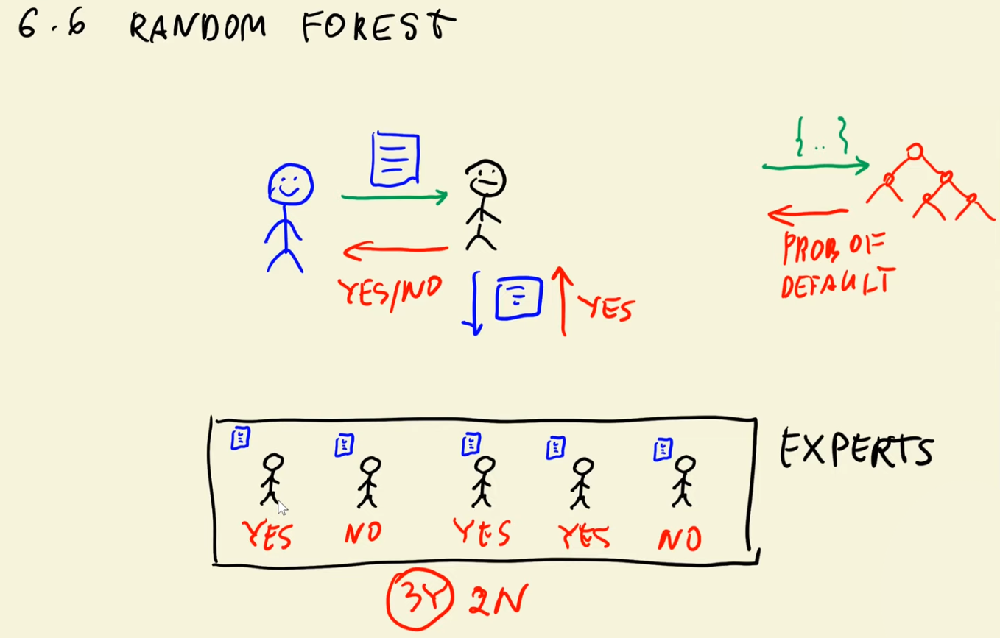
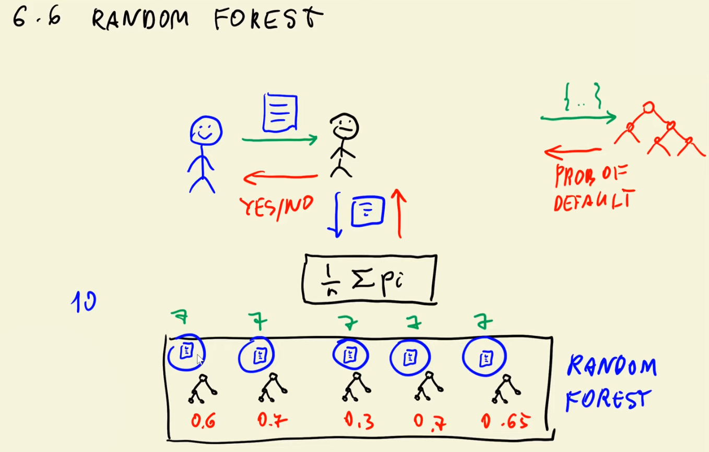

## 🌳 From Individual Trees to a Forest
Each tree (expert) outputs a **probability of default** (e.g., 0.6, 0.7, 0.3...).  
These predictions are then **averaged** to produce the final probability for the ensemble.

If we just trained the same tree multiple times on the same data, they’d be identical — offering no diversity.  
That’s why Random Forest introduces **randomness** at two levels:
1. **Random feature subsets** – each tree only sees part of the available features.  
2. **Random data subsets** (bootstrapping) – each tree trains on a slightly different sample of the data.

## 🧠 Example of Feature Randomization
Suppose our dataset has 3 features:  
- **assets**, **debt**, **price**

We can train:
- Tree 1 → using **assets + debt**  
- Tree 2 → using **assets + price**  
- Tree 3 → using **debt + price**

Each tree learns different relationships, and their averaged predictions form the final result.  
This diversity reduces overfitting and increases generalization.

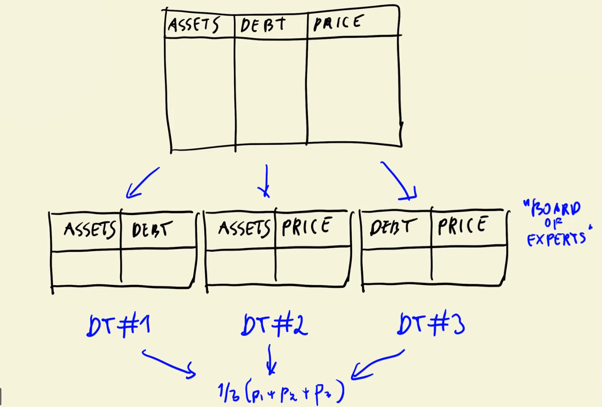

## ⚙️ Random Forest Essentials
- Implemented in scikit-learn via:
  - `RandomForestClassifier` (for classification)
  - `RandomForestRegressor` (for regression)
- Key parameter: **`n_estimators`** – number of trees in the forest.

Even with **default parameters**, Random Forests perform well.  
Example: using only 10 trees achieved AUC comparable to the best single decision tree.

## 🎲 Randomness & Reproducibility
Because of feature and data randomness, retraining may yield slightly different results.  
To ensure **reproducibility**, set a fixed **`random_state`**.  
Otherwise, results will vary at each training run.

## 📈 Effect of Number of Trees (`n_estimators`)
By experimenting with different numbers of trees (10 → 200):
- AUC improves rapidly up to around **50 trees**, then plateaus.
- Adding more trees beyond that gives diminishing returns.

✅ **Optimal range:** ~50–100 trees for this dataset.  
More trees = slower training, but only marginally better results.

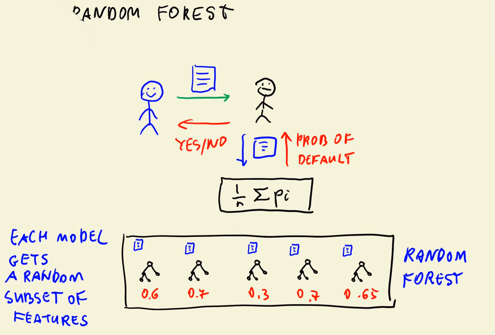

## ⚖️ Hyperparameter Tuning
Just like Decision Trees, Random Forests inherit similar tunable parameters:

| Parameter | Description | Typical Range | Effect |
|------------|--------------|----------------|---------|
| **`max_depth`** | Maximum depth of each tree | 5–15 | Controls model complexity |
| **`min_samples_leaf`** | Minimum samples per leaf | 1–10 | Prevents overfitting |
| **`n_estimators`** | Number of trees | 50–200 | Improves stability |
| **`max_features`** | Fraction or number of features per tree | 0.5–1.0 | Increases diversity |
| **`bootstrap`** | Whether to sample data with replacement | True/False | Adds randomness |
| **`n_jobs`** | Number of CPU cores to use | -1 (all cores) | Speeds up training |

## 🔍 Results of Parameter Tuning
1. **Best `max_depth`** = 10  
   - Shallower (5) underfits; deeper (15) adds little improvement.  
   - Around 1–2.5% AUC improvement over suboptimal depths.

2. **Best `min_samples_leaf`** = 3  
   - Smaller leaves (1–3) perform best.  
   - Too large (50) severely reduces performance.  

3. **Best `n_estimators`** = 100  
   - Performance plateaus after 50–100 trees.  

✅ **Final Model Configuration:**
- `max_depth = 10`
- `min_samples_leaf = 3`
- `n_estimators = 100`
- `random_state = 1`
- `n_jobs = -1` (parallelized training)

## 💡 Additional Notes
- **`max_features`** determines how many features each tree randomly selects.  
  Example: `max_features=0.7` → each tree sees 70% of features.  
- **`bootstrap`** adds randomness at the **row** level by sampling the data with replacement.  
- **`n_jobs=-1`** allows parallel training across all available CPU cores, significantly speeding up computation.

## 🧾 Key Takeaways
| Concept | Description |
|----------|--------------|
| **Random Forest** | An ensemble of diverse decision trees combined via averaging |
| **Purpose** | Reduce variance and overfitting of individual trees |
| **Randomness** | Applied to both data samples (bootstrap) and feature subsets |
| **Performance** | Stabilizes after a certain number of trees (~50–100) |
| **Tuning Strategy** | Sequentially tune `max_depth` and `min_samples_leaf` |
| **Parallelization** | Use `n_jobs=-1` for efficient multi-core training |

---

# ML Zoomcamp 6.7 - Gradient Boosting and XGBoost

## What’s the big idea?
- **Ensembles** improve predictions by combining many models.
- Unlike **Random Forests** (parallel, independent trees averaged), **Boosting** trains models **sequentially**: each new model focuses on correcting the **errors** of the previous one.
- Replacing the models with trees yields **Gradient Boosted Trees**; a popular implementation is **XGBoost**.

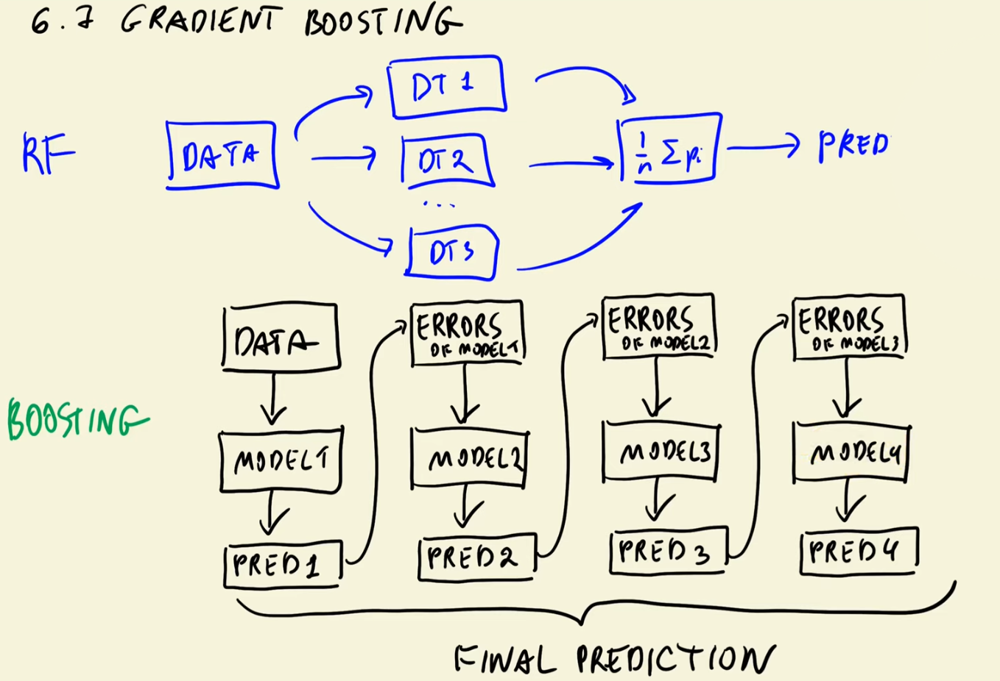

## Boosting workflow
1. Train model \(M_1\) on the dataset.
2. Compute its **errors/residuals**.
3. Train \(M_2\) to correct those errors.
4. Repeat for many iterations \(M_3, M_4, \dots\).
5. **Aggregate** their predictions into a final score.

> Key difference vs. Random Forests: **sequential dependency** (cannot train in parallel) and **error-correction** at each step.

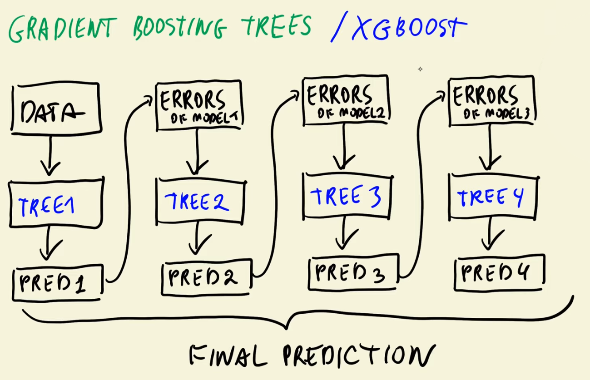

## XGBoost essentials
- Wrap features/labels in **DMatrix** (optimized internal format).
- Train with a set number of **rounds/trees** (iterations).
- Common **parameters**:
  - `eta` (**learning rate**): how fast the model learns (defaults to 0.3). Crucial for controlling overfitting; discussed further in next lesson.
  - `max_depth`: tree depth (controls complexity).
  - `min_child_weight`: minimum samples per leaf (regularization akin to min samples leaf).
  - `objective`: e.g., `binary:logistic` for binary classification.
  - `nthread` (parallel CPU threads), `seed` (reproducibility), `verbosity` (logging).

## Monitoring & evaluation
- Use a **watchlist** to evaluate on train/validation **after each round**.
- Set `eval_metric='auc'` to track AUC over iterations.
- Typical behavior:
  - **Train AUC** climbs toward ~1.0 as rounds increase.
  - **Validation AUC** **peaks early** (often ~10–25 rounds) then **declines** → classic **overfitting**.
- Practical implication: don’t just add more trees; monitor validation AUC and stop near the peak (early stopping to be covered elsewhere).

## Takeaways
- **Boosting** = sequential error-correction; powerful but prone to **overfitting** if too many trees or too-deep trees.
- **XGBoost** offers fast, regularized gradient boosting with rich monitoring.
- Key knobs: **learning rate**, **tree depth**, **min child weight**, and the **number of rounds**.
- Next up: deeper **parameter tuning**, especially the **learning rate**, plus tuning `max_depth` and `min_child_weight`.

---

# ML Zoomcamp 6.8 - XGBoost Parameter Tuning

## 🎯 Overview
This lesson covers **hyperparameter tuning** for **XGBoost**, focusing on three critical parameters:
1. **η (eta)** — Learning rate  
2. **max_depth** — Maximum tree depth  
3. **min_child_weight** — Minimum samples per leaf  

In the previous lesson, the default parameters achieved an AUC ≈ 0.82 with ~25 trees before overfitting. Now, we optimize each parameter to improve performance and model stability.

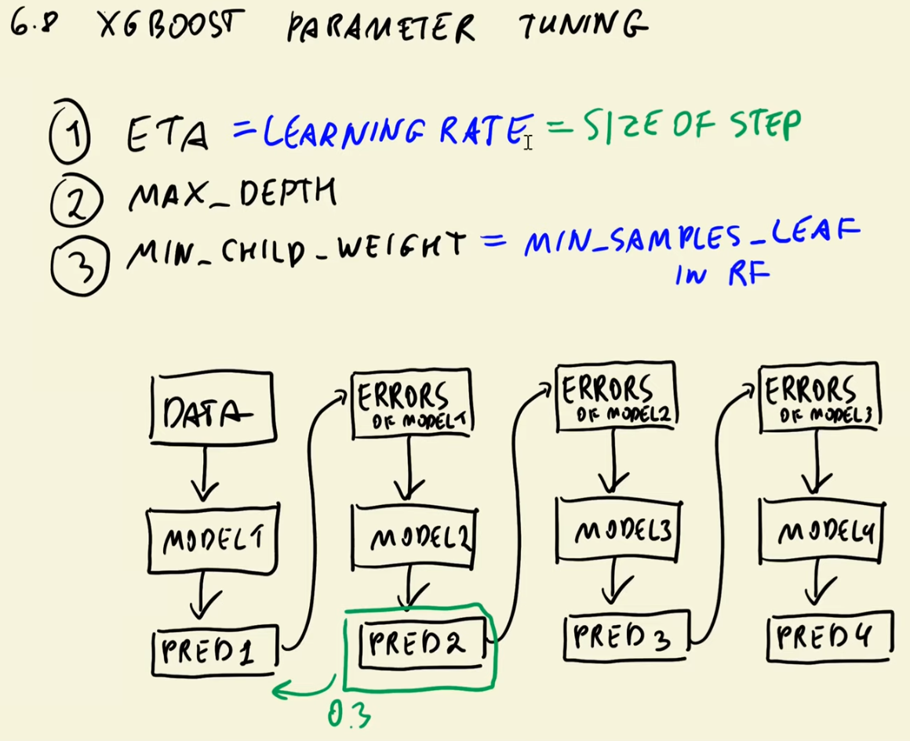

## ⚙️ 1. Tuning the Learning Rate (η)

### Concept
- **η (learning rate)** controls how much each new tree contributes to correcting previous errors.  
  - `η = 1.0` → large steps (fast learning but prone to overfitting)  
  - `η = 0.1` → smaller steps (slower, steadier improvement)  
  - `η = 0.01` → very slow learning (requires many trees)

### Observations
| η Value | Behavior | Performance |
|----------|-----------|-------------|
| **1.0** | Learns fast, peaks early (~5 iterations), then declines sharply | Overfits quickly |
| **0.3** | Good baseline, peaks near ~25 iterations | Balanced but still overfits |
| **0.1** | Learns slower, peaks near ~75 iterations | Best overall AUC (~0.83) |
| **0.05** | Slower, peaks ~130 iterations | Slightly worse than 0.1 |
| **0.01** | Extremely slow | Requires too many iterations |

✅ **Best value:** `η = 0.1`

## 🌳 2. Tuning the Maximum Tree Depth (`max_depth`)

### Concept
- Controls model complexity:
  - Shallow trees → underfit but generalize better
  - Deep trees → overfit easily

### Experimented Values: `3`, `4`, `6`, `10`

### Observations
| max_depth | Behavior | Performance |
|------------|-----------|-------------|
| **10** | Fast initial gain, then stagnates | Overfits |
| **6** | Moderate speed, peaks early (~50 iterations) | Slight overfitting |
| **4** | Stable, moderate learning speed | Decent performance |
| **3** | Slower learning but strong final AUC (~0.835) | ✅ Best overall |

✅ **Best value:** `max_depth = 3`

## 🌱 3. Tuning Minimum Child Weight (`min_child_weight`)

### Concept
- Similar to `min_samples_leaf` in Decision Trees.
- Prevents splits with too few samples (helps regularization).

### Experimented Values: `1`, `10`, `30`

### Observations
- Differences are minimal; performance curves almost identical.
- Slight edge for **`min_child_weight = 1`**.

✅ **Best value:** `min_child_weight = 1`

## 🧩 4. Additional Parameters Worth Exploring
Beyond the three main ones, two other parameters can further improve generalization:

| Parameter | Meaning | Typical Range | Similar To |
|------------|----------|----------------|-------------|
| **subsample** | Fraction of training samples used per iteration | 0.3–1.0 | Row sampling |
| **colsample_bytree** | Fraction of features used per tree | 0.3–1.0 | Feature sampling |

> 🧠 Try values like 0.6 or 0.3 to mimic Random Forest–style randomness.

## 🏆 5. Final Model Configuration
| Parameter | Value |
|------------|--------|
| **eta** | 0.1 |
| **max_depth** | 3 |
| **min_child_weight** | 1 |
| **nrounds** | ~175 iterations |
| **objective** | binary:logistic |
| **eval_metric** | AUC |

✅ **Final Model:** Balanced between learning speed and generalization — minimal overfitting and strong validation AUC.

## 📘 6. Practical Notes
- **Tuning order:**  
  1️⃣ η (learning rate)  
  2️⃣ max_depth  
  3️⃣ min_child_weight  
- Plotting results helps visualize learning behavior, but in practice, tracking AUC from console output or logs is often enough.
- Further fine-tuning may involve:
  - `subsample`
  - `colsample_bytree`
  - Regularization terms (`lambda`, `alpha`)

## 🧾 Key Takeaways
| Concept | Summary |
|----------|----------|
| **Learning Rate (η)** | Controls step size — too large → overfit, too small → slow |
| **Tree Depth** | Limits model complexity; small trees generalize better |
| **Child Weight** | Regularization against noisy splits |
| **Overfitting Control** | Use smaller η and shallower trees |
| **Extra Regularization** | Use subsample and colsample_bytree |
| **Best Model Found** | `η=0.1`, `max_depth=3`, `min_child_weight=1`, ~175 rounds |

---

# ML Zoomcamp 6.9 - Selecting the Best Model

## 🧭 Overview
This lesson concludes **Session 6** of the Machine Learning Zoomcamp by **selecting and training the final model**.  
So far, three tree-based models have been trained and tuned:
1. **Decision Tree**
2. **Random Forest**
3. **XGBoost**

Now, these models are compared on validation data to identify the best performer, and the winning model is retrained on the full dataset.

## 🌳 Step 1: Reviewing Trained Models
- **Decision Tree Model:**  
  Tuned to optimal parameters; served as the baseline.  
  **Validation AUC ≈ 78.5%**

- **Random Forest Model:**  
  Improved performance over Decision Tree by about **+4%**, reaching **AUC ≈ 82.5%**

- **XGBoost Model:**  
  Slightly outperformed Random Forest with **AUC ≈ 83.5%**, confirming it as the **best overall model**.

✅ **Winner:** XGBoost (best generalization and performance)

## 🧩 Step 2: Training the Final Model
The **final XGBoost model** was retrained on the **entire training dataset** (train + validation combined):

- Combined data into `full_train`
- Extracted target variable (`status`)
- Removed target from feature set to prevent data leakage
- Converted records to dictionaries → vectorized features  
- Created DMatrix objects for efficient XGBoost training

## ⚙️ Step 3: Evaluating on the Test Set
- The final model was evaluated on **previously unseen test data**.  
- **AUC on test set:** ~0.83  
  → Nearly identical to validation performance, indicating **strong generalization** and **no overfitting**.

✅ **Conclusion:**  
The model maintains high accuracy across unseen data, proving robust and reliable.

## 📊 Model Comparison Summary

| Model | AUC (Validation) | AUC (Test) | Notes |
|--------|------------------|-------------|-------|
| Decision Tree | ~0.785 | — | Simple, interpretable, weaker performance |
| Random Forest | ~0.825 | — | Strong, stable, but slower |
| XGBoost | ~0.835 | ~0.83 | Best performance, strong generalization |

## 💡 Key Insights
- **XGBoost** performs best for **tabular datasets**, often outperforming Random Forests.
- However:
  - It’s **more complex** to tune due to many hyperparameters.
  - It’s **more prone to overfitting** if not carefully regularized.
- **Random Forests** remain simpler and more robust with fewer parameters.

## 🏁 Final Takeaways
- Best Model: **XGBoost**
- Validation and Test AUC: ~83%
- No significant overfitting detected.
- Demonstrated workflow:
  1. Train multiple tree-based models
  2. Compare validation metrics
  3. Select the best one
  4. Retrain on full data
  5. Validate on test set
