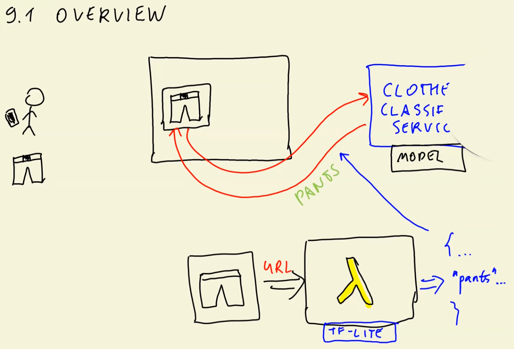
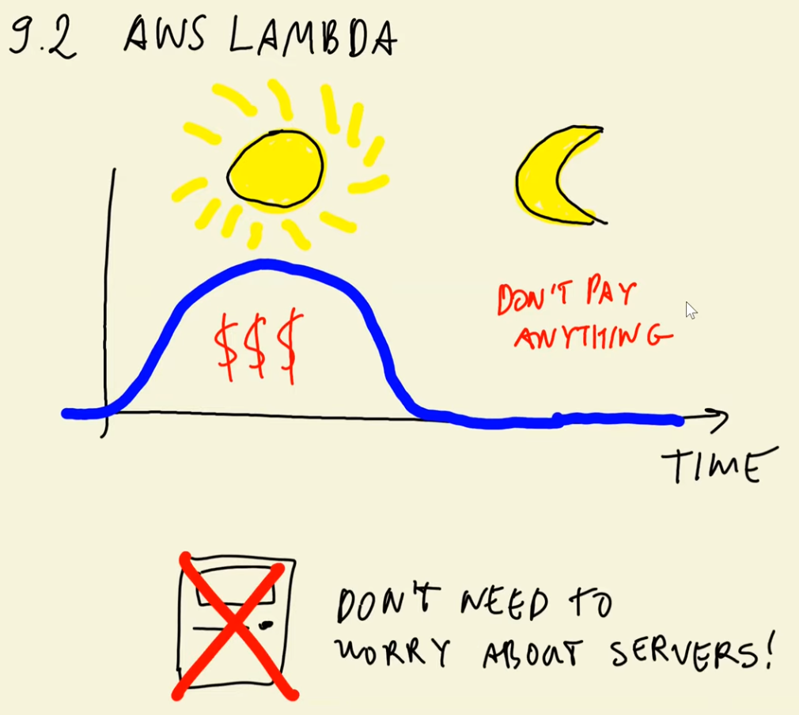

# ML Zoomcamp 9.1 - Introduction to Serverless



In this session, the focus shifts from **training deep learning models** to **deploying them in a serverless environment** using **AWS Lambda**. The goal is to turn an image classification model into a production-ready service.

## 👕 1. Real-World Use Case
- A user uploads a clothing item (e.g., pants) to an online marketplace.
- The system sends the image to a **clothes classification service**.
- The service predicts the class (e.g., *pants*) and helps the user categorize their listing automatically.

## 🤖 2. From Training to Deployment
- The model was previously trained using **TensorFlow/Keras** to classify clothing items.
- This session focuses on how to **deploy** that trained model so it can serve real-time predictions.

## ☁️ 3. Why AWS Lambda?
- **AWS Lambda** allows running code without managing servers.
- It supports deploying ML models as lightweight services.
- Workflow:
  1. Client sends an **image URL** to the Lambda endpoint.
  2. Lambda loads the model, classifies the image, and returns predicted classes with scores.

## 🔄 4. Using TensorFlow Lite (TFLite)
- AWS Lambda works best with **fast, lightweight models**.
- TFLite is preferred over standard TensorFlow because it:
  - Uses **less memory**
  - Loads **faster**
  - Produces **smaller model files**
  - Fits Lambda's execution constraints better
- The session covers converting the trained model into **TensorFlow Lite format**.

## 🐳 5. Packaging with Docker
- The Lambda function and TFLite model are packaged inside a **Docker container**.
- This allows:
  - Custom dependencies
  - Reproducible deployment
  - Full control over the execution environment

## 🌐 6. Exposing the Service
- After deployment, the Lambda function is exposed as a **REST API** using **AWS API Gateway**.
- This makes the model accessible via a simple HTTP request:
  - Input: image URL  
  - Output: predicted classes + confidence scores  

## 🚀 7. What’s Covered in the Session
- Understanding AWS Lambda and serverless ML
- Why TFLite is a better fit than TensorFlow for inference
- Converting models to TFLite
- Deploying ML via Lambda using Docker
- Building a web-accessible inference service with API Gateway

The session sets the stage for **production-level model deployment**, transforming a trained neural network into a scalable, serverless image classification API.

---

# ML Zoomcamp 9.2 - AWS Lambda

This lesson introduces **AWS Lambda** and explains how it fits into deploying machine learning models in a serverless environment.



## 🧩 1. What AWS Lambda Is
- AWS Lambda is a **serverless compute service**.
- It allows running code without provisioning or managing servers.
- Ideal for lightweight ML inference tasks.

## 🧠 2. How Lambda Integrates Into ML Deployment
- Lambda can host model inference logic as a **Lambda function**.
- The function is triggered by events such as:
  - API Gateway requests  
  - File uploads  
  - Other AWS service events  

## 🛠 3. Development and Testing Workflow
- You write and test your Lambda function locally.
- Once ready, the code is deployed to AWS.
- Lambda handles:
  - Auto-scaling  
  - Execution  
  - Infrastructure management  

## 🏗 4. Supporting Infrastructure
- Deployment typically includes:
  - A Lambda function  
  - A container or packaged code bundle  
  - Integration with other AWS services (e.g., API Gateway)
- This forms a complete serverless inference pipeline.

## 🎯 5. Key Concepts Covered
- What Lambda functions are and how they work.
- How Lambda can host ML models.
- How Lambda integrates into a serverless architecture.
- Overview of deploying and connecting model inference code.

## 🔚 6. Lesson Context
This lecture serves as a foundation for the upcoming steps:
- Using TensorFlow Lite inside Lambda  
- Packaging the entire ML inference workflow  
- Deploying it as a serverless image classification API  

---

 AWS Lambda is a **serverless computing service** that lets you execute code without worrying about managing servers. Here's an overview of how it works and its benefits:  

### **Setting Up a Lambda Function 🛠️**
1. **Accessing Lambda:**
   - Go to the AWS Management Console and search for the `Lambda` service.

2. **Creating a Function:**
   - Choose the `Author from scratch` option.
   - Name your function (e.g., `mlzoomcamp-test`).
   - Select the runtime environment (e.g., `Python 3.9`) and architecture (`x86_64`).

3. **Understanding Function Parameters:**
   - **`event`:** Contains the input data passed to the function (e.g., a JSON payload).
   - **`context`:** Provides details about the invocation, configuration, and execution environment.

4. **Updating the Default Function:**
   - Edit `lambda_function.py` with custom logic. Example:  
     ```python
     def lambda_handler(event, context):
         print("Parameters:", event) # Print input parameters
         url = event["url"]  # Extract URL from input
         return {"prediction": "clothes"}  # Sample response
     ```

### **Testing and Deployment 🚀**
1. **Create a Test Event:**
   - Define a mock input to simulate real-world data.  

2. **Deploy Changes:**
   - Save and deploy the function to apply updates.  

3. **Test Your Function:**
   - Run the function with the test event to ensure it works as expected.

### **Advantages of AWS Lambda ✅**
- **Serverless Architecture 🖥️:** No need to provision or manage servers.  
- **Cost-Effective 💰:** Pay only for requests and compute time—idle time is free!  
- **Automatic Scaling 📈:** Adjusts automatically based on request volume.  
- **Ease of Use 🎯:** Focus on coding; AWS handles infrastructure.  

### **Dynamic Link Management Use Case 🌐**
 `AWS lambda` was used to automatically redirect users to updated invite links for joining the DataTalks.Club community. This is to avoid expired links on the user side, by using a Lambda function that reads from a config file where invitation links can be update.  

### Free Tier Usage
Note that `AWS Lambda` offers a free tier that includes a certain number of free requests (1 million requests per month), and free compute time (400,000 GB-seconds per month).

---

# ML Zoomcamp 9.3 - TensorFlow Lite

## 1. Why TensorFlow Lite?
TensorFlow is a very large library (~1.7GB unpacked). Large model packages have drawbacks:
- Slow cold starts in serverless environments (e.g., AWS Lambda).
- More storage cost and higher initialization latency.
- Importing TensorFlow itself is slow and increases RAM usage.

**TensorFlow Lite (TFLite)** is a lightweight alternative designed *only for inference* (`model.predict`) and **not for training**.

## 2. Using TensorFlow Lite for Inference
To use a Keras/TensorFlow model with TensorFlow Lite, you must **convert the model**:

1. Load an existing Keras `.h5` model.
2. Convert it using `TFLiteConverter`.
3. Save the output `.tflite` file.

The conversion internally:
- Converts Keras → SavedModel → TFLite format.

## 3. Running Inference With TFLite
TFLite requires more manual steps than Keras:

### Key components:
- **Interpreter**: loads the TFLite model.
- **allocate_tensors()**: loads weights into memory.
- **input & output indexes**: must be retrieved manually.
- **set_tensor()**: assign input data.
- **invoke()**: run the model.
- **get_tensor()**: extract predictions.

This replaces Keras’s simpler `model.predict()` workflow.

## 4. Preprocessing Without TensorFlow
Because TFLite is often used *without* installing full TensorFlow, the preprocessing normally done with:

- `tf.keras.preprocessing.image.load_img`
- `tf.keras.applications.X.preprocess_input`

must be **re-implemented manually**.

### Two replacements are needed:
1. **Image loading & resizing** → done with PIL (`Pillow`).
2. **`preprocess_input` logic** → replicated by copying the relevant pixel-scaling code from Keras source (`imagenet_utils`).

This removes TensorFlow from the pipeline entirely.

## 5. Complete TFLite Workflow (Conceptually)
1. **Load image with PIL**  
2. **Resize to (299, 299)**  
3. **Convert to array & apply TFLite-compatible normalization**  
4. **Load `.tflite` model with Interpreter**  
5. **Initialize tensors**  
6. **Feed input tensor manually**  
7. **Invoke model**  
8. **Extract output tensor**  
9. **Map predictions to labels**

The resulting predictions match those from standard TensorFlow/Keras.

## 6. Takeaway
TensorFlow Lite enables:
- Smaller model sizes
- Faster inference
- No TensorFlow dependency
- Deployment in resource-constrained environments (mobile, edge, serverless)

The tradeoff is:
- More verbose inference code
- Manual handling of preprocessing and tensor I/O

TensorFlow Lite is ideal when **only inference** is required and efficiency matters.

---

# 9.4