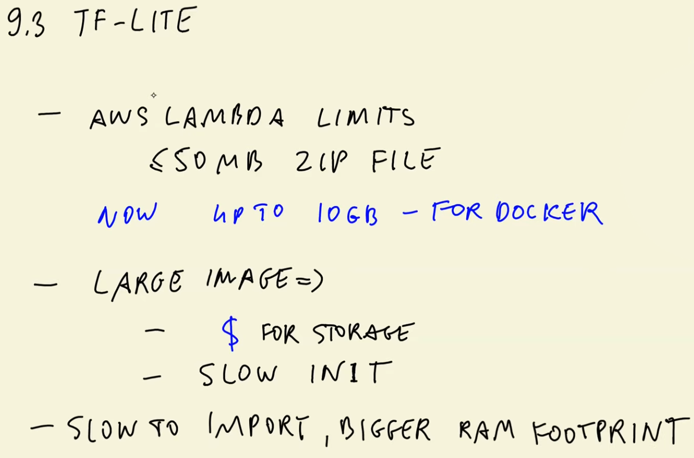
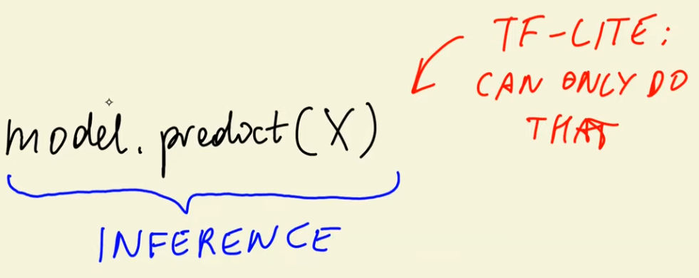

# ML Zoomcamp 9.1 - Introduction to Serverless


In this session, the focus shifts from **training deep learning models** to **deploying them in a serverless environment** using **AWS Lambda**. The goal is to turn an image classification model into a production-ready service.

## 👕 1. Real-World Use Case
- A user uploads a clothing item (e.g., pants) to an online marketplace.
- The system sends the image to a **clothes classification service**.
- The service predicts the class (e.g., *pants*) and helps the user categorize their listing automatically.

## 🤖 2. From Training to Deployment
- The model was previously trained using **TensorFlow/Keras** to classify clothing items.
- This session focuses on how to **deploy** that trained model so it can serve real-time predictions.

## ☁️ 3. Why AWS Lambda?
- **AWS Lambda** allows running code without managing servers.
- It supports deploying ML models as lightweight services.
- Workflow:
  1. Client sends an **image URL** to the Lambda endpoint.
  2. Lambda loads the model, classifies the image, and returns predicted classes with scores.

## 🔄 4. Using TensorFlow Lite (TFLite)
- AWS Lambda works best with **fast, lightweight models**.
- TFLite is preferred over standard TensorFlow because it:
  - Uses **less memory**
  - Loads **faster**
  - Produces **smaller model files**
  - Fits Lambda's execution constraints better
- The session covers converting the trained model into **TensorFlow Lite format**.

## 🐳 5. Packaging with Docker
- The Lambda function and TFLite model are packaged inside a **Docker container**.
- This allows:
  - Custom dependencies
  - Reproducible deployment
  - Full control over the execution environment

## 🌐 6. Exposing the Service
- After deployment, the Lambda function is exposed as a **REST API** using **AWS API Gateway**.
- This makes the model accessible via a simple HTTP request:
  - Input: image URL  
  - Output: predicted classes + confidence scores  

## 🚀 7. What’s Covered in the Session
- Understanding AWS Lambda and serverless ML
- Why TFLite is a better fit than TensorFlow for inference
- Converting models to TFLite
- Deploying ML via Lambda using Docker
- Building a web-accessible inference service with API Gateway

The session sets the stage for **production-level model deployment**, transforming a trained neural network into a scalable, serverless image classification API.

---

# ML Zoomcamp 9.2 - AWS Lambda

This lesson introduces **AWS Lambda** and explains how it fits into deploying machine learning models in a serverless environment.


## 🧩 1. What AWS Lambda Is
- AWS Lambda is a **serverless compute service**.
- It allows running code without provisioning or managing servers.
- Ideal for lightweight ML inference tasks.

## 🧠 2. How Lambda Integrates Into ML Deployment
- Lambda can host model inference logic as a **Lambda function**.
- The function is triggered by events such as:
  - API Gateway requests  
  - File uploads  
  - Other AWS service events  

## 🛠 3. Development and Testing Workflow
- You write and test your Lambda function locally.
- Once ready, the code is deployed to AWS.
- Lambda handles:
  - Auto-scaling  
  - Execution  
  - Infrastructure management  

## 🏗 4. Supporting Infrastructure
- Deployment typically includes:
  - A Lambda function  
  - A container or packaged code bundle  
  - Integration with other AWS services (e.g., API Gateway)
- This forms a complete serverless inference pipeline.

## 🎯 5. Key Concepts Covered
- What Lambda functions are and how they work.
- How Lambda can host ML models.
- How Lambda integrates into a serverless architecture.
- Overview of deploying and connecting model inference code.

## 🔚 6. Lesson Context
This lecture serves as a foundation for the upcoming steps:
- Using TensorFlow Lite inside Lambda  
- Packaging the entire ML inference workflow  
- Deploying it as a serverless image classification API  

---

 AWS Lambda is a **serverless computing service** that lets you execute code without worrying about managing servers. Here's an overview of how it works and its benefits:  

### **Setting Up a Lambda Function 🛠️**
1. **Accessing Lambda:**
   - Go to the AWS Management Console and search for the `Lambda` service.

2. **Creating a Function:**
   - Choose the `Author from scratch` option.
   - Name your function (e.g., `mlzoomcamp-test`).
   - Select the runtime environment (e.g., `Python 3.9`) and architecture (`x86_64`).

3. **Understanding Function Parameters:**
   - **`event`:** Contains the input data passed to the function (e.g., a JSON payload).
   - **`context`:** Provides details about the invocation, configuration, and execution environment.

4. **Updating the Default Function:**
   - Edit `lambda_function.py` with custom logic. Example:  
     ```python
     def lambda_handler(event, context):
         print("Parameters:", event) # Print input parameters
         url = event["url"]  # Extract URL from input
         return {"prediction": "clothes"}  # Sample response
     ```

### **Testing and Deployment 🚀**
1. **Create a Test Event:**
   - Define a mock input to simulate real-world data.  

2. **Deploy Changes:**
   - Save and deploy the function to apply updates.  

3. **Test Your Function:**
   - Run the function with the test event to ensure it works as expected.

### **Advantages of AWS Lambda ✅**
- **Serverless Architecture 🖥️:** No need to provision or manage servers.  
- **Cost-Effective 💰:** Pay only for requests and compute time—idle time is free!  
- **Automatic Scaling 📈:** Adjusts automatically based on request volume.  
- **Ease of Use 🎯:** Focus on coding; AWS handles infrastructure.  

### **Dynamic Link Management Use Case 🌐**
 `AWS lambda` was used to automatically redirect users to updated invite links for joining the DataTalks.Club community. This is to avoid expired links on the user side, by using a Lambda function that reads from a config file where invitation links can be update.  

### Free Tier Usage
Note that `AWS Lambda` offers a free tier that includes a certain number of free requests (1 million requests per month), and free compute time (400,000 GB-seconds per month).

---

# ML Zoomcamp 9.3 - TensorFlow Lite




## 1. Why TensorFlow Lite?
TensorFlow is a very large library (~1.7GB unpacked). Large model packages have drawbacks:
- Slow cold starts in serverless environments (e.g., AWS Lambda).
- More storage cost and higher initialization latency.
- Importing TensorFlow itself is slow and increases RAM usage.

**TensorFlow Lite (TFLite)** is a lightweight alternative designed *only for inference* (`model.predict`) and **not for training**.

## 2. Using TensorFlow Lite for Inference
To use a Keras/TensorFlow model with TensorFlow Lite, you must **convert the model**:

1. Load an existing Keras `.h5` model.
2. Convert it using `TFLiteConverter`.
3. Save the output `.tflite` file.

The conversion internally:
- Converts Keras → SavedModel → TFLite format.

## 3. Running Inference With TFLite
TFLite requires more manual steps than Keras:

### Key components:
- **Interpreter**: loads the TFLite model.
- **allocate_tensors()**: loads weights into memory.
- **input & output indexes**: must be retrieved manually.
- **set_tensor()**: assign input data.
- **invoke()**: run the model.
- **get_tensor()**: extract predictions.

This replaces Keras’s simpler `model.predict()` workflow.

## 4. Preprocessing Without TensorFlow
Because TFLite is often used *without* installing full TensorFlow, the preprocessing normally done with:

- `tf.keras.preprocessing.image.load_img`
- `tf.keras.applications.X.preprocess_input`

must be **re-implemented manually**.

### Two replacements are needed:
1. **Image loading & resizing** → done with PIL (`Pillow`).
2. **`preprocess_input` logic** → replicated by copying the relevant pixel-scaling code from Keras source (`imagenet_utils`).

This removes TensorFlow from the pipeline entirely.

## 5. Complete TFLite Workflow (Conceptually)
1. **Load image with PIL**  
2. **Resize to (299, 299)**  
3. **Convert to array & apply TFLite-compatible normalization**  
4. **Load `.tflite` model with Interpreter**  
5. **Initialize tensors**  
6. **Feed input tensor manually**  
7. **Invoke model**  
8. **Extract output tensor**  
9. **Map predictions to labels**

The resulting predictions match those from standard TensorFlow/Keras.

## 6. Takeaway
TensorFlow Lite enables:
- Smaller model sizes
- Faster inference
- No TensorFlow dependency
- Deployment in resource-constrained environments (mobile, edge, serverless)

The tradeoff is:
- More verbose inference code
- Manual handling of preprocessing and tensor I/O

TensorFlow Lite is ideal when **only inference** is required and efficiency matters.

---

# ML Zoomcamp 9.4 - Preparing the Code for Lambda

This lesson focuses on preparing the project code so it can run inside an AWS Lambda function. The instructor highlights the following key concepts:

## 📌 Key Topics

### **1. Separating and Organizing Utility Code**
- Move helper logic (such as preprocessing, postprocessing, or TensorFlow Lite inference helpers) into a dedicated utilities file.
- Keep the main Lambda handler clean and focused only on orchestrating inputs and outputs.
- Ensures maintainability and avoids duplicating logic across components.

### **2. Streamlining the Inference Workflow**
- Prepare minimal logic that AWS Lambda will execute:
  - Load TensorFlow Lite model once during initialization.
  - Run preprocessing on incoming images.
  - Perform prediction using the TFLite interpreter.
  - Post-process the model output into class labels and scores.

### **3. Reducing Code to Essentials**
- Since Lambda has strict resource limits, remove unnecessary dependencies.
- Keep only what is required to:
  - Load the model  
  - Process images  
  - Return predictions  

### **4. Ensuring Production Readiness**
- The code needs to be packaged together before deployment.
- Configuration, dependencies, and model files must all be arranged consistently.
- Proper structure allows seamless containerization for AWS Lambda.

## 🔧 Converting the Notebook to a Python Script

As part of preparing code for deployment, the lesson encourages converting Jupyter Notebook development code into a standalone `.py` script.

### **Using Jupyter `nbconvert`**
To convert an `.ipynb` notebook into a `.py` file suitable for Lambda deployment, use:

- The `nbconvert` utility from Jupyter  
- This produces a clean, executable `.py` file extracted from the notebook

```bash
jupyter nbconvert --to script 09-serverless/09-serverless-live.ipynb 
```

This step helps transition from experimentation in Jupyter to production-ready Python scripts that can be packaged in Docker and deployed to AWS Lambda.

---

# ML Zoomcamp 9.5 - Preparing a Docker Image

**Objective:**
Package the previously converted Python script (from a Jupyter notebook) into a Docker image suitable for deployment on AWS Lambda.

### 🧱 1. Converting Notebook to Script  
The model code was first converted from a `.ipynb` file into a `.py` script and tested locally to ensure correctness.

### 🐋 2. Creating the Dockerfile  
A `Dockerfile` is created to define the environment for AWS Lambda:

- Start from an **AWS Lambda Python base image** (e.g., Python 3.8).
- Install dependencies (`keras-image-helper`, TensorFlow Lite runtime, etc.).
- Copy the trained model file into the container.
- Copy the lambda handler script.
- Set the command so Lambda knows where to find the handler.

### 📦 3. Installing TensorFlow Lite Correctly  
A critical issue:  
- TensorFlow Lite must be compiled for **Amazon Linux**, the OS AWS Lambda runs on.  
- The default wheels installed from PyPI are compiled for Debian/Ubuntu and will fail.

**Solution:**  
Use a precompiled wheel specifically built for AWS Lambda (from a GitHub repo).  
Install it directly via URL.

### 🏗 4. Building and Running the Docker Image  
The image is built using:

- `docker build -t clothing-model .`

Then run locally with the correct port exposed (Lambda runtime uses `8080`):

- `docker run -p 8080:8080 clothing-model`

### 🧪 5. Testing the Container Locally  
A small script using `requests` is used to:

- Send an HTTP POST request to the container
- Include an image URL for prediction
- Read and print the JSON response

The testing endpoint follows AWS Lambda’s emulator path structure.

### 🔧 6. Fixing JSON Serialization Errors  
TensorFlow Lite model outputs NumPy arrays that cannot be serialized directly.

Fix:  
Convert prediction outputs to Python native types (lists + floats) before returning them.

### 🚀 7. Result  
After rebuilding the image:

- The container responds correctly with predictions.
- The model runs using TensorFlow Lite inside the Lambda-compatible Docker image.

### 🎯 Final Outcome  
A fully functional Docker image containing:

- The model  
- The Lambda handler  
- All required dependencies  
- A TensorFlow Lite runtime compiled for Amazon Linux  

The image is now ready to be **pushed to AWS and deployed as a Lambda function**.

---

# ML Zoomcamp 9.6 - Creating the Lambda Function

This lesson explains how to take a locally built Docker image, push it to **Amazon ECR**, and deploy it as an **AWS Lambda** function. It also covers testing, configuring performance settings, and understanding Lambda pricing.

## 🚀 Deploying the Docker Image

### 1. **Using Container Image Mode in Lambda**
Instead of authoring a function from scratch, Lambda can run a **Docker container image**.  
To use this, the image must be uploaded to **Amazon ECR (Elastic Container Registry)**.

### 2. **Creating an ECR Repository**
- Uses the **AWS CLI** to create a repository.
- Repository URI includes:
  - AWS Account ID  
  - Region  
  - Repository name  
- After creation, the repository appears in the AWS Console.

### 3. **Authenticating to ECR**
- Must log in before pushing images.
- Authentication is done using AWS CLI’s `get-login-password`.
- The password is masked with `sed` in the demonstration for security.

### 4. **Tagging & Pushing the Docker Image**
- Local Docker image is tagged with the ECR URI.
- Image pushed to ECR using `docker push`.
- After pushing, the image appears in the ECR UI.

## 🛠 Creating the Lambda Function

### 5. **Creating Lambda from Container Image**
- Select “Container Image” when creating the function.
- Provide the image URI (from ECR).
- AWS may convert the tag into a digest automatically.
- Architecture left as default (x86_64).

### 6. **Testing the Function**
- Lambda is invoked using a test event containing the image URL.
- First invocation may fail due to short default timeout.

## ⚙️ Configuration Adjustments

### 7. **Fixing Timeout & Memory**
- Increase **timeout to 30 seconds** (needed for container cold start).
- Increase **memory to ~1GB** for better performance.
- After adjustment:
  - First run: ~7 seconds (cold start)
  - Subsequent runs: ~2 seconds (warm start)

## 💰 AWS Lambda Pricing Overview

### 8. **Cost Analysis**
- Cost depends on:
  - Function memory (GB)
  - Execution time (seconds)
- Example with ~2s per request at 1GB memory:
  - **1 image**: tiny fraction of a cent  
  - **10,000 images**: ~$0.33  
  - **1,000,000 images**: ~$33  
- ARM architecture is slightly cheaper.

### 9. **When Lambda Makes Sense**
- Great for **experiments**, **low-traffic use cases**, and **serverless workflows**.
- Less practical for very high-load services (cost scales quickly).

---

# ML Zoomcamp 9.7 - API Gateway: Exposing the Lambda Function

## 🎯 Goal
Expose an existing AWS Lambda model-serving function as a REST API using **API Gateway**.

## 🚀 Steps Covered

### 1. **Access the Lambda Function**
- Start with the Lambda function created earlier (containing the ML model inference logic).

### 2. **Open API Gateway**
- Go to AWS API Gateway.
- Create a **new REST API**.
- Name it appropriately (e.g., `clothing-classification`).

### 3. **Create a Resource**
- Add a new resource called **`/predict`**.  
  > This follows the common ML convention for prediction endpoints.

### 4. **Create a Method (POST)**
- Under `/predict`, create a **POST** method.
- Select **Lambda Function** as the integration type.
- Choose the correct region and Lambda function name.
- Grant permission for API Gateway to invoke the Lambda function.

### 5. **Test the Integration**
- Use the built-in **"Test"** tool in API Gateway.
- Send a JSON payload (the same one used in local tests).
- Confirm that:
  - The Lambda function runs successfully.
  - A prediction is returned.
  - Cold start may take ~4 seconds; subsequent calls are faster.

### 6. **Deploy the API**
- Create a deployment stage (e.g., `test`).
- Deploy the API to generate a public URL.
- Final request URL structure:
  ```bash
  https://<api-id>.execute-api.<region>.amazonaws.com/test/predict
  ```
- Update any local test scripts to use this URL.

### 7. **End-to-End Invocation**
- Sending a POST request to the API Gateway URL:
- API Gateway forwards the payload to Lambda.
- Lambda computes predictions.
- API Gateway returns the result to the client.

### 8. ⚠️ Security Warning
- The deployed endpoint is **publicly accessible** unless restricted.
- For production:
- Do **not** expose Lambda functions openly.
- Use IAM, VPCs, authorizers, or private APIs.
- Consult cloud engineers at your workplace for secure configurations.

## ✅ Final Outcome
You successfully converted a Lambda ML function into a working **REST web service** using API Gateway, enabling external applications to send POST requests and receive predictions.