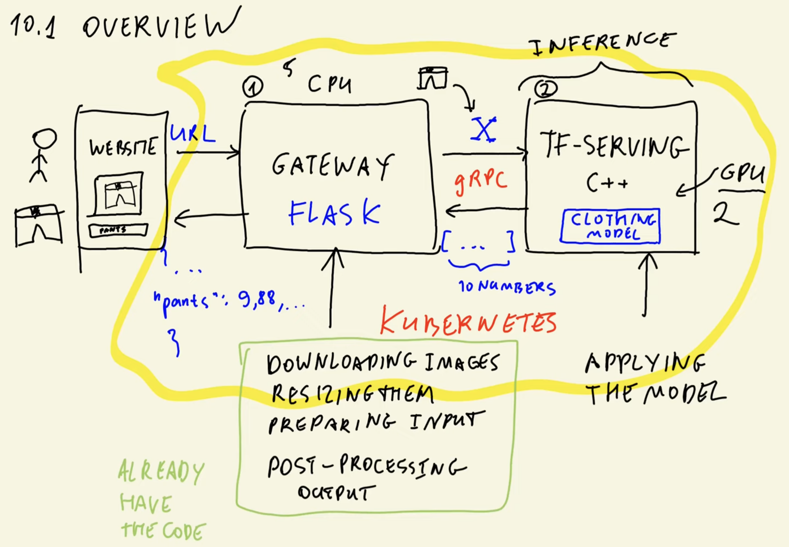
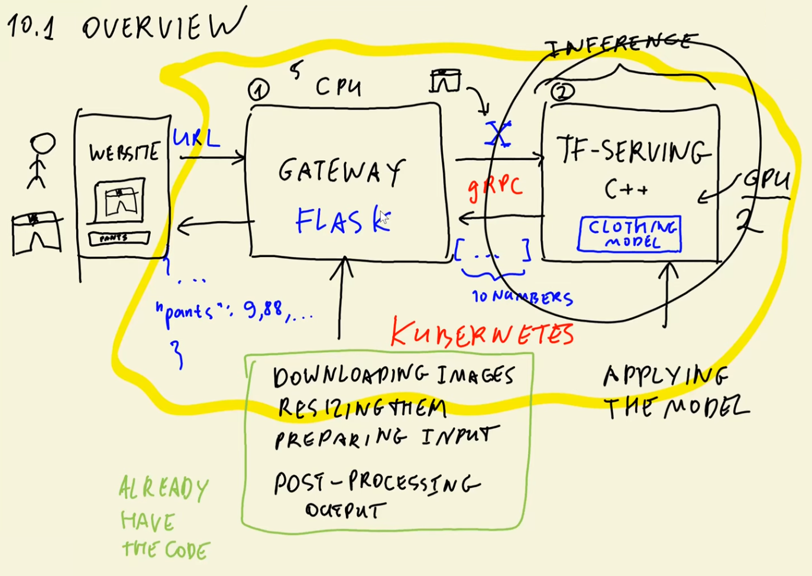
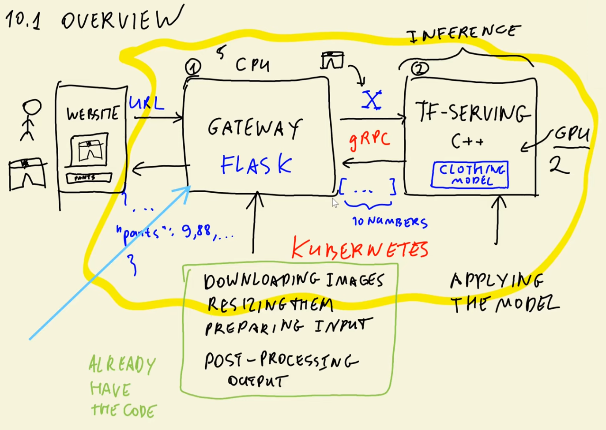
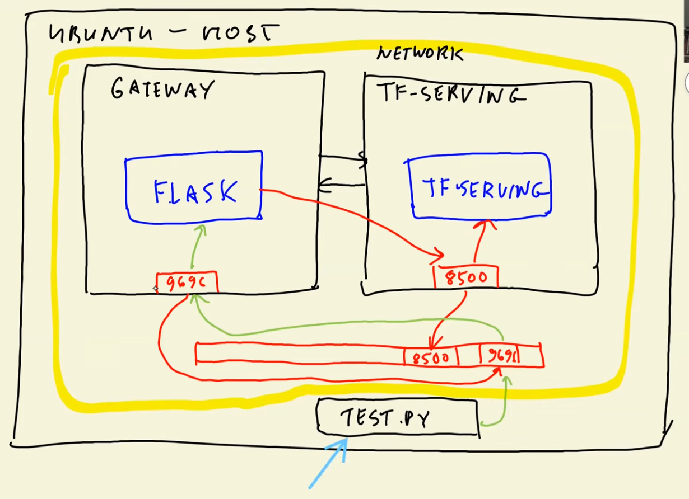
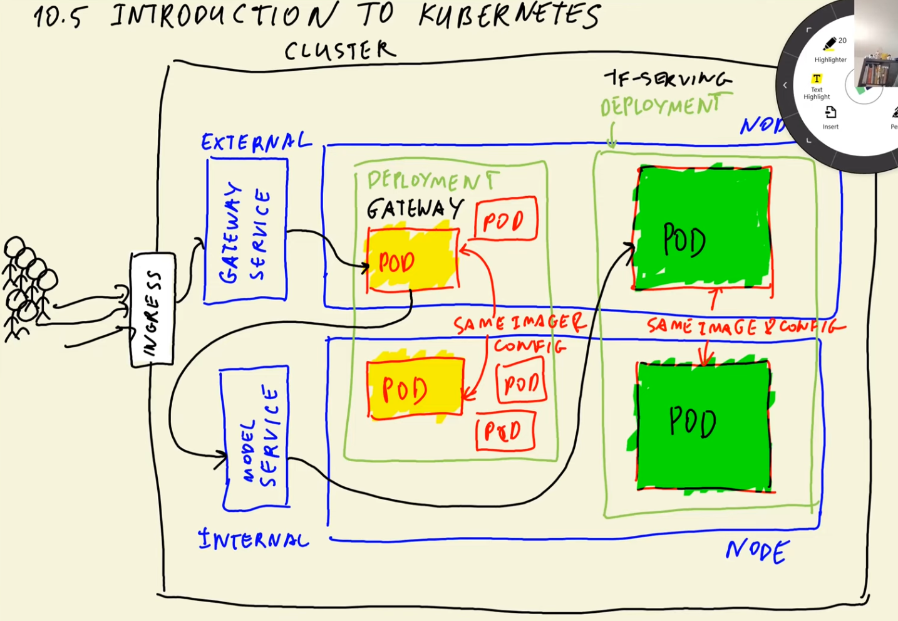
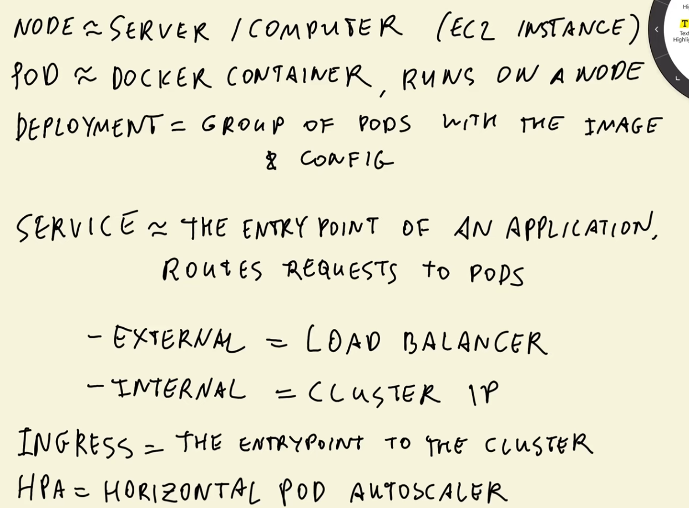
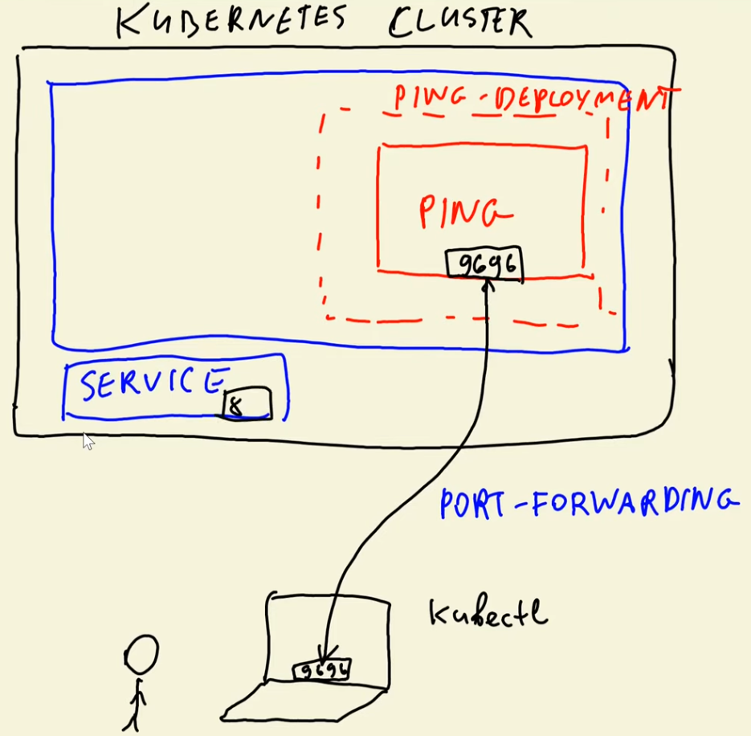

# ML Zoomcamp 10.1 - Overview

## Overview
Session 10 covers how to deploy an image classification system using **TensorFlow Serving** and **Kubernetes**, building on the model trained in previous sessions. The goal is to classify clothing images (e.g., pants) for an online classifieds website.



## Architecture Components
### 1. **TensorFlow Serving**
- A high-performance C++ system designed exclusively for **inference**.
- Receives a preprocessed input matrix **X** (numpy array representing the image).
- Returns an array of **10 prediction scores** for the clothing categories.
- Communicates using **gRPC**, a fast binary protocol.

### 2. **Gateway Service (Flask)**
Needed because:
- Users cannot perform preprocessing themselves.
- Websites prefer sending JSON, not using gRPC.
- TensorFlow Serving expects a formatted input (e.g., resized image, numpy array).

The gateway:
- Accepts an **image URL**.
- Downloads and preprocesses the image (resize, convert to numpy, prepare input).
- Sends it to TensorFlow Serving via gRPC.
- Postprocesses the 10 prediction scores into a **human-readable JSON response**.

### 3. **User Workflow**
1. User uploads a picture on the website.
2. Website sends the image URL to the gateway.
3. Gateway preprocesses and forwards it to TensorFlow Serving.
4. TensorFlow Serving returns prediction scores.
5. Gateway converts them into readable predictions.
6. Website uses predictions to suggest a clothing category.

## Why Two Services?
- **Different resource requirements:**  
  - TensorFlow Serving → GPU for fast matrix multiplications  
  - Gateway → CPU is enough  
- **Independent scalability:**  
  - Example: 2 GPU TensorFlow Serving instances + 5 CPU gateway instances  
- **Cleaner architecture:** preprocessing and postprocessing stay outside core inference.

## Reuse of Previous Code
- The gateway’s logic (downloading, preprocessing, postprocessing) heavily reuses code from the earlier serverless (AWS Lambda) session.

## Deployment Roadmap (Lessons Summary)

### **Lesson 1**
- Convert the Keras model into **SavedModel** format (required by TensorFlow Serving).
- Run TensorFlow Serving **locally in Docker** and test it.

### **Lesson 2**
- Build the gateway preprocessing service using **Flask**.

### **Lesson 3**
- Use **Docker Compose** to run both services (gateway + TensorFlow Serving) locally and connect them.

### **Lesson 5**
- Introduce core **Kubernetes concepts**.

### **Lesson 6**
- Deploy a simple test application to a local Kubernetes cluster using **kind**.

### **Lesson 7**
- Deploy both the gateway and TensorFlow Serving to Kubernetes.

### **Lesson 8**
- Move the entire system to the cloud using **AWS EKS** (but applicable to any cloud provider).

## Final Notes
- The session focuses on building a scalable, modular inference pipeline using industry-standard tools.
- The next step is converting the trained Keras model into the SavedModel format expected by TensorFlow Serving.

---

# ML Zoomcamp 10.2 - TensorFlow Serving

This section explains how to prepare and deploy a Keras model using **TensorFlow Serving**.



### Converting a Keras Model to SavedModel
- TensorFlow Serving requires models in the **SavedModel** format rather than traditional HDF5 files.
- A pre-trained image classification model (Xception) is downloaded and converted to this format.
- After conversion, the SavedModel directory contains the model architecture, weights, and metadata.

### Inspecting the SavedModel
- TensorFlow provides the `saved_model_cli` tool to inspect exported models.
- The signature definition is especially important:  
  It shows expected **input tensor shape** `(batch, 299, 299, 3)` and **output shape** `(batch, 10)`.
- This information is needed to correctly format data before sending requests to TensorFlow Serving.

### Running the Model with TensorFlow Serving (Docker)
- The SavedModel is loaded into a Docker container using the official `tensorflow/serving` image.
- Important Docker configuration:
  - **Port mapping** exposes gRPC on port `8500`.
  - **Volume mapping** links the local SavedModel directory to the container's model path.
  - **Environment variable** `MODEL_NAME` specifies which model to serve.

### gRPC and Protobuf
- TensorFlow Serving uses **gRPC**, a high-performance binary communication protocol.
- Inputs for inference must be encoded as **Protocol Buffers (protobuf)** instead of JSON.
- This allows efficient, production-grade model serving with low latency.

### Overall Purpose
This lesson demonstrates:
- How to export a model to SavedModel format  
- How to inspect it  
- How to serve it using TensorFlow Serving + Docker  
- Why protobuf/gRPC are required for inference requests  

It sets the foundation for building a complete ML inference pipeline using Kubernetes and TensorFlow Serving.

---

# ML Zoomcamp 10.3 - Creating a Pre-Processing Service

## 1. Review of Previous Work
- Previously, a Jupyter Notebook was used to:
  - Load an image of pants
  - Pre-process it
  - Convert it into protobuf format
  - Send the request to **TensorFlow Serving**
  - Post-process the received predictions

## 2. Convert Notebook to Python Script
- Jupyter is no longer needed.
- The notebook is converted into a `.py` script using **jupyter nbconvert**.
- The resulting script is renamed to `gateway.py`.
- The code is cleaned and organized into functions:
  - `prepare_request(x)` – builds protobuf request
  - `make_predictions(url)` – sends request and receives raw predictions
  - `prepare_response(pb_response)` – extracts float values and maps them to classes
- A simple `if __name__ == "__main__"` block tests the script.
- Running the script confirms working predictions.

## 3. Wrap Script in a Flask API
- Flask imports and boilerplate are added (taken from a previous lesson).
- A new endpoint `/predict` is created:
  - Accepts JSON containing an image URL.
  - Internally calls the prediction pipeline.
  - Returns results using `jsonify`.
- Flask app is tested with a small test script posting data to `localhost:9696/predict`.
- The service works as intended.

## 4. Architecture Overview
The system now has two components:
1. **TensorFlow Serving container** (Docker)
2. **Flask gateway service**
   - Receives client requests
   - Converts them to protobuf
   - Sends them to TensorFlow Serving
   - Converts model output to human-readable predictions

## 5. Add Dependencies (Without TensorFlow Itself)
- A `Pipfile` / pipenv environment is created.
- Installed packages include:
  - Flask
  - Pillow (image helper)
  - Gunicorn (for Docker later)
- **TensorFlow is *not* installed** to avoid a 1.7GB dependency.

### Problem
- The code requires only one function from TensorFlow: converting numpy arrays to protobuf (`make_tensor_proto`).
- Installing TensorFlow just for this is too heavy.

### Solution
- Use a lightweight package **tensorflow-protobuf**, containing only the protobuf files.
- A separate file, `proto.py`, is created to hold the protobuf-conversion logic.
- `gateway.py` imports this instead of loading full TensorFlow.
- Result: same behavior with a tiny fraction of the size.

## 6. Verification
- The system is run again inside the virtual environment.
- Predictions work correctly.
- No TensorFlow warnings appear, confirming that heavy dependencies were removed.

## 7. Final Notes
- Dependencies and environment setup are complete.
- TensorFlow Serving is running.
- The Flask application is functioning.
- Next step: **Dockerize the gateway service** and integrate both components using **Docker Compose**.

---

# ML Zoomcamp 10.4 - Docker-Compose




## Overview
This lesson covers how to run both the **TensorFlow Serving model** and the **gateway service** locally using Docker. Previously, TensorFlow Serving was run alone in Docker, while the gateway (a Flask app handling image preprocessing and gRPC communication) ran in a virtual environment. The goal is now to containerize both and orchestrate them together.

## 1. Preparing the Model Service Image
- Previously, TensorFlow Serving was launched using the official image, mapping:
  - Port **8500**
  - A local model directory
  - The environment variable `MODEL_NAME`
- To make the model self-contained and easier to deploy, a **custom Docker image** is created.
- Steps:
  - Create a Dockerfile for the model.
  - Copy the SavedModel directory into the image.
  - Set `MODEL_NAME` inside the Dockerfile.
  - Build the image and run it without requiring volume mounts or manual environment variables.

## 2. Preparing the Gateway Service Image
- The gateway service contains:
  - Image downloading and resizing logic
  - gRPC calls to TensorFlow Serving
  - Protobuf utilities
- A new Dockerfile is created using:
  - A Python base image
  - Copied files: `gateway.py`, `proto.py`, `Pipfile`, and `Pipfile.lock`
  - Installation of dependencies
  - Startup command for the Flask app
- The gateway is then built into a Docker image and run on port **9696**.

## 3. Why Communication Fails (Container Networking)
When the test script is executed:
- The request reaches the **gateway container** successfully.
- The gateway then attempts to call **localhost:8500** for TensorFlow Serving.
- Problem:  
  Inside the gateway container, **localhost refers only to that container**, not to the TensorFlow Serving container.
- Result:  
  gRPC connection error — *failed to connect to all addresses*.

### Root Cause
Each container has its own network namespace. Without linking them:
- Gateway cannot reach TensorFlow Serving.
- The mapped ports are only available to the host, not between containers.

## 4. Solution: Use Docker Compose
To allow containers to communicate:
- Docker Compose is introduced.
- Both services run inside the **same virtual network**.
- Containers can access one another by service name (e.g., `tf-serving:8500`).

### Steps:
1. Install Docker Compose (if not included in Docker Desktop).
2. Add `docker-compose.yml` file describing both services:
   - Model service
   - Gateway service
3. Define port mappings and container names.
4. Run everything with a single command.

## Key Concepts Covered
- Building Docker images for both TensorFlow Serving and gateway.
- Understanding why inter-container networking fails with plain Docker.
- Fixing communication issues using Docker Compose.
- Ensuring both services run in one shared network.
- Executing test requests end-to-end once the network is properly set up.

## End Result
After containerizing both components and orchestrating them using Docker Compose:
- TensorFlow Serving runs in one container.
- Gateway service runs in another.
- They can communicate through the internal Docker network.
- The test script successfully performs full prediction requests.

---

# ML Zoomcamp 10.5 - Introduction to Kubernetes

This lesson introduces the core concepts of **Kubernetes** and explains how it manages containerized applications such as Docker images.




## 🚀 What is Kubernetes?

Kubernetes is an **open-source system** for:

- Automating **deployment**
- Handling **scaling**
- Managing **containerized applications**

It can take the Docker images you created locally and deploy them to the cloud, automatically adjusting resources depending on the incoming load.

## 🖥️ Kubernetes Cluster Structure

### **1. Cluster**
A Kubernetes cluster contains multiple **nodes**.

### **2. Nodes**
A **node** is roughly equivalent to a:

- Physical machine  
- Virtual server (e.g., EC2 instance)

Nodes run your application workloads.

### **3. Pods**
A **pod** is:

- The smallest unit in Kubernetes  
- Roughly equivalent to a **Docker container**  
- Runs a specific image and configuration  
- Lives on a node  

Pods may require differing amounts of CPU / RAM.

### **4. Deployments**
A **deployment** groups multiple pods that:

- Use the **same Docker image**
- Share the **same configuration** (ENV vars, parameters)

Examples:
- *Gateway service deployment*
- *TensorFlow Serving model deployment*

## 🔗 Services & Ingress

### **Services**
A service is the **entry point** to a set of pods.  
It receives requests and routes them to available pods.

There are two main types:

### **1. External Service (LoadBalancer)**
- Exposed outside the cluster  
- Used by web clients / external applications  

### **2. Internal Service (ClusterIP)**
- Default service type  
- Only accessible **within** the cluster  

### **Ingress**
Ingress is the **true external entrypoint** to the Kubernetes cluster.  
It routes traffic to external services (e.g., gateway service).

## 📈 Scaling with HPA

Kubernetes can automatically scale based on load using:

### **HPA – Horizontal Pod Autoscaler**
- Adds more pods when traffic increases  
- Removes pods when traffic decreases  
- Can even request additional nodes if existing ones are full  

## 🎯 What You Need for ML Zoomcamp

For this course, the focus is on:

- **Pods**
- **Deployments**
- **Services**

You **will not** need to configure:

- Ingress  
- HPA  

But understanding them is helpful for real-world Kubernetes usage.

## 📝 Final Summary

- **Nodes** are the machines in the cluster.  
- **Pods** run containers on these nodes.  
- **Deployments** manage groups of identical pods.  
- **Services** provide stable endpoints for accessing pods:  
  - External = LoadBalancer  
  - Internal = ClusterIP  
- **Ingress** is the top-level entry point to the cluster.  
- **HPA** scales pods automatically based on traffic.

Kubernetes provides a scalable, automated environment for deploying machine learning services.

---

# ML Zoomcamp 10.6 - Deploying a Simple Service to Kubernetes



## Overview
This lesson demonstrates how to deploy a simple **Flask-based “ping” application** to a local **Kubernetes** cluster. The workflow includes preparing the app, containerizing it with Docker, setting up Kubernetes tools, creating a cluster, and deploying the application using Kubernetes **Deployments** and **Services**.

## 1. Preparing the Ping Application
- The goal is to reuse the simple *ping* Flask app from Session 5.
- Steps:
  - Create a `ping` folder.
  - Copy the `ping.py` Flask app into it.
  - Initialize a clean virtual environment by creating a fresh `Pipfile`.
  - Install required packages (`flask`, `gunicorn`).

## 2. Creating the Docker Image
- A Dockerfile is created (copied and adapted from Session 5).
- Steps:
  - Copy only `ping.py` into the image.
  - Adjust commands so the container runs the ping app.
- Build the image:
  - Tagging is important; avoid using `latest` for Kind.
  - Example tag used: `ping:v001`.
- Run the container locally to verify:
  - Expose port `9696`.
  - Sending a GET request to `/ping` returns `"pong"`.

## 3. Setting Up Kubernetes Tools
### Install Kubernetes CLI (`kubectl`)
- Needed to interact with Kubernetes clusters.
- On Linux, install manually (on macOS/Windows it typically comes with Docker Desktop).

### Install Kind
- **Kind** = Kubernetes IN Docker.
- Allows creating lightweight local Kubernetes clusters for testing.

### Create a Local Cluster
- Run `kind create cluster`.
- This sets up a Kubernetes control-plane container.
- Configure `kubectl` to use the new Kind cluster.

### Verify Installation
Using `kubectl get` commands:
- `kubectl get services`
- `kubectl get pods`
- `kubectl get deployments`  
All should show no resources yet, confirming a clean cluster.

## 4. Creating the Kubernetes Deployment
A Kubernetes **Deployment** describes:
- the desired number of pods
- pod configuration (image, ports, labels, resources)

### Key Parts of the Deployment YAML
- **kind: Deployment**
- **metadata**: name of the deployment (`ping-deployment`)
- **spec**:
  - **replicas**: 1
  - **selector**: match labels (`app: ping`)
  - **template**: pod configuration  
    - container name: `ping-pod`
    - image: `ping:v001`
    - resources: CPU/memory limits
    - exposed container port: `9696`

### Labels & Selectors
- Each pod gets the label `app: ping`.
- The Deployment uses this label to manage its pods.

## 5. Applying the Deployment
- Apply the YAML:  
  `kubectl apply -f deployment.yaml`
- Kubernetes attempts to create the pod.

### Common Issue Encountered
- Pod stuck in *ImagePullBackOff* or *ErrImagePull*.
- Reason: Kind cannot find local Docker images unless explicitly loaded.

### Fix
- Load the image into Kind:
- After loading, Kubernetes can successfully start the pod.

## 6. Verifying Deployment
Commands:
- `kubectl get deployments`
- `kubectl get pods`
- `kubectl describe pod <pod-name>`

This confirms:
- The image is now accessible.
- The pod is running.
- Labels, containers, ports, and resources match the deployment spec.

## Key Takeaways
- Kubernetes requires explicit configuration for **Deployments** and **Services** using YAML.
- Local Docker images must be imported into Kind using `kind load docker-image`.
- Deployments manage pods and ensure the desired number of replicas.
- Labels and selectors are essential for linking Kubernetes resources.
- Tools required: **Docker**, **kubectl**, **Kind**, and optionally **VS Code Kubernetes extension** for YAML templates.

---

# ML Zoomcamp 10.7 - Deploying TensorFlow Models to Kubernetes

## Overview
This lesson demonstrates how to deploy a **TensorFlow Serving model** and a **gateway service** to a **local Kubernetes cluster** created with `kind`. Previously, a simple service was deployed; now the full ML-serving stack is deployed.

## Architecture Recap
- **TensorFlow Serving service**
  - C++ service provided by TensorFlow.
  - Serves the trained model via **gRPC**.
  - Runs internally inside the cluster (ClusterIP).

- **Gateway service**
  - Custom Flask app.
  - Accepts images, resizes them, converts to NumPy arrays, packs them into protobuf, sends gRPC requests to TensorFlow Serving, and performs post-processing.
  - Must be exposed externally.

Both services mimic the original Docker Compose structure but are now deployed in Kubernetes.

## Step-by-Step Deployment

### 1. Inspect Existing Cluster
- Uses `kubectl get pods` and `kubectl get deployments` to review the existing ping example from previous lessons.

### 2. Deploy the TensorFlow Serving Model

#### Create Deployment YAML
- Defines a Kubernetes deployment for the TensorFlow model.
- Specifies:
  - Image: `zoomcamp10-model-xception...`
  - CPU and memory limits.
  - Container port `8500` (gRPC).
  - Single replica.

#### Load Image Into Kind
- `kind load docker-image <image-name>` allows the cluster to access the local image.

#### Apply Deployment
- `kubectl apply -f model-deployment.yaml`
- Initially fails due to insufficient CPU.
- CPU limit reduced to `0.5` to make it run.

#### Verify
- `kubectl get pods`
- Port-forwarding to test:
  - `kubectl port-forward <pod> 8500:8500`
  - Run local gateway script to verify predictions.

### 3. Deploy the Model Service
- Create a **ClusterIP** service (internal only).
- Exposes port `8500`.
- Apply and verify with:
  - `kubectl apply -f model-service.yaml`
  - `kubectl get service`

- Test via port-forwarding the service:
  - `kubectl port-forward service/tf-serving-clothing-model 8500:8500`

## 4. Deploy the Gateway Service

### Create Deployment YAML
- Uses image: `zoomcamp10-gateway...`
- Exposes port `9696`.
- Sets necessary environment variable:
  - `TF_SERVING_HOST`
  - Points to internal Kubernetes service using the pattern:
  ```bash
  <service-name>.default.svc.cluster.local:<port>
  ```
  - For example:
  ```bash
  tf-serving-clothing-model.default.svc.cluster.local:8500
  ```

### Test DNS Resolution Inside a Pod
- Uses `kubectl exec -it <pod> -- bash`
- Attempts to `curl` services internally.
- Installs missing tools (curl) after adjusting resource limits to allow updates.

## 5. Resource Adjustments
The cluster initially struggled due to insufficient CPU/memory for multiple pods. The lesson shows:
- Lowering ping service resource usage.
- Deleting and reapplying deployments when pods wouldn't terminate due to resource starvation.

## Key Concepts Highlighted
- **Kind cluster resource limitations** affect pod scheduling.
- **Port-forwarding** is crucial for local testing.
- **Service DNS naming conventions** in Kubernetes:
```bash
<service-name>.<namespace>.svc.cluster.local
```
- **ClusterIP vs external service types**.
- **gRPC communication** between gateway and TensorFlow Serving.
- Using `kubectl exec` to troubleshoot networking inside the cluster.

## Final Outcome
By the end of the lesson:
- TensorFlow model is deployed and served inside Kubernetes.
- Gateway is configured to communicate with it via internal service DNS.
- The full machine learning inference pipeline works end-to-end on the local Kubernetes setup.

---

# ML Zoomcamp 10.8 - Deploying to EKS


