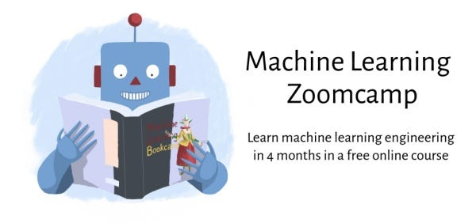

# 📚 Machine Learning Zoomcamp

A collection of notes, code examples, assignments, and projects from the **Machine Learning Zoomcamp** course.  

It covers the full ML lifecycle, including:  
- Data preparation & feature engineering  
- Model training & evaluation  
- Deployment and monitoring in production  
- End-to-end projects and experiments  

This repo is my personal workspace for learning, experimenting, and building practical ML solutions. 🚀