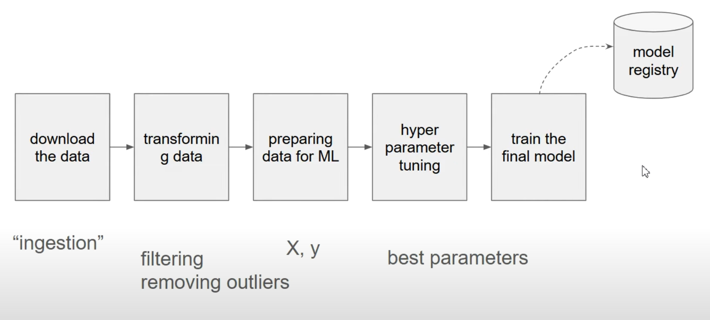

# MLOps Zoomcamp 3.1 - Machine Learning Pipelines: Summary

## Key Concepts

This video introduces the concept of machine learning pipelines and explains why they are important for MLOps. The instructor demonstrates how to transform messy Jupyter notebooks into structured, reproducible, and maintainable pipelines.

## Main Points

### What is a Training Pipeline?
- A training pipeline is a **sequence of steps executed in order to train a machine learning model**
- Converting notebooks to pipelines improves maintainability, reproducibility, and reliability

### Typical ML Pipeline Steps
1. **Download the data** (ingestion)
2. **Transform the data** (filtering, removing outliers)
3. **Prepare data for ML** (create X and y matrices)
4. **Hyperparameter tuning** (find best parameters)
5. **Train the final model** (using best parameters)
6. **Register the model** in a model registry

### Pipeline Implementation Options

1. **Simple Python Script**
   - Better than notebooks but still has limitations
   - Issues with scheduling, collaboration, centralization, and scalability
   - No built-in retry mechanisms or proper error handling

2. **Workflow Orchestration Tools**
   - **General Purpose Orchestrators**:
     - Airflow (popular but complex)
     - Prefect
     - Mage
   - **ML-specific Orchestrators**:
     - Kubeflow Pipelines
     - MLflow Pipelines

### Benefits of Workflow Orchestrators
- Centralized execution environment
- Team collaboration support
- Easy code updating in a central location
- Scalability with additional resources
- Built-in monitoring, alerting and notifications
- Dependency management between steps
- Retry mechanisms for failed steps