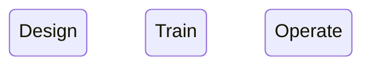
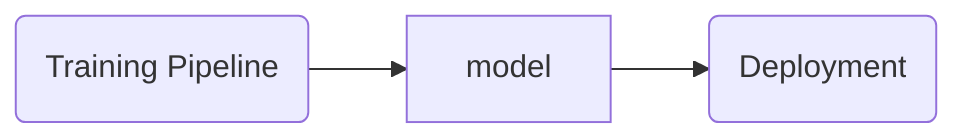
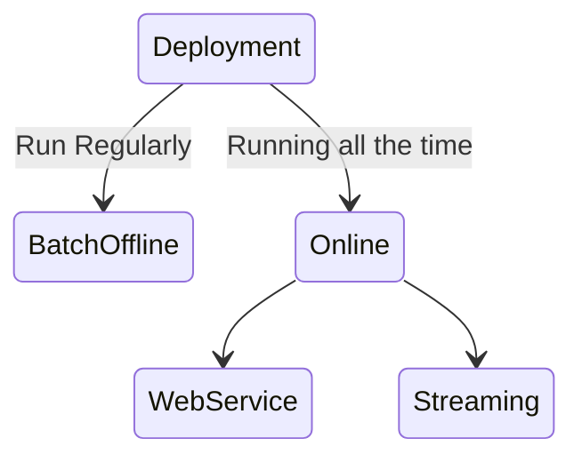
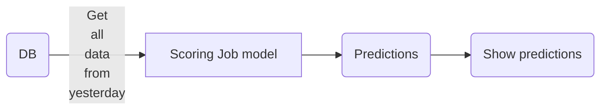

# Experiment Tracking

Schema:

## Deployment

### Batch Offline

- Run the model regularly (hourly, daily, monthly)

#### Marketing

- `Churn` - decide to stop using the service from a company and go use the service of a competitor

### Web Service

### Streaming

