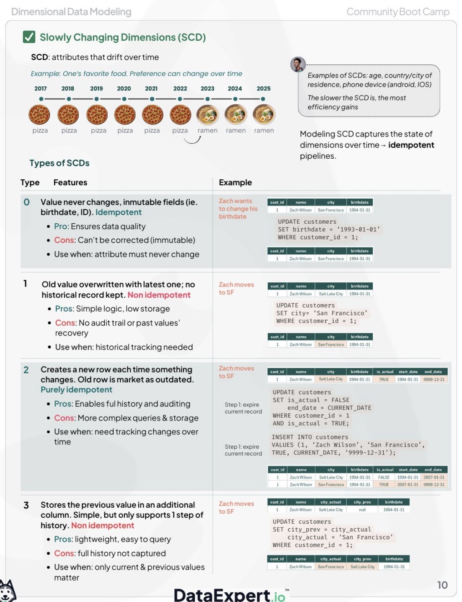

# 📘 Slowly Changing Dimensions (SCD)

## 📖 Overview
**`Slowly Changing Dimensions (SCD)`** &rarr; **techniques** used in data warehousing **to manage and track changes in dimension data over time**

**`dimension`** &rarr; contains **descriptive attributes** (e.g., customer name, address, product category), and these attributes may change over time

SCD methods define **how these changes are handled and stored**.

---

## 🎯 Why SCD is Important
- Preserve historical data
- Track changes over time
- Enable accurate reporting and analytics
- Support audit and compliance requirements

---

## 🧩 SCD Types



---

## 🔹 Type 0 – Fixed Dimension
### Description
- Data is **never changed**
- Original value is always retained

### Use Case
- Immutable data (e.g., date of birth)

### Example

| CustomerID | Name | BirthDate |
|------------|------|-----------|
| 1 | Alice | 1990-01-01 |

➡️ Even if the value changes, it is ignored.

---

## 🔹 Type 1 – Overwrite
### Description
- Old data is **overwritten**
- No history is preserved

### Use Case
- Non-critical changes (e.g., correcting typos)

### Example

Before:

| ID | City |
|----|------|
| 1 | Paris |

After:

| ID | City |
|----|------|
| 1 | London |

➡️ Previous value is lost.

---

## 🔹 Type 2 – Full History
### Description
- A **new record is created** for each change
- Full history is preserved

### Key Columns
- `start_date`
- `end_date`
- `is_current`

### Example

| ID | City | StartDate | EndDate | Current |
|----|------|-----------|---------|--------|
| 1 | Paris | 2020-01-01 | 2022-01-01 | No |
| 1 | London | 2022-01-02 | NULL | Yes |

➡️ Most commonly used SCD type

---

## 🔹 Type 3 – Partial History
### Description
- Stores **limited history**, typically one previous value

### Example

| ID | CurrentCity | PreviousCity |
|----|-------------|--------------|
| 1 | London | Paris |

➡️ Only one level of history retained

---

## 🔹 Type 4 – History Table
### Description
- Current data stored in main table
- Historical data stored in a separate table

### Example

**Main Table**

| ID | City |
|----|------|
| 1 | London |

**History Table**

| ID | City | ChangeDate |
|----|------|------------|
| 1 | Paris | 2022-01-01 |

---

## 🔹 Type 6 – Hybrid (1 + 2 + 3)
### Description
- Combines:
  - Type 1 (overwrite)
  - Type 2 (history)
  - Type 3 (previous value)

### Example

| ID | City | PrevCity | StartDate | EndDate |
|----|------|----------|-----------|---------|
| 1 | London | Paris | 2022-01-01 | NULL |

➡️ Provides both current and historical insights

---

## ⚖️ Comparison Table

| Type | History | Storage Cost | Complexity | Use Case |
|------|--------|-------------|-----------|----------|
| Type 0 | None | Low | Low | Static data |
| Type 1 | None | Low | Low | Corrections |
| Type 2 | Full | High | Medium | Audit/history |
| Type 3 | Limited | Medium | Medium | Simple tracking |
| Type 4 | Full (separate) | High | Medium | Large history |
| Type 6 | Full + current | High | High | Advanced analytics |

---

## 🧠 Best Practices
- Use **Type 2** for most business-critical dimensions
- Use **Type 1** for non-critical corrections
- Add **surrogate keys** for Type 2 tables
- Index effective date columns for performance
- Combine SCD with **Delta Lake MERGE** for efficient updates

---

## 🚀 Example (Delta Lake MERGE for SCD Type 2)

```sql
MERGE INTO customers target
USING updates source
ON target.id = source.id AND target.is_current = true
WHEN MATCHED AND target.city <> source.city THEN
  UPDATE SET end_date = current_date(), is_current = false
WHEN NOT MATCHED THEN
  INSERT (id, city, start_date, end_date, is_current)
  VALUES (source.id, source.city, current_date(), NULL, true)
```