## What Databricks is and why it became important

## 1. The beginning: one machine was enough
At first, companies processed data such as sales, logs, transactions, and events on **one machine** using SQL, Python, or Java.

This worked well when data was small.

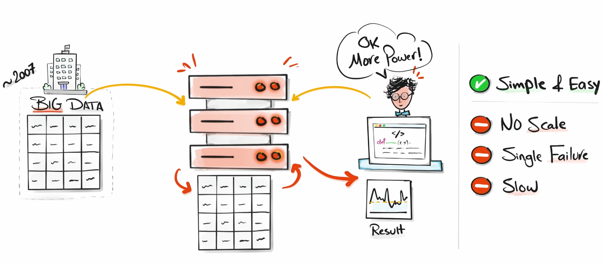

### The problem
Around **2007**, data volume exploded:
- more users
- more transactions
- more historical data
- new unstructured data like images, videos, and PDFs

Companies moved from **gigabytes to terabytes**, and one machine became too slow, too limited, and too risky. Even a bigger machine could only help temporarily.

### Key lesson
**Big data cannot be handled efficiently on a single machine.**

## 2. Hadoop: distributing the work
The next big solution was **Hadoop**.

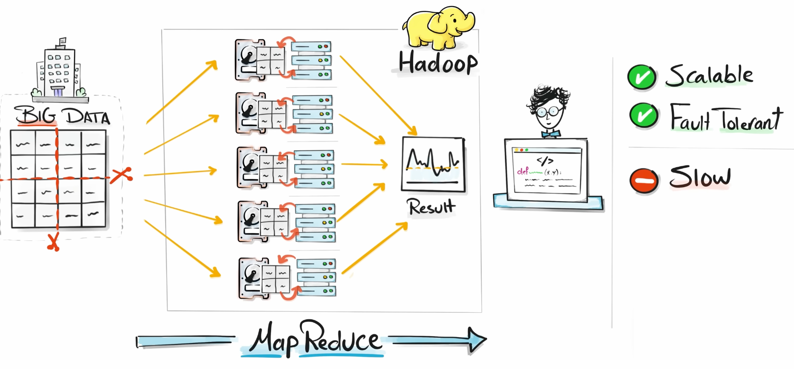

### What Hadoop introduced
Instead of using one machine, Hadoop uses **many machines working together**:
- data is split across machines
- each machine processes part of the data
- results are combined at the end

This is called a **distributed system**, based on the idea of **divide and conquer**.

### Benefits
- could process massive data volumes
- easy to scale by adding more machines
- more fault-tolerant than a single machine

### The downside
Hadoop was still **slow**, because it relied heavily on **reading and writing data from disk**.

## 3. Spark: faster big data processing
Around **2009**, researchers at **UC Berkeley** created **Apache Spark**.

### What made Spark different
Spark kept data **in memory whenever possible** instead of constantly using disk.

### Result
Spark kept the distributed power of Hadoop, but made processing **much faster**.

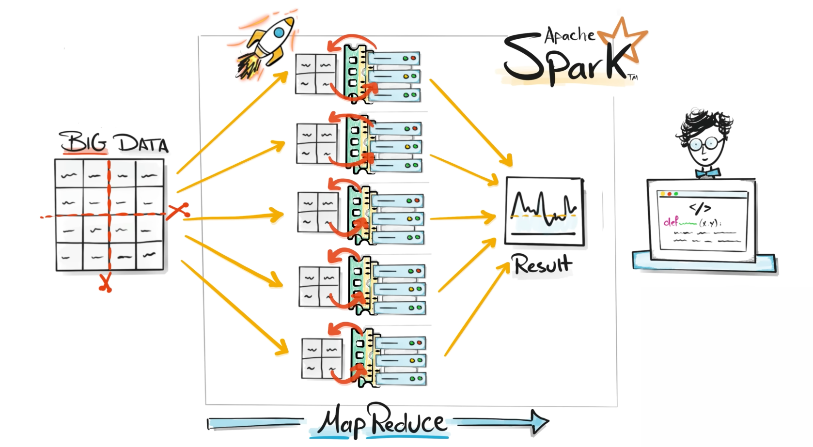

### Why Spark became popular
It offered:
- scalability
- fault tolerance
- speed

Spark quickly became the **dominant engine for big data processing**.

## 4. PySpark: opening Spark to Python users
At first, Spark was mostly used by engineers working with **Scala and Java**.

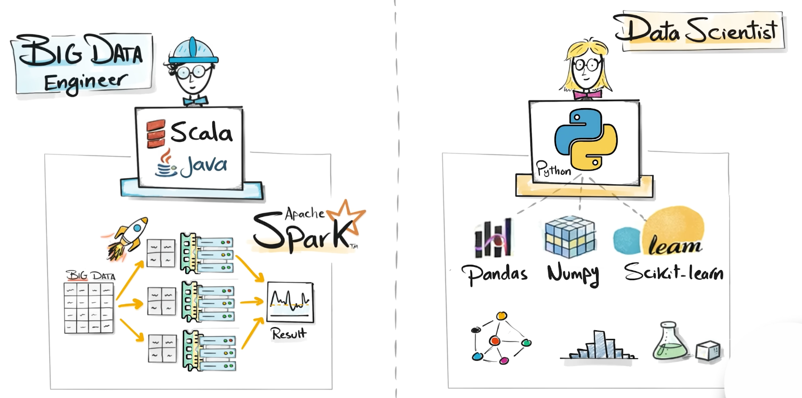

At the same time, **data science was growing fast**, and many people were working in **Python** with tools like:
- pandas
- NumPy
- scikit-learn

### The gap
There was a divide between:
- **big data engineers** using Spark
- **data scientists** using Python

### The solution
**PySpark** was introduced, allowing Python users to work with Spark.

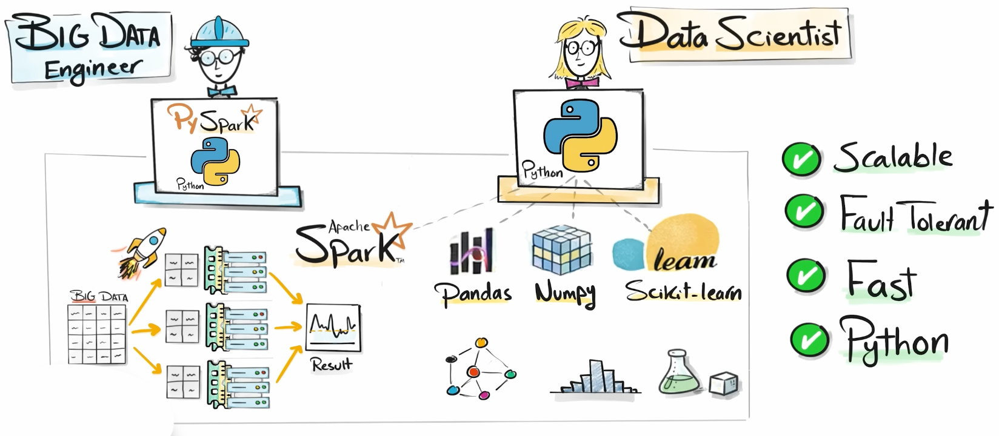

### Why this mattered
PySpark made Spark accessible to many more people because it felt similar to working with pandas and DataFrames, but with the power of distributed processing underneath.

## 5. The real problem: Spark was hard to manage
Even with PySpark, running real Spark projects was difficult.

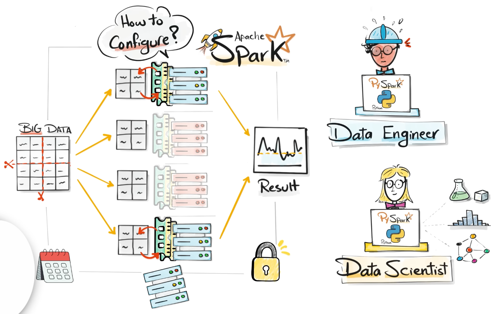

### Challenges
Teams had to manage:
- infrastructure
- clusters
- scaling
- security
- failures
- notebooks
- scheduling
- monitoring

This became even harder when companies moved from **on-premise systems to the cloud**.

### Core issue
Data engineers wanted to build pipelines and projects, not spend time maintaining infrastructure.

## 6. Databricks: managed Spark in one platform
In **2013**, the original creators of Spark founded **Databricks**.

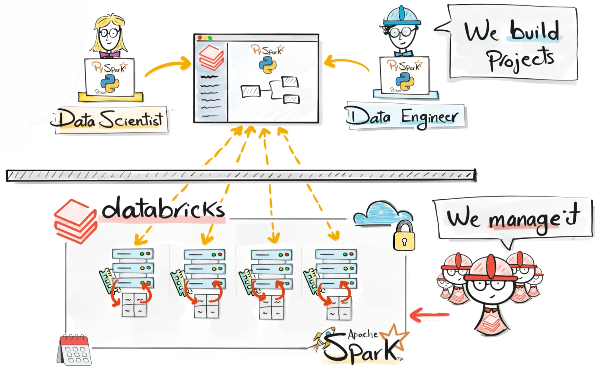

### Their idea
Create a platform that hides infrastructure complexity and provides:
- managed Spark
- notebooks
- cluster management
- cloud integration
- a unified environment

### Why companies liked it
Databricks allowed teams to focus on:
- building pipelines
- running analytics
- delivering projects faster

Instead of managing infrastructure, teams could focus on data work.

## 7. From data lakes to the lakehouse
As data engineers adopted cheap storage, they built huge **data lakes**.

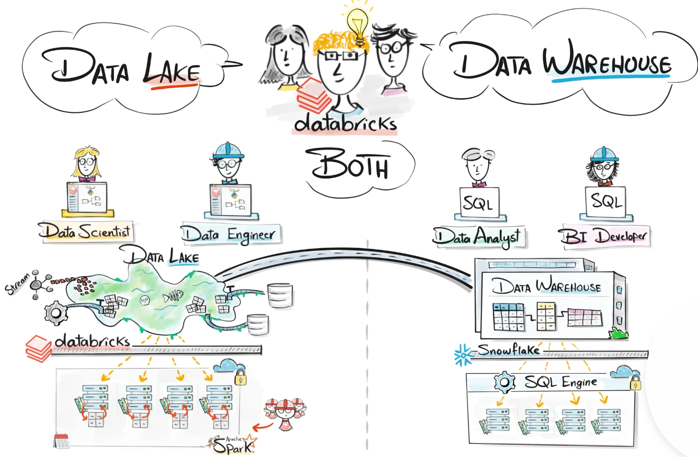

### The issue with data lakes
Over time, many data lakes became messy **data swamps**:
- poor structure
- weak control
- schema changes went unnoticed
- low trust in the data

At the same time, analysts and BI teams were living in a different world:
- structured data
- SQL
- cloud warehouses like Snowflake

This created a split between:
- engineers and data scientists in the data lake
- analysts and warehouse teams in SQL-based systems

### The result
Companies ended up with:
- multiple systems
- more pipelines
- more movement of data
- more cost and complexity

## 8. Delta Lake and the Lakehouse: the big turning point
To solve this, Databricks introduced the idea of combining the strengths of a **data lake** and a **data warehouse**.

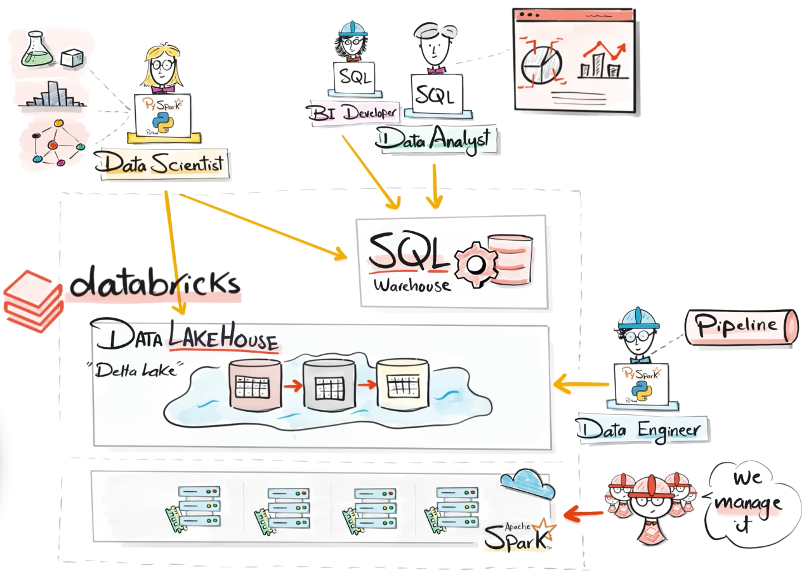

### The solution
This became:
- **Delta Lake**
- the **Lakehouse architecture**

### What it added
The lakehouse improved the data lake with features such as:
- transactions
- schema enforcement
- versioning
- more reliable and structured data

It also enabled SQL-based access, so analysts could work directly on the same platform.

### Why this was a game changer
Now:
- data engineers
- data scientists
- analysts
- BI teams
- warehouse developers

could all work together on **one platform**, using **one data layer**, without constantly moving data between systems.

### Key takeaway
This was the moment Databricks evolved from a **managed Spark tool** into a true **data platform**.

## 9. Unity Catalog: governance at enterprise scale
As Databricks grew in large enterprises, the biggest challenge was no longer speed.


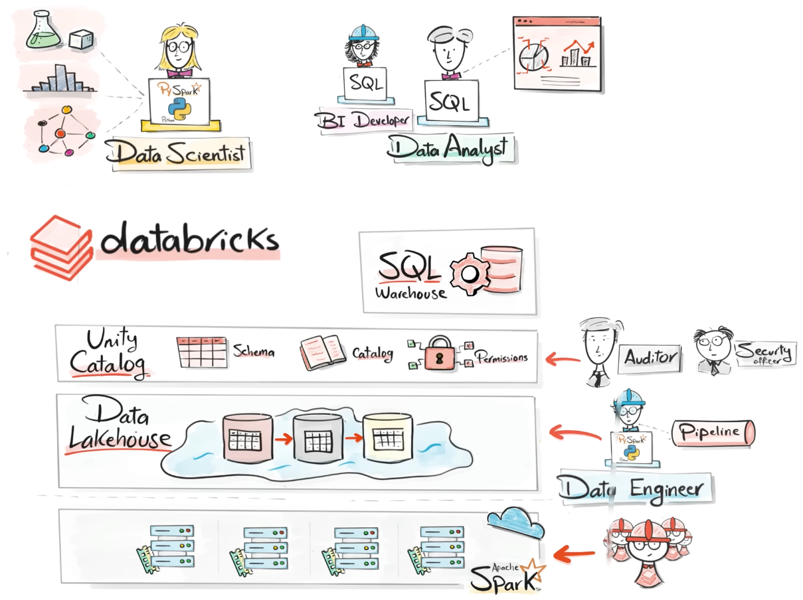

### New challenge
The real problem became **governance**:
- access control
- permissions
- compliance
- data lineage
- auditing

Large companies cannot simply let everyone access all data.

### Databricks’ response
They introduced **Unity Catalog**.

### What Unity Catalog provides
A centralized layer for:
- catalogs
- schemas
- tables
- permissions
- lineage

### Why it matters
It helps:
- governance teams
- auditors
- compliance teams
- data teams sharing assets securely

This made Databricks much more attractive for enterprise use.

## 10. Databricks becomes a Data + AI platform
The next big shift came with **AI**.

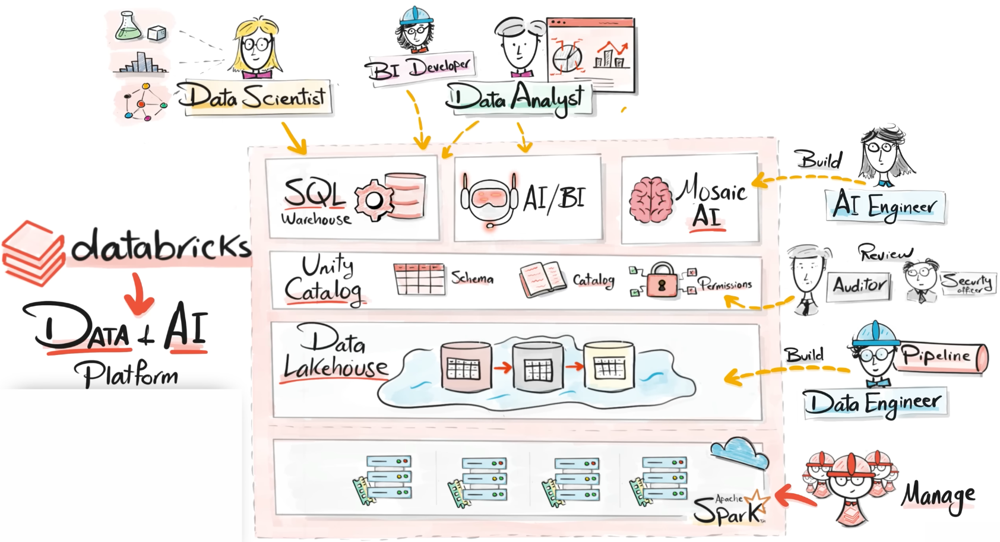

### The new need
Companies wanted more people to interact with data, not just:
- data engineers
- analysts
- scientists

They also wanted:
- managers
- project leads
- business experts

to ask questions directly.

### The challenge
Without AI, business users still needed data experts to get answers.

### Databricks’ response
Databricks extended the platform with AI capabilities, including:
- model training
- LLM integration
- intelligent agents
- AI systems built directly where the data lives

### Result
Databricks evolved again:
from a **data platform** to a **Data + AI platform**.

## Final message of the transcript
The speaker’s main point is that Databricks became powerful because it solved problems step by step:

1. **Single-machine limits**
2. **Distributed processing with Hadoop**
3. **Speed with Spark**
4. **Accessibility with PySpark**
5. **Operational simplicity with Databricks**
6. **Unified analytics with the Lakehouse**
7. **Enterprise governance with Unity Catalog**
8. **AI integration for broader business use**

Today, Databricks is presented as a platform where:
- data engineers build pipelines
- analysts explore data
- data scientists train models
- AI engineers build AI systems
- governance teams enforce compliance
- business users can interact with data through prompts

---

# 🧠 Job Cluster vs All-Purpose Cluster (Core Idea)

**Job clusters are temporary and created for specific jobs, while all-purpose clusters are persistent and used for interactive work**

---

## 🔵 Job Cluster

**`Job Cluster`** &rarr; a cluster that is **created automatically when a job starts and terminated when the job finishes**

### ⚙️ How it works
- Job starts &rarr; cluster is created
- Job runs &rarr; executes tasks
- Job ends &rarr; cluster is destroyed

### 🎯 Characteristics
- Ephemeral (temporary)
- Dedicated to a single job
- Automatically managed
- Cost-efficient

---

## 🟢 All-Purpose Cluster

**`All-Purpose Cluster`** &rarr; a shared, long-running cluster used for interactive workloads

### ⚙️ How it works
- You create it manually
- It stays running until stopped
- Multiple users can use it

### 🎯 Characteristics
- Persistent
- Shared across users
- Supports notebooks and ad-hoc queries
- Higher cost if left running

---

## ⚖️ Key Differences
| Feature    | Job Cluster           | All-Purpose Cluster        |
| ---------- | --------------------- | -------------------------- |
| Lifetime   | Temporary             | Persistent                 |
| Usage      | Automated jobs        | Interactive work           |
| Cost       | Lower (auto shutdown) | Higher (runs continuously) |
| Sharing    | Single job            | Multiple users             |
| Management | Automatic             | Manual                     |

### 🧠 Important Insight
Job clusters are preferred for production pipelines because they are isolated and cost-efficient.

**Job clusters in production to ensure isolation and cost control, and all-purpose clusters for development and experimentation**

### 🎯 One-Line Summary
**Job cluster = temporary & automated**
**All-purpose cluster = persistent & interactive**

---

## Photon

**`Photon`** &rarr; **a high-performance execution engine in Databricks that accelerates SQL and DataFrame workloads**

### 🔧 Simple Explanation
<u>Think of it like this</u>:
- Spark (Catalyst + Tungsten) &rarr; already fast
- Photon &rarr; makes it even faster 🚀

👉 **It replaces parts of the Spark execution engine with a more efficient one**

---

## ⚙️ What Photon Actually Does
Photon improves performance by:

### 1️⃣ Native Code Execution
- Written in C++ (not JVM)
- Runs closer to hardware

👉 Faster than standard Spark execution

### 2️⃣ Vectorized Processing
- Processes data in batches instead of row by row

👉 Better CPU utilization

### 3️⃣ Optimized Algorithms
- Faster joins
- Faster aggregations
- Better filtering

### 4️⃣ Better CPU Efficiency
- Uses modern CPU features (SIMD, caching)

👉 Less overhead, more speed

---

### 📊 Where Photon Helps Most
<u>Photon is especially effective for</u>:
- SQL queries
- DataFrame operations
- Joins
- Aggregations
- ETL pipelines

### 🔄 How It Fits in Spark
```
Your code
   ↓
Catalyst → builds optimized plan
   ↓
Photon → executes it faster than Tungsten
```
👉 Photon replaces parts of Tungsten execution layer

### 🎯 Why Photon Is Important
- Faster queries (often 2x–5x)
- Lower compute costs
- Better performance for large datasets

### 🔥 Bonus Tip
**Photon is fully compatible with Spark APIs, so no code changes are required to benefit from it**

### 🎯 One-Line Summary
**Photon = faster execution engine for Spark in Databricks**

---

## Delta Live

**`Delta Live Tables`** &rarr; a framework in Databricks for building, managing, and automating reliable data pipelines using declarative code

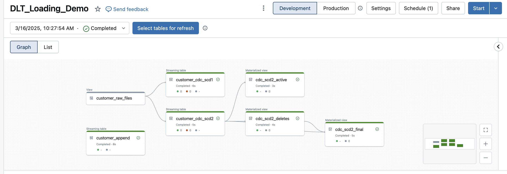

### 🔧 Simple Explanation
<u>Instead of manually writing</u>:
- ingestion logic
- transformations
- error handling
- pipeline orchestration

👉 Delta Live Tables does it for you automatically.

<u>You just define</u>:
```
what the data pipeline should do
```

<u>👉 Databricks handles</u>:
- execution
- dependencies
- monitoring
- optimization

### ⚙️ How It Works
You define tables using code (SQL or Python):
```sql
CREATE LIVE TABLE clean_data AS
SELECT * FROM raw_data WHERE valid = true;
```
👉 DLT:
1. Understands dependencies
2. Builds the pipeline
3. Runs it automatically

### 🧩 Key Features
1️⃣ Declarative Pipelines
2️⃣ Automatic Orchestration
3️⃣ Data Quality Checks
4️⃣ Built-in Monitoring
5️⃣ Incremental Processing

### 🎯 Why Use Delta Live Tables
- Less manual pipeline code
- Built-in reliability
- Easier maintenance
- Faster development

### 🔄 DLT vs Traditional Pipelines
| Feature       | Traditional    | DLT       |
| ------------- | -------------- | --------- |
| Orchestration | Manual         | Automatic |
| Data quality  | Custom code    | Built-in  |
| Monitoring    | External tools | Built-in  |
| Complexity    | Higher         | Lower     |