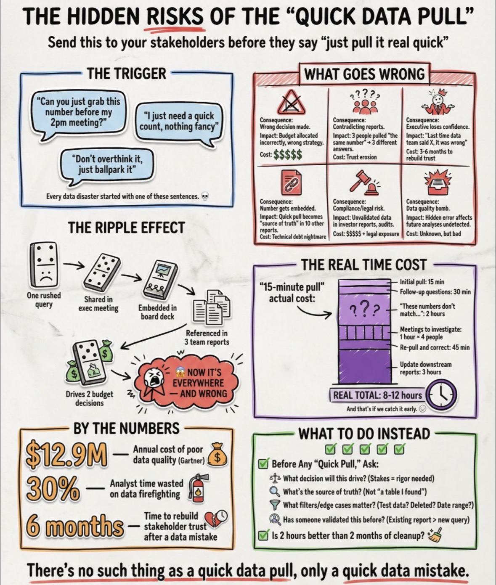

## Predicate Pushdown

**`Predicate pushdown`** &rarr; an **optimization where filters are applied as early as possible**, ideally **at the data source level**, to reduce the amount of data read and processed

---

## Exactly-Once Processing

**`Exactly-once processing`** &rarr; ensures that each record is processed only once, even in the presence of failures or retries

### 🔧 Example
<u>Imagine</u>:
- system crashes during processing
- job restarts

<u>👉 Without exactly-once</u>:
- duplicates ❌

<u>👉 With exactly-once</u>:
- each record processed once ✅

### 🎯 Where it’s used
- streaming systems
- financial data
- critical pipelines

---

## Idempotency

**`Idempotency`** &rarr; means that **running the same operation multiple times produces the same result**

### 🔧 Example
If you run a pipeline twice:
- 👉 Without idempotency:
  - Data → duplicated ❌
- 👉 With idempotency:
  - Same result every time ✅

### 🎯 Why it matters
- safe retries
- reliable pipelines
- no duplicates

---

# Schema-on-Read vs Schema-on-Write

---

## 🔵 Schema-on-Read

**`Schema-on-Read`** &rarr; Schema is applied when reading the data

## 🟢 Schema-on-Write

**`🟢 Schema-on-Write`** &rarr; Schema is enforced when writing data

### ⚖️ Comparison
| Feature             | Schema-on-Read | Schema-on-Write |
| ------------------- | -------------- | --------------- |
| When schema applied | Read time      | Write time      |
| Flexibility         | High           | Low             |
| Data quality        | Lower          | Higher          |
| Use case            | Data lake      | Data warehouse  |

# Hidden Risk of "Quick Data Pull"

