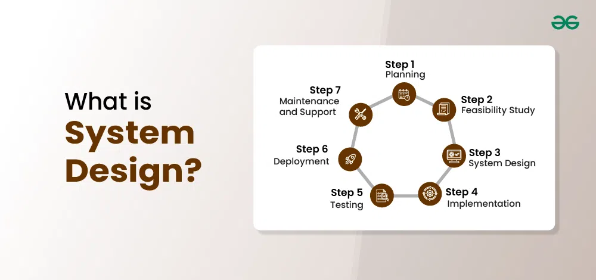
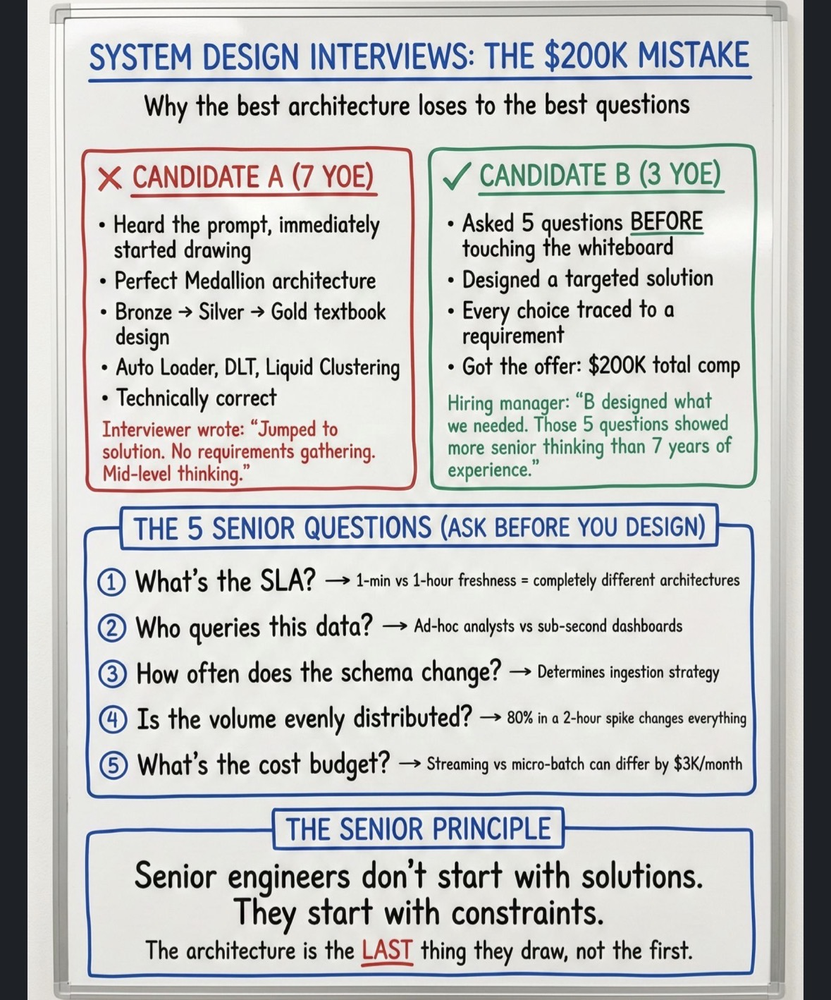

# System Design


## 🧠 What is System Design?
**`System design`** &rarr; the process of defining how different components (data, services, infrastructure) work together to solve a problem in a scalable, reliable, and efficient way

### 🔧 Simple Explanation
System design is answering:
- 👉 “How would you build this system?”

Not just:
- writing code ❌

But:
- designing the whole solution ✅

### 🏗️ What You Design in a System
A system includes:
- data sources
- data pipelines
- storage
- processing
- APIs / outputs
- infrastructure

### Example (Data Engineering System)
```
API → Azure Data Factory → Databricks → Delta Lake → Power BI
```
👉 System design = how all these connect and scale

## 🎯 What System Design Focuses On
### 1️⃣ Scalability
- Can the system handle more data/users?

Example:
- millions of records per day

### 2️⃣ Reliability
- What happens if something fails?

Example:
- retries
- fault tolerance

### 3️⃣ Performance
- How fast is the system?

Example:
- partitioning
- caching

### 4️⃣ Cost
- How expensive is it?

Example:
- job clusters vs always-on clusters

### 5️⃣ Maintainability
- Is it easy to update and debug?

## 🧠 Example Question (You WILL get something like this)
“Design a data pipeline for processing financial transactions”

Good Answer Structure
1. Ingestion
   - API / Kafka / ADF
2. Storage
   - Data Lake (S3 / ADLS)
3. Processing
   - Databricks (Spark)
4. Architecture
   - Bronze / Silver / Gold
5. Serving
   - BI / dashboards
6. Monitoring
   - logs, alerts

## 🔄 System Design vs Coding
| Coding               | System Design         |
| -------------------- | --------------------- |
| Write functions      | Design systems        |
| Solve small problems | Solve large problems  |
| Focus on logic       | Focus on architecture |

---

# System Design Interview Ponts

