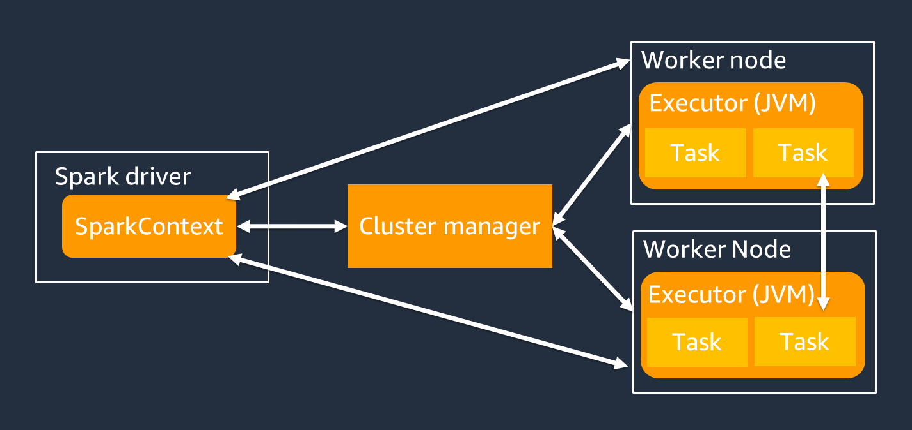
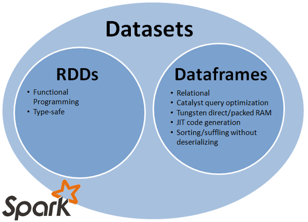
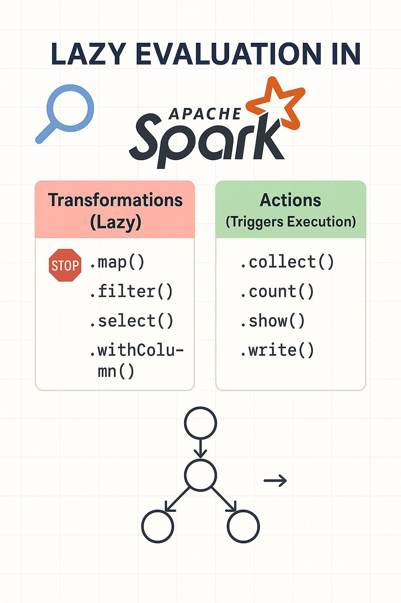
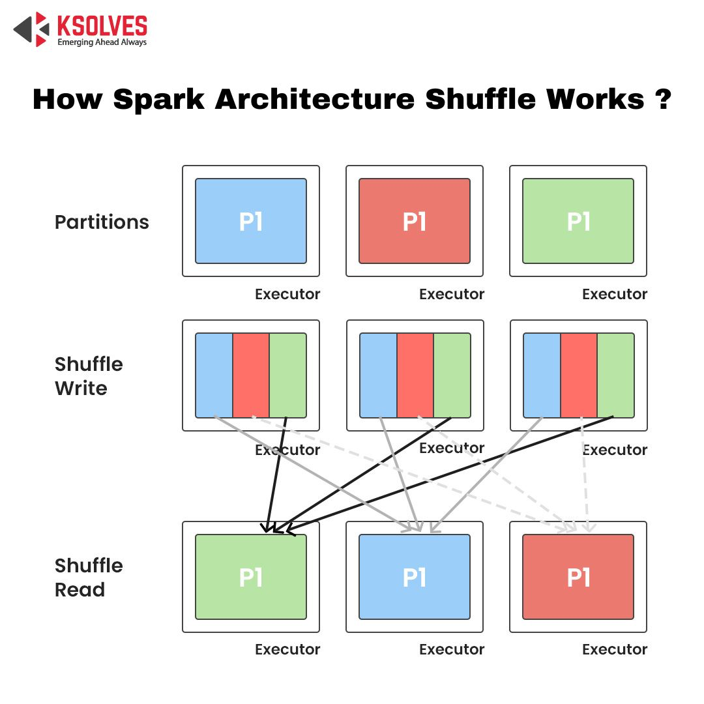
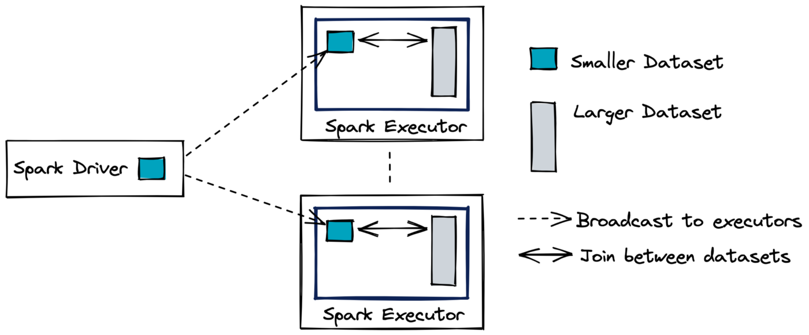
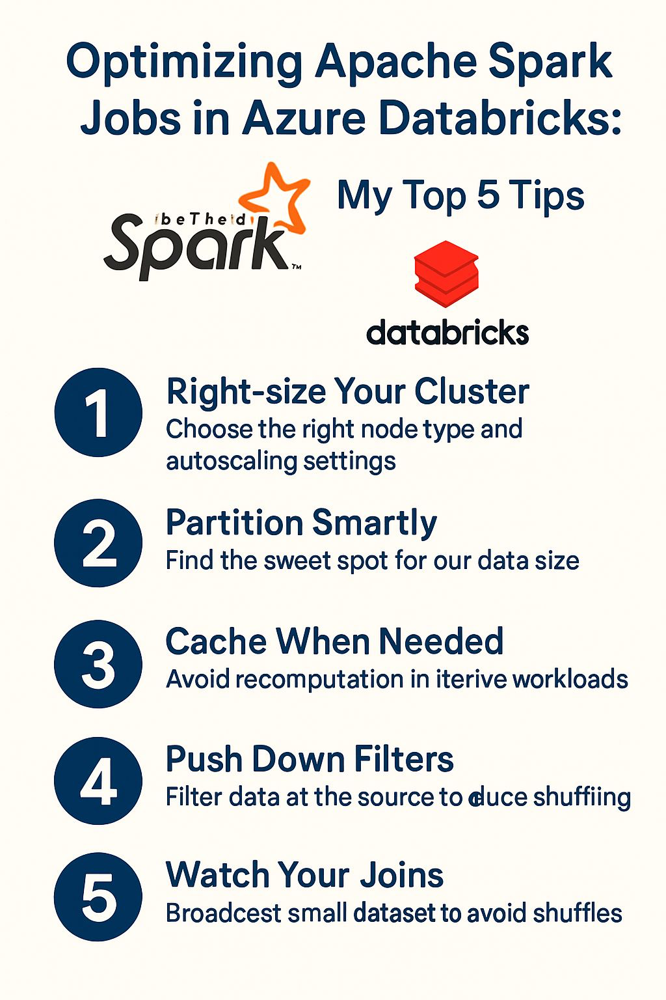
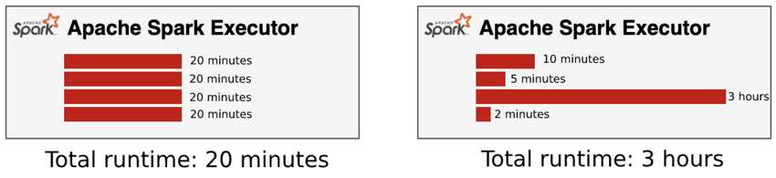
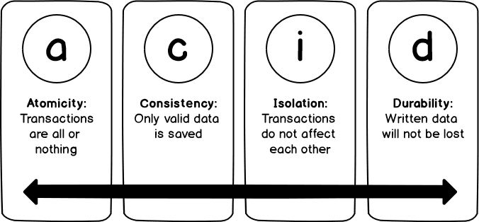
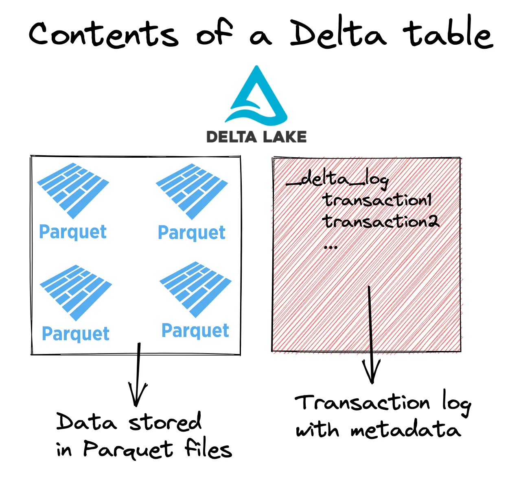

# 🧠 Common Questions - Spark / Delta / Databricks Flashcards

---

## 1. What is Apache Spark and how does it work?
**Q:** What is Apache Spark and how does it work?  
**A:** Apache Spark is an open-source framework for parallel computing data in memory across distributed machines. This framework supports batch, streaming and machine learning, works with languages like java, scala, python and SQL. 

Internally, Spark works by splitting data into partitions and processing them in parallel across multiple nodes. When a job is executed, the Spark driver builds a DAG of transformations, that is then divided in stages and taks. These tasks are distributed to executors which process the data and return it to the driver.

Apache Spark is composed of 3 components:
1. Spark Driver - the main program that contains the spark session, build the DAG, schedule tasks, coordonate executors and collect the results
2. Workers - process and transform pratitioned data and return the result to the spark driver
3. Cluster Manager - Manage resources on the cluster - This park is now handled by Databricks

---

## 2. What is the difference between RDD, DataFrame, and Dataset?
**Q:** What is the difference between RDD, DataFrame, and Dataset?  
**A:**
RDD, DataFrame, and Dataset are different objects in Spark, mainly differing in level of abstraction and optimization.

Abstraction means hiding complexity and giving you a simpler way to work with something.

**`RDD (Resilient Distributed Dataset)`** &rarr; it is a **low level abstraction** &rarr; It is an immutable distributed collection of objects (type safety) that gives full control over data processing but lacks built-in optimization, making it less efficient for most use cases.

**`DataFrame`** &rarr; is a higher-level abstraction &rarr; is a structured data with a schema, similar to a table, known for computational optimization.

**`Dataset`** &rarr; is a higher-level abstraction &rarr; is a stronger typed version of DataFrame (mainly used in Scala/Java) &rarr; It combines the benefits of RDD (type safety) and DataFrame (optimization)

---

## 3. What is lazy evaluation?
**Q:** What is lazy evaluation?  
**A:** Lazy evaluation means transformations are not executed until an action is triggered, allowing Spark to optimize execution plans

---

## 4. What is a shuffle and why is it expensive?
**Q:** What is a shuffle and why is it expensive?  
**A:** A shuffle redistributes data across partitions, typically during joins or aggregations. It is expensive due to network transfer, disk I/O, and data movement.

---

## 5. What is a broadcast join and when do you use it?
**Q:** What is a broadcast join and when do you use it?  
**A:** A broadcast join sends a small dataset to all executors to avoid shuffle. It is used when one table is small enough to fit in memory.

---

## 6. How do you optimize a slow Spark job?
**Q:** How do you optimize a slow Spark job?  
**A:** 
1. Analyzing Spark UI
2. Reducing shuffles
3. Using broadcast joins
4. Optimizing partitions
5. Caching data
6. Improving query logic

---

## 7. How do you handle skewed data?
**Q:** How do you handle skewed data?  
**A:** 
1. Broadcast joins
2. Salting
3. Repartitioning
4. Adaptive query execution
5. Pre-aggregation

---

## 8. What is Delta Lake and why use it over Parquet?
**Q:** What is Delta Lake and why use it over Parquet?  
**A:** Delta Lake adds:
1. ACID transactions
2. Schema enforcement
3. Versioning
4. Efficient updates on top of Parquet files

---

## 9. What are ACID transactions in Delta Lake?
**Q:** What are ACID transactions in Delta Lake?  
**A:** 

| ACID Property | Description | Example / Key Concept |
|---------------|-------------|------------------------|
| **Atomicity** | A transaction **either fully completes or does not happen at all**. | If a Spark job fails during a write, **no partial data is committed**. |
| **Consistency** | Data always remains in a **valid state according to schema rules**. | **Invalid writes are rejected**. |
| **Isolation** | Multiple processes can **read and write simultaneously without corrupting data**. | Delta uses **optimistic concurrency control**. |
| **Durability** | Once a transaction is **committed**, it is **permanently stored** in the data lake. | Committed data remains **persisted and recoverable**. |

---

## 10. What is Time Travel?
**Q:** What is Time Travel in Delta Lake?  
**A:** It allows querying previous versions of a table using version number or timestamp.

---

## 11. What is Schema Enforcement vs Schema Evolution?
**Q:** What is Schema Enforcement vs Schema Evolution?  
**A:** Schema enforcement prevents invalid schema writes, while schema evolution allows controlled schema changes like adding new columns.

---

## 12. How do you implement an upsert (SCD Type 1)?
**Q:** How do you implement an upsert (SCD Type 1)?
**A:** By using MERGE INTO to update existing records and insert with overwrite.

---

## 13. How do you implement SCD Type 2 in Delta Lake?
**Q:** How do you implement SCD Type 2 in Delta Lake?  
**A:** By creating new records for changes, updating old records with end dates, and marking current records using flags.

---

## 14. How do you handle duplicates?
**Q:** How do you handle duplicates in data pipelines?  
**A:** By using deduplication logic such as DISTINCT, dropDuplicates(), or window functions.

---

## 15. What is the Delta Log (_delta_log)?
**Q:** What is the Delta Log (_delta_log)?  
**A:** It is a transaction log that stores metadata, schema, and version history of a Delta table.

---

## 16. What does VACUUM do and what are the risks?
**Q:** What does VACUUM do and what are the risks?  
**A:** VACUUM removes old data files to free space, but can break time travel if retention is too short.

---

## 17. What happens if you overwrite a Delta table?
**Q:** What happens when you overwrite a Delta table?  
**A:** A new version is created and previous data is logically replaced, but still accessible via time travel (until vacuumed).

---

## 18. What is a cluster?
**Q:** What is a cluster in Spark/Databricks?  
**A:** A cluster is a group of machines (nodes) that work together to process data in parallel.

---