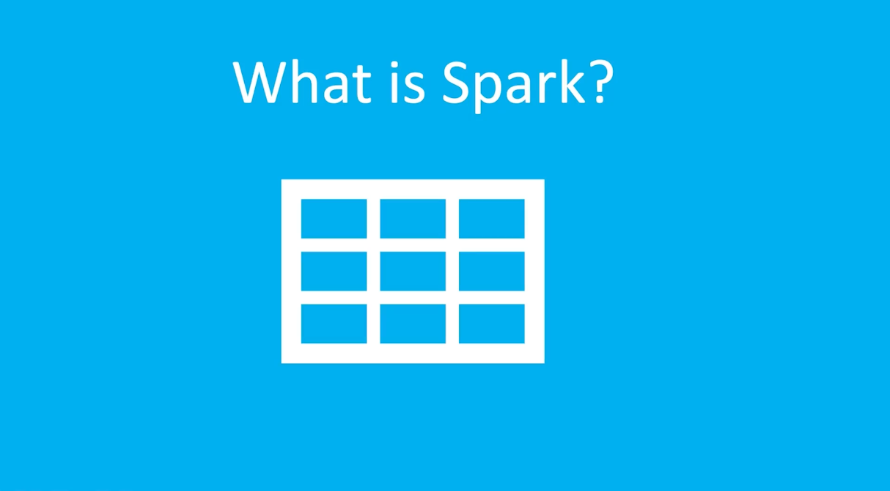
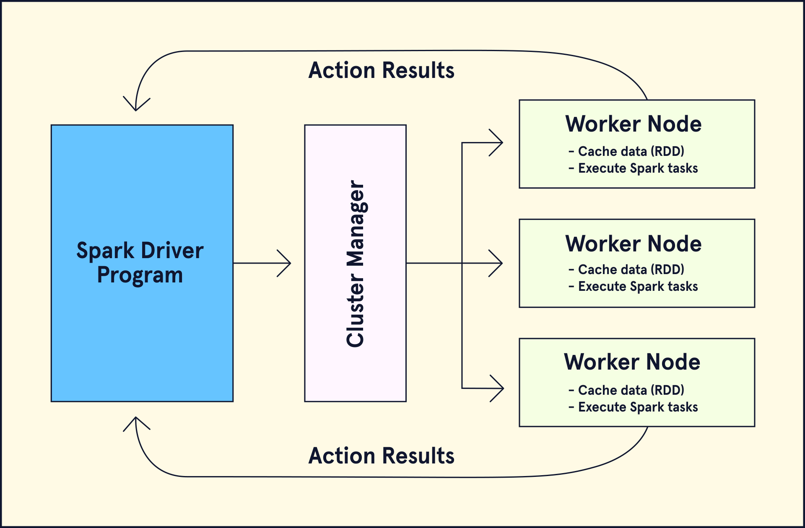
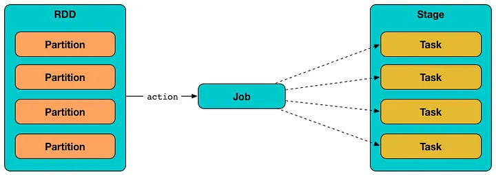
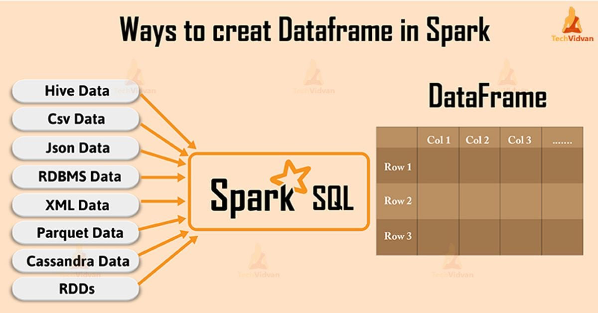

## 1️⃣ Apache Spark


**`Apache spark`** &rarr; **open-source framework designed for in-memory paralle processing of large-scale data across multiple machines**.

<u>Key characteristics</u>:
- Distributed computing
- In memory-processing
- Scalable cluster execution
- Supports batch, streaming, machine learning, and SQL workloads

---


| Feature | Description | Key Points |
|--------|-------------|------------|
| **Speed** | Spark performs computations **in memory**, which significantly improves processing speed compared to traditional **disk-based frameworks** like earlier Hadoop MapReduce systems. | In-memory processing, faster than disk-based systems |
| **Ease of Use** | Spark provides **simple and flexible APIs** in multiple programming languages, making it accessible to many developers and data engineers. | Java, Scala, Python, R |
| **Versatility** | Spark supports multiple types of **data processing workloads within a single framework**, allowing organizations to build **end-to-end data pipelines**. | ETL, Streaming analytics, Machine learning, Graph processing |
| **Scalability** | Spark can **scale from a single server to thousands of distributed machines**, supporting both small workloads and large enterprise-level data processing. | Works from single-node to large distributed clusters |
| **Integration** | Spark integrates with many **data sources and storage systems**, enabling it to operate in diverse architectures and cloud environments. | Hadoop, Apache HBase, Apache Cassandra, AWS S3, Cloud data lakes and warehouses |


---

## 2️⃣ [Spark Architecture Concepts](https://docs.aws.amazon.com/prescriptive-guidance/latest/tuning-aws-glue-for-apache-spark/key-topics-apache-spark.html)


---

### 👑 Driver
**`Driver`** &rarr; **main program that contains the Spark application**.

<u>Key characteristics</u>:
- Creates the Spark session/context  
- Builds the execution plan (DAG)  
- Schedules tasks  
- Coordinates executors  
- Collects results

**`Driver`** &rarr; **brain of the Spark application**



<u>Flow</u>:
1. You run a Spark job.
2. The driver converts your code into tasks.
3. Tasks are distributed to executors.

---

### 👷 Executors

**`Executors`** &rarr; **worker that execute tasks on the cluster node**

<u>Key characteristics</u>:
- Execute trask asigned by the driver
- Process data partitions
- Perform transformation and actions
- Return results to the driver
- Store cached data

<u>Key points</u>:
- Each executor runs on a worker node
- Each executor has **memory and CPU cores**
- Multiple task can run in parallel in an executor

**`Executor`** &rarr; **worker doing the actual computation**

---

## 📝 Cluster Manager

**`Cluster Manager`** &rarr; **manages the resources of the cluster**

<u>Key characteristics</u>:
- Allocate CPU and memory resources
- Launch executor processes
- Manage cluster nodes

**`Databricks`** &rarr; **handles these automatically**

---

## 3️⃣ Execution Model Concepts

---

### Job

**`Job`** &rarr; **entire computation trigger by an action in Spark**

<u>Example actions</u>:
- `count()`
- `show()`
- `collect()`
- `write()`

When an action is executed:
1. Spark builds a **DAG execution plan**
2. The job is divided into stages

---

### Stage



**`Stage`** &rarr; **group of task that run in parallel without requiering data shuffeling**

Spark divides jobs into stages based on **shuffle boundries**

Typical reason for new stage:
- `groupBy`
- `join`
- `reduceByKey`

<u>Example pipeline</u>:
- `Read data → Filter → Map → GroupBy → Count`

<u>Spark may split into</u>:
- Stage 1
    - `Read + Filter + Map`
- Stage 2
    - `GroupBy + Count`

---

## Task

**`Task`** &rarr; **smallest unit of work in Spark** 
↳ **each task represents one data partiton**
↳ **one task per partition**

**`Tasks`** &rarr; **run in parallel across executors**

---

## RDD (Resilient Distributed Dataset)

**`RDD`** &rarr; **an imutable distributed collection of objects partitioned across cluster nodes**

↳ **the lowest-level distributed data structure in Spark**

<u>Key characteristics</u>:
- Fault tolerant
- Distributed
- Immutable
- Supports parallel operations

<u>Example</u>:
```python
rdd = spark.sparkContext.parallelize([1,2,3,4])
```

<u>Operations</u>:
- `map`
- `filter`
- `reduce`

RDDs are powerful but low-level and slower than DataFrames.
Today they are used less often.

---

## DataFrame


**`DataFrame`** &rarr; **a distributed collection of structured data with schema**, similar to a table in SQL or Pandas dataframe.

<u>Key characteristics</u>:
- Schema-based
- Optimized execution
- SQL support
- Uses **Catalyst optimizer**

<u>Example</u>:
```python
df = spark.read.parquet("data.parquet")
df.filter(df.age > 30)
```

<u>Advantages over RDD</u>:
- Faster
- Query optimization
- Better memory usage

---

## Dataset

**`Dataset`** &rarr; **a distributed collection of structured data with schema and compiled-time type safety.**

**`Dataset`** &rarr; **a strongly typed version of a DataFrame**

<u>Important points</u>:
- Available in **Scala and Java**
- Combines benefits of **RDD + DataFrame**

---

## Transformers

**`Transformers`** &rarr; **Operations that create a new dataset from an existing one**

---

## Lazy Evaluation

**`Lazy Evaluation`** &rarr; **Transformers are not executed immediately; Spark waits until an action is called**

---

## Action

**`Action`** &rarr; **trigger execution of Spark jobs**
↳ They return results or write data

<u>Examples</u>:
- `show()`
- `count()`
- `collect()`
- `write()`

---

## Partitions

**`Partitions`** &rarr; **a chunk of distributed data processed in parallel**

---

## Shuffle

**`Shuffle`** &rarr; **moves data across partitions between executors**

<u>Example operations causing shuffle</u>:
- `groupBy`
- `join`
- `distinct`
- `reduceByKey`

<u>Shuffles are expensive operations because they involve</u>:
- `network transfer`
- `disk I/O`
- `data redistribution`

**`Optimizing Spark`** &rarr; **often means reducing shuffle operations**

---

🎯 The 10 Spark Concepts You Must Know
1️⃣ Driver
2️⃣ Executors
3️⃣ Cluster Manager
4️⃣ Jobs
5️⃣ Stages
6️⃣ Tasks
7️⃣ RDD
8️⃣ DataFrame
9️⃣ Partitions
🔟 Shuffle