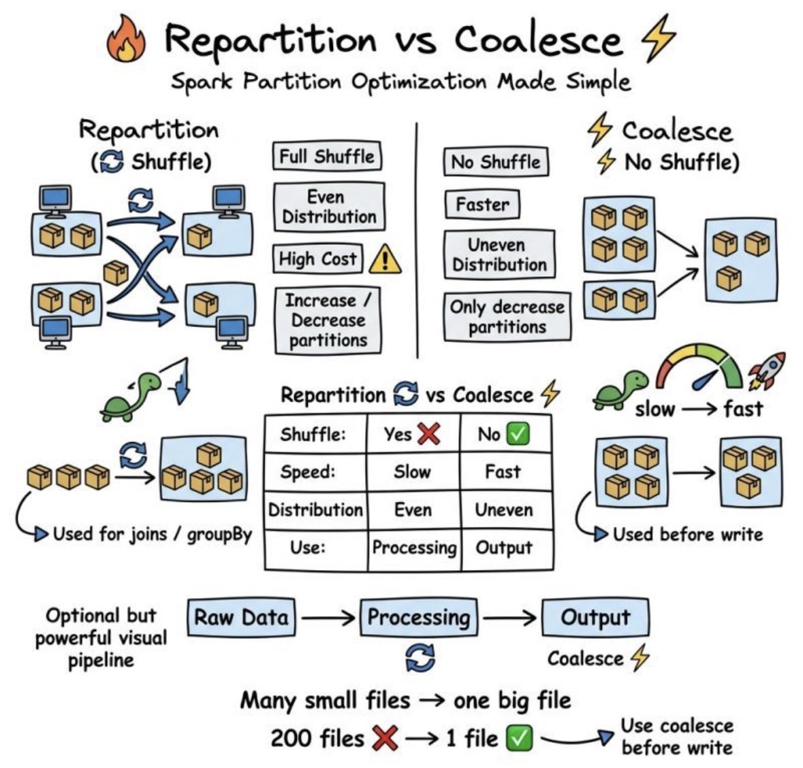

## 1️⃣ Apache Spark


**`Apache spark`** &rarr; **open-source framework designed for in-memory paralle processing of large-scale data across multiple machines**.

<u>Key characteristics</u>:
- Distributed computing
- In memory-processing
- Scalable cluster execution
- Supports batch, streaming, machine learning, and SQL workloads

---


| Feature | Description | Key Points |
|--------|-------------|------------|
| **Speed** | Spark performs computations **in memory**, which significantly improves processing speed compared to traditional **disk-based frameworks** like earlier Hadoop MapReduce systems. | In-memory processing, faster than disk-based systems |
| **Ease of Use** | Spark provides **simple and flexible APIs** in multiple programming languages, making it accessible to many developers and data engineers. | Java, Scala, Python, R |
| **Versatility** | Spark supports multiple types of **data processing workloads within a single framework**, allowing organizations to build **end-to-end data pipelines**. | ETL, Streaming analytics, Machine learning, Graph processing |
| **Scalability** | Spark can **scale from a single server to thousands of distributed machines**, supporting both small workloads and large enterprise-level data processing. | Works from single-node to large distributed clusters |
| **Integration** | Spark integrates with many **data sources and storage systems**, enabling it to operate in diverse architectures and cloud environments. | Hadoop, Apache HBase, Apache Cassandra, AWS S3, Cloud data lakes and warehouses |


---

## 2️⃣ [Spark Architecture Concepts](https://docs.aws.amazon.com/prescriptive-guidance/latest/tuning-aws-glue-for-apache-spark/key-topics-apache-spark.html)


---

### 👑 Driver
**`Driver`** &rarr; **main program that contains the Spark application**.

<u>Key characteristics</u>:
- Creates the Spark session/context  
- Builds the execution plan (DAG)  
- Schedules tasks  
- Coordinates executors  
- Collects results

**`Driver`** &rarr; **brain of the Spark application**


<u>Flow</u>:
1. You run a Spark job.
2. The driver converts your code into tasks.
3. Tasks are distributed to executors.

---

### 👷 Executors

**`Executors`** &rarr; **worker that execute tasks on the cluster node**

<u>Key characteristics</u>:
- Execute trask asigned by the driver
- Process data partitions
- Perform transformation and actions
- Return results to the driver
- Store cached data

<u>Key points</u>:
- Each executor runs on a worker node
- Each executor has **memory and CPU cores**
- Multiple task can run in parallel in an executor

**`Executor`** &rarr; **worker doing the actual computation**

---

## 📝 Cluster Manager

**`Cluster Manager`** &rarr; **manages the resources of the cluster**

<u>Key characteristics</u>:
- Allocate CPU and memory resources
- Launch executor processes
- Manage cluster nodes

**`Databricks`** &rarr; **handles these automatically**

---

## 3️⃣ Execution Model Concepts

---

### Job

**`Job`** &rarr; **entire computation trigger by an action in Spark**

<u>Example actions</u>:
- `count()`
- `show()`
- `collect()`
- `write()`

When an action is executed:
1. Spark builds a **DAG execution plan**
2. The job is divided into stages

---

### Stage


**`Stage`** &rarr; **group of task that run in parallel without requiering data shuffeling**

Spark divides jobs into stages based on **shuffle boundries**

Typical reason for new stage:
- `groupBy`
- `join`
- `reduceByKey`

<u>Example pipeline</u>:
- `Read data → Filter → Map → GroupBy → Count`

<u>Spark may split into</u>:
- Stage 1
    - `Read + Filter + Map`
- Stage 2
    - `GroupBy + Count`

---

## Task

**`Task`** &rarr; **smallest unit of work in Spark** 
↳ **each task represents one data partiton**
↳ **one task per partition**

**`Tasks`** &rarr; **run in parallel across executors**

---

## RDD (Resilient Distributed Dataset)

**`RDD`** &rarr; **an imutable distributed collection of objects partitioned across cluster nodes**

↳ **the lowest-level distributed data structure in Spark**

<u>Key characteristics</u>:
- Fault tolerant
- Distributed
- Immutable
- Supports parallel operations

<u>Example</u>:
```python
rdd = spark.sparkContext.parallelize([1,2,3,4])
```

<u>Operations</u>:
- `map`
- `filter`
- `reduce`

RDDs are powerful but low-level and slower than DataFrames.
Today they are used less often.

---

## DataFrame


**`DataFrame`** &rarr; **a distributed collection of structured data with schema**, similar to a table in SQL or Pandas dataframe.

<u>Key characteristics</u>:
- Schema-based
- Optimized execution
- SQL support
- Uses **Catalyst optimizer**

<u>Example</u>:
```python
df = spark.read.parquet("data.parquet")
df.filter(df.age > 30)
```

<u>Advantages over RDD</u>:
- Faster
- Query optimization
- Better memory usage

---

## Dataset

**`Dataset`** &rarr; **a distributed collection of structured data with schema and compiled-time type safety.**

**`Dataset`** &rarr; **a strongly typed version of a DataFrame**

<u>Important points</u>:
- Available in **Scala and Java**
- Combines benefits of **RDD + DataFrame**

---

## Transformers

**`Transformers`** &rarr; **Operations that create a new dataset from an existing one**

---

## Lazy Evaluation

**`Lazy Evaluation`** &rarr; **Transformers are not executed immediately; Spark waits until an action is called**

---

## Action

**`Action`** &rarr; **trigger execution of Spark jobs**

↳ They return results or write data

<u>Examples</u>:
- `show()`
- `count()`
- `collect()`
- `write()`

---

## Partitions

**`Partitions`** &rarr; **a chunk of distributed data processed in parallel**

---

## Shuffle

**`Shuffle`** &rarr; **moves data across partitions between executors**

<u>Example operations causing shuffle</u>:
- `groupBy`
- `join`
- `distinct`
- `reduceByKey`

<u>Shuffles are expensive operations because they involve</u>:
- `network transfer`
- `disk I/O`
- `data redistribution`

**`Optimizing Spark`** &rarr; **often means reducing shuffle operations**

---

🎯 The 10 Spark Concepts You Must Know
1️⃣ Driver
2️⃣ Executors
3️⃣ Cluster Manager
4️⃣ Jobs
5️⃣ Stages
6️⃣ Tasks
7️⃣ RDD
8️⃣ DataFrame
9️⃣ Partitions
🔟 Shuffle

---

## Caching data

**`Caching data`** &rarr; storing a dataset in memory so Spark doesn’t have to recompute it every time it’s used

Caching = **avoid recomputation** &rarr; **improve performance**

### 🔧 Why Caching Exists

Spark uses lazy evaluation.
<u>That means</u>:
```python
df = spark.read.parquet("data")
df_filtered = df.filter(df.age > 30)
```
👉 Nothing runs yet.

## 📉 Without Caching
```python
df_filtered.count()
df_filtered.show()
```
<u>❌ Without caching</u>:
- Spark recomputes `df_filtered` twice

## 📈 With Caching
```python
df_filtered.cache()

df_filtered.count()
df_filtered.show()
```
<u>✅ With caching</u>:
- First action &rarr; computation happens
- Result stored in memory
- Second action &rarr; **reuses cached data**

---

## Optimizing Partitions

**`Optimizing partitions`** &rarr; choosing the right number and distribution of data partitions to maximize parallelism and minimize processing time

---

# Repartition vs Coalesce

&rarr; **used to change the number of partitions in a DataFrame** &rarr; work differently



---

## 🔵 Repartition

**`Repartition`** &rarr; **redistributes data across partitions using a full shuffle**

### ⚙️ How it works
```python
df.repartition(100)
```

<u>Spark</u>:
- shuffles all data across the cluster
- evenly redistributes it
- creates new partitions

### 🎯 Characteristics
- Causes full shuffle ❗
- Ensures even distribution
- Can increase or decrease partitions

<u>✅ When to use</u>
- You want more parallelism
- Data is unevenly distributed
- Before joins or aggregations

---

## 🟢 Coalesce

**`Coalesce`** &rarr; **reduces the number of partitions without a full shuffle**

### ⚙️ How it works
```python
df.coalesce(10)
```

<u>Spark</u>:
- merges existing partitions
- avoids full data shuffle
- moves minimal data

### 🎯 Characteristics
- No full shuffle (more efficient)
- Only reduces partitions
- May create uneven partitions

<u>✅ When to use</u>
- You want fewer output files
- Writing data to storage
- Small datasets

## ⚖️ Key Differences

| Feature             | Repartition | Coalesce      |
| ------------------- | ----------- | ------------- |
| Shuffle             | Yes (full)  | No (minimal)  |
| Increase partitions | Yes         | No            |
| Decrease partitions | Yes         | Yes           |
| Performance cost    | Higher      | Lower         |
| Data distribution   | Even        | Can be uneven |

## 🎯 One-Line Summary
Repartition = shuffle + balance partitons
Coalesce = no shuffle + merged partition

💡 Bonus Tip
Avoid using coalesce for large datasets if it creates skewed partitions

---

## Fault Tolerance

**`Fault tolerance`** &rarr; Spark’s ability to recover from failures (like node crashes) and continue processing without losing data or results

### 🔧 Why It’s Needed
<u>In Spark</u>:
- Data is processed across **many machines**
- Machines can fail:
  - node crashes
  - executor dies
  - network issues

👉 Without fault tolerance → job fails ❌
👉 With Spark → job recovers ✅

### ⚙️ How Spark Achieves Fault Tolerance

<u>Spark uses **3 main mechanisms**</u>:

#### 1️⃣ Lineage (Most Important)

`Lineage` &rarr; the history of transformations used to build a dataset

<u>Example</u>:
```python
df = spark.read.parquet("data")
df2 = df.filter(df.age > 30)
df3 = df2.groupBy("country").count()
```

👉 Spark builds a lineage like:
```
Read → Filter → GroupBy
```

##### What happens if data is lost?
<u>If a partition is lost</u>:
- Spark **recomputes it using lineage**

👉 No need to store copies of data

#### 2️⃣ Partition-Based Recovery

Data is split into **partitions**

<u>If one partition fails</u>:
```
Partition 3 lost ❌
```

<u>👉 Spark</u>:
- recomputes **only that partition**
- not the entire dataset

#### 3️⃣ Task Retry Mechanism

<u>If a task fails</u>:
- Spark automatically retries it

<u>Default</u>:
- 4 retries

<u>Example</u>
```
Task failed → retry → retry → success
```
👉 User doesn’t see failure

---

## Catalyst optimizer

**`Catalyst Optimizer`** &rarr; Spark’s query optimization engine that automatically improves the execution of DataFrame and SQL queries

### 🔧 Simple Explanation
<u>>When you write</u>:
```python
df.filter(df.age > 30).select("name")
```
👉 Spark does NOT execute it directly.

<u>Instead</u>:
1. Builds a logical plan
2. Optimizes it
3. Converts it into a physical plan
4. Executes it efficiently

👉 Catalyst is responsible for **steps 2 and 3**

### ⚙️ How Catalyst Works (Step-by-Step)
#### 1️⃣ Logical Plan
<u>Spark first creates a logical representation of your query</u>:
```
Filter → Select → Data Source
```

#### 2️⃣ Optimization (Catalyst Magic ✨)
Catalyst applies rules like:

🔹 Predicate Pushdown
<u>Move filters earlier</u>:
```
Filter before reading data → less data processed
```

🔹 Column Pruning
<u>Only read needed columns</u>:
```
SELECT name → don’t read other columns
```

🔹 Constant Folding
<u>Simplify expressions</u>:
```
WHERE age > 10 + 5 → age > 15
```

🔹 Join Reordering
Rearranges joins for efficiency

#### 3️⃣ Physical Plan
<u>Catalyst chooses how to execute</u>:
- Broadcast join
- Sort-merge join
- Shuffle hash join

👉 Picks the most efficient strategy

#### 4️⃣ Execution
Final plan is executed by Spark

## 🔥 Key Insight (Interview Gold)
**Catalyst is why DataFrames are faster than RDDs**

👉 Because RDDs:
- don’t use Catalyst
- no automatic optimization

## 🔥 Bonus Tip (Very Strong Signal)
<u>Add this</u>:
**Catalyst** works together with the **Tungsten engine**, which optimizes memory usage and execution at a lower level

## 🎯 One-Line Summary
**Catalyst = brain of Spark query optimization**

---

## Tungsten engine

**`Tungsten engine`** &rarr; **Spark’s execution engine that optimizes how data is processed at a low level, focusing on memory management and CPU efficiency**

### 🔧 Simple Explanation
Catalyst = the brain (planning)
Tungsten = the engine (execution)

- Catalyst decides what to do
- Tungsten makes it run fast

### ⚙️ What Tungsten Improves
Tungsten focuses on how Spark executes operations efficiently:

#### 1️⃣ Memory Management
Uses **off-heap memory** instead of relying only on JVM (Java Virtual Machine)

<u>Why?</u>
- Reduces garbage collection (GC)
- More efficient memory usage

#### 2️⃣ Binary Data Format
<u>Instead of Java objects</u>:
```
Java Object → heavy ❌
Binary format → compact ✅
```

<u>👉 Benefits</u>:
- less memory usage
- faster processing

#### 3️⃣ Code Generation (Very Important)
Tungsten generates optimized Java bytecode at runtime

<u>Example</u>:
- Instead of generic execution
- Spark generates **custom optimized code for your query**

👉 Faster execution 🚀

#### 4️⃣ CPU Optimization
- Uses CPU cache efficiently
- Reduces unnecessary operations
- Improves execution speed

### 🧠 How It Works Together with Catalyst
<u>Flow</u>:
```
Your code
   ↓
Catalyst → builds optimized plan
   ↓
Tungsten → executes it efficiently
```

### 🔥 Bonus Tip (Strong Signal)
**Tungsten is one of the main reasons why DataFrames are significantly faster than RDDs**

## 🎯 One-Line Summary
**Tungsten = low-level performance engine of Spark**
