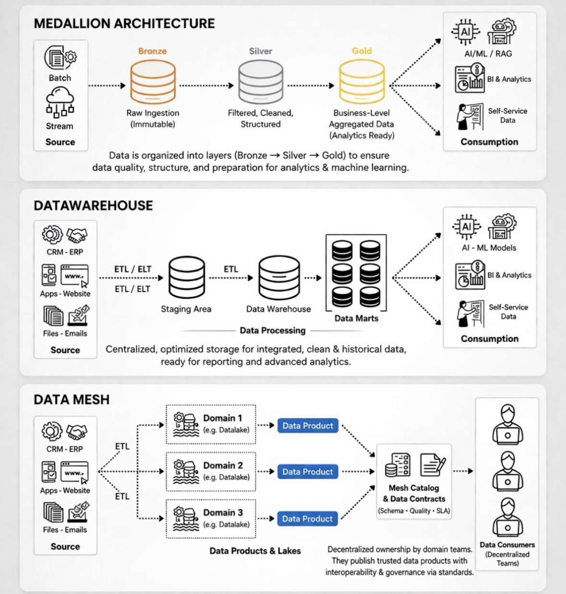
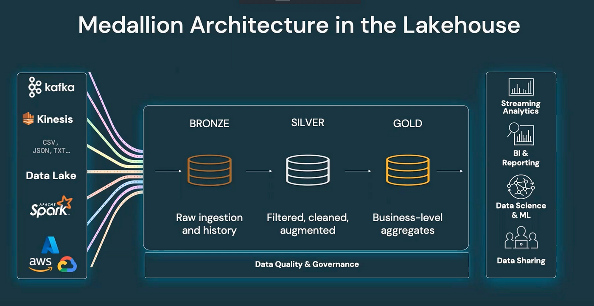
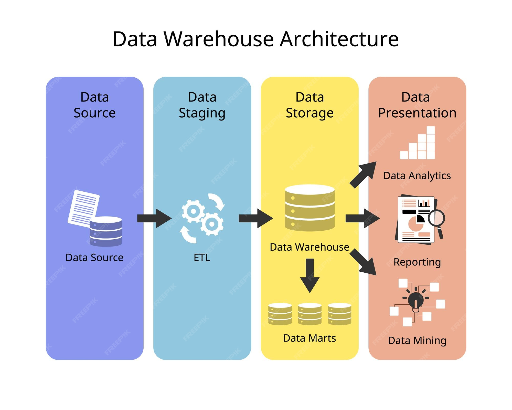
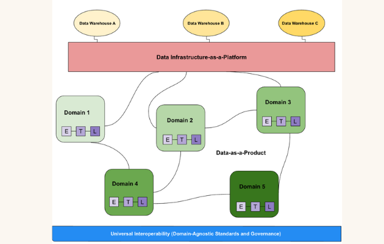
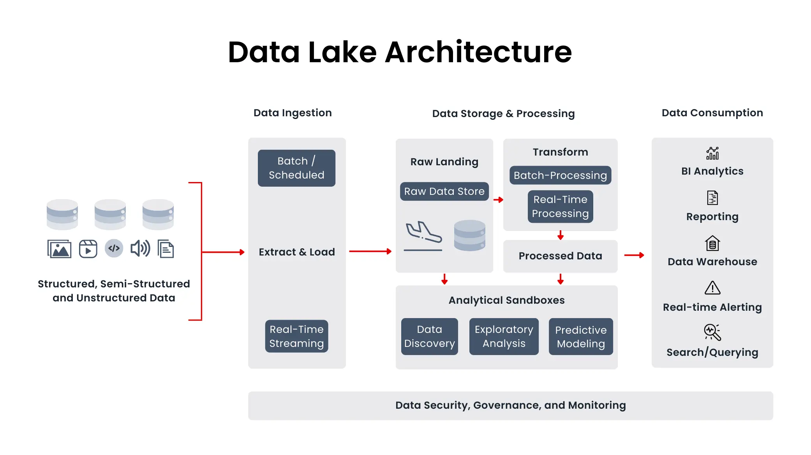
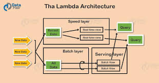
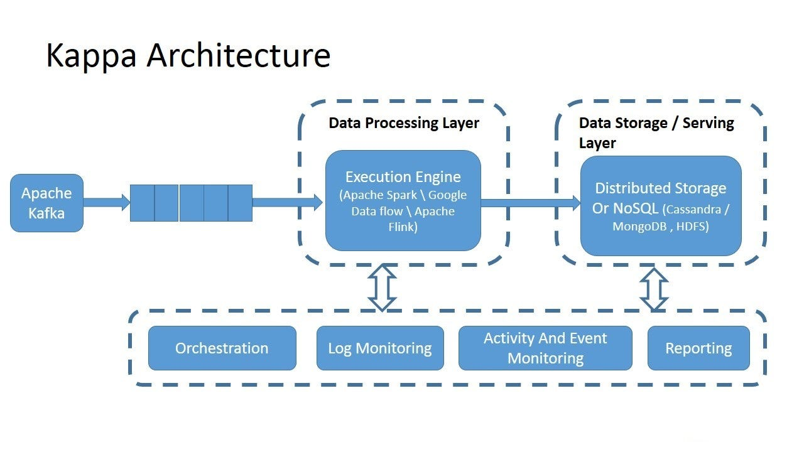
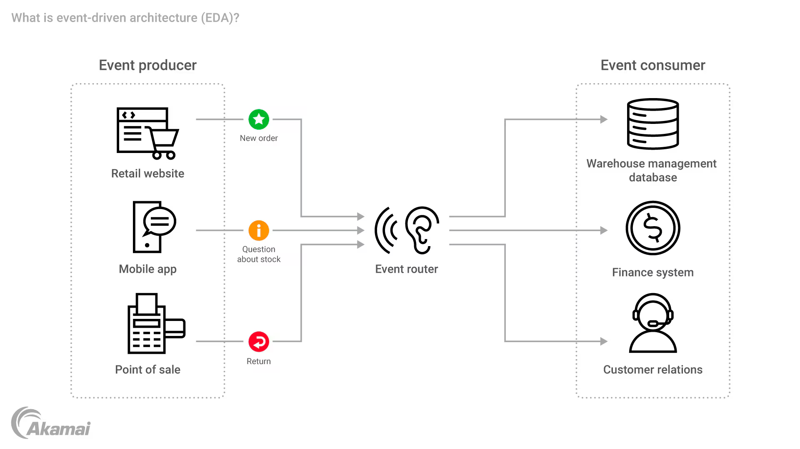

# Data Engineering Architectures

These architectures are often compared, but in reality, they adress different challanges.



### 1. Medallion Architecture

It is higly effective for progressively strucutred data (Bronze &rarr; Silver &rarr; Gold).
You gain in quality, reliability, and readliness for for analytics or ML.
`Trade-off`: More transformations, which can sometimes introduce latency.

### 2. Data Warehouse

Here, the focus is on performance and centralization. It's extremely powerful for reporting, BI and historical analysis, with a realiable source of data.
`Trade-off`: However, it can become rigid when needs evolve quickly.

### 3. Data Mesh

`A shift in mindset`: focusing on decentralization and team autonomy.
Each domain owns its own "Data Products", which enables faster scaling at large scale.
But it requires real maturity (structured governance, shared standards, and strong data culture).

`What is often overlookd`:
There is no "more efficient" architecture then another. Efficiency depends on what you are optimizing.

- data quality and preparations
- performance and consistency
- organizational scalability

In reality, no architecture perfectly optimize all three at the same time.
That's where the real work of achitecture lines: finding the right balance based on context and business needs.

### 4. Data Lake Architecture
🔹 Concept
- Stores raw data in its native format

🔹 Characteristics
- Schema-on-read
- Very flexible
- Cheap storage

🔹 Tools
- S3
- Azure Data Lake

🔹 Problem
- messy data
- lack of governance

### 5. Lakehouse Architecture
🔹 Concept
- Combines Data Lake + Data Warehouse

🔹 Key technologies
- Delta Lake
- Databricks

🔹 Benefits
- ACID transactions
- schema enforcement
- performance

### 6. Lambda Architecture
🔹 Concept
- Combines batch + real-time processing
```
Batch layer + Speed layer + Serving layer
```

🔹 Problem
- complex
- duplicate logic

### 7. Kappa Architecture
🔹 Concept
- Streaming-only architecture

👉 No batch layer
👉 Everything is processed as streams

### 8. Event-Driven Architecture
🔹 Concept
- Systems react to events in real-time

Example:
- Kafka
- streaming pipelines

---

## 1. Medallion Architecture


### 🧠 What is Medallion Architecture?
**`Medallion Architecture`** &rarr; a data design pattern that organizes data into layers (**Bronze, Silver, Gold**) to improve data quality, reliability, and usability

#### 🥉 Bronze Layer (Raw Data)
**`The Bronze layer`** &rarr; contains raw, unprocessed data exactly as it is ingested from source systems

🎯 Characteristics
- Raw data
- May contain errors, duplicates
- Full history preserved
- Used for replay/debugging

#### 🥈 Silver Layer (Cleaned Data)
**`The Silver layer`** &rarr; contains **cleaned, validated, and transformed data**

🔧 What happens here
- Data cleaning
- Deduplication
- Schema enforcement
- Joins / transformations

🎯 Characteristics
- Structured data
- Higher quality
- Ready for analysis
- Still somewhat detailed

#### 🥇 Gold Layer (Business Data)
**`The Gold layer`** &rarr; contains **aggregated, business-ready data optimized for reporting and analytics**

🔧 What happens here
- Aggregations
- KPIs
- Business logic
- Data modeling

🎯 Characteristics
- Highly refined
- Optimized for queries
- Used by BI tools (Power BI, dashboards)

### 🧠 Why This Architecture Matters
1️⃣ Data Quality
- Raw → Clean → Trusted
2️⃣ Debugging
- You can always go back to Bronze
3️⃣ Scalability
- Each layer has a clear responsibility
4️⃣ Flexibility
- You can rebuild Silver/Gold from Bronze

---

## 2. Data Warehouse Architecture


### 🧠 What is Data Warehouse Architecture?
**`Data Warehouse Architecture`** &rarr; a design pattern used to **collect, store, and organize structured data from multiple sources for reporting and analytics**

🎯 Purpose
A data warehouse is built to:
- support business intelligence (BI)
- enable fast SQL queries
- provide a single source of truth

⚙️ Core Components
A typical data warehouse architecture looks like this:
```
Sources → ETL/ELT → Data Warehouse → BI / Reporting
```

🎯 Characteristics
- schema-on-write (strict schema)
- optimized for queries
- highly structured
- Star Schema

⚖️ Data Warehouse vs Data Lake
| Feature     | Data Warehouse  | Data Lake      |
| ----------- | --------------- | -------------- |
| Data type   | Structured      | Any format     |
| Schema      | Schema-on-write | Schema-on-read |
| Flexibility | Low             | High           |
| Performance | High            | Medium         |

---

## 3. Data Mesh Architecture


### 🧠 What is Data Mesh Architecture?
**`Data Mesh`** &rarr; a decentralized data architecture where data ownership is distributed across domain teams, treating data as a product

🔧 Simple Explanation
Traditional approach:
```
All data → central data team ❌
```

Problems:
- bottlenecks
- slow delivery
- overloaded teams

Data Mesh approach:
```
Team A owns data A ✅
Team B owns data B ✅
Team C owns data C ✅
```
👉 Each team manages their own data

#### 🎯 Core Idea
Move from centralized data ownership &rarr; **decentralized ownership**

#### 🧩 4 Key Principles of Data Mesh

##### 1️⃣ Domain-Oriented Ownership
**Each team owns its own data**

Example:
- Finance team &rarr; financial data
- Marketing team &rarr; campaign data

👉 They:
- build pipelines
- maintain data
- ensure quality

#### 2️⃣ Data as a Product
**Data is treated like a product with users**

Each dataset should have:
- documentation
- quality guarantees
- clear ownership

#### 3️⃣ Self-Serve Data Platform
**Platform provides tools for teams**

Instead of every team building everything:
👉 Platform team provides:
- Databricks
- storage (S3 / ADLS)
- pipelines

#### 4️⃣ Federated Governance
**Governance is shared across teams**

- standards (naming, security)
- compliance rules
- access control

#### ⚙️ How It Looks in Practice
```
           Platform Layer
     (Databricks, Storage, Tools)
              ↓
-----------------------------------
Finance Domain → pipelines + data  
Marketing Domain → pipelines + data  
Sales Domain → pipelines + data  
-----------------------------------
```
👉 Each team is independent

#### 🎯 Why Data Mesh Exists
Problems with centralized systems:
- slow data delivery
- bottlenecks
- poor ownership

Benefits of Data Mesh:
- scalability (teams scale independently)
- faster development
- better data ownership
- improved data quality

#### ⚖️ Data Mesh vs Traditional Architecture
| Feature        | Traditional  | Data Mesh    |
| -------------- | ------------ | ------------ |
| Ownership      | Central team | Domain teams |
| Scalability    | Limited      | High         |
| Bottlenecks    | High         | Low          |
| Responsibility | Centralized  | Distributed  |

⚠️ Challenges
Data Mesh is powerful but:
- requires strong governance
- needs mature teams
- harder to manage

👉 Not always the best choice

---

## 4. Data Lake Architecture


### 🧠 What is Data Lake Architecture?
**`Data Lake Architecture`** &rarr; **a system designed to store large volumes of raw data in its native format**, allowing flexible processing and analysis

🎯 Purpose
A data lake is built to:
- store any type of data (structured, semi-structured, unstructured)
- support big data processing
- enable flexible analytics

⚙️ Core Components
```
Sources → Ingestion → Storage (Data Lake) → Processing → Consumption
```

🎯 Characteristics
- schema-on-read
- low cost
- highly scalable

⚠️ Main Problem (Very Important)
Data lakes can become a “data swamp”

Meaning:
- messy data
- no governance
- hard to query

🎯 One-Line Summary
**Data lake = store everything, process later**

---

## 5. Lakehouse Architecture


### 🧠 What is Lakehouse Architecture?
**`Lakehouse Architecture`** &rarr; **combines the flexibility of a data lake with the reliability and performance of a data warehouse**

#### 🔧 Simple Explanation
Traditional world:
- Data Lake &rarr; flexible but messy ❌
- Data Warehouse &rarr; structured but rigid ❌

Lakehouse:
**👉 Best of both worlds ✅**
- store raw data like a lake
- enforce structure and performance like a warehouse

⚙️ Core Idea
```
Data Lake Storage + Data Warehouse Features = Lakehouse
```

#### 🧩 Key Components
##### 1️⃣ Storage Layer (Data Lake)
🔹 What it is
- Cheap, scalable storage

🔧 Technologies
- S3
- Azure Data Lake

📦 Stores:
- raw data
- structured data
- semi-structured data

##### 2️⃣ Transaction Layer (Delta Lake)
🔹 What it adds
- ACID transactions
- schema enforcement
- versioning

👉 This is what makes it a lakehouse

##### 3️⃣ Processing Layer
🔹 What it does
- transforms data
- runs pipelines

🔧 Tools
- Apache Spark
- Databricks

##### 4️⃣ Serving Layer
🔹 What it does
- enables analytics
- supports BI tools

🔧 Tools
- Power BI
- SQL queries

##### 🧠 How It Works (Flow)
```
Sources
   ↓
Data Lake (S3 / ADLS)
   ↓
Delta Lake (transactions + structure)
   ↓
Processing (Spark / Databricks)
   ↓
Analytics / BI
```

#### 🎯 Key Features
##### ✅ ACID Transactions
- reliable writes
- no corrupted data

##### ✅ Schema Enforcement
- prevents bad data

##### ✅ Time Travel
- access historical data

##### ✅ Performance Optimization
- indexing (Z-ordering)
- caching
- data skipping

⚖️ Lakehouse vs Data Lake vs Data Warehouse
| Feature     | Data Lake | Data Warehouse | Lakehouse |
| ----------- | --------- | -------------- | --------- |
| Data type   | Any       | Structured     | Any       |
| Schema      | On-read   | On-write       | Both      |
| Performance | Medium    | High           | High      |
| Flexibility | High      | Low            | High      |
| Cost        | Low       | Higher         | Balanced  |

#### 🧠 Where Medallion Fits
Lakehouse often uses:
```
Bronze → Silver → Gold
```
👉 Medallion is a design pattern inside lakehouse

#### 🎯 One-Line Summary
**Lakehouse = data lake + data warehouse combined**

---

## 6. Lambda Architecture


### 🧠 What is Lambda Architecture?
**`Lambda Architecture`** &rarr; a data architecture that **processes data using both batch and real-time (streaming) pipelines** to provide accurate and low-latency results

🔧 Why Lambda Architecture Exists
Problem:
- Batch processing → accurate but slow ❌
- Streaming → fast but may be less accurate ❌

👉 Lambda combines both ✅

⚙️ Core Idea
```
Batch Layer + Speed Layer → Serving Layer
```

### 🧩 3 Main Layers
#### 1️⃣ Batch Layer (Accuracy)
✅ What it does
- processes all historical data
- produces accurate results

🔧 Characteristics
- high latency (slow)
- recomputes full dataset
- reliable

📦 Example
```
Process all transactions overnight
```

#### 2️⃣ Speed Layer (Real-Time)
✅ What it does
- processes new incoming data in real time

🔧 Characteristics
- low latency (fast)
- handles recent data
- may be approximate

📦 Example
```
Process live transactions instantly
```

#### 3️⃣ Serving Layer
✅ What it does
combines results from:
- batch layer
- speed layer

🎯 Purpose
- provides final query results

#### 🧠 How It Works (Flow)
```
Incoming Data
     ↓
-------------------------
| Batch Layer           |
| (full recomputation)  |
-------------------------
           ↓
-------------------------
| Speed Layer           |
| (real-time updates)   |
-------------------------
           ↓
      Serving Layer
           ↓
      Queries / BI
```

#### 🎯 Example (Real Scenario)
E-commerce sales dashboard:
- Batch layer &rarr; calculates total sales daily
- Speed layer &rarr; updates recent sales instantly
- Serving layer &rarr; combines both

👉 Users see:
- accurate + real-time data

### ⚠️ Main Problem (VERY IMPORTANT)
- Lambda Architecture is complex

Why?
- two pipelines (batch + streaming)
- duplicated logic
- harder to maintain

#### 🔄 Lambda vs Modern Architectures
Today, Lambda is often replaced by:
👉 Kappa Architecture
- streaming-only

👉 Lakehouse + streaming
- simpler unified approach

#### 🎯 One-Line Summary
**Lambda = batch + streaming together**

---

## 7. Kappa Architecture


### 🧠 What is Kappa Architecture?
**`Kappa Architecture`** &rarr; **a data architecture that processes all data as a stream**, using a single unified pipeline instead of separate batch and streaming layers

### 🔧 Simple Explanation
- Lambda (old way):
```
Batch pipeline + Streaming pipeline ❌
```
- Kappa (modern way):
```
One streaming pipeline for everything ✅
```
👉 No duplication, simpler system

### ⚙️ Core Idea
Treat all data (past and present) as a continuous stream

### 🧩 Components of Kappa Architecture
#### 1️⃣ Data Stream (Source)
🔹 What it is
- continuous flow of data

🔧 Tools
- Kafka
- Event hubs

📦 Example
```
User events, transactions, logs
```

#### 2️⃣ Stream Processing Layer
🔹 What it does
- processes data in real-time
- applies transformations

🔧 Tools
- Spark Structured Streaming
- Flink

#### 3️⃣ Storage Layer
🔹 What it does
- stores processed results

🔧 Technologies
- Data Lake (S3 / ADLS)
- Delta Lake

#### 🧠 How It Works (Flow)
```
Incoming Data Stream
        ↓
Stream Processing (Spark / Flink)
        ↓
Storage (Delta Lake / Data Lake)
        ↓
Analytics / BI
```

#### 🎯 Why Kappa Architecture Exists
Problems with Lambda:
- two pipelines
- duplicate logic
- complex maintenance

Kappa solves this:
- single pipeline
- simpler architecture
- easier maintenance

#### ⚖️ Lambda vs Kappa
| Feature      | Lambda                  | Kappa                |
| ------------ | ----------------------- | -------------------- |
| Pipelines    | Two (batch + streaming) | One (streaming only) |
| Complexity   | High                    | Lower                |
| Maintenance  | Hard                    | Easier               |
| Reprocessing | Batch layer             | Replay stream        |

#### ⚠️ Challenges
- requires reliable streaming system
- replaying large data can be expensive
- needs good data retention

---

## 8. Event-Driven Architecture


### 🧠 What is Event-Driven Architecture?
**`Event-Driven Architecture (EDA)`** is a system design where components communicate by producing and consuming events, rather than calling each other directly

#### 🔧 Simple Explanation
Traditional system:
```
Service A → calls → Service B ❌
```
👉 tightly coupled

Event-driven system:
```
Service A → emits event → Event system → Service B listens ✅
```
👉 loosely coupled

##### 🎯 What is an Event?
An event is something that happened in the system.

📦 Examples
- “Order created”
- “User registered”
- “Payment completed”
- “Transaction processed”

### ⚙️ Core Components
#### 1️⃣ Event Producers
🔹 What they do
- generate events

📦 Example
- application creates an order
- sends “Order Created” event

#### 2️⃣ Event Broker (Message System)
🔹 What it does
- receives events
- stores and distributes them

🔧 Tools
- Kafka
- Azure Event Hubs
- RabbitMQ

#### 3️⃣ Event Consumers
🔹 What they do
- listen to events
- react to them

📦 Example
- billing service listens to “Order Created”
- sends invoice

#### 🧠 How It Works (Flow)
```
Producer → Event Broker → Consumers
```

Example:
```
User places order
   ↓
"Order Created" event
   ↓
-------------------------
| Kafka / Event Hub     |
-------------------------
   ↓
Inventory Service updates stock  
Billing Service creates invoice  
Analytics updates dashboard  
```
👉 Multiple systems react independently

#### 🎯 Key Benefits
✅ Loose Coupling
- services don’t depend on each other

✅ Scalability
- consumers can scale independently

✅ Real-Time Processing
- instant reaction to events

✅ Flexibility
- new consumers can be added easily

#### ⚠️ Challenges
- harder to debug
- eventual consistency
- requires good monitoring

#### 🔄 Event-Driven vs Traditional
| Feature       | Traditional  | Event-Driven |
| ------------- | ------------ | ------------ |
| Communication | Direct calls | Events       |
| Coupling      | Tight        | Loose        |
| Scalability   | Limited      | High         |
| Flexibility   | Low          | High         |

#### 🎯 One-Line Summary
**Event-driven = systems react to events, not calls**