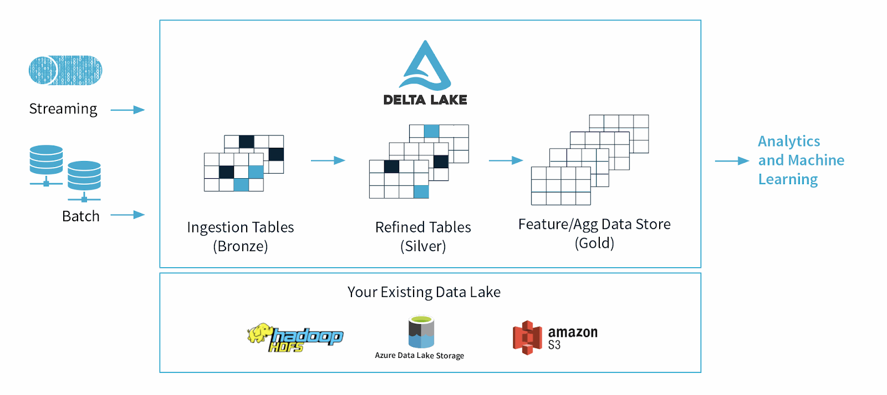

## What Delta Lake Is

**`Delta Lake`** &rarr; **a storage layer build on top of data lakes (like S3, Azure Data Lake or HDFS)** that adds **database-like reliability and performance** to big data files



It usually stores data in **Parquet format**, but adds a **transaction log** that tracks every change to the data.

This allows Spark to treat files in the data lake like **reliable tables**.

---

## Problems With Traditional Data Lakes

<u>Before Delta Lake, data lakes had several issues</u>:

### 1. No ACID transactions 

If multiple jobs wrote data at the same time, files could become **corrupted or inconsistent.**

<u>Example</u>:
Two pipelines writing to the same table simultaneously.

<u>Possible results</u>:
- incomplete writes
- duplicated data
- corrupted datasets

Traditional data lakes do not **guarantee atomic writes**.

### 2. Schema inconsistency

In a normal data lake, different files might contain different schemas.

There is **no strict schema enforcement** &rarr; Spark might fail when reading this dataset

### 3. Slow queries

Data lakes often contain **thousands of files**, and Spark may need to scan many of them.

<u>This leads to</u>:
- slow queries
- large data scans
- inefficient processing

### 4. Difficult updates

**Traditional data lakes** are **append-only systems**.

Updating or deleting records is difficult because data is stored in immutable files.

<u>Example</u>:
- Updating one row may require rewriting an entire file.

---

## What Delta Lake Adds
<u>Delta Lake &rarr; solves these problems by adding</u>:
- **Transaction Log**
- **Table Management**

---

## 1️⃣ ACID Transactions


| ACID Property | Description | Example / Key Concept |
|---------------|-------------|------------------------|
| **Atomicity** | A transaction **either fully completes or does not happen at all**. | If a Spark job fails during a write, **no partial data is committed**. |
| **Consistency** | Data always remains in a **valid state according to schema rules**. | **Invalid writes are rejected**. |
| **Isolation** | Multiple processes can **read and write simultaneously without corrupting data**. | Delta uses **optimistic concurrency control**. |
| **Durability** | Once a transaction is **committed**, it is **permanently stored** in the data lake. | Committed data remains **persisted and recoverable**. |

## 2️⃣ Schema Enforcement

**`Delta Lake`** &rarr; prevents invalid schema changes

Example:
Table schema
| id | name | age |

If a new dataset tries to write:
| id | product |

Delta will reject the write unless schema evolution is enabled.

This prevents data corruption.

---

## 3️⃣ Time Travel

**`Delta Lake`** &rarr; allows you to **query previous versions of a table**
&rarr; **stores the entire history of table changes**

This is extremely useful for:
- debugging
- auditing
- restoring deleted data

<u>Example</u>:

- Query an older version of the table
```sql
SELECT * FROM sales VERSION AS OF 5
```

- Or by timestamp
```sql
SELECT * FROM sales TIMESTAMP AS OF '2025-03-01'
```

---

## 4️⃣ Merge / Upsert

**`Delta Lake`** &rarr; allows **MERGE INTO** &rarr; **efficient updates and inserts**

<u>Example</u>:
- Updating customer records
```sql
MERGE INTO customers target
USING updates source
ON target.id = source.id
WHEN MATCHED THEN UPDATE
WHEN NOT MATCHED THEN INSERT
```

</u>This allows</u>:
- `updates`
- `inserts`
- `deletes`

Without rewriting the entire dataset.

---

## 5️⃣ Data Versioning

Every time a Delta table changes &rarr; a **new version is created**

| Version | Operation    |
| ------- | ------------ |
| 0       | Initial load |
| 1       | Insert       |
| 2       | Update       |
| 3       | Delete       |

This information is stored in the **Delta transaction log**

The log is located in a special folder:

```shell
_delta_log/
```

<u>This log contains</u>:
- commit history
- schema changes
- transaction metadata

Spark reads the log to determine **the current table state**

---

## Delta Lake Architecture

<u>A Delta table contains</u>:
```shell
table/
    part-0001.parquet
    part-0002.parquet
    part-0003.parquet
    _delta_log/
        000000.json
        000001.json
        000002.json
```

<u>Components</u>:
- **Parquet files**
    - actual data
- **Delta log**
    - tracks every change
    - manages table versions


<u>This log enables</u>:
    - transactions
    - time travel
    - versioning

---

## Performance Features

**`Delta Lake`** &rarr; **improves performance**

### 1. Data skipping

**`Delta Lake`** &rarr; **tracks metadata to skip irrelevant files**

### 2. File compaction

**`File compaction`** &rarr; Reduce storage space and improve I/O efficiency when accessing the table

<u>Example</u>:
```sql
OPTIMIZE table_name
```

### 3. Z-Ordering

**`Z-Ordering`** &rarr; Improves query performance by organizing data

<u>Example</u>:
```sql
OPTIMIZE table_name ZORDER BY (customer_id)
```

---

## Simple Interview Definition

1. What is a Delta Lake?

**`Delta Lake`** &rarr; is a storage layer built on top of data lakes that adds reliability and performance features such as ACID transactions, schema enforcement, time travel, and efficient updates. It uses a transaction log to track all changes to data stored in Parquet files, allowing Spark to treat data lake files like reliable database tables.


2. Why use Delta Lake instead of Parquet?

- ACID transactions
- schema enforcement
- time travel
- merge operations
- better reliability
- improved performance

