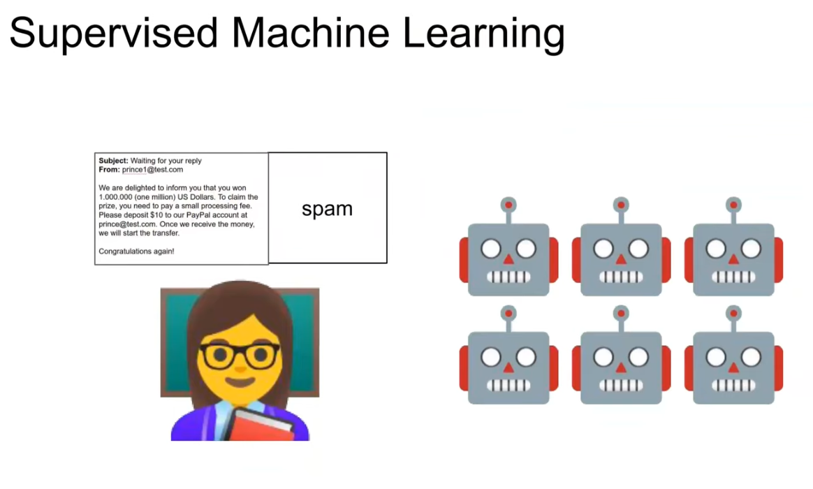
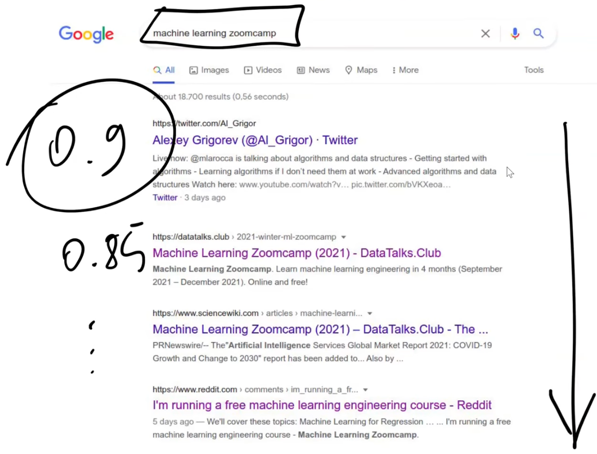

# ML Zoomcamp 1.1 - Introduction to Machine Learning

## Context

- Use case: car classifieds website where users list used cars for sale.

- Problem: sellers must choose a price; too high deters buyers, too low loses money.

## Current manual approach

- Sellers compare similar ads to estimate a price.
- Experts (e.g., at dealerships) use experience and past prices to value cars.

## ML solution overview
- Collect historical data: features + known prices (target).
- Features include: age (year), manufacturer, model, mileage, number of doors, etc.

- Train a machine learning model to learn patterns relating features → price.

- The trained model encapsulates these patterns and can predict price for new listings.

## How it helps users

- When a user fills the listing form (year, make, mileage, ...), the model suggests a price.
- Users can accept or adjust the suggested price.
- Model predictions are reliable on average but may be off for individual cars.

## Key concepts
- Features: observable attributes of the car (input variables).
- Target: what we want to predict (price).
- Model: the output of training that maps features → predicted price.
- Predictions: model outputs for new inputs without known targets.

## Summary
- Machine learning extracts pricing patterns from data to assist pricing decisions.
- It automates expert-like valuation, improving user experience on the marketplace.

---

# ML Zoomcamp 1.2 - ML vs Rule-Based Systems

### Context
- Problem: unsolicited emails (promotions, fraud) — need to classify messages as spam or not and route them to a spam folder.

### Rule-based approach
- Create explicit rules from observed patterns (e.g., sender == promotions@online.com, subject contains "tax review", body contains "deposit").
- Encode rules in code (if/else).

- Pros: simple to start, interpretable.
- Cons: brittle and hard to maintain — spam evolves, rules proliferate, false positives/negatives increase, maintenance becomes a nightmare.

### Machine learning approach

- Collect labeled data (users mark spam → spam folder)

- Extract features from emails (title length, body length, sender/domain flags, presence of keywords, etc.). Many features can originate from previous rules.

- Train a classifier on features + labels; output is a model that predicts spam probability.
- Use a threshold (e.g., 0.5) on predicted probability to decide spam vs. inbox.
- Pros: adapts to changing patterns, leverages many features, reduces manual rule maintenance.
- Cons: requires labeled data and feature engineering; may still make errors on individual messages.

### Workflow comparison
- Rule-based: data + hand-coded rules → direct predictions.

- ML-based: data + labels → train model → model + new data → predictions.

### Key takeaways
- Start with rules to understand patterns; use those insights as features for ML.
- ML shifts maintenance from rule editing to collecting labels and retraining models.
- Example classification (spam) demonstrates why ML is preferred for evolving, noisy problems.

---

# ML Zoomcamp 1.3 - Supervised Machine Learning

- Core idea: teach algorithms by example — provide inputs (features) and labels (targets) so the model learns patterns and generalizes to new data.

- Data representation:
  - X — feature matrix (rows = observations, columns = features).
  - y — target vector (labels we want to predict).
  
- Goal: learn a function g that maps X → y; training (fitting) adjusts g to produce outputs close to y.
  
  
  

- Outputs / problem types:
  - Regression — numeric output (e.g., car price, house value).
  
  - Classification — categorical output:
    - Binary classification (two classes, e.g., spam vs. not spam).
    
    - Multiclass classification (many categories, e.g., image classes).
    
  - Ranking — score and sort items (e.g., recommender systems, search results).
  
  
  
- Practical points:
  - Features often require extraction/engineering from raw data (text, images, etc.).
  - Models produce predictions (numbers, probabilities, scores); decisions use thresholds or ranking logic.
  - This course focuses mainly on classification; next lessons cover regression and project organization (CRISP‑DM).

---

# ML Zoomcamp 1.4 - CRISP-DM

## Context
- Lesson: Session #1.4 of ML Zoomcamp.  
- Topic: Processes for organizing machine learning (ML) projects.  
- Framework: **CRISP-DM** (Cross Industry Standard Process for Data Mining).  
- Example: **Spam detection system**.

## Why Processes Matter
- ML projects require:
  - Understanding the problem.
  - Collecting data.
  - Training models.
  - Using them in production.  
- Methodologies like CRISP-DM help structure these steps into a repeatable process.

## CRISP-DM Overview
- Created in the 1990s (by IBM), still widely applicable today.  
- Six main steps, iterative and flexible.  
- Applied to spam detection example.

## Steps of CRISP-DM

### 1. Business Understanding
- Define the problem and success metrics.  
- Ask: *Do we really need ML?* Sometimes heuristics or rules suffice.  
- Example: Spam complaints → Goal: reduce spam emails by **50%**.  
- Must establish clear KPIs.

### 2. Data Understanding
- Identify available data and assess quality.  
- Example: spam button clicks → Are they reliable? Do users mislabel emails?  
- Questions:
  - Is data large enough?  
  - Are there gaps or noise?  
  - Do we need to collect/buy more?  
- Sometimes insights here require revisiting business understanding.

### 3. Data Preparation
- Transform raw data into ML-ready format (tabular **X, y**).  
- Steps:
  - Cleaning mislabeled examples.  
  - Building pipelines for repeatable transformations.  
  - Feature extraction (e.g., presence of words like “deposit”).  

### 4. Modeling
- Train and compare different models:
  - Logistic regression, decision trees, neural networks, etc.  
- Iterate:
  - Add/remove features.  
  - Fix data issues.  
- Goal: Select the **best-performing model**.

### 5. Evaluation
- Compare model performance with business goals.  
- Example: Did spam complaints drop by 50%?  
- If goals unmet:
  - Adjust features/data.  
  - Reconsider business objectives.  
  - Possibly stop project if not viable.

### 6. Deployment
- Deploy model into production for real users.  
- Today, evaluation often happens through **online testing (A/B tests)**.  
- Roll out gradually (e.g., to 5% of users first).  
- Engineering focus:
  - Monitoring, scalability, reliability, maintainability.

## Iteration
- ML projects are iterative, not linear.  
- Continuous improvement cycle:
  - Start with simple models → deploy quickly → gather feedback.  
  - Improve via new features, data sources, or refined goals.  
- Fast iterations help prove usefulness early.

## Summary
- **CRISP-DM steps**:  
  1. Business Understanding.  
  2. Data Understanding.  
  3. Data Preparation.  
  4. Modeling.  
  5. Evaluation.  
  6. Deployment.  

- Key points:
  - Always check if ML is the right tool.  
  - Data quality and preparation are critical.  
  - Success = measurable improvements against business KPIs.  
  - Deployment requires strong engineering practices.  
  - Iterate to refine and sustain project value.

---

# ML Zoomcamp 1.5 - Model Selection Process

## Context
- Step of ML pipeline where the actual learning happens.
- Goal: try different models (e.g., logistic regression, decision trees, neural networks) and select the best one.
- Different models may work better or worse depending on the dataset.

## Holdout + Train
- Mimics real-world use of models:
  - Train on past data (e.g., July).
  - Deploy and apply to future unseen data (e.g., August).
- To simulate this:
  - Split dataset into **training (80%)** and **validation (20%)**.
  - Train only on training data.
  - Validate using held-out data (pretend it’s "future" data).

## Making Predictions
- From **training data**: extract features `X` and target `y`, train model `g`.
- From **validation data**: extract unseen `Xv`, `yv`.
- Apply model `g` → predictions `ŷ`.
- Compare `ŷ` with actual `yv` → compute accuracy.

**Example:**
- Logistic Regression → 66% accuracy  
- Decision Tree → 60%  
- Random Forest → 67%  
- Neural Network → 80%  
→ Select Neural Network.

## Multiple Comparisons Problem
- Risk: one model may appear best by **luck** (overfitting to validation).
- Example: flipping coins (random models). One coin gets 100% correct by chance.
- Same risk applies to real models → false confidence in "lucky" models.

## Train + Validation + Test
- Solution: split into **3 sets**:
  - **Training (60%)**
  - **Validation (20%)**
  - **Test (20%)**
- Process:
  1. Train models on training data.
  2. Evaluate on validation data → select best model.
  3. Final check: apply chosen model to test set.
  4. Confirm performance is consistent (not luck).

## Model Selection - 6 Steps
1. **Split data** → Train / Validation / Test.  
2. **Train model** on training data.  
3. **Validate model** on validation set.  
4. **Repeat** with different models.  
5. **Select best model** based on validation results.  
6. **Test final model** on test set to confirm performance.  

- After selection, retrain using **Train + Validation** for more data, then test.

## Key Takeaways
- Model selection ensures robustness and avoids overfitting to one validation set.
- Validation is for **choosing** models, test is for **final check**.
- Use as much data as possible for training after validation is complete.

---

# ML Zoomcamp 1.6 GitHub Codespaces 2024 Edition

[Developed on Github Codespace]

---

# ML Zoomcamp 1.7 - Introduction to NumPy

[Developed on IDE]

---

# ML Zoomcamp 1.8 - Linear Algebra Refresher

## 🔑 Key Topics
- Vector operations  
- Vector-vector multiplication (dot product)  
- Matrix-vector multiplication  
- Matrix-matrix multiplication  
- Identity matrix  

## 🟢 Vector Operations
- **Scalar multiplication**: Multiply each element of a vector by a number.  
  - Example: `[2, 4, 5, 6] * 2 → [4, 8, 10, 12]`  
- **Vector addition**: Add corresponding elements of two vectors.  
  - Example: `[1, 2, 3] + [2, 2, 2] → [3, 4, 5]`  
- **Notation**:  
  - In **linear algebra**, vectors are typically written as **columns**.  
  - In **NumPy**, vectors are often represented as **rows**.  

## 🔵 Vector-Vector Multiplication (Dot Product)
- Also called **inner product**.  
- Unlike NumPy’s element-wise multiplication, the dot product returns a **single number**.  
- Formula:  
  \[
  u \cdot v = \sum_{i=1}^{n} u_i \times v_i
  \]  
- Example:  
  - `u = [2, 4, 5, 6]`  
  - `v = [1, 0, 0, 2]`  
  - `u·v = (2×1) + (4×0) + (5×0) + (6×2) = 14`  
- Implemented in NumPy using `np.dot(u, v)`.  

## 🟣 Matrix-Vector Multiplication
- Given matrix **U** and vector **v**:  
  - Multiply **each row** of **U** by **v** (dot product).  
- Result: A new vector with one element per row of **U**.  
- Example:  
\[
U = 
\begin{bmatrix}
1 & 2 \\
3 & 4 \\
5 & 6
\end{bmatrix},
\quad
v = 
\begin{bmatrix}
2 \\
1
\end{bmatrix}
\]  
\[
Uv =
\begin{bmatrix}
1×2 + 2×1 \\
3×2 + 4×1 \\
5×2 + 6×1
\end{bmatrix}
=
\begin{bmatrix}
4 \\
10 \\
16
\end{bmatrix}
\]  
- Implemented in NumPy with `np.dot(U, v)`.  

## 🟠 Matrix-Matrix Multiplication
- Multiply **U × V** by treating **V** as multiple column vectors.  
- Each resulting column is `U × v_i` (matrix-vector multiplication).  
- Example:  
  - `U` is shape `(m, n)`  
  - `V` is shape `(n, k)`  
  - Result is shape `(m, k)`  
- Implemented in NumPy with `np.dot(U, V)`.

## 🟡 Identity Matrix
- Denoted as **I**.  
- A square matrix with **1s on the diagonal** and **0s elsewhere**.  
- Property:  
  - \( U \times I = U \)  
  - \( I \times U = U \)  
- Acts like the number **1** in matrix multiplication.  
- Created in NumPy using `np.eye(n)`.  

---

# 

