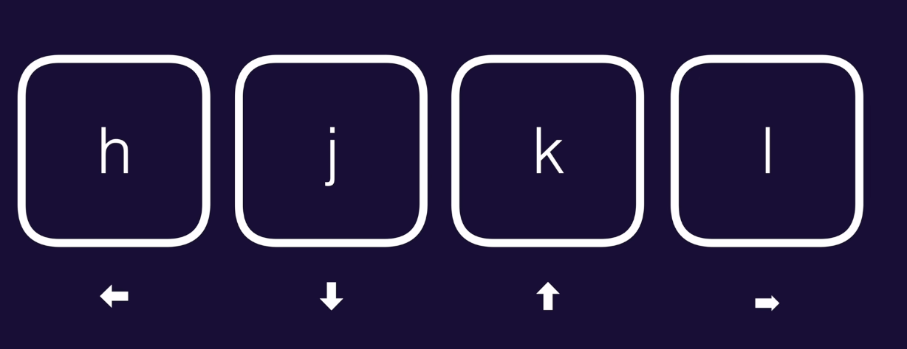
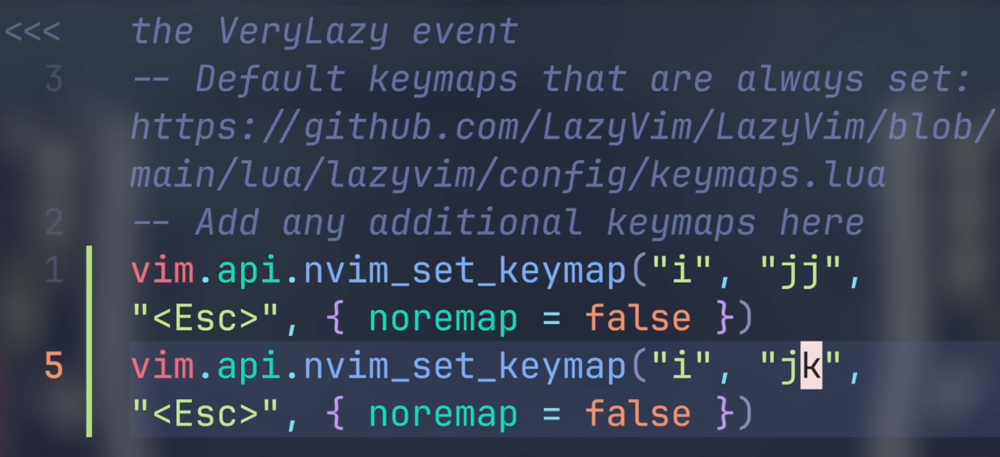
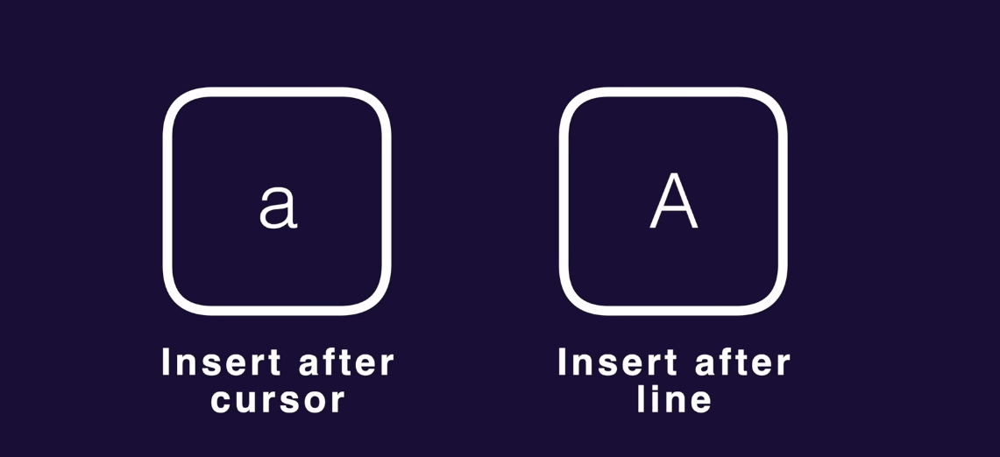
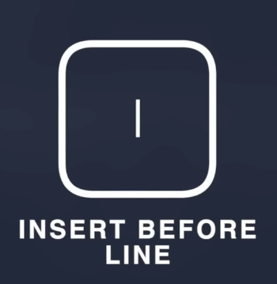
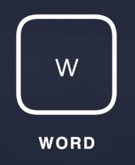
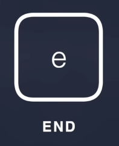
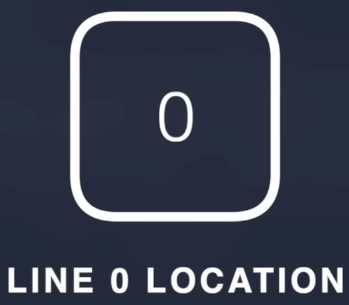

# Vim Motions

Here I start learning vim motions

## The "Normal" workmode


```
Some basic movement
Some basic movement
```

There is a game you can play to learn this 4 keys "Vim Adventure".

## The "Insert" workmode

By pressing the letter "i" i can start inserting text into the text editor.

The standard mode to get back to the "Normal" workmode is to press the key "esc".

You can also escape the "Normal" workmode by pressing a combination of other keys, the most commmon combination of keys is "jj" or "jk", but that requires a dedicated mapping.



You can go in the insert mode also using the key "a".

The only difference is that:
- "i" &rarr; will enter in the insert mode before the last letter
- "a" &rarr; will enter in the insert mode after the last letter

## Capital

`Every key you learn has a capital counter part`



Just like "i" enter in insert mode before the character you ar in with the cursor, the Capital i before the current positon.


## Jump between works

In the "Normal" workmode you can jump between works:
- `w` &rarr; after a word

- `b` &rarr; before a word

- `e` &rarr; go to the end of the word where you ar in

- `$` (`Shift` + `4`) to go the the end of the line

- `0` to go to the end of the line

- `^` first character in a line


`OBS`: Think of remapping the capital e and b to mark the ending and the begineeing of a character in a line.


