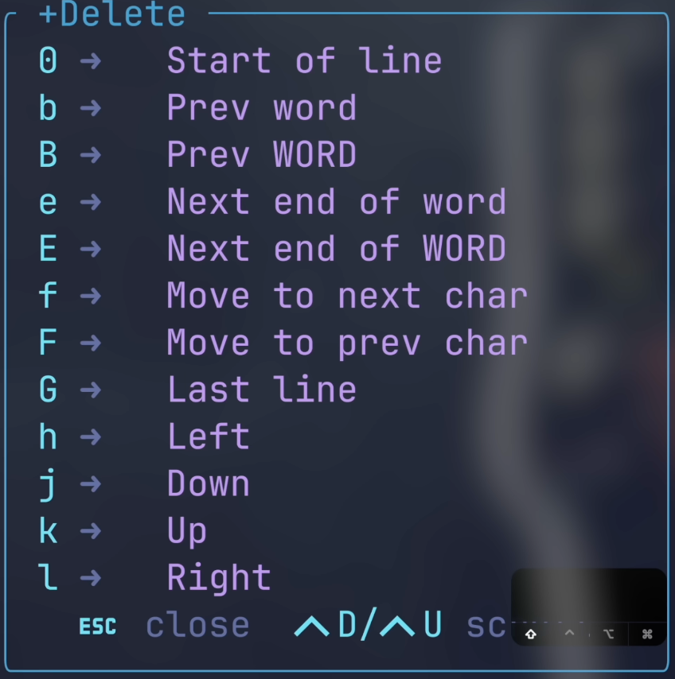
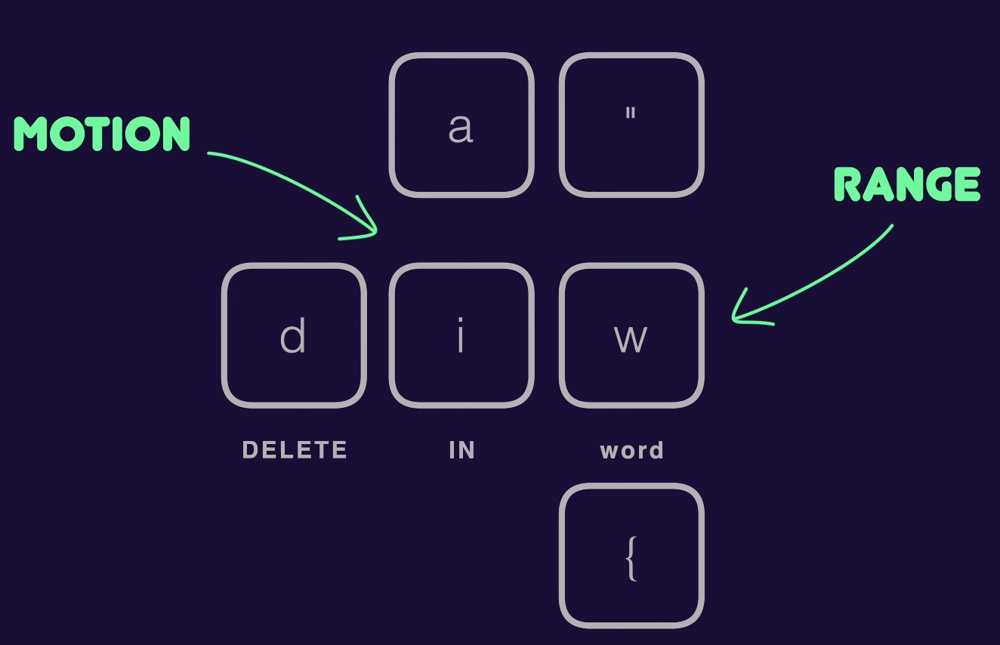
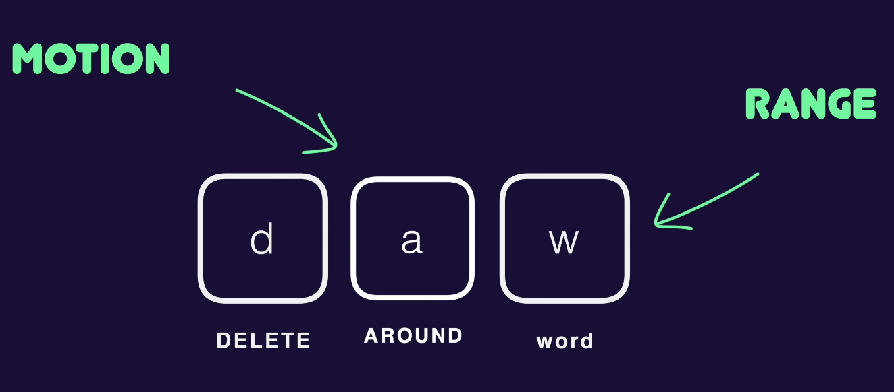
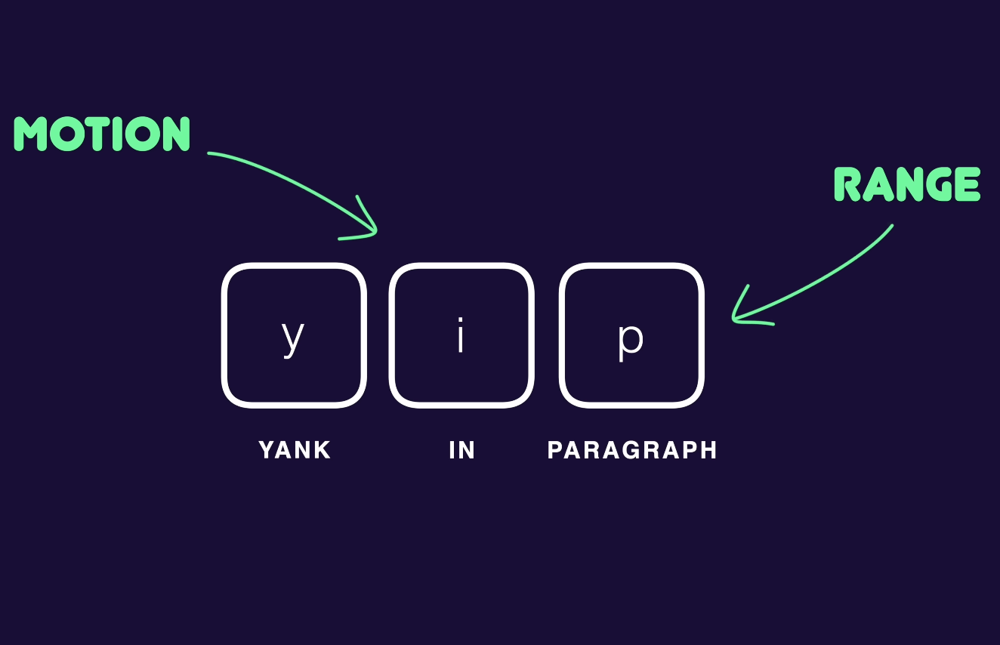

# Vim Motions

Here I start learning vim motions

## The "Normal" workmode


```
Some basic movement
Some basic movement
```

There is a game you can play to learn this 4 keys "Vim Adventure".

## The "Insert" workmode

By pressing the letter "i" i can start inserting text into the text editor.

The standard mode to get back to the "Normal" workmode is to press the key "esc".

You can also escape the "Normal" workmode by pressing a combination of other keys, the most commmon combination of keys is "jj" or "jk", but that requires a dedicated mapping.


You can go in the insert mode also using the key "a".

The only difference is that:
- "i" &rarr; will enter in the insert mode before the last letter
- "a" &rarr; will enter in the insert mode after the last letter

## Capital

`Every key you learn has a capital counter part`


Just like "i" enter in insert mode before the character you ar in with the cursor, the Capital i before the current positon.


## Jump between works

In the "Normal" workmode you can jump between works:
- `w` &rarr; after a word

- `b` &rarr; before a word

- `e` &rarr; go to the end of the word where you ar in

- `$` (`Shift` + `4`) to go the the end of the line

- `0` to go to the end of the line

- `^` first character in a line


`OBS`: Think of remapping the capital e and b to mark the ending and the begineeing of a character in a line.

- `f` stands for `find` and follow by a character we jump directly to the first appereance of that character
- `;` repets the last `find command`
- `,` is the oposit of `;` will take you to the backwords of the last `find command` used
- `F` search backwords from the cursore, works like `f` but in the other direction
   - `4ft` will find the 4th occurance of the character `t` in the line

`OBS`: VIM knows each character so with f you can also find spaces in the text

- `==` shift the line to the left to fix the indentation
- `gg` redirect you to the top of the document
- `G` redirect you to the bottom of the document
- `M` takes you to the middle of the document

`OBS`: Search also for the markers VIM to learn them

- `zz` scroll the document so that the current line with your cursor is at the center



Deletion Operator (`d`):
- `dw` cuts a word
- `u` undo
- `p` paste (acts after the cursor)
- `P` paste (acts before the cursor)
- `dd` deletes the entire line

Copying Operator (`y` yank):
- `yw` yanks a word
- `yy` yanks an entire line

Visual Mode (`v`):
- `v` Opens the visual mode

Replace Mode (`R`):
- VIM will stard writing over the text
- `Ctrl + r` - redo

Code Specific commands:
- `%` connected pair - will always take you to the matching counterpart of the expression
- `diw` delete in word
- `diW` delete everything around the word
- `dif` delete inside functionf 





- `ci(` change in `(`
- `di(` delete in `(`
- `di"` delete in `"`
- `.` repets the last action
- `o` start a new line in insert mode

`OBS`: search for `:set rnu`

- `/` starts a search of a string from the first element
- `n` to search the next word
- `N` to search for the backwords word
- `?` start a search of a string form the last element

`OBS`: search for `hlsearch`

- `,` this will open the command line in vim